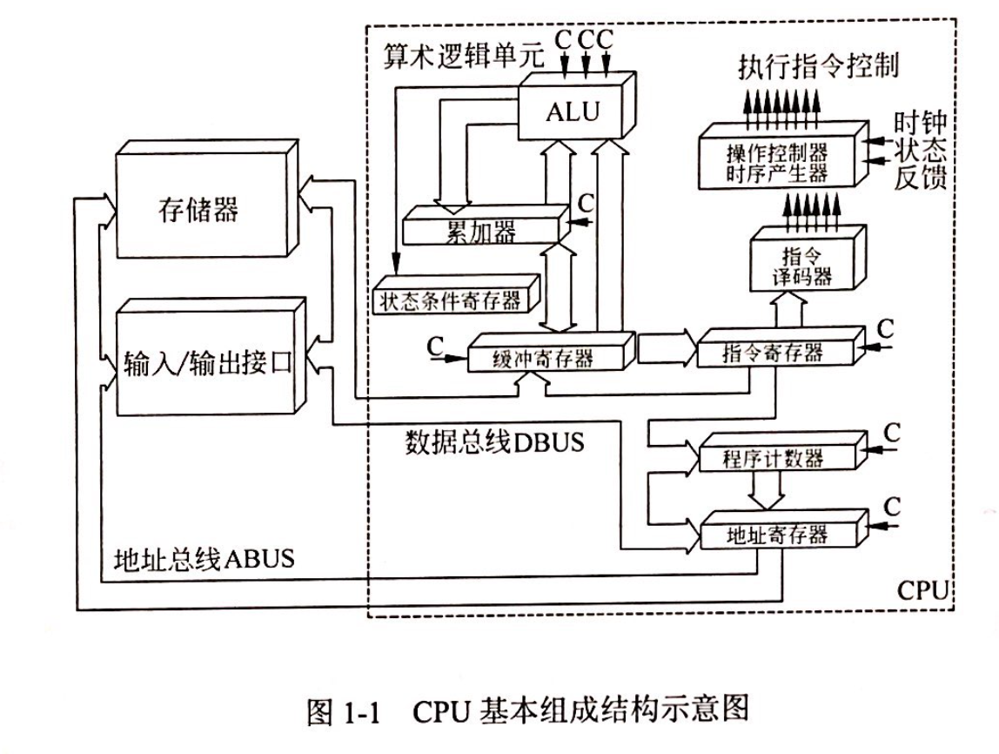

## 计算机基础知识

### 试题放置
题目编号大致为：1-6

### 必考知识点
#### 冯诺依曼计算机
**数据和指令都是以二进制形式存储在存储器中**

程序的功能都由中央处理器(CPU)执行指令来实现

程序的执行过程由指令进行自动控制

#### CPU组成部件

**CPU主要由运算器、控制器、寄存器组和内部总线等部件组成**

**计算机能且只能执行“指令”。指令由操作码和地址码组成。**

- 运算器
 - 算术逻辑单元（ALU）：对数据的算术运算和逻辑运算
 - 累加寄存器（AC）：为ALU提供一个工作区
 - 数据缓冲寄存器（DR）：暂时存放由内存储器读/写的指令和数据字
 - 状态条件寄存器(Program Status Word, PSW)：存状态标志与控制标志
- 控制器
 - 指令寄存器(Instruction Register, IR)：存储即将执行的指令
 - 程序计数器(Program Counter, PC)：**存储下一条要执行指令的地址**
 - 地址寄存器(Address Register, AR)：用来保存当前CPU所访问的内存单元的地址
  - 指令译码器(Instruction Decoder, ID):
  对指令寄存器中的指令的操作码字段进行译码分析解释，指出指令的操作种类和寻址方式
- 寄存器组
 - 专用：运算器和控制器的寄存器
 - 通用：程序员规定其用途，数目因处理器不同有所差异
 
- AMD Vs Intel
  - AMD（双核）：将两个内核做在一个Die（晶元）上，通过直连架构连接起来，集成度更高；从单核升级到双核，不需要更换电源、芯片组、散热系统和主板，只需要刷新BIOS软件即可。
  - Intel（双芯）：放在不同核心的两个内核封装在一起
  
#### 数据表示
**计算机里都是以补码的形式存储数据**
- 原码 ：最高位符号位，0代表正数，1代表负数，非符号位为该数字绝对值的二进制。

- 反码（原码转补码的过渡）：正数的反码与原码一致，负数的反码是对原码按位取反，只是最高位（符号位）不变。

- 补码：正数的补码与原码一致，负数的补码是该数的反码加1。

- 移码：增加一个偏移量，常用于表示浮点数的阶码；如果机器字长为n，规定偏移量为 2n-1，则只要将补码的符号位取反即可。

字长为8，单符号位 |5|-5
 :-:|:-:|:-:
原码|00000101|10000101
反码|00000101|11111010
补码|00000101|11111011
移码|10000101|01111011

#### SRAM和DRAM存储器

主存储器种类：

1、RAM (Random-Access Memory)： 随机存储器，可读/写，只能暂存数据，断电后数据丢失。

☑️SRAM (Static)：静态随机存储器，在不断电时信息能够一直保持，读写速度快，生成成本高，多用于容量较小的高速缓冲存储器。

☑️DRAM (Dynamic)：动态随机存储器，需要定时刷新以维持信息不丢失，读写速度较慢，集成度高，生产成本低，多用于容量较大的主存储器

2、ROM (Read-Only Memory)：只读存储器，出厂前用掩膜技术写入，常用于存放BIOS和微程序控制。

####  输入/输出技术的三种方式
直接查询控制：有无条件传送和程序查询方式，都需要通过CPU执行程序来查询外设的状态，判断外设是否准备好接收数据或准备好了向CPU输入的数据。在这种情况下CPU不做别的事情，只是不停地对外设的状态进行查询。

中断方式：当I/O系统与外设交换数据时，CPU无须等待也不必查询I/O的状态，而可以抽身来处理其他任务。当I/O系统准备好以后，则发出中断请求信号通知CPU，CPU接到中断请求信号后，保存正在执行的程序的现场，转入I/O中断服务程序的执行，完成于I/O系统的数据交换，然后再返回被打断的程序继续执行。与程序控制方式相比，中断方式因为CPU无需等待而提高了效率。

DMA(Direct Memory Access)：直接寄存器存取方式，是指数据在内存与I/O设备间的直接成块传送，即在内存与I/O设备间传送一个数据块的过程中，不需要CPU的任何干涉，只需要CPU正在过程开始启动与过程结束时的处理，实际操作由DMA硬件直接执行完成。

#### 多级中断
为了实现多级中断，保存程序现场信息最有效的方法是使用**堆栈**

#### RISC和CISC

- 精简指令集计算机 (RISC: **Reduced Instruction Set Computer**) 

一种执行较少类型计算机指令的微处理器

RISC的大多数指令在一个时钟周期内完成，以更快的速度执行操作（每秒执行更多百万条指令，即MIPS）

因为计算机执行每个指令类型都需要额外的晶体管和电路元件，计算机指令集越大就会使微处理器更复杂，执行操作也会更慢。

纽约约克镇IBM研究中心的John Cocke证明，**计算机中约20%的指令承担了80%的工作**，于1974年，他提出RISC的概念。许多当前的微芯片都使用RISC概念。 

- 复杂指令集计算机 (CISC: **Complex Instruction Set Computer**)

计算机处理器包含有实现各种功能的指令或微指令，指令集越丰富，为微处理器编写程序就越容易，但是丰富的微指令集会影响其性能。

复杂指令集计算机（CISC）体系结构的设计策略是使用大量的指令，包括复杂指令。

每一项简单或复杂的任务都有一条对应的指令。

程序设计者不需要写一大堆指令去完成一项复杂的任务。

但指令集的复杂性使得CPU和控制单元的电路非常复杂。

- VS (versus)
CISC普遍采用微程序控制器，RISC则普遍采用硬布线控制器

**RISC的指令种类和寻指方式相对于CISC更少**

RISC和CISC都采用流水线技术

#### 计算机可靠性

串联系统：`R=R1*R2*...*Rn`

并联系统：`R=1-(1-R1)(1-R2)...(1-Rn)`

#### 总线 Bus
计算机设备和设备之间传输信息的公共数据通道。重要特征是**总线由总线上的所有设备共享**。

- 数据总线（Data Bus， DB）

双向，传送数据信息

**DB的宽度决定了CPU和其他设备每次交换数据的位数**

- 地址总线（Address Bus，AB）

单向，传送CPU发出的地址信息，目的是指明与CPU交换信息的内存单元或I/O设备

存储器按地址访问，每个存储单元有一个固定地址

`1 MB=1024 KB= 2^20 B`

访问1MB存储器中的任一单元，需要给出 `2^20` 个地址

**AB的宽度决定了CPU的最大寻址能力**

- 控制总线（Control Bus， CB）

传送控制信号、时序信号、状态信息等

CB中每一条线的信息传送方向是单方向且确定的，但CB作为一个整体则是双向的，所有结构框架图均以双向线表示

#### 常见总线

**PCI总线是并行内总线， SCSI 总线是并行外总线**

PCI总线：Peripheral Component Interconnect (外设部件互连标准) 的缩写，它是目前个人电脑中使用最为广泛的接口，几乎所有的主板产品上都带有这种插槽。PCI插槽也是主板带有最多数量的插槽类型，在目前流行的台式机主板上，ATX结构的主板一般带有5～6个PCI插槽，而小一点的MATX主板也都带有2～3个PCI插槽，可见其应用的广泛性。**PCI是目前微型机上广泛采用的内总线，采用并行传输方式。**

SCSI总线：Small Computer System Interface (小型计算机系统接口) 的缩写， 是一种用于计算机及其周边设备之间（硬盘、软驱、光驱、打印机、扫描仪等）系统级接口的独立处理器标准。SCSI标准定义命令、通信协议以及实体的电气特性（换成OSI的说法，就是占据物理层、链接层、套接层、应用层），最大部分的应用是在存储设备上（例如硬盘、磁带机）；但，其实SCSI可以连接的设备包括有扫描仪、光学设备（像CD、DVD）、打印机……等等，SCSI命令中有条列出支持的设备SCSI周边设备。理论上，SCSI不可能连接所有的设备，所以有“1Fh - unknown or no device type”这个参数存在。**小型计算机系统接口是一条并行外总线，广泛用于连接软硬磁盘、光盘、扫描仪等。**

#### 数据传输方式

同步传输方式中发送方和接收方的时钟是统一的、字符与字符间的传输是同步无间隔的。

异步传输方式并不要求发送方和接收方的时钟完全一样，字符与字符间的传输是异步的。

CPU访问内存通常是同步方式，CPU与I/O接口交换信息通常是同步方式，CPU与PCI总线交换信息通常是同步方式

**I/O接口与打印机交换信息则通常采用基于缓存池的异步方式**

### 参考
[百度教育-系统架构师考试题](https://easylearn.baidu.com/edu-page/tiangong/bgkdetail?id=de6ab5ccda38376baf1fae0e&fr=search)
