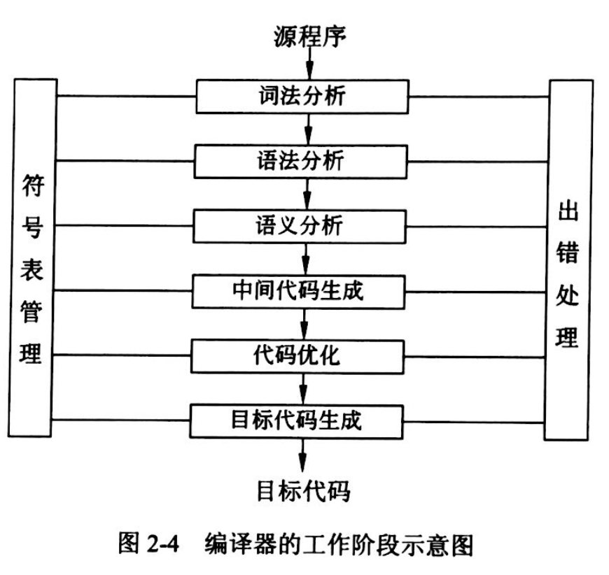

## 程序设计语言知识

### 试题放置
题目编号大致为：20-22

### 知识点
#### 编译程序基本原理

1、词法分析

词法分析器根据词法规则识别出源程序中的各个记号（token），每个记号代表一类单词（lexeme）。源程序中常见的记号可以归为几大类：关键字、标识符、字面量和特殊符号。词法分析器的输入是源程序，输出是识别的记号流。词法分析器的任务是把源文件的字符流转换成记号流。本质上它查看连续的字符然后把它们**识别为“单词”**。

2、语法分析

语法分析器根据语法规则识别出记号流中的结构（短语、句子），并构造一棵能够正确反映该**结构的语法树**。

3、语义分析

语义分析器根据语义规则对语法树中的语法单元进行静态语义检查，如果类型检查和转换等，其目的在于保证语法正确的结构**在语义上**也是合法的。

4、中间代码生成

中间代码生成器根据语义分析器的输出生成中间代码。中间代码可以有若干种形式，它们的共同特征是与具体机器无关。最常用的一种中间代码是**三地址码**，它的一种实现方式是四元式。三地址码的优点是便于阅读、便于优化。

5、中间代码优化

优化是编译器的一个重要组成部分，由于编译器将源程序翻译成中间代码的工作是机械的、按固定模式进行的，因此，生成的中间代码往往在**时间和空间上有很大浪费**。当需要生成高效目标代码时，就必须进行优化。

6、目标代码生成

目标代码生成是编译器的最后一个阶段。在生成目标代码时要考虑以下几个问题：计算机的系统结构、指令系统、寄存器的分配以及内存的组织等。编译器生成的目标程序代码可以有多种形式：**汇编语言、可重定位二进制代码、内存形式**。

7、符号表管理

符号表的作用是**记录源程序中符号的必要信息**，并加以合理组织，从而在编译器的各个阶段能对它们进行快速、准确的查找和操作。符号表中的某些内容甚至要保留到程序的运行阶段。

8、出错处理

用户编写的源程序中往往会有一些错误，可分为**静态错误和动态错误**两类。所谓动态错误，是指源程序中的逻辑错误，它们发生在程序运行的时候，也被称作动态语义错误，如变量取值为零时作为除数，数组元素引用时下标出界等。静态错误又可分为语法错误和静态语义错误。语法错误是指有关语言结构上的错误，如单词拼写错、表达式中缺少操作数、begin和end不匹配等。静态语义错误是指分析源程序时可以发现的语言意义上的错误，如加法的两个操作数中一个是整型变量名，而另一个是数组名等。

#### 算术表达式
**名称可以理解为二叉树的根的位置，先左后右，根看名称**

- 中缀式 （左根右）

是一个通用的算术或逻辑公式表示方法， 操作符是以中缀形式处于操作数的中间（例：`3+4`），中缀表达式是人们常用的算术表示方法。

- 后缀式/逆波兰式（左右根）

这种表示方式把运算符写在运算对象的后面，例如，把 `a+b` 写成 `ab+`，所以也称为后缀式。这种表示法的优点是根据运算对象和算符的出现次序进行计算，不需要使用括号，也便于用械实现求值。

- 前缀式/波兰式 （根左右）

前缀表达式是一种没有括号的算术表达式，与中缀表达式不同的是，其将运算符写在前面，操作数写在后面。

例如，`1-(2+3)` 的波兰是为 `-1+23` 。

中序遍历即算术表达式 `(a-b)*(c+d)`

后序遍历即其后缀表达式（逆波兰式）为 `ab-cd+*`

前序遍历即前缀表达式（波兰式）为 `*-ab+cd`

