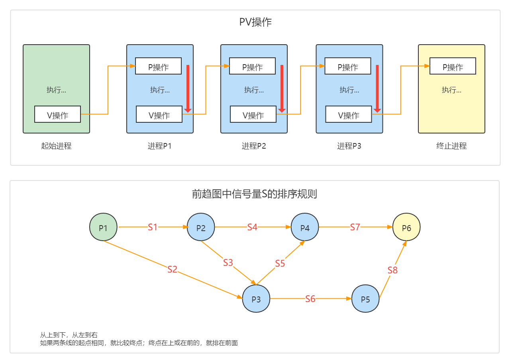

## 操作系统基础知识

### 试题放置
题目编号大致为：23-28

### 知识点
#### PV操作
**P操作：相当于请求资源、输入**

**V操作：相当于释放资源、输出**

使用PV操作和信号量可以 **实现进程间的同步和互斥**，实现资源的互斥使用。



- 起始进程：只有 V操作(输出)，没有 P操作(输入)
```
相当于程序只出不进
```

- 终止进程：只有 P操作(输入)，没有 V操作(输出)
```
相当于程序只进不出
```

- 在单一进程内部，由 P操作 —> V操作
```
1、P：请求到资源 (相当于程序输入)
2、执行…
3、V：释放资源 (相当于程序的输出)
```

- 在两个进程之间，由 V操作 —> P操作
```
1、V：一个进程释放了资源
2、P：另一个进程可以申请该资源
```

**原则**
```
初始进程，只有V，没有P
终止进程，只有P，没有V
进程内，从P到V
进程间，从V到P
一个进程有几个输入就有几个输出V
```

