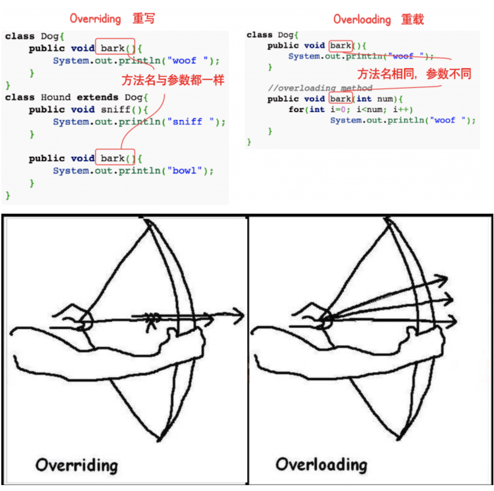

## Java程序设计与设计模式

### 试题放置
第六大题 (**最后两题选做一题**)

### Hello World
```
public class HelloWorld {
    public static void main(String[] args) {
        System.out.println("Hello World");
    }
}
```
*注：String args[] 与 String[] args 都可以执行，但推荐使用 String[] args，这样可以避免歧义和误读。*

```
$ javac HelloWorld.java
$ java HelloWorld
Hello World
```
以上我们使用了两个命令 javac 和 java。

javac 后面跟着的是java文件的文件名，例如 HelloWorld.java。 该命令用于将 java 源文件编译为 class 字节码文件，如： javac HelloWorld.java。

运行javac命令后，如果成功编译没有错误的话，会出现一个 HelloWorld.class 的文件。

### 基本语法
编写 Java 程序时，应注意以下几点：

- 大小写敏感：Java 是大小写敏感的，这就意味着标识符 Hello 与 hello 是不同的。

- 类名：对于所有的类来说，类名的首字母应该大写。如果类名由若干单词组成，那么每个单词的首字母应该大写，例如 MyFirstJavaClass 。

- 方法名：所有的方法名都应该以小写字母开头。如果方法名含有若干单词，则后面的每个单词首字母大写。

- 源文件名：源文件名必须和类名相同。当保存文件的时候，你应该使用类名作为文件名保存（切记 Java 是大小写敏感的），文件名的后缀为 .java。（如果文件名和类名不相同则会导致编译错误）。

- 主方法入口：所有的 Java 程序由 public static void main(String[] args) 方法开始执行。

### 枚举
```
class FreshJuice {
   enum FreshJuiceSize{ SMALL, MEDIUM , LARGE }
   FreshJuiceSize size;
}
 
public class FreshJuiceTest {
   public static void main(String[] args){
      FreshJuice juice = new FreshJuice();
      juice.size = FreshJuice.FreshJuiceSize.MEDIUM  ;
   }
}
```

#### 关键字
*注意*：Java 的 `null` 不是关键字，类似于 true 和 false，它是一个字面常量，不允许作为标识符使用。

### 源程序与编译型运行区别


### 对象和类
#### 构造方法
每个类都有构造方法。如果没有显式地为类定义构造方法，Java 编译器将会为该类提供一个默认构造方法。
```
public class Puppy{
    public Puppy(){
    }
 
    public Puppy(String name){
        // 这个构造器仅有一个参数：name
    }
}
```

```
public class Puppy{
   int puppyAge;
   public Puppy(String name){
      // 这个构造器仅有一个参数：name
      System.out.println("小狗的名字是 : " + name ); 
   }
 
   public void setAge( int age ){
       puppyAge = age;
   }
 
   public int getAge( ){
       System.out.println("小狗的年龄为 : " + puppyAge ); 
       return puppyAge;
   }
 
   public static void main(String[] args){
      /* 创建对象 */
      Puppy myPuppy = new Puppy( "tommy" );
      /* 通过方法来设定age */
      myPuppy.setAge( 2 );
      /* 调用另一个方法获取age */
      myPuppy.getAge( );
      /*你也可以像下面这样访问成员变量 */
      System.out.println("变量值 : " + myPuppy.puppyAge ); 
   }
}
```

#### 源文件声明规则
当在一个源文件中定义多个类，并且还有import语句和package语句时，要特别注意这些规则。

- 一个源文件中只能有一个 public 类
- 一个源文件可以有多个非 public 类
- 源文件的名称应该和 public 类的类名保持一致。例如：源文件中 public 类的类名是 Employee，那么源文件应该命名为Employee.java。
- 如果一个类定义在某个包中，那么 package 语句应该在源文件的首行。
- 如果源文件包含 import 语句，那么应该放在 package 语句和类定义之间。如果没有 package 语句，那么 import 语句应该在源文件中最前面。
- import 语句和 package 语句对源文件中定义的所有类都有效。在同一源文件中，不能给不同的类不同的包声明。

```
import java.io.*;
 
public class Employee{
   String name;
   int age;
   String designation;
   double salary;
   // Employee 类的构造器
   public Employee(String name){
      this.name = name;
   }
   // 设置age的值
   public void empAge(int empAge){
      age =  empAge;
   }
   /* 设置designation的值*/
   public void empDesignation(String empDesig){
      designation = empDesig;
   }
   /* 设置salary的值*/
   public void empSalary(double empSalary){
      salary = empSalary;
   }
   /* 打印信息 */
   public void printEmployee(){
      System.out.println("名字:"+ name);
      System.out.println("年龄:" + age);
      System.out.println("职位:" + designation);
      System.out.println("薪水:" + salary);
   }
}
```

### 基本数据类型
#### 内置数据类型
Java语言提供了八种基本类型。六种数字类型（四个整数型，两个浮点型），一种字符类型，还有一种布尔型。

- byte: 数据类型是8位、有符号的，以二进制补码表示的整数

- short: 数据类型是 16 位、有符号的以二进制补码表示的整数

- int: 数据类型是32位、有符号的以二进制补码表示的整数

- long: 数据类型是 64 位、有符号的以二进制补码表示的整数

- float: 数据类型是单精度、32位、符合IEEE 754标准的浮点数

- double: 数据类型是双精度、64 位、符合 IEEE 754 标准的浮点数

- boolean: true 和 false

- char: 类型是一个单一的 16 位 Unicode 字符

#### 隐含强制类型转换
整数的默认类型是 int。

小数默认是 double 类型浮点型，在定义 float 类型时必须在数字后面跟上 F 或者 f。

### 变量类型
Java语言支持的变量类型有：

类变量：独立于方法之外的变量，用 static 修饰。

实例变量：独立于方法之外的变量，不过没有 static 修饰。

局部变量：类的方法中的变量。
```
import java.io.*;
 
public class Employee {
    //salary是静态的私有变量
    private static double salary;
    // DEPARTMENT是一个常量
    public static final String DEPARTMENT = "开发人员";
    public static void main(String[] args){
        salary = 10000;
        System.out.println(DEPARTMENT+"平均工资:"+salary);
    }
}
```
以上实例编译运行结果如下:
`开发人员平均工资:10000.0`

**注意**：如果其他类想要访问该变量，可以这样访问：Employee.DEPARTMENT。

#### 访问控制修饰符
Java中，可以使用访问控制符来保护对类、变量、方法和构造方法的访问。Java 支持 4 种不同的访问权限。

- default (即默认，什么也不写）: 在同一包内可见，不使用任何修饰符。使用对象：类、接口、变量、方法。

- private : 在同一类内可见。使用对象：变量、方法。 注意：不能修饰类（外部类）

- public : 对所有类可见。使用对象：类、接口、变量、方法

- protected : 对同一包内的类和所有子类可见。使用对象：变量、方法。 注意：不能修饰类（外部类）。

#### final 修饰符
final 表示"最后的、最终的"含义，变量一旦赋值后，不能被重新赋值。被 final 修饰的实例变量必须显式指定初始值。
```
public class Test{
  final int value = 10;
  // 下面是声明常量的实例
  public static final int BOXWIDTH = 6;
  static final String TITLE = "Manager";
 
  public void changeValue(){
     value = 12; //将输出一个错误
  }
}
```

父类中的 final 方法可以被子类继承，但是不能被子类重写。

final 类不能被继承，没有类能够继承 final 类的任何特性。

#### abstract 修饰符
抽象类不能用来实例化对象，声明抽象类的唯一目的是为了将来对该类进行扩充。

一个类不能同时被 abstract 和 final 修饰。如果一个类包含抽象方法，那么该类一定要声明为抽象类，否则将出现编译错误。
```
abstract class Caravan{
   private double price;
   private String model;
   private String year;
   public abstract void goFast(); //抽象方法
   public abstract void changeColor();
}
```

#### synchronized 修饰符
声明的方法同一时间只能被一个线程访问。synchronized 修饰符可以应用于四个访问修饰符。

#### transient 修饰符
序列化的对象包含被 transient 修饰的实例变量时，java 虚拟机(JVM)跳过该特定的变量。

该修饰符包含在定义变量的语句中，用来预处理类和变量的数据类型。
```
public transient int limit = 55;   // 不会持久化
public int b; // 持久化
```

#### volatile 修饰符
volatile 修饰的成员变量在每次被线程访问时，都强制从共享内存中重新读取该成员变量的值。而且，当成员变量发生变化时，会强制线程将变化值回写到共享内存。这样在任何时刻，两个不同的线程总是看到某个成员变量的同一个值。
```
public class MyRunnable implements Runnable
{
    private volatile boolean active;
    public void run()
    {
        active = true;
        while (active) // 第一行
        {
            // 代码
        }
    }
    public void stop()
    {
        active = false; // 第二行
    }
}
```
通常情况下，在一个线程调用 run() 方法（在 Runnable 开启的线程），在另一个线程调用 stop() 方法。 如果 第一行 中缓冲区的 active 值被使用，那么在 第二行 的 active 值为 false 时循环不会停止。

但是以上代码中我们使用了 volatile 修饰 active，所以该循环会停止。

### 继承
#### 继承类型
需要注意的是 Java 不支持多继承，但支持多重继承。

在 Java 中，类的继承是单一继承，也就是说，一个子类只能拥有一个父类，所以 extends 只能继承一个类
```
public class Animal { 
    private String name;   
    private int id; 
    public Animal(String myName, int myid) { 
        //初始化属性值
    } 
    public void eat() {  //吃东西方法的具体实现  } 
    public void sleep() { //睡觉方法的具体实现  } 
} 
 
public class Penguin extends Animal{ 
}
```
使用 implements 关键字可以变相的使java具有多继承的特性，使用范围为类继承接口的情况，可以同时继承多个接口（接口跟接口之间采用逗号分隔）。
```
public interface A {
    public void eat();
    public void sleep();
}
 
public interface B {
    public void show();
}
 
public class C implements A,B {
}
```

#### super 与 this 关键字
super关键字：我们可以通过super关键字来实现对父类成员的访问，用来引用当前对象的父类。

this关键字：指向自己的引用。

#### 构造器
子类是不继承父类的构造器（构造方法或者构造函数）的，它只是调用（隐式或显式）。如果父类的构造器带有参数，则必须在子类的构造器中显式地通过 super 关键字调用父类的构造器并配以适当的参数列表。

如果父类构造器没有参数，则在子类的构造器中不需要使用 super 关键字调用父类构造器，系统会自动调用父类的无参构造器。

### 重写(Override)与重载(Overload)
#### 重写(Override)
重写是子类对父类的允许访问的方法的实现过程进行重新编写, 返回值和形参都不能改变。即**外壳不变，核心重写！**

重写的好处在于子类可以根据需要，定义特定于自己的行为。 也就是说子类能够根据需要实现父类的方法。

重写方法不能抛出新的检查异常或者比被重写方法申明更加宽泛的异常。

例如： 父类的一个方法申明了一个检查异常 IOException，但是在重写这个方法的时候不能抛出 Exception 异常，因为 Exception 是 IOException 的父类，抛出 IOException 异常或者 IOException 的子类异常。

在面向对象原则里，重写意味着可以重写任何现有方法。

#### 重载(Overload)
重载(overloading) 是在一个类里面，方法名字相同，而参数不同。返回类型可以相同也可以不同。

每个重载的方法（或者构造函数）都必须有一个独一无二的参数类型列表。

最常用的地方就是构造器的重载。

重载规则:

1. 被重载的方法必须改变参数列表(参数个数或类型不一样)；
1. 被重载的方法可以改变返回类型；
1. 被重载的方法可以改变访问修饰符；
1. 被重载的方法可以声明新的或更广的检查异常；
1. 方法能够在同一个类中或者在一个子类中被重载。
1. 无法以返回值类型作为重载函数的区分标准。

#### 重写与重载之间的区别
区别点|重载方法|重写方法
-|-|-
参数列表|必须修改|一定不能修改
返回类型|可以修改|一定不能修改
异常|可以修改|可以减少或删除，一定不能抛出新的或者更广的异常
访问|可以修改|一定不能做更严格的限制（可以降低限制）



### 多态
多态是同一个行为具有多个不同表现形式或形态的能力。多态就是同一个接口，使用不同的实例而执行不同操作。

多态的优点：
1. 消除类型之间的耦合关系
2. 可替换性
3. 可扩充性
4. 接口性
5. 灵活性
6. 简化性

多态存在的三个必要条件
继承、
重写、
父类引用指向子类对象：Parent p = new Child();

当使用多态方式调用方法时，首先检查父类中是否有该方法，如果没有，则编译错误；如果有，再去调用子类的同名方法。

多态的好处：可以使程序有良好的扩展，并可以对所有类的对象进行通用处理。

#### 虚函数
虚函数的存在是为了多态。

Java 中其实没有虚函数的概念，它的普通函数就相当于 C++ 的虚函数，动态绑定是Java的默认行为。如果 Java 中不希望某个函数具有虚函数特性，可以加上 final 关键字变成非虚函数。

当子类对象调用重写的方法时，调用的是子类的方法，而不是父类中被重写的方法。

要想调用父类中被重写的方法，则必须使用关键字 `super`。

#### 多态的实现方式
方式一：重写(Override)

方式二：接口
1. 生活中的接口最具代表性的就是插座，例如一个三接头的插头都能接在三孔插座中，因为这个是每个国家都有各自规定的接口规则，有可能到国外就不行，那是因为国外自己定义的接口类型。

2. java中的接口类似于生活中的接口，就是一些方法特征的集合，但没有方法的实现。

方式三：抽象类和抽象方法

### 抽象类

在面向对象的概念中，所有的对象都是通过类来描绘的，但是反过来，并不是所有的类都是用来描绘对象的，如果一个类中没有包含足够的信息来描绘一个具体的对象，这样的类就是抽象类。

抽象类除了不能实例化对象之外，类的其它功能依然存在，成员变量、成员方法和构造方法的访问方式和普通类一样。

**由于抽象类不能实例化对象，所以抽象类必须被继承，才能被使用。** 也是因为这个原因，通常在设计阶段决定要不要设计抽象类。

父类包含了子类集合的常见的方法，但是由于父类本身是抽象的，所以不能使用这些方法。

在 Java 中抽象类表示的是一种继承关系，一个类只能继承一个抽象类，而一个类却可以实现多个接口。

在 Java 语言中使用 abstract class 来定义抽象类。

#### 抽象方法

如果你想设计这样一个类，该类包含一个特别的成员方法，该方法的具体实现由它的子类确定，那么你可以在父类中声明该方法为抽象方法。
Abstract 关键字同样可以用来声明抽象方法，抽象方法只包含一个方法名，而没有方法体。
抽象方法没有定义，方法名后面直接跟一个分号，而不是花括号。
```
public abstract class Employee
{
   private String name;
   private String address;
   private int number;
   
   public abstract double computePay();
   
   //其余代码
}
```

### 接口
接口（英文：Interface），在JAVA编程语言中是一个抽象类型，是抽象方法的集合，接口通常以interface来声明。一个类通过继承接口的方式，从而来继承接口的抽象方法。
接口并不是类，编写接口的方式和类很相似，但是它们属于不同的概念。类描述对象的属性和方法。接口则包含类要实现的方法。

除非实现接口的类是抽象类，否则该类要定义接口中的所有方法。

接口无法被实例化，但是可以被实现。一个实现接口的类，必须实现接口内所描述的所有方法，否则就必须声明为抽象类。另外，在 Java 中，接口类型可用来声明一个变量，他们可以成为一个空指针，或是被绑定在一个以此接口实现的对象。

#### 接口与类相似点：
一个接口可以有多个方法。
接口文件保存在 .java 结尾的文件中，文件名使用接口名。
接口的字节码文件保存在 .class 结尾的文件中。
接口相应的字节码文件必须在与包名称相匹配的目录结构中。
接口与类的区别：
接口不能用于实例化对象。
接口没有构造方法。
接口中所有的方法必须是抽象方法，Java 8 之后 接口中可以使用 default 关键字修饰的非抽象方法。
接口不能包含成员变量，除了 static 和 final 变量。
接口不是被类继承了，而是要被类实现。
接口支持多继承。

#### 接口特性

接口中每一个方法也是隐式抽象的,接口中的方法会被隐式的指定为 public abstract（只能是 public abstract，其他修饰符都会报错）。
接口中可以含有变量，但是接口中的变量会被隐式的指定为 public static final 变量（并且只能是 public，用 private 修饰会报编译错误）。
接口中的方法是不能在接口中实现的，只能由实现接口的类来实现接口中的方法。

#### 抽象类和接口的区别
1. 抽象类中的方法可以有方法体，就是能实现方法的具体功能，但是接口中的方法不行。
2. 抽象类中的成员变量可以是各种类型的，而接口中的成员变量只能是 public static final 类型的。
3. 接口中不能含有静态代码块以及静态方法(用 static 修饰的方法)，而抽象类是可以有静态代码块和静态方法。
4. 一个类只能继承一个抽象类，而一个类却可以实现多个接口。

*JDK 1.8 以后，接口里可以有静态方法和方法体了。*

```
/* 文件名 : NameOfInterface.java */
import java.lang.*;
//引入包
 
public interface NameOfInterface
{
   //任何类型 final, static 字段
   //抽象方法
}
```

接口有以下特性：

接口是隐式抽象的，当声明一个接口的时候，不必使用abstract关键字。

接口中每一个方法也是隐式抽象的，声明时同样不需要abstract关键字。

接口中的方法都是公有的。

### 包(package)
为了更好地组织类，Java 提供了包机制，用于区别类名的命名空间。

包的作用:

1. 把功能相似或相关的类或接口组织在同一个包中，方便类的查找和使用。
2. 如同文件夹一样，包也采用了树形目录的存储方式。同一个包中的类名字是不同的，不同的包中的类的名字是可以相同的，当同时调用两个不同包中相同类名的类时，应该加上包名加以区别。因此，包可以避免名字冲突。
3. 包也限定了访问权限，拥有包访问权限的类才能访问某个包中的类。

Java 使用包（package）这种机制是为了防止命名冲突，访问控制，提供搜索和定位类（class）、接口、枚举（enumerations）和注释（annotation）等。

```
package pkg1[．pkg2[．pkg3…]];

package net.java.util;
public class Something{
   ...
}
```

那么它的路径应该是 net/java/util/Something.java 这样保存的。 package(包) 的作用是把不同的 java 程序分类保存，更方便的被其他 java 程序调用。

开发者可以自己把一组类和接口等打包，并定义自己的包。而且在实际开发中这样做是值得提倡的，当你自己完成类的实现之后，将相关的类分组，可以让其他的编程者更容易地确定哪些类、接口、枚举和注释等是相关的。

由于包创建了新的命名空间（namespace），所以不会跟其他包中的任何名字产生命名冲突。使用包这种机制，更容易实现访问控制，并且让定位相关类更加简单。

### PS
#### oc语言的优缺点有哪些

OC语言优点：

1.Category是非常实用的扩展机制，可以很方便的为一个已有的类添加属性或者方法，而不需要笨拙的去继承。

2.运行时多态的概念，可以让一个类的对象动态的以其他类行为去执行（OC中多了很多运行时态的机制，其中id的特殊用途，可以通过id类型的变量，调用不同类的同名函数，即使这些类没有任何关系）。

3.ARC不用多讲了吧

4.OC中类没有所谓的构造函数和析构函数，所以如果一个类中有其他类的数据（动态申请的），那么释放内存就不能依赖析构函数，但可以采用重写-（id） free来实现类中所有数据释放。

5.OC++中成员变量也有三种访问权限，@public，@protected，@private。但默认的是@protected，而C++中默认是private。

6.OC中成员函数只有两种，一种是实例函数，一种是类函数。实例函数就是C++中的Public函数，类函数就是public中的staTIc函数。

7.OC中成员函数如果要接受多个参数，则需要每个参数前加冒号（虽然教科书上说参数后加冒号，但就我看来说成参数前加更能让C++Programmer理解）。例如-（ int ） Set ： （ int ） A ： （ int ） B ;每个形参前还可以加一个参数名，并成为函数名的一部分。例如-（ int ） Set ： （ int ） A And ： （ int ） B;在使用时［ classTest Set ： 10 And ： 12 ］; 起初看起来确实不习惯。

8.OC中还多了一个id类型，通过测试，id就是指针。

9.OC不是一个过度复杂的 C 衍生语言。

10.OC可以给已类添加新的函数。@interface classExist（ NewMethodGroup ）-@end，@implementaTIon classExist（ NewMethodGroup ）-@end。

11.OC可以将让某类A，代替某类B。通过poseAs关键字。例如：［FracTIonB poseAs： ［FracTIon class］］;此后使用Fraction类时，就转换成使用FractionB了

12.OC还有protocol概念。protocol实际是一组函数，支持改协议的类都应重写这些函数。通过@protocol-@end来声明protocol。类中通过《protocol1，protocol2，。。。》来表示支持某个协议。如@interface A ： Object 《 NSCopying， NSTransform 》-@end表明类A继承与Object类，并支持两个协议（NSCopying， NSTransform ）。

13.OC最后总结，其类实现以c为基础。@interface classTest - @end是相当于一组宏，帮你将类的所有成员变量声明组织为一个结构体，成员函数实际就是普通函数，是在原来成员函数基础上，修改函数名称，添加结构体指针到第一个参数。id类型实际也就是指针。难怪OC的类看起来不像C的一般语法，原因就是其源自C的一般语法，采用新的类脚本的方式，实现的类功能。

14.由于都是C衍生出的面向对象的语言 所以可以和C++混合编码。

OC语言的缺点：

1.不支持多重继承 只有多级继承。

2.使用动态运行时类型，所有的方法都是函数调用，所以很多编译时优化方法都用不到。（如内联函数等），性能低劣。

3.不支持运算符重载（“命名空间”，也称“名称空间” 。VS.NET中的各种语言使用的一种代码组织的形式 通过名称空间来分类，区别不同的代码功能 同时也是VS.NET中所有类的完全名称的一部分。因为人类可用的单词数太少，并且不同的人写的程序不可能所有的变量都没有重名现象，对于库来说，这个问题尤其严重，如果两个人写的库文件中出现同名的变量或函数（不可避免），使用起来就有问题了，为了解决这个问题，引入了名字空间这个概念，通过使用 namespace xxx；你所使用的库函数或变量就是在该名字空间中定义的，这样一来就不会引起不必要的冲突了。）

4.程序执行效率：汇编>C>OC

### 参考
[Java 教程](https://www.runoob.com/java/java-tutorial.html)
[oc语言的优缺点](https://blog.csdn.net/zhuxincheng_1218/article/details/124404458)
