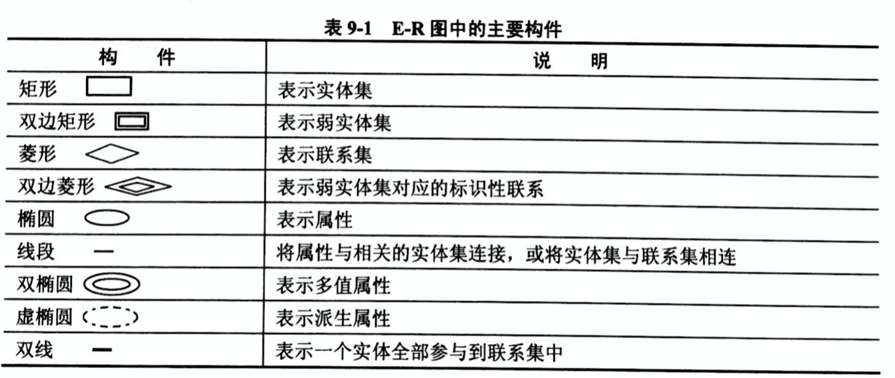
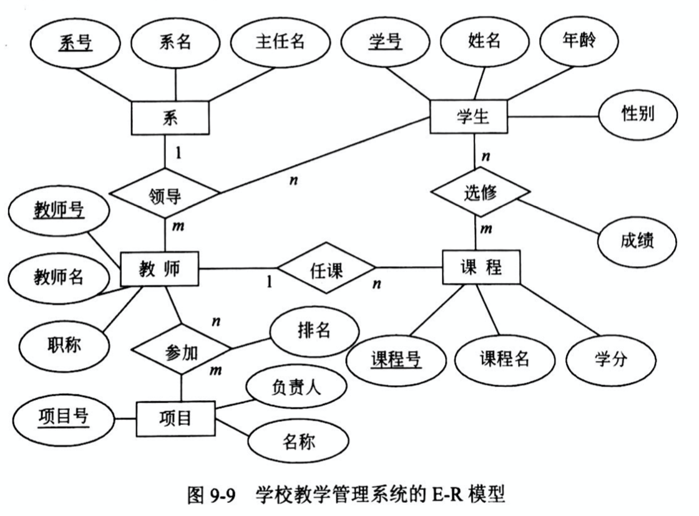
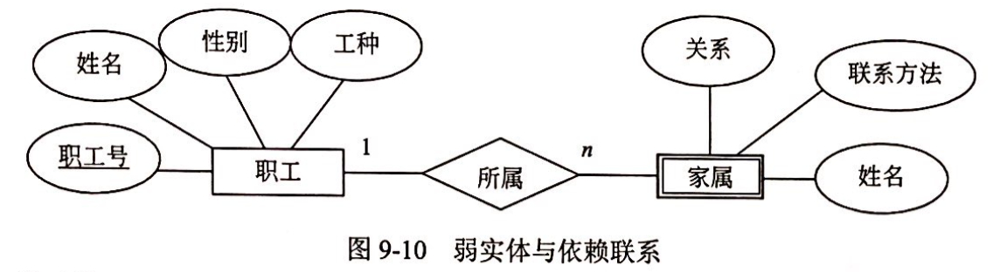
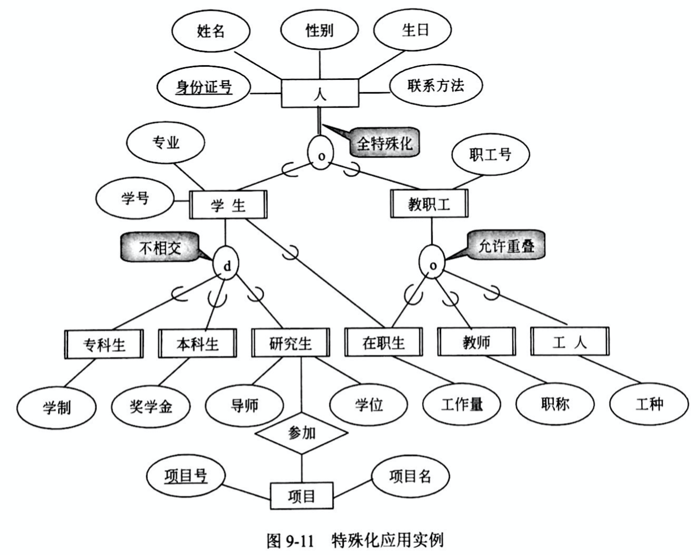
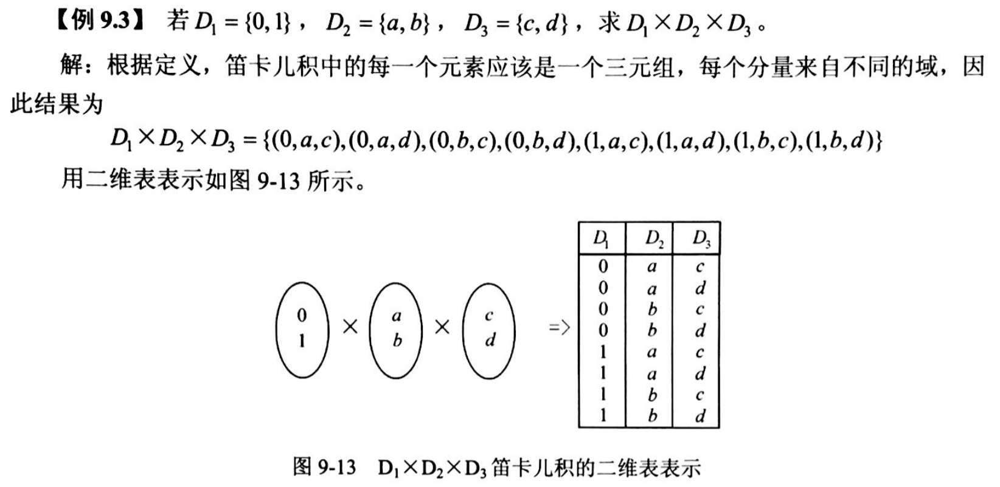
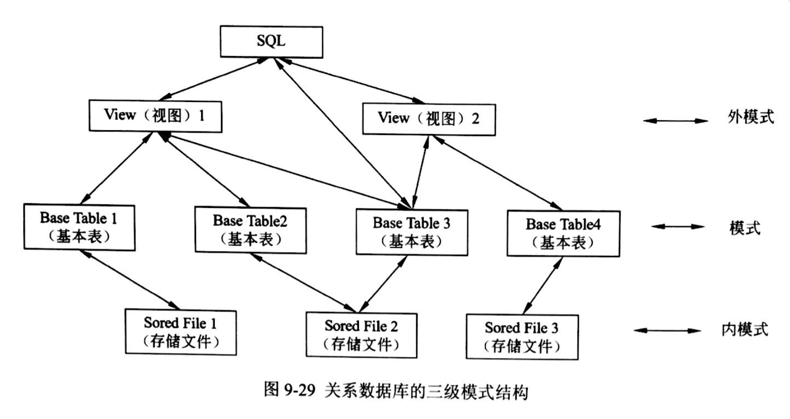

## 数据库分析与设计

###  试题放置
第二大题

### 第9章 数据库技术基础
#### 9.1.1 数据库系统（DataBase System, DBS）
由数据库（DB）、硬件、软件和人员组成。

数据库特点：数据间联系密切、冗余度小、独立性较高、易拓展，可为各类用户共享。

人员4类：系统分析员和数据库设计人员；应用程序员；最终用户；数据库管理员（DataBase Administrator, DBA）。

#### 9.1.2 数据库管理系统（DataBase Management System, DBMS）的功能
数据定义（Data Definition Language, DDL）、
数据库操作（Data Manipulation Language, DML）、
数据库运行管理、数据的组织存储和管理、数据库的建立和维护、其他。

#### 9.1.3 DBMS的特征及分类
数据结构化且统一管理；

有较高的数据独立性；

数据控制功能（包括：数据库中数据的安全性、完整性、并发控制、故障恢复）；

DBMS分为三类：

关系数据库系统（Relation DataBase System, RDBS）

面向对象数据库系统（Object-Oriented DataBase System, OODBS）：完整地描述现实世界的数据结构，能表达数据间的嵌套、递归关系；具有OO的封装性和继承性，提高了软件的可重用性。

对象关系数据库系统（Object-Oriented Relation DataBase System, ORDBS）：
在RDBS基础上提供元祖、数组、集合等更丰富的数据类型以及处理新的数据类型操作的能力。

#### 9.1.6 大数据（Big Data）
无法用现有的软件工具提取、存储、搜索、共享、分析和处理的海量的、复杂的数据集合。

特征4V：大量化(Volume)、多样化(Variety)、价值密度低(Value)、快速化(Velocity)

#### 9.2.2 数据模型的三要素
数据结构、数据操作、数据的约束条件

#### 9.2.3 实体-联系模型（Entity-Relationship Model, E-R）


- 实体

- 联系

- 属性
 - 简单属性和复合属性：简单属性是原子的、不可再分的
 - 单值属性和多值属性：单值属性对于一个实体只有一个单独的值
 - NULL：无意义或不知道
 - 派生属性：由其他属性得来，比如：工作年限=当前时间-参加工作时间
 
 
- 弱实体：一个实体的存在必须以另一个实体为前提

- 特殊化：实体具有共性和特殊性，从普通到特殊的过程


#### 9.2.4 数据模型
层次模型、网状模型、关系模型、面向对象模型

#### 9.3 关系代数
#### 9.3.1 关系数据库的基本概念
属性（Attribute）：描述事物的特征

属性的域（Domain）: 每个属性的取值范围对应的一个值的集合

**第一范式（First Normal Form, 1NF）：在关系数据模型中，通常对域加了一个限制，所有的域都是原子数据（Atomic Data）**

例如：整数、字符串、整形、浮点型，而集合、记录、数组是非原子数据。

**笛卡尔积**



### 9.4 关系数据库SQL(Structured Query Language)语言简介
#### 9.4.1 SQL数据库体系结构
特点：

综合统一

高度非过程化

面向集合的操作方式

终端命令操作（自含式语言）和嵌入高级语言程序的使用方式

语言简洁、易学易用
```
SELECT//查询
CREATE DROP ALTER//定义
INSERT UPDATE DELETE//操纵
GRANT REVORK//控制 
```

