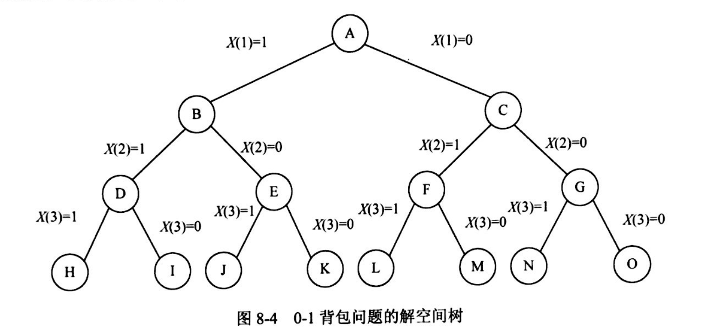
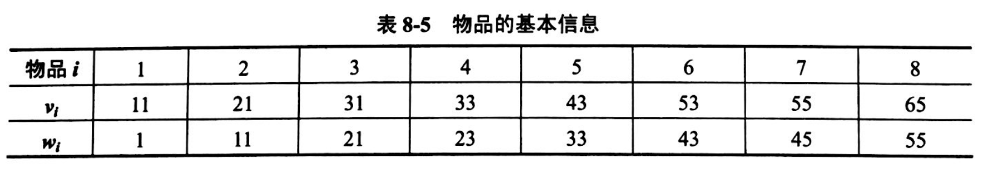
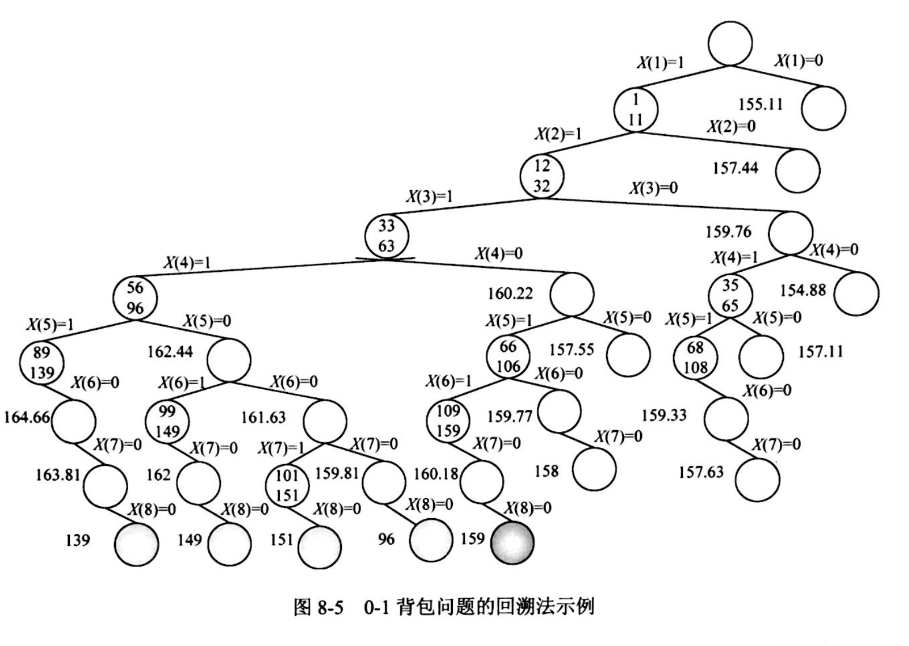
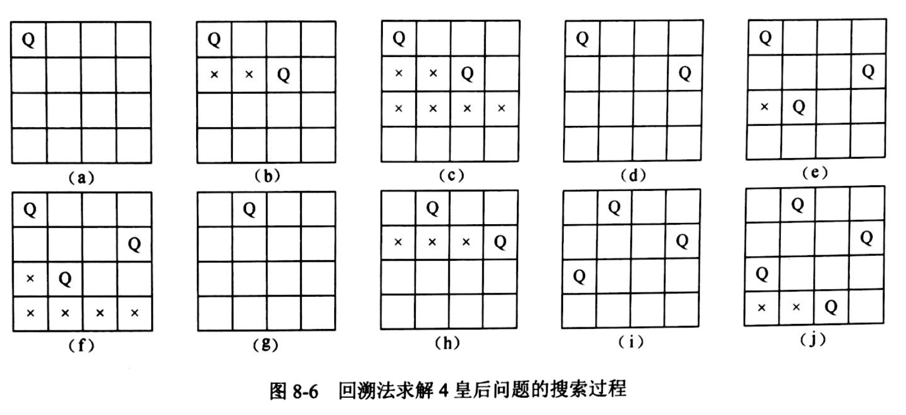

## 算法设计与分析

###  试题放置
第四大题的一部分

### 教程章节
《软件设计师教程（第5版）》

第8章 算法设计与分析

### 8.1 基本概念
#### 8.1.1 算法（Algorithm）
对特定问题求解步骤的一种描述，是指令的有限序列，其中每一条指令表示一个或多个操作。

重要特性：有穷性、确定性、可行性、输入、输出。

#### 8.1.4 算法的表示
自然语言、流程图、程序设计语言、伪代码。

**下午的算法题不仅考核算法设计与分析技术，还同时考核算法的C程序设计语言实现。因此，本章采用C程序设计语言表示算法。**

### 8.2 算法分析基础
#### 8.2.1 时间复杂度
3种情况：最佳、最坏、平均

### 8.3 分治法
#### 8.3.1 递归
```
int Factorial(int num){
    if(num == 0)
        return 1;
    if(num > 0)
        return num * Factorial(num - 1);
}
```
#### 8.3.2 分治法的基本思想
分治与递归经常同时应用于算法设计之中，并由此产生许多高效的算法。

设计思想是将一个难以直接解决的大问题分解成一些规模较小的相同问题，以便各个击破，分而治之。

一般分治算法在每一层递归上都有3个步骤：

（1）分解 （2）求解（3）合并

#### 8.3.3 典型实例
- 归并排序
- 最大字段和问题

### 8.4 动态规划法
**基本上考的都是这个设计策略的算法**
#### 8.4.1 基本思想
将待求解问题分解成若干个子问题，先求解子问题，然后从子问题的解得到原问题的解。为了避免大量的重复计算，用一个表记录所有已解决的子问题的答案，在需要时再找出即可。

问题具有如下两个性质，可以考虑用动态规划法：

（1）最优子结构：问题的最优解包含子问题的最优解；有时贪心策略也可能适用。

（2）重叠子问题：用来解原问题的递归算法可反复的解相同的子问题，而不是产生新的子问题。

#### 8.4.2 典型实例
- 0-1背包问题
- 最长公共子序列（LCS）

### 8.5 贪心法
#### 8.5.1 基本思想
仅根据当前已有的信息做出选择，一旦确定不会更改；不是从整体最优考虑，只是局部最优。

举一个简单的例子：平时购物找钱，为使找回的零钱的硬币数最少，从最大面值的币种开始，按递减的顺序考虑各币种。贪心算法在这里总是最优的，因为银行对其发行的硬币种类和面值的巧妙安排。如果只有面值分别为1、5、11，希望找回15单位的硬币，如果按照贪心算法，则应找回1个11和4个1面值的硬币，但是最优解应该是3个5单位面值的硬币。

可以用贪心算法求得最优解的问题包含以下两个性质：

（1）最优子结构：问题的最优解包含子问题的最优解；

（2）贪心选择性质：问题的整体最优解可以通过一系列局部最优解的选择来得到。

#### 8.5.2 典型实例
- 活动选择问题
- 背包问题：物品已按照其单位重量的价值从大到小排好序
 - 最大价值先放背包
 - 最小重量先放背包
 - 最大单位重量价值先放背包（最优解）
 
### 8.6 回溯法
以深度优先的方式系统地搜索问题的所有解的解空间树的方法，适用于解一些组合数较大的问题。
 
#### 8.6.1 算法框架


- 限界函数
为了有效地进行搜索，需要对某些结点进行剪枝，需要设计限界函数来判断。这是一个核心问题。

#### 8.6.2 典型实例
- 0-1 背包问题



- n 皇后问题：

`nxn` 格棋盘上放置n个皇后，彼此不受攻击。国际象棋的规则，一个皇后可以攻击与之处在同一行或同一列或同一条斜线上的其他任何棋子。


### 8.7 分支限界法
类似回溯法，也是一种在问题的解空间树T上搜索问题解的算法。求解目标不同，只是找出满足约束条件的一个解。

根据从活结点表中选择下一拓展结点的不同方式，可分为：

（1）队列式（FIFO，先进先出）分支限界法；

（2）优先队列式分支限界法。

### 8.8 概率算法
基本特征：
（1）输入包括两部分：原问题的输入+一个供算法进行随机选择的随机数序列；

（2）运行过程中，包括一处或多处随机选择；

（3）结果不能保证一定正确，但能限制其出错的概率；

（4）在不同的运行过程中，对于相同的输入实例可以有不同的结果。

大致分为4类：数值概率算法、蒙特卡罗（Monte Carlo）算法、拉斯维加斯（Las Vegas）算法、舍伍德（Sherwood）算法。

### 8.9 近似算法
基本思想是放弃求最优解，而用近似最优解代替。

最重要的标准：
（1）算法的时间复杂度；（2）解的近似程度。

### 8.10 数据挖掘算法
利用机器学习方法对多种数据，包括数据库数据、数据仓库数据、Web数据等进行分析和挖掘。

核心是算法，主要功能包括：分类、回归、关联规则和聚类等。

### 8.11 智能优化算法
一些新颖的优化算法，如人工神经网络、混沌、遗传算法、进化规划、模拟退火、禁忌搜索以及混合优化策略等，通过模拟或揭示某些自然现象或过程而得到发展，有独特的算法构造的直观性与自然机理。

#### 蚁群算法
蚂蚁在寻找食物或者寻找回巢的路径中，会在它们经过的地方留下一些信息素，而信息素能被同一蚁群中后来的蚂蚁感受到，并作为一种信号影响后到者的行动，而后到者留下的信息素会对原有的信息素进行加强，并循环下去。这样，经过蚂蚁越多的路径，在后到蚂蚁的选择中被选中的可能性就越大。这个过程会一直持续到所有蚂蚁都走最短的那一条路径为止。这种行为表现出一种信息正反馈现象。
