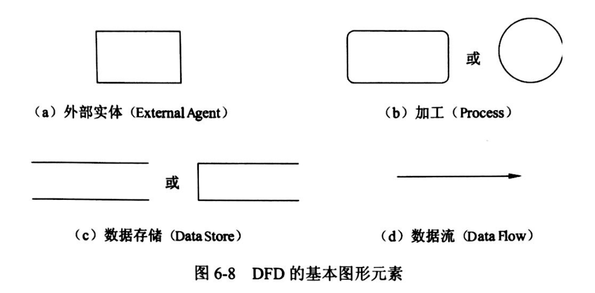
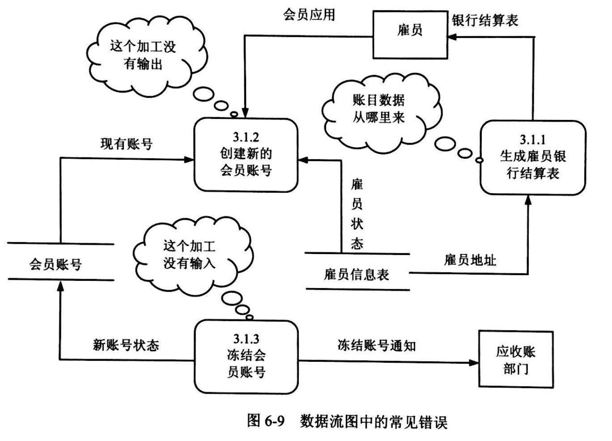
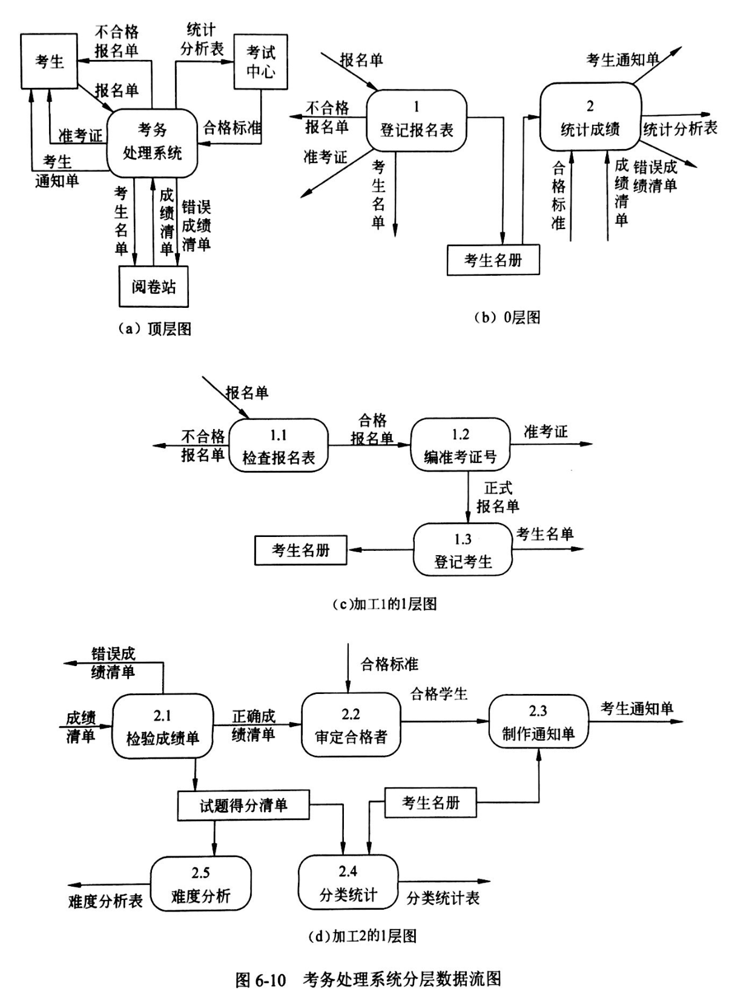
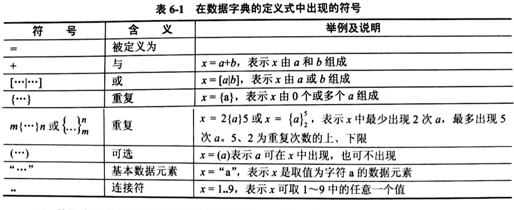
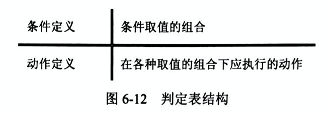

## 结构化分析与设计DFD

###  试题放置
第一大题

### 教程章节
《软件设计师教程（第5版）》

第6章 结构化开发方法

#### 数据流程图 (Data Flow Diagram, DFD）
是一种便于用户理解、分析系统数据流程的图形工具。

#### 考核重点
补充外部实体、补充缺失数据流、找出错误数据流、补充加工处理。

#### 考试技巧
> 第一题：找出实体

实体分为：人、系统、物。

根据说明和顶层图可以能够迅速的找出实体。

> 第二题：找出数据存储文件

1、首先根据第一题中找出的 实体并在0层图中备注出来。

 2、根据说明和实体可以很快的找出文件所对应图中的位置。

> 第三题：找出缺失的数据流

此题要跟据三个方面查找：（按顺序）很重要！！！

1、父图子图平衡

2、看圆角矩形（加工）是否缺少输入，或者输出

3、数据守恒（换句话说，输入是否足够产生输出）

但是，我们说的是技巧，所以以上3个步骤当然很抽象。

缺失数据流技巧：（按顺序）

（1）先判断子图数据流和父图数据流，在输入输出方向上是否一致。若图不容易看，可以使用铅笔将子图除实体外画出来当成一个系统。（如果不缺跳下一步）
（2）看圆角矩形是否有进有出。（如果不缺跳下一步）

（3）那如果以上2种方法还是找不出缺失数据流的话，以下这种方法啦。

- 说明了数据存储与加工之间存在缺失（从说明中获取）

- 说明了加工与加工之间存在缺失数据流（从说明中获取）

> 第四题,一般是不是固定格式，所以不做说明。

#### 基本图形元素
数据流图中的基本图形元素包括：外部实体（External Agent）、加工（Process）、数据存储（Data Store）、数据流（Data Flow）。



- 外部实体（External Agent）

存在于软件系统之外的人员或组织，指出系统所需数据的发源地（源）和系统所产生的数据的归宿地（宿）。源和宿采用相同的图形符合，有数据流流出，则为源；有数据流流入，则为宿；两者兼有则既是源又是宿。

- 加工（Process）

至少有一个输入和一个输出数据流。

3种常见的错误如图所示：

黑洞：只有输入没有输出 

奇迹：只有输出没有输入

灰洞：输入不足以产生输出

**灰洞的原因：一个错误的命名过程；错误命名的输入或输出；不完全的事实。**

- 数据存储（Data Store）

写：数据流流入数据存储

读：数据流流出数据存储

修改：双向箭头的数据流

具体实现：文件系统、数据库系统

存储介质：磁盘、磁带或其他介质

- 数据流（Data Flow）

输入：外部实体流入加工

输出：加工流向外部实体

**DFD 描述的是数据流，而不是控制流！**

#### 扩充符合
一个加工如果有多个输入或输出数据流，可用扩充符号来描述多个数据流之间的关系。

1) 星号（*）

与：输入流->全部数据流到达后才能进行加工；输出流->加工结束将同时产生所有的输出数据流。

2) 加号（+）

或：任何一个即可

3) 异或（⊕）

互斥：当且仅当一个输入流到达才能加工；加工产生的数据流仅一个

#### 层次结构
自顶向下逐层分解，层数控制在 7±2 的范围内。

- 顶层图
分层数据流图的顶层只有一个，其只有一个加工，代表整个软件系统，改加工描述了软件系统与外界之间的数据流。

- 0层数据流图
顶层图的加工（即系统）经分解后的图

- 底层图
分层数据流图的最底层的图，所有的加工不再进行分解。

- 中间层
在顶层图和底层图之间的图，至少有一个加工可以被分解为一张子图。

- 基本加工
不再分解成子图的加工

- 数据流图的画法
1）画系统的输入和输出
2）画系统的内部
3）画加工的内部
重复第3步的分解，直到图中尚未分解的加工都不必再分解



```
正式报名单 = 准考证号 + 报名单
考生名单 = {准考证号 + 考试级别} （其中，{w} 表示 w 重复多次）
```

#### 分层数据流图的审查
1、一致性和完整性

- 一致性
- - 父图和子图的平衡
- - 数据守恒：输出数据流中的数据必须能从加工的输入数据流直接获得，或者能够通过加工产生；输入数据流存在无用数据
- - 局部数据存储：任何一个数据存储都应有写和读的数据流，除非为其他软件系统使用、产生、维护；一个数据存储仅与一个加工进行读写且从未出现过，该数据存储只是相应加工的内部文件，不应在这张DFD中。
- - 加工的输出数据流不能与输入数据流同名
- 完整性
- - 每个加工至少有一个输入和一个输出数据流
- - 每个数据存储至少有一个加工对其进行读操作，另一个加工进行写操作
- - 每个数据流和文件都必须命名，并保持与数据字典一致
- - 每个基本加工都应有一个加工规约

2、构造时需要注意的问题

- - 命名适当
- - 画数据流而不是控制流
- - 避免一个加工有过多的数据流
- - 分解尽可能均匀
- - 先考虑确定状态，忽略琐碎的细节
- - 随时准备重画
- 分解的程度
- - 层数控制7±2 的范围内
- - 分解应自然，概念上应合理、清晰
- - 不影响DFD的易理解性的前提下，可适当增加子加工数量以减少层数
- - 一般来说，上层分解快（多分解几个加工），下层分解慢（少分解几个加工）
- - 分解要均匀

#### 数据字典（DD）
为数据流图中的每个数据流、文件、加工，以及组成数据流或文件的数据项做出说明。其中，对加工的描述成为“小说明”或“加工逻辑说明”。

4类条目：数据流、数据项、数据存储、基本加工

数据项是组成数据流和数据存储的最小元素。



#### 结构化语言描述加工逻辑

#### 试题放置

在中级软考中，这题总是放置在下午第一大题的数据流图的第4小问中，问法是：根据说明，采用结构化语言对“xxxx”的加工逻辑进行描述。

#### 简介
常用的加工逻辑描述方法有结构化语言、判定表、判定树。

#### 结构化语言

介于自然语言和形式化语言之间的半形式化语言，是自然语言的一个受限子集。

- 外层三种基本结构

1）顺序结构

一组使用祈使句、选择语句、重复语句的顺序排列。祈使语句是指至少包含一个动词及一个名词，指出要执行的动作及接受动作的对象。

2）选择结构

IF-THEN-ELSE-ENDIF

CASE-OF-ENDCASE

```
IF(条件1) THEN
    分支内容
ELSE IF(条件2) THEN
    分支内容
ELSE
    分支内容
ENDIF
```

3）重复结构

DO-WHILE-ENDDO

REPEAT-UNTIL

```
缺陷检测{
    WHILE(接收图像)
    DO
    {
        检测所收到的所有图像
        IF(出现一张图像检测不合格) THEN
        {
            返回产品不合格;
            不合格产品检测结果=产品星号+不合格类型
        }
        ENDIF
    }
    ENDDO
｝
```

- 内层结构

一般使用祈使语句的自然语言短语，使用数据字典中的名词和有限的自定义词，其动词含义要具体，尽量不用形容词和副词来修饰，还可使用一些简单的算法运算和逻辑运算符号。

#### 判定表
某个加工的一组动作依赖于多个逻辑条件的取值，表示复杂的条件组合与应做的动作之间的对应关系。


#### 判定树
判定表的变形，更直观，易于理解和使用。

#### 问答题
- 请说明逻辑数据流图（Logical Data Flow Diagram）和物理数据流图（Physical Data Flow Diagram）之间的主要区别：

物理数据流图关注的是系统中的物理实体，以及一些具体的文档、报告和其他输入/输出硬拷贝。物理数据流图用做系统构造和实现的技术性蓝图。

逻辑数据流图强调参与者所做的事情，可以帮助设计者决定需要哪些系统资源、为了运行系统用户必须执行的活动、在系统安装之后如何保护和控制这些系统。逻辑数据流图是物理数据流图去掉了所有的物理细节后得到的变换形式，逻辑数据流图被用做系统分析的需求分析阶段的起点。

- 绘制1层数据流图时要注意的问题：

保持父图与子图平衡。父图中某加工的输入输出数据流必须与它的子图的输入输出数据流在数量和名字上相同。如果父图的一个输入（或输出）数据流对应于子图中几个输入（或输出）数据流，而子图中组成这些数据流的数据项全体正好时父图中的这一个数据流，那么它们仍然算是平衡的。

- 数据流图是在系统分析与总体设计阶段宏观地描述系统功能需求的重要图形化工具，程序流程图也是软件开发过程中比较常用的图形化工具。简要说明程序流程图的适用场合与作用：

程序流程图通常在进行详细设计时使用，用来描述程序的逻辑结构。

#### 参考
[数据流图大题](https://blog.csdn.net/WHT869706733/article/details/117048472)

[结构化语言描述加工逻辑](https://blog.csdn.net/WHT869706733/article/details/124777145)

[软件设计师数据流图（答题技巧）](https://blog.csdn.net/qq_36914639/article/details/80352727)

[软件设计师笔记（结构化开发）](https://blog.csdn.net/m0_58342134/article/details/126250648)

[2022年软件设计师学习路线](https://www.bilibili.com/read/cv18526892)
