## 面向对象分析与设计

### 试题放置
第三大题

### 教程章节
《软件设计师教程（第5版）》

第7章 面向对象技术/7.2 UML

### UML建模
#### 简介
统一建模语言（Unified Modeling Language, UML）是面向对象软件的标准化建模语言。

#### 考核重点
使用UML建模的原则,从中确定用例图、类图、顺序图、状态图和活动图的各种元素,以及图中的各种元素之间的关系。一般情况下,题目会给出未完成的图形,需要考生根据描述给出参与者、用例、类、状态、活动和符号、类之间的重复度,以及参与者之间的关系及内涵。

#### 考试技巧

#### 基本构造块
#### 4种事物
- 结构事物：模型的**静态**部分，描述概念或物理元素。

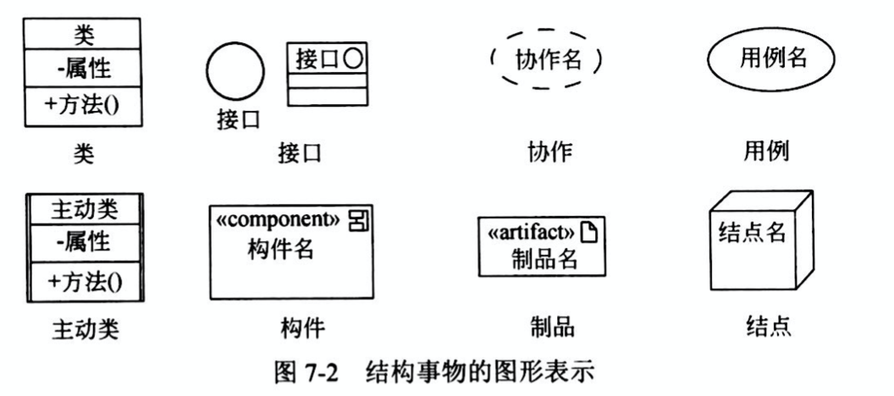

- 行为事物：模型的**动态**部分，描述跨越时间和空间的行为。包括交互、状态机、活动。

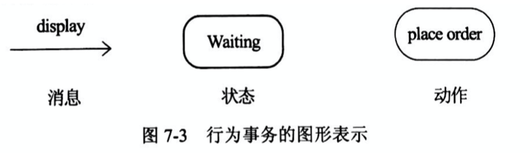

- 分组事物：模型的**组织**部分，模型分解成的“盒子”。最主要的分组事物是包，把元素组织成组的机制。

- 注释事物：模型的**解释**部分，描述、说明和标注模型的任何元素。一个依附于一个或一组元素之上，对其进行约束或解释的简单符号。

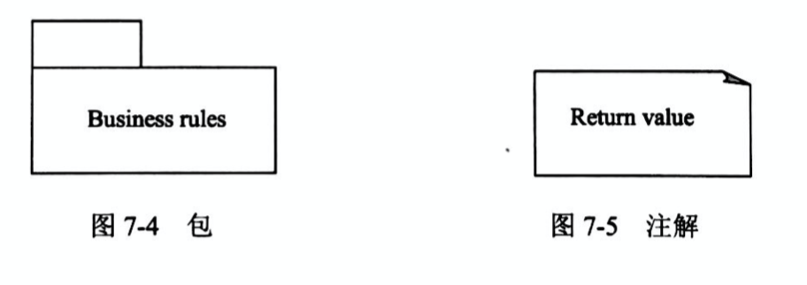

#### 4种关系
- 依赖：依赖事物 通过可能有方向的虚线连接 独立事物。

- 关联：实线连接；描述一组链，即对象之间的连接。聚集是一种特殊类型的关联，描述了整体和部分的结构关系。可以标注重复度 (Multiplicity)和角色 (Role)。

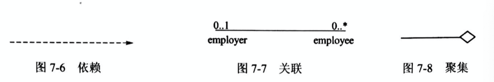

- 泛化：特殊(子)元素 通过带空心箭头的实线指向 一般(父)元素。子元素共享父元素的结构和行为。

- 实现：接口/用例 通过带空心箭头的虚线指向 实现接口的类或构件/实现用例的协作。

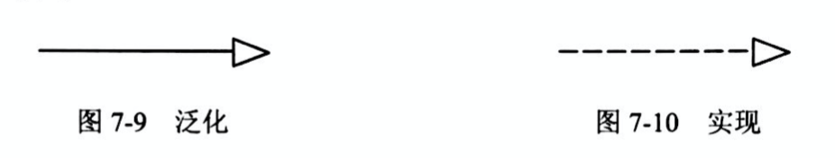

#### 图
UML 2.0 提供了13种图，其中**序列图、通信图、交互概览图和计时图均被称为交互图**。

- 类图 (Class DIagram)

展现一组对象 (类)、接口、协作和它们之间的依赖/泛化/关联关系。

类图给出系统的静态设计视图，包含主动类的类图给出了系统的静态进程视图。

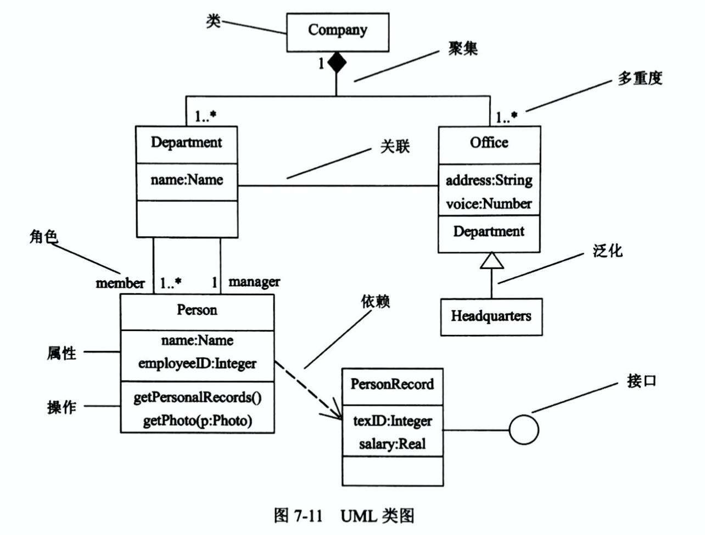

- 对象图(Object Diagram)

展现某一时刻一组对象以及它们之间的关系，描述了事物的实例的静态快照。
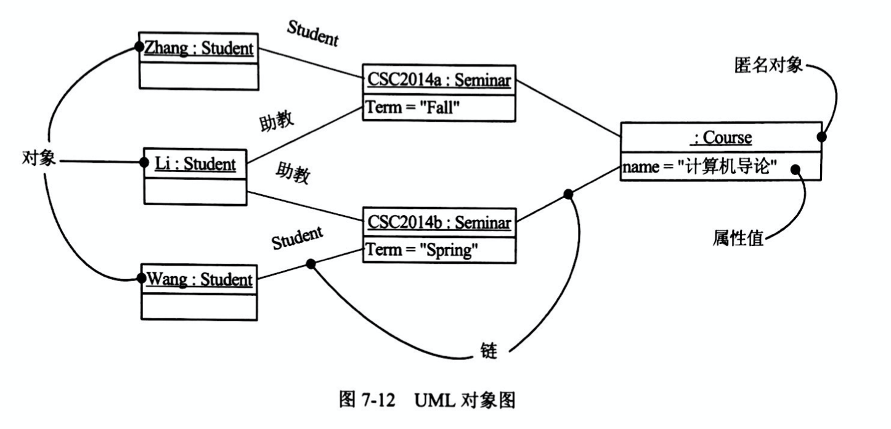
 
- 用例图(Use Case Diagram)

展现了一组用例、参与者以及它们之间的关系。

用例之间有拓展(`<<extend>>`)、包含(`<<include>>`)关系、泛化关系；

参与者之间的泛化关系；

参与者（Actor）和用例之间的关联关系。

泛化(generalization)：

泛化关系是一种继承关系，子用例将继承基用例的所有行为，关系和通信关系，也就是说在任何使用基用例的地方都可以用子用例来代替。

泛化关系在用例图中使用空心的箭头表示，箭头方向从子用例指向基用例。

扩展(extend)： 

extend关系是对基用例的扩展，基用例是一个完整的用例，即使没有子用例的参与，也可以完成一个完整的功能。

extend的基用例中将存在一个扩展点，只有当扩展点被激活时，子用例才会被执行。

extend关系在用例图中使用带箭头的虚线表示(在线上标注<<extend>>)，箭头从子用例指向基用例。

包含(include)：

include为包含关系，当两个或多个用例中共用一组相同的动作，这时可以将这组相同的动作抽出来作为一个独立的子用例，供多个基用例所共享。

因为子用例被抽出，基用例并非一个完整的用例，所以include关系中的基用例必须和子用例一起使用才够完整，子用例也必然被执行。

include关系在用例图中使用带箭头的虚线表示(在线上标注<<include>>)，箭头从基用例指向子用例

**简要说明extend和include关系的含义(必背)**

```
扩展（extend）如果一个用例明显地混合了两种或两种以上的不同场景，即根据情况可能发生多种事情，则可以断定将这个用例分为一个主用例和一个或多个辅用例进行描述可能更加清晰。

包含（include）两个以上用例有共同功能，可分解到单独用例，形成包含依赖；执行基本用例时，每次都必须调用被包含的用例。
```

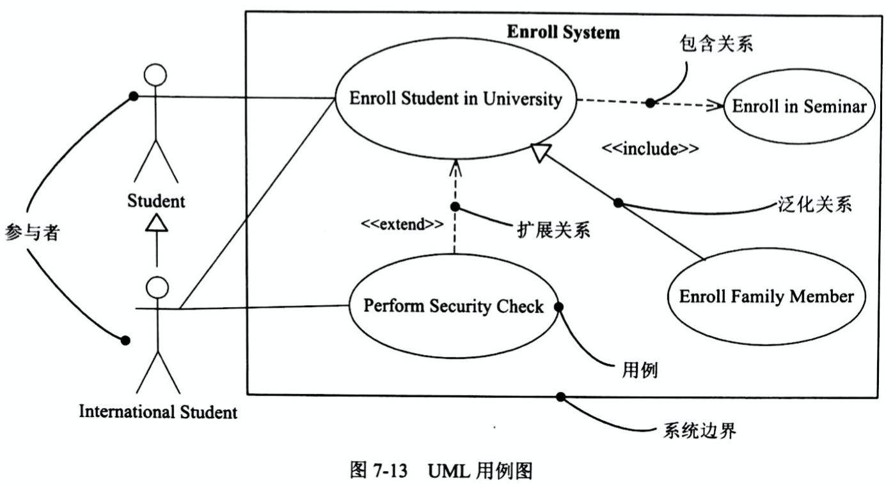
 
-  交互图

系统的动态方面的建模。
 
 - 序列图（Sequence Diagram）
 
 场景（Scenario）的图形化表示，描述以时间顺序组织的对象之间的交互活动。
 
 特征：有对象生命线；有控制焦点。
 
 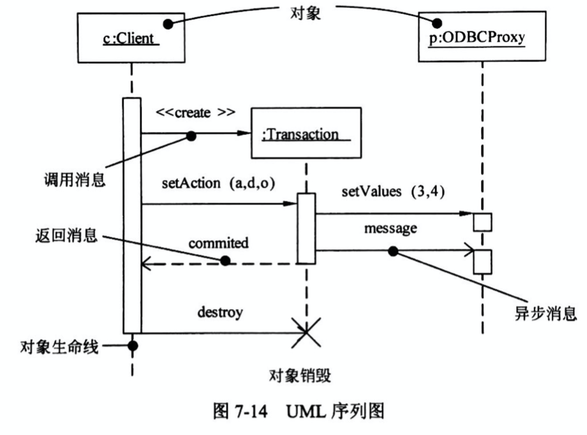
 
 - 通信图(Communication DIagram)
 
 强调收发消息的对象的结构组织，也称作协作图。
 
 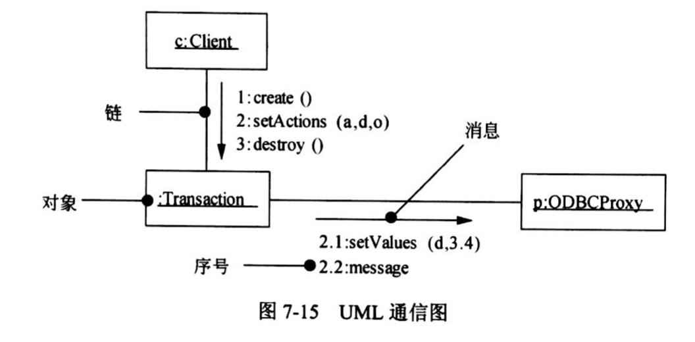
 
 特征：有路径；有顺序号
 
 **序列图和通信图是同构的，它们之间可以相互转换。**
 
 -  交互概览图(Interaction Overview Diagram)
 
 活动图的变体，描述业务过程中的控制流概览，软件过程中的详细逻辑概览，以及将多个图进行连接，抽象掉了消息和生命线。
 
 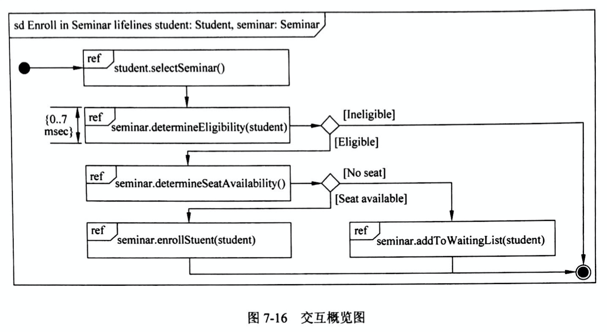

 - 计时图（Timing Diagram）
 
 关注沿着线性时间轴、生命线内部和生命线之间的条件改变，很想示波器。适合分析周期和非周期性任务。
 
 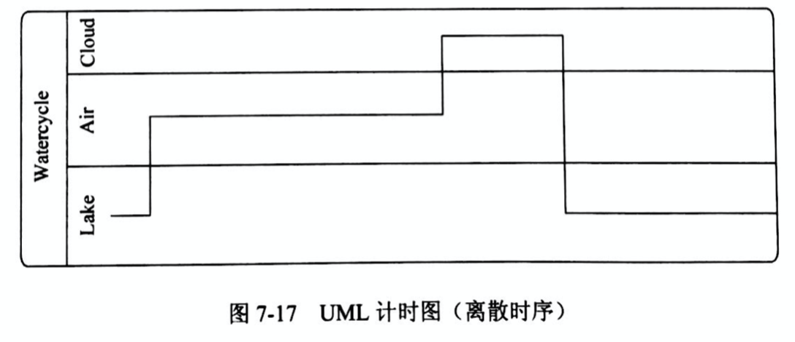
 
- 状态图(State Diagram)

展现一个状态机，由状态、转换、事件和活动组成。

转换包括事件和动作；动作是一个可执行的原子操作，不可中断，执行时间可忽略不计。

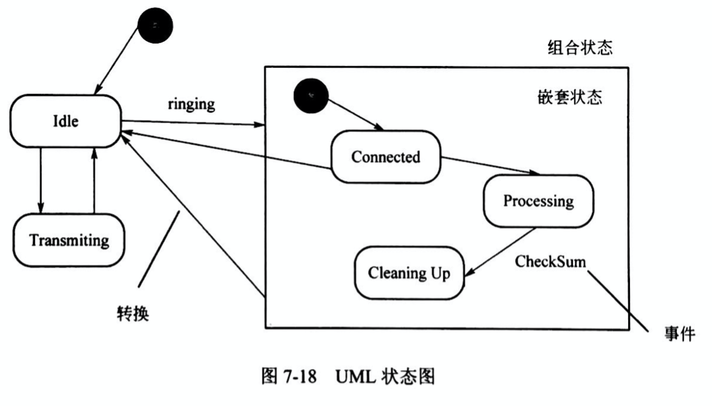
 
- 活动图（Activity Diagram）

展现了在系统内从一个活动到另一个活动的流程。

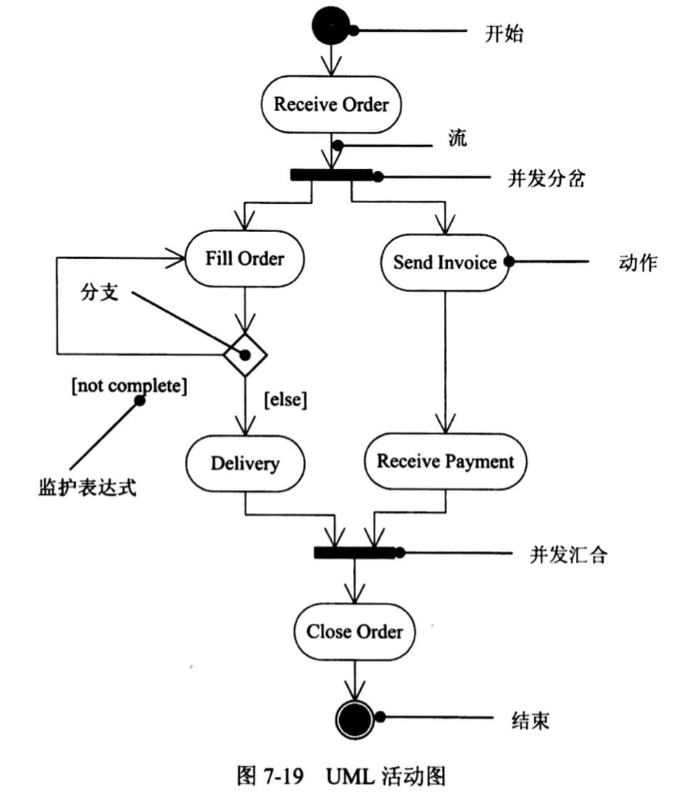
 
- 构件图(Component Diagram)

展现一组构件之间的组织和依赖。

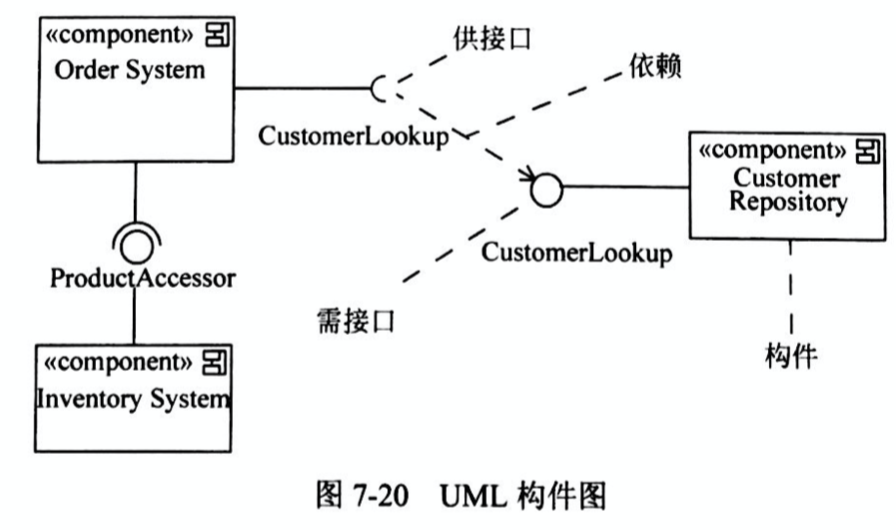
 
- 组合结构图（Composite Structure Diagram）

描述一个分类器（类、构件、用例）的内部结构，描述设计、架构模式或策略。

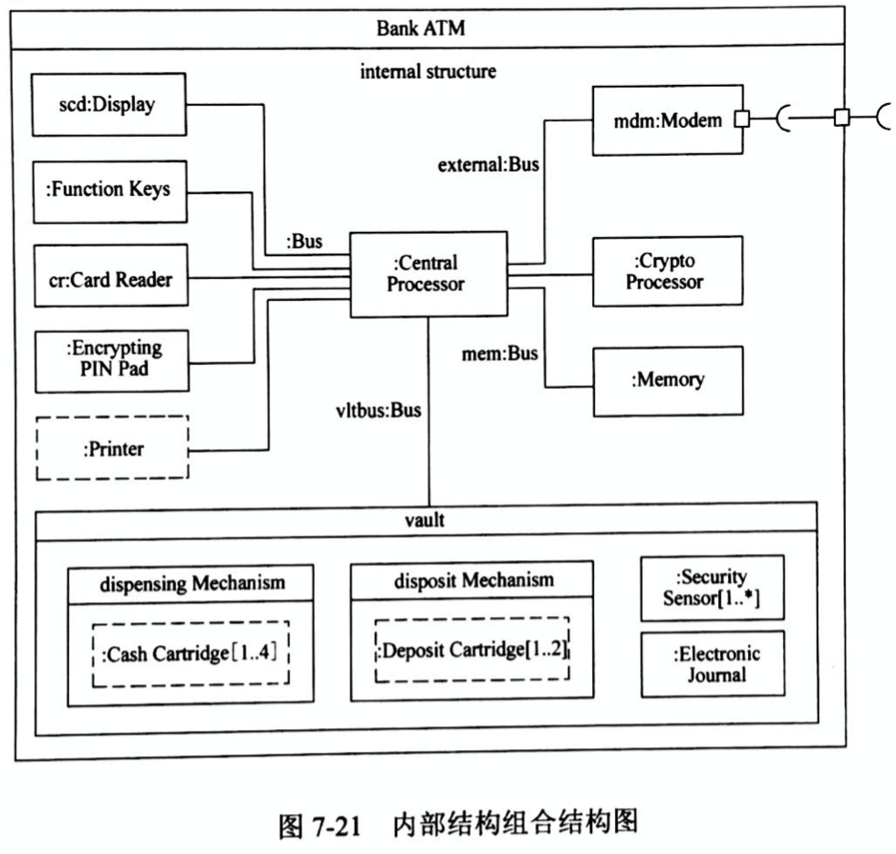

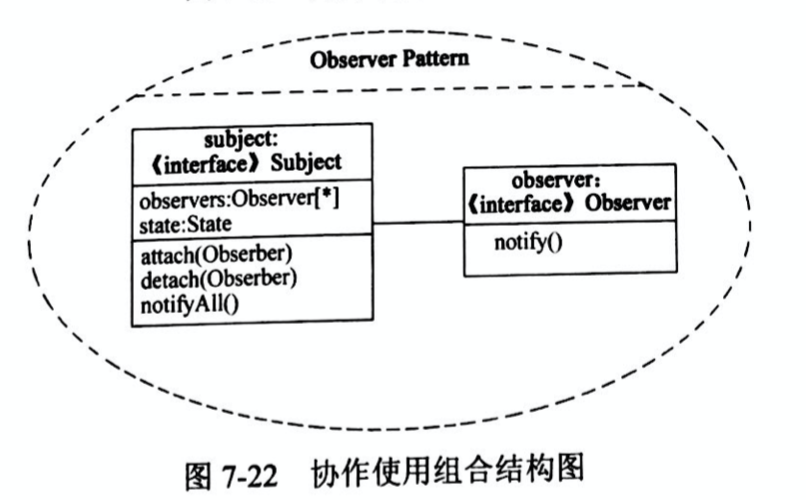
 
- 部署图（Deployment Diagram）

面向对象系统的物理方面建模，展现了运行时处理结点以及其中构件（制品）的配置。

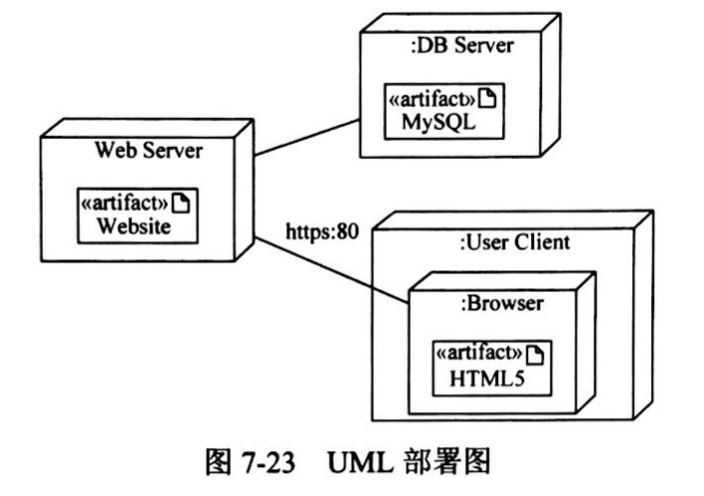

- 包图（Package Diagram）

把模型本身组织成层次结构的通用机制，不能执行，展现由模型本身分解而成的组织单元以及其间的依赖关系。

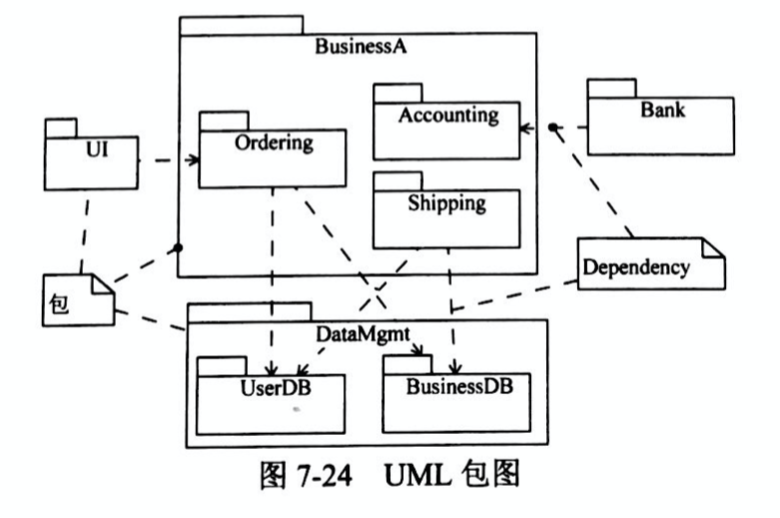

#### 参考
[UML（关系和UML图）](https://blog.csdn.net/gets_s/article/details/120538315)

[UML总结 & UML 下午题](https://blog.csdn.net/weixin_49486457/article/details/127005976)

[UML建模大题](https://blog.csdn.net/WHT869706733/article/details/117138550)
