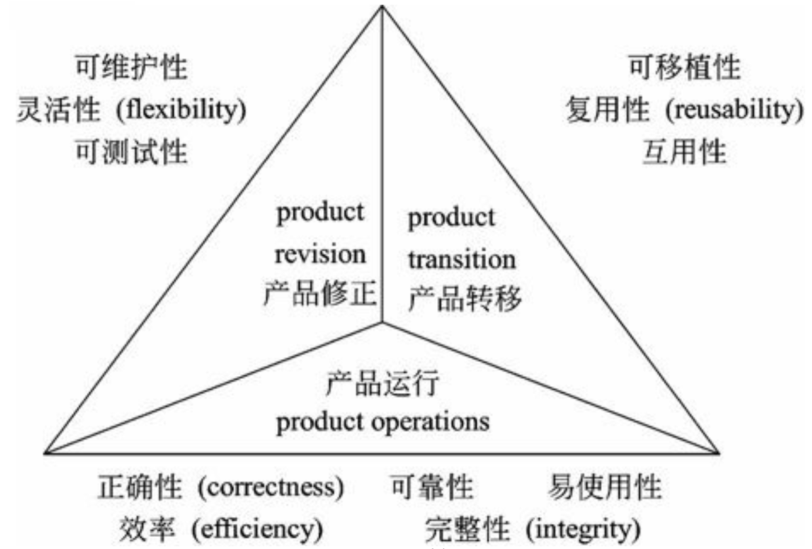

## ISO/IEC 9126和Mc Call软件质量模型
软件质量是指反映软件系统或软件产品满足规定或隐含需求的能力的特征和特性全体。软件质量管理是指对软件开发过程进行独立的检查活动，由质量保证、质量规划和质量控制3个主要活动构成。软件质量保证是指为保证软件系统或软件产品充分满足用户要求的质量而进行的有计划、有组织的活动，其目的是生产高质量的软件。

软件质量模型，用来描述软件质量特性，例如 ISO/IEC 9126 软件质量模型和Mc Call软件质量模型。

#### ISO/IEC 9126软件质量模型

ISO/IEC 9126软件质量模型由三个层次组成: 

第一层是质量特性，第二层是质量子特性，第三层是度量指标。

该模型的质量特性和质量子特性如图所示。

<escape>
<table>
  <tr align="center">
    <th>质量特性</th>
    <th>功能性</th>
    <th>可靠性</th>
    <th>易用性</th>
    <th>效率</th>
    <th>可维护性</th>
    <th>可移植性</th>
  </tr>
  <tr align="center">
    <td rowspan="5" colspan="1">质 量 子 特 性</td>
    <td>适合性</td>
    <td>成熟性</td>
    <td>易理解性</td>
    <td>时间特性</td>
    <td>易分析性</td>
    <td>适应性</td>
  </tr>
  <tr align="center">
    <td>准确性</td>
    <td>容错性</td>
    <td>易学性</td>
    <td>资源利用性</td>
    <td>易改变性</td>
    <td>易安装性</td>
  </tr>
  <tr align="center">
    <td>互操作性 (互用性)</td>
    <td>易恢复性</td>
    <td>易操作性</td>
    <td>/</td>
    <td>稳定性</td>
    <td>共存性 (一致性)</td>
  </tr>
  <tr align="center">
    <td>保密安全性</td>
    <td>/</td>
    <td>吸引性</td>
    <td>/</td>
    <td>易测试性</td>
    <td>易替换性</td>
  </tr>
  <tr align="center">
    <td>功能性的依从性</td>
    <td>可靠性的依从性</td>
    <td>易用性的依从性</td>
    <td>效率依从性</td>
    <td>维护性的依从性</td>
    <td>可移植性的依从性</td>
  </tr>
</table>
</escape>

其中各质量特性和质量子特性的含义如下。

(1)功能性(functionality)。与一组功能及 其指定的性质的存在有关的一组属性。功能是指满 足规定或隐含需求的那些功能。
· 适应性(suitability)。与对规定任务能否提 供一组功能以及这组功能是否适合有关的软件属 性。
· 准确性(accurateness)。与能够得到正确 或相符的结果或效果有关的软件属性。
· 互用性(interoperability)。与同其他指定 系统进行交互操作的能力相关的软件属性。
· 依从性(compliance)。使软件服从有关的 标准、约定、法规及类似规定的软件属性。
· 安全性(security)。与避免对程序及数据 的非授权故意或意外访问的能力有关的软件属性。

(2)可靠性(reliability)。与在规定的一段时
间内和规定的条件下，软件维持在其性能水平有关 的能力。
· 成熟性(maturity)。与由软件故障引起失 效的频度有关的软件属性。
· 容错性(fault tolerance)。与在软件错误 或违反指定接口的情况下，维持指定的性能水平的 能力有关的软件属性。
· 易恢复性(recoverability)。与在故障发生 后，重新建立其性能水平并恢复直接受影响数据的 能力，以及为达到此目的所需的时间和努力有关的
软件属性。

(3)易使用性(usability)。与为使用所需的
努力和由一组规定或隐含的用户对这样使用所作的 个别评价有关的一组属性。
· 易理解性(understandability)。与用户为 理解逻辑概念及其应用所付出的劳动有关的软件属 性。
· 易学性(learnability)。与用户为学习其应 用(例如操作控制、输入、输出)所付出的努力相 关的软件属性。
· 易操作性(operability)。与用户为进行操 作和操作控制所付出的努力有关的软件属性。

(4)效率(efficiency)。在规定条件下，软 件的性能水平与所用资源量之间的关系有关的软件 属性。
· 时间特性(time behavior)。与响应和处理 时间以及软件执行其功能时的吞吐量有关的软件属 性。
· 资源特性(resource behavior)。与软件执 行其功能时，所使用的资源量以及使用资源的持续 时间有关的软件属性。

(5)可维护性(maintainability)。与进行规 定的修改所需要的努力有关的一组属性。
· 易分析性(analyzability)。与为诊断缺陷 或失效原因，或为判定待修改的部分所需努力有关 的软件属性。
· 易改变性(changeability)。与进行修改、 排错或适应环境变换所需努力有关的软件属性。
· 稳定性(stability)。与修改造成未预料效果 的风险有关的软件属性。
· 易测试性(testability)。为确认经修改软件 所需努力有关的软件属性。

(6)可移植性(por tability)。与软件可从某 一环境转移到另一环境的能力有关的一组属性。
· 适应性(adaptability)。与软件转移到不同 环境时的处理或手段有关的软件属性。
· 易安装性(installability)。与在指定环境下 安装软件所需努力有关的软件属性。
· 一致性(conformance)。使软件服从与可 移植性有关的标准或约定的软件属性。
· 易替换性(replaceability)。与一软件在该 软件环境中用来替代指定的其他软件的可能和努力 有关的软件属性。

#### Mc Call软件质量模型
Mc Call软件质量模型从软件产品的运行、修正 和转移三个方面确定了11个质量特性。

Mc Call也给出了一个三层模型框架，第一 层是质量特性，第二层是评价准则，第三层是度量指标。

#### 参考
[ISO/IEC9126 软件质量模型](https://www.cnblogs.com/zuqe0720/p/10877140.html)
