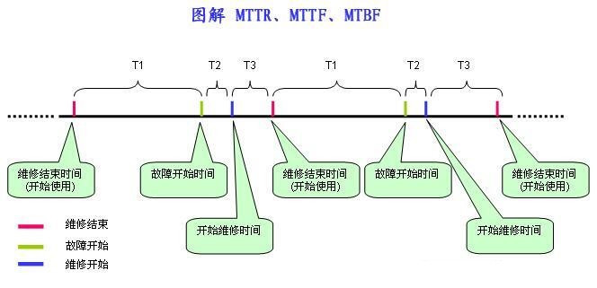

## MTTF/MTBF/MTRF的概念

MTTR、MTTF、MTBF 是体现系统可靠性的重要指标，但是三者容易混淆,下文使用图解方式解释三者之间的区别，希望能起到解惑的效用。

- MTTF (Mean Time To Failure，平均无故障时间)，指系统无故障运行的平均时间，取所有从系统开始正常运行到发生故障之间的时间段的平均值。 `MTTF = ∑T1 / N`

- MTTR (Mean Time To Repair，平均修复时间)，指系统从发生故障到维修结束之间的时间段的平均值。`MTTR = ∑(T2+ T3) / N`

- MTBF (Mean Time Between Failure，平均失效间隔)，指系统两次故障发生时间之间的时间段的平均值。 `MTBF = ∑(T2 + T3 + T1) / N`

很明显: `MTBF = MTTF + MTTR`

对于不可修复系统， 系统的平均寿命指系统发生失效前的平均工作（或存储） 时间或工作次数， 也称为系统在失效前的平均时间， 记为MTTF （meantime to failure）。

对于可修复系统，可修复产品的平均修复时间， 就是从出现故障到修复中间的这段时间记为MTTR（mean time to repair） 平均修复时间。MTTR 越短表示易恢复性越好。

对于可修复系统， 系统的寿命是指两次相邻失效（故障） 之间的工作时间， 而不是指整个系统的报废时间。平均寿命即是平均无故障时间， 也称为系统平均失效间隔， 记为MTBF （mean time between failure）。

**度量公式**

可靠性：`MTTF/(1+MTTF)`

可用性：`MTBF/(1+MTBF)`

可维护性：`1/(1+MTTR)`

**可靠性与可用性的区别** 

可靠性与寿命有关， 但是和传统的机械设备寿命概念不同的是， 可靠性并不是笼统的要求长寿命， 而是强调在规定的时间内能否充分发挥其功能， 即产品的可用性（可靠性指标之一）； 

可靠性通常低于可用性， 因为可靠性要求系统在0 ~ t 的时间段内必须正常运行， 而对于可用性， 要求相对较低， 系统可以发生故障， 然后在0 ~ t的时间段内修复， 只要系统在修复后能正常运行， 仍然可以计入可用性。

因此， 可用性大于或等于可靠性。对于不可维修系统， 可用度就仅仅决定于且等于可靠度。

#### 参考
[MTTF，MTBF，MTRF的概念](https://blog.csdn.net/sakura_saku/article/details/121205480)

[MTTR、MTTF、MTBF详解](https://blog.csdn.net/qq_43316814/article/details/106062099)
