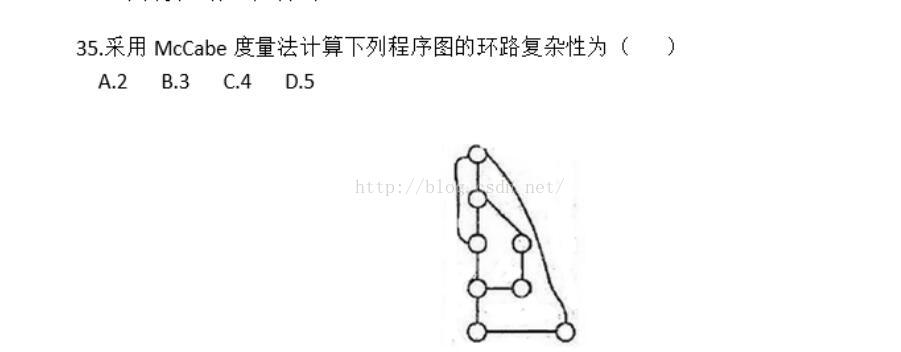
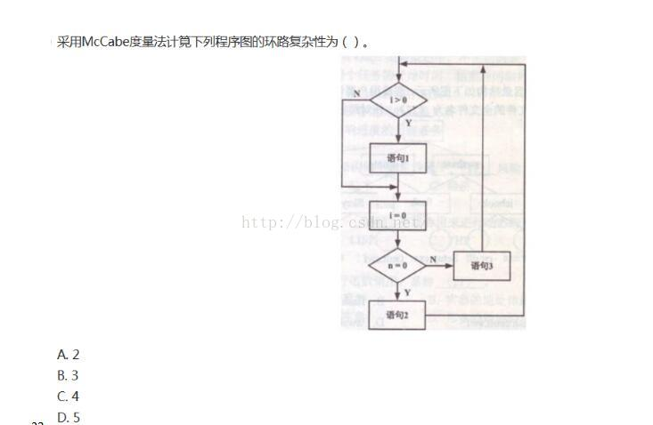
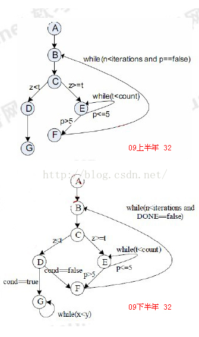

## McCabe环路复杂度计算方法

软考的McCabe这种题型来说几乎每次都考，那么我来讲讲如何计算以及题型的分类：

形复杂度定量度量程序的逻辑复杂度：描绘程序控制流的流图之后，

可以用下述3种方法中的任何一种来计算环形复杂度。

（1）流图中的区域数等于环形复杂度。

（2）流图G的环形复杂度V(G)=E-N+2，其中，E是流图中边的条数，N是结点数。

（3）流图G的环形复杂度V(G)=P+1，其中，P是流图中判定结点的数目。


自己是这样理解的：

*这种环路度量法，计算的思路是这样的：它是考虑控制的复杂程度，即条件选择的分支繁杂程度*

例一

如图：



根据公式：

```
V(G)=E-N+2
V(G)=10-8+2=4
```
则得出答案选择 C.

例二：



根据公式：
```
V(G)=E-N+2
V(G)=8-6+2=4
```
选 C

例三：



方法一：

 流图G的环形复杂度V(G)=E-N+2，其中，E是流图中边的条数，N是结点数。

 有了前面的分析，现在就好做了：

上图：8-7+2=3

下图：9-7+2=4（注意E不是10，因为G节点的自环弧线要忽略掉，而E节点还包含E-F边为非自环弧线）

方法二：

流图G的环形复杂度V(G)=P+1，其中，P是流图中判定结点的数目。

判断节点：

上图：C,E，  2个点，复杂度2+1=3

下图：C.E.D  3个点，复杂度3+1=4

#### 参考

[McCabe环路复杂度计算方法](https://blog.csdn.net/a13669586274/article/details/78635996)
