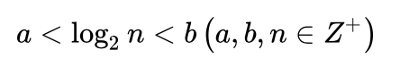

# 二分查找 (Binary Search)

## 查找过程
首先，假设表中元素是按升序排列，将表中间位置记录的关键字与查找关键字比较，如果两者相等，则查找成功；否则利用中间位置记录将表分成前、后两个子表，如果中间位置记录的关键字大于查找关键字，则进一步查找前一子表，否则进一步查找后一子表。重复以上过程，直到找到满足条件的记录，使查找成功，或直到子表不存在为止，此时查找不成功。

## 算法要求
1.必须采用顺序存储结构。

2.必须按关键字大小有序排列。

## 比较次数
计算公式：



当顺序表有n个关键字时：

查找失败时，至少比较a次关键字；查找成功时，最多比较关键字次数是b。

注意：a,b,n均为正整数。

## 算法复杂度
二分查找的基本思想是将n个元素分成大致相等的两部分，取a[n/2]与x做比较，如果x=a[n/2],则找到x,算法中止；如果x<a[n/2],则只要在数组a的左半部分继续搜索x,如果x>a[n/2],则只要在数组a的右半部搜索x.

时间复杂度即是while循环的次数。

总共有n个元素，

渐渐跟下去就是n,n/2,n/4,....n/2^k（接下来操作元素的剩余个数），其中k就是循环的次数

由于你n/2^k取整后>=1

即令n/2^k=1 （最坏的情况）

可得k=log2n,（是以2为底，n的对数）

所以时间复杂度可以表示O(h)=O(log2n)

## 伪代码 (Pseudocode)
```
BinarySearch(max,min,des)
while(min<=max) {
    mid=(min+max)/2
    if mid=des then
    return mid
    else if mid>des then
    max=mid-1
    else
    min=mid+1
}
return max
```

## C和C++（语法基本相同）
### 第一种
```
int BinSearch(SeqList *R，int n,KeyType K)
{
    //在有序表R[0..n-1]中进行二分查找，成功时返回结点的位置，失败时返回-1
    int low=0,high=n-1,mid；     //置当前查找区间上、下界的初值
    while(low<=high)
    {
        if(R[low].key==K)
            return low;
        if(R[high].key==k)
            return high;          //当前查找区间R[low..high]非空
        mid=low+(high-low)/2;
            /*使用(low+high)/2会有整数溢出的问题
            （问题会出现在当low+high的结果大于表达式结果类型所能表示的最大值时，
                这样，产生溢出后再/2是不会产生正确结果的，而low+((high-low)/2)
                不存在这个问题*/
        if(R[mid].key==K)
          return mid;             //查找成功返回
        if(R[mid].key<K)
          low=mid+1;              //继续在R[mid+1..high]中查找
        else
          high=mid-1;             //继续在R[low..mid-1]中查找
    }
    if(low>high)
        return -1;//当low>high时表示所查找区间内没有结果，查找失败
}
```
### 第二种
```
int bsearchWithoutRecursion(int array[],int low,int high,int target)
{
    while(low<=high)
        {
            int mid=low+(high-low)/2;//还是溢出问题
            if(array[mid]>target)
                high=mid-1;
            else if(array[mid]<target)
            low=mid+1;
            else
                return mid;
        }
    return-1;
}
```
### 第三种
```
int binSearch(const int *Array,int start,int end,int key)
{
        int left,right;
        int mid;
        left=start;
        right=end;
        while(left<=right)
             
        {
                    mid=left+(right-left)/2;//还是溢出问题
                    if(key==Array[mid])  return mid;
                    else if(key<Array[mid]) right=mid-1;
                    else if(key>Array[mid]) left=mid+1;
                 
        }
        return -1;
}
```

## Java
```
public static int binarySearch(Integer[] srcArray, int des) {
    //定义初始最小、最大索引
    int start = 0;
    int end = srcArray.length - 1;
    //确保不会出现重复查找，越界
    while (start <= end) {
        //计算出中间索引值
        int middle = (end + start)>>>1 ;//防止溢出
        if (des == srcArray[middle]) {
            return middle;
        //判断下限
        } else if (des < srcArray[middle]) {
            end = middle - 1;
        //判断上限
        } else {
            start = middle + 1;
        }
    }
    //若没有，则返回-1
    return -1;
}
```
