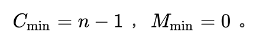
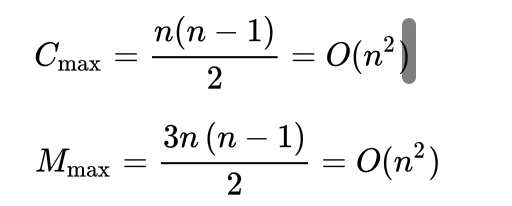
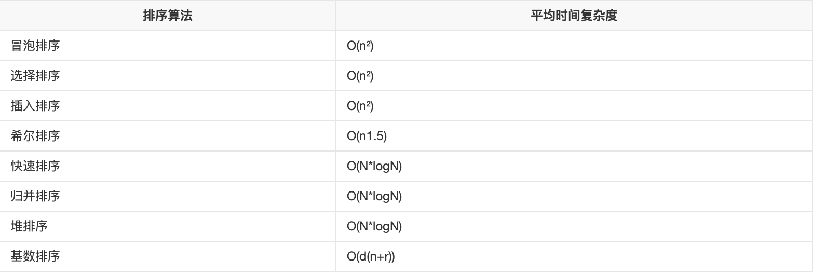

# 冒泡排序

## 算法原理

冒泡排序算法的原理如下：

比较相邻的元素。如果第一个比第二个大，就交换他们两个。 

对每一对相邻元素做同样的工作，从开始第一对到结尾的最后一对。在这一点，最后的元素应该会是最大的数。

针对所有的元素重复以上的步骤，除了最后一个。

持续每次对越来越少的元素重复上面的步骤，直到没有任何一对数字需要比较。

## 时间复杂度
若文件的初始状态是正序的，一趟扫描即可完成排序。所需的关键字比较次数 C 和记录移动次数 M  均达到最小值：



所以，冒泡排序最好的时间复杂度为 O(n) 。

若初始文件是反序的，需要进行 n-1 趟排序。每趟排序要进行 n - i 次关键字的比较(1≤i≤n-1)

且每次比较都必须移动记录三次来达到交换记录位置。在这种情况下，比较和移动次数均达到最大值:


 
冒泡排序的最坏时间复杂度为  O(n^2) 。
综上，因此冒泡排序总的平均时间复杂度为 O(n^2) 。

## 算法稳定性
冒泡排序就是把小的元素往前调或者把大的元素往后调。比较是相邻的两个元素比较，交换也发生在这两个元素之间。所以，如果两个元素相等，是不会再交换的；如果两个相等的元素没有相邻，那么即使通过前面的两两交换把两个相邻起来，这时候也不会交换，所以相同元素的前后顺序并没有改变，所以冒泡排序是一种稳定排序算法。

## 算法比较



## 算法描述
### C
```
#include <stdio.h>
 
#define ARR_LEN 255 /*数组长度上限*/
#define elemType int /*元素类型*/
 
/* 冒泡排序 */
/* 1. 从当前元素起，向后依次比较每一对相邻元素，若逆序则交换 */
/* 2. 对所有元素均重复以上步骤，直至最后一个元素 */
/* elemType arr[]: 排序目标数组; int len: 元素个数 */
void bubbleSort (elemType arr[], int len) {
    elemType temp;
    int i, j;
    for (i=0; i<len-1; i++) /* 外循环为排序趟数，len个数进行len-1趟 */
        for (j=0; j<len-1-i; j++) { /* 内循环为每趟比较的次数，第i趟比较len-i次 */
            if (arr[j] > arr[j+1]) { /* 相邻元素比较，若逆序则交换（升序为左大于右，降序反之） */
                temp = arr[j];
                arr[j] = arr[j+1];
                arr[j+1] = temp;
            }
        }
}
 
int main (void) {
    elemType arr[ARR_LEN] = {3,5,1,-7,4,9,-6,8,10,4};
    int len = 10;
    int i;
     
    bubbleSort (arr, len);
    for (i=0; i<len; i++)
        printf ("%d\t", arr[i]);
    putchar ('\n');
     
    return 0;
}
```
### C++
```
#include <iostream>
using namespace std;
template<typename T>
//整数或浮点数皆可使用
void bubble_sort(T arr[], int len)
{
    int i, j;  T temp;
    for (i = 0; i < len - 1; i++)
        for (j = 0; j < len - 1 - i; j++)
        if (arr[j] > arr[j + 1])
        {
            temp = arr[j];
            arr[j] = arr[j + 1];
            arr[j + 1] = temp;
        }
}
int main()
{
    int arr[] = { 61, 17, 29, 22, 34, 60, 72, 21, 50, 1, 62 };
    int len = (int) sizeof(arr) / sizeof(*arr);
    bubble_sort(arr, len);
    for (int i = 0; i < len; i++)
        cout << arr[i] << ' ';
 
    cout << endl;
 
    float arrf[] = { 17.5, 19.1, 0.6, 1.9, 10.5, 12.4, 3.8, 19.7, 1.5, 25.4, 28.6, 4.4, 23.8, 5.4 };
    len = (int) sizeof(arrf) / sizeof(*arrf);
    bubble_sort(arrf, len);
    for (int i = 0; i < len; i++)
        cout << arrf[i] << ' ';
 
    return 0;
}
```
### Java
```
    public static void bubbleSort(int arr[]) {
 
        for(int i =0 ; i<arr.length-1 ; i++) { 
           
            for(int j=0 ; j<arr.length-1-i ; j++) {  
 
                if(arr[j]>arr[j+1]) {
                    int temp = arr[j];
                     
                    arr[j]=arr[j+1];
                     
                    arr[j+1]=temp;
            }
            }    
        }
    }

```
## 汇编
```
有一个首地址为A的5个有符号数字的数组，请采用“冒泡”排序
DATAS SEGMENT
A  DW 9,4,26,85,38
DATAS ENDS
CODES SEGMENT
ASSUME CS:CODES,DS:DATAS
START:
    MOV AX,DATAS
    MOV DS,AX
    MOV DI,4;初始化外循环次数为数组个数-1
 LP1:MOV CX,DI;外循环次数初值为数组个数-1
     MOV  BX,0;基址初值BX为0
  LP2:MOV AX,A[BX]
    CMP AX,A[BX+2]
    JGE CONT;大于等于不交换
    XCHG AX,A[BX+2];小于交换,AX保存的为较大的数
MOV A[BX],AX;A[BX]保存的为较大的数，准备进行下一次比较,
  CONT:ADD BX,2;基址初值BX+2,字变量，下一个字偏移地址+2
LOOP LP2  ;内循环次数-1,内循环次数是否为0？
    DEC DI;外循环次数-1
    JNZ LP1;外循环次数是否为0?
    MOV AH,4CH
    INT 21H
CODES ENDS
    END START
```

## 优化
- 针对问题：

数据的顺序排好之后，冒泡算法仍然会继续进行下一轮的比较，直到arr.length-1次，后面的比较没有意义的。

- 方案：

设置标志位flag，如果发生了交换flag设置为true；如果没有交换就设置为false。

这样当一轮比较结束后如果flag仍为false，即：这一轮没有发生交换，说明数据的顺序已经排好，没有必要继续进行下去。

### Java
```
public static void BubbleSort1(int [] arr){
　
　
　   int temp;//临时变量
　
　   boolean flag;//是否交换的标志
　
　   for(int i=0; i<arr.length-1; i++){   //表示趟数，一共 arr.length-1 次
　
　
　       // 每次遍历标志位都要先置为false，才能判断后面的元素是否发生了交换
　
　       flag = false;
　
　       
　
　       for(int j=arr.length-1; j>i; j--){ //选出该趟排序的最大值往后移动
　
　
　           if(arr[j] < arr[j-1]){
　
　               temp = arr[j];
　
　               arr[j] = arr[j-1];
　
　               arr[j-1] = temp;
　
　               flag = true;    //只要有发生了交换，flag就置为true
　
　           }
　
　       }
　
　       // 判断标志位是否为false，如果为false，说明后面的元素已经有序，就直接return
　
　       if(!flag) break;
　
　   }
　
　}
```

