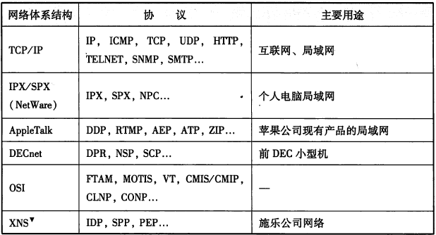
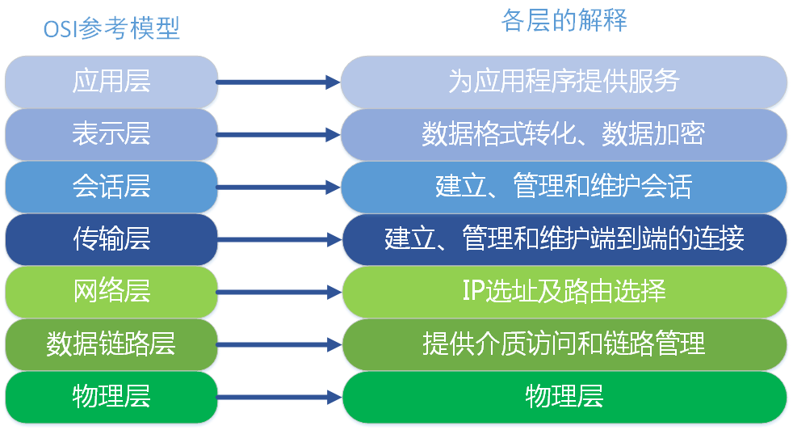
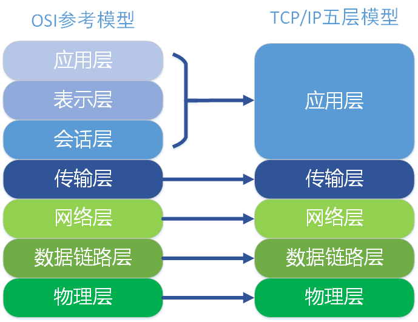
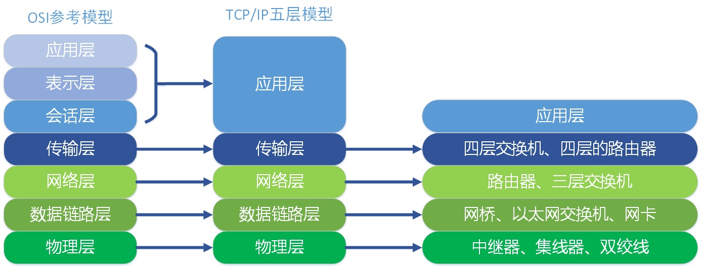
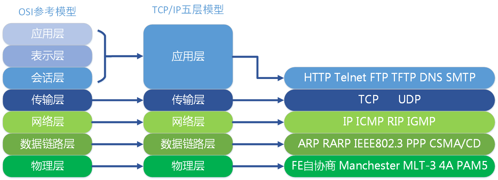
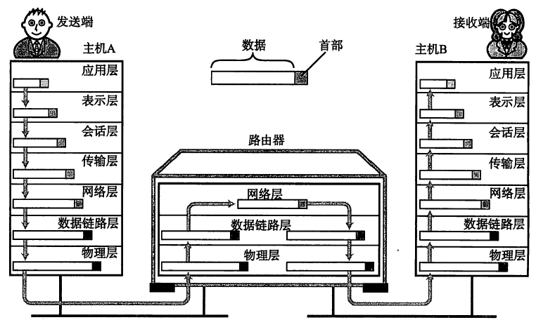
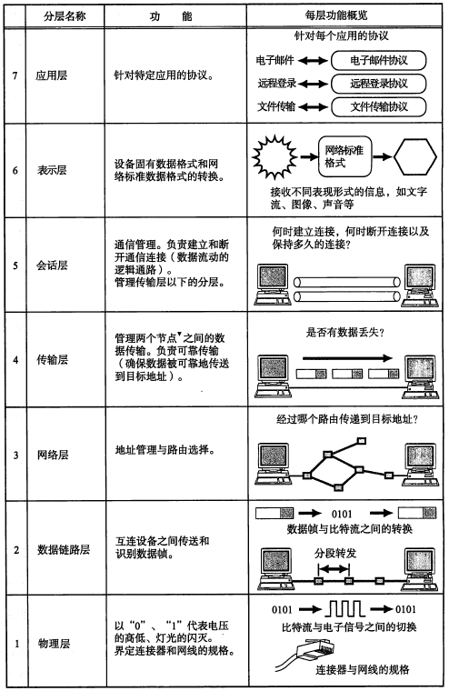
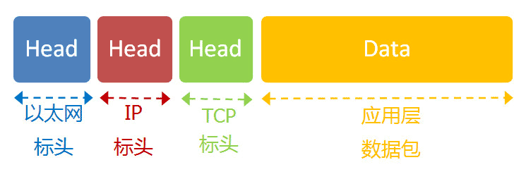
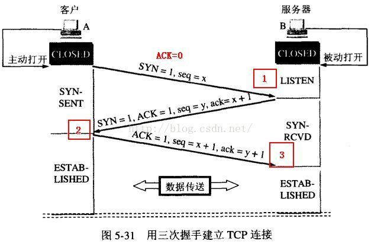
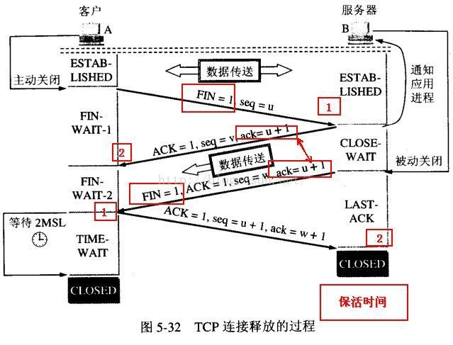

# 开放式系统互联OSI
#### 协议
互联网中常用的代表性的协议有IP、TCP、HTTP等，LAN中常用协议有IPX、SPX等。

“计算机网络体系结构”将这些网络协议进行了系统的归纳；TCP/IP就是这些协议的集合。

其中，还有Novell公司的IPX/SPX、苹果公司的AppleTalk（仅限苹果公司计算机使用）、IBM开发的用于构件大规模网络的SNA以及前DEC公司开发的DECnet等。

*协议的必要性*

简单来说，协议就是计算机之间通过网络实现通信时事先达成的一种“约定”；这种“约定”使那些由不同厂商的设备，不同CPU及不同操作系统组成的计算机之间，只要遵循相同的协议就可以实现通信。

协议可以分很多种，每一种协议都明确界定了它的行为规范：2台计算机之间必须能够支持相同的协议，并且遵循相同的协议进行处理，才能实现相互通信。

#### TCP/IP

TCP/IP 意味着 TCP 和 IP 在一起协同工作。

TCP 负责应用软件（比如你的浏览器）和网络软件之间的通信。

IP 负责计算机之间的通信。

TCP 负责将数据分割并装入 IP 包，然后在它们到达的时候重新组合它们。

IP 负责将包发送至接受者。

#### 开放式系统互联(Open System Interconnect, OSI)

OSI定义了网络互连的七层框架（物理层、数据链路层、网络层、传输层、会话层、表示层、应用层），即ISO开放互连系统参考模型。如下图。
每一层实现各自的功能和协议，并完成与相邻层的接口通信。OSI的服务定义详细说明了各层所提供的服务。某一层的服务就是该层及其下各层的一种能力，它通过接口提供给更高一层。各层所提供的服务与这些服务是怎么实现的无关。

TCP/IP五层协议和OSI的七层协议对应关系如下。

在每一层都工作着不同的设备，比如我们常用的交换机就工作在数据链路层的，一般的路由器是工作在网络层的。

在每一层实现的协议也各不同，即每一层的服务也不同.下图列出了每层主要的协议。

七层通信

下图表述了简单的每个分层的作用：

数据包

IP 数据包在以太网数据包的负载里面，TCP数据包在IP数据包的负载里。

#### 三次握手，四次挥手

需要了解的信息：

- ACK ： TCP协议规定，只有ACK=1时有效，也规定连接建立后所有发送的报文的ACK必须为1
- SYN(SYNchronization) ： 在连接建立时用来同步序号。当SYN=1而ACK=0时，表明这是一个连接请求报文。对方若同意建立连接，则应在响应报文中使SYN=1和ACK=1. 因此, SYN置1就表示这是一个连接请求或连接接受报文。
- FIN （finis）即完，终结的意思， 用来释放一个连接。当 FIN = 1 时，表明此报文段的发送方的数据已经发送完毕，并要求释放连接。

**三次握手 建立连接**

TCP（Transmission Control Protocol，传输控制协议）是 面向连接的协议，也就是说在收发数据之前，必须先和对方建立连接

一个TCP连接必须要经过三次“对话”才能建立起来，其中的过程非常复杂，只简单的 描述下这三次对话的简单过程：主机A向主机B发出连接请求数据包：“我想给你发数据，可以吗？”，这是第一次对话；主机B向主机A发送同意连接和要求同步 （同步就是两台主机一个在发送，一个在接收，协调工作）的数据包：“可以，你什么时候发？”，这是第二次对话；主机A再发出一个数据包确认主机B的要求同 步：“我现在就发，你接着吧！”，这是第三次对话。三次“对话”的目的是使数据包的发送和接收同步，经过三次“对话”之后，主机A才向主机B正式发送数据。

首先由Client发出请求连接即 SYN=1 ACK=0, TCP规定SYN=1时不能携带数据，但要消耗一个序号,因此声明自己的32位序号是 seq=x，然后 Server 进行回复确认，即 SYN=1 ACK=1 seq=y, ack=x+1, 再然后 Client 再进行一次确认，但不用SYN 了，这时即为 ACK=1, seq=x+1, ack=y+1.

**四次挥手 释放连接**

当客户A 没有东西要发送时就要释放 A 这边的连接，A会发送一个报文（没有数据），其中 FIN 设置为1, 服务器B收到后会给应用程序一个信，这时A那边的连接已经关闭，即A不再发送信息（但仍可接收信息）。 A收到B的确认后进入等待状态，等待B请求释放连接， B数据发送完成后就向A请求连接释放，也是用FIN=1 表示， 并且用 ack = u+1(如图）， A收到后回复一个确认信息，并进入 TIME_WAIT 状态， 等待 2MSL 时间。

> 关于 TIME_WAIT 过渡到 CLOSED 状态说明： 从 TIME_WAIT 进入 CLOSED 需要经过 2MSL，其中 MSL 就叫做 *最长报文段寿命（Maxinum Segment Lifetime）*，根据 RFC 793 建议该值这是为 2 分钟，也就是说需要经过 4 分钟，才进入 CLOSED 状态。

*为什么要等待呢？*

为了这种情况： B向A发送 FIN = 1 的释放连接请求，但这个报文丢失了， A没有接到不会发送确认信息， B 超时会重传，这时A在 WAIT_TIME 还能够接收到这个请求，这时再回复一个确认就行了。（A收到 FIN = 1 的请求后 WAIT_TIME会重新记时）。

另外服务器B存在一个保活状态，即如果A突然故障死机了，那B那边的连接资源什么时候能释放呢？ 就是保活时间到了后，B会发送探测信息， 以决定是否释放连接。

*为什么连接的时候是三次握手，关闭的时候却是四次握手？*

因为当Server端收到Client端的SYN连接请求报文后，可以直接发送SYN+ACK报文。其中ACK报文是用来应答的，SYN报文是用来同步的。但是关闭连接时，当Server端收到FIN报文时，很可能并不会立即关闭SOCKET，所以只能先回复一个ACK报文，告诉Client端，"你发的FIN报文我收到了"。只有等到我Server端所有的报文都发送完了，我才能发送FIN报文，因此不能一起发送。故需要四步握手。

### 参考
[TCP/IP协议（一）网络基础知识](https://www.cnblogs.com/imyalost/p/6086808.html)

[TCP/IP协议详解](https://zhuanlan.zhihu.com/p/33889997)
