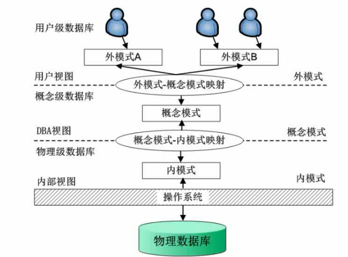

## 数据库三级模式两级映射

> 美国国家标准协会(American National Standard Institute, ANSI)的数据库管理系统研究小组于1978年提出了标准化的建议，将数据库结构分为3级：面向用户或应用程序员的用户级、面向建立和维护数据库人员的概念级、面向系统程序员的物理级。

一、数据库有哪三级模式？

人们为数据库设计了一个严谨的体系结构，数据库领域公认的标准结构是三级模式结构，它包括外模式、(概念)模式、内模式，有效地组织、管理数据，提高了数据库的逻辑独立性和物理独立性。

1.1 用户级--> 外模式(反映了数据库系统的用户观)

外模式又称子模式或用户模式，对应于用户级。它是某个或某几个用户所看到的数据库的数据视图，是与某一应用有关的数据的逻辑表示。

外模式是从模式导出的一个子集，包含模式中允许特定用户使用的那部分数据。用户可以通过外模式描述语言来描述、定义对应于用户的数据记录(外模式)，也可以利用数据操纵语言(Data Manipulation Language，DML)对这些数据记录进行操作。

1.2 概念级--> 概念模式（反映了数据库系统的整体观）

概念模式又称模式或逻辑模式，对应于概念级。它是由数据库设计者综合所有用户的数据，按照统一的观点构造的全局逻辑结构，是对数据库中全部数据的逻辑结构和特征的总体描述，是所有用户的公共数据视图(全局视图)。

它是由数据库管理系统提供的数据模式描述语言(Data Description Language，DDL)来描述、定义的。

1.3 物理级 --> 内模式（反映了数据库系统的存储观）

内模式又称存储模式，对应于物理级。它是数据库中全体数据的内部表示或底层描述，是数据库最低一级的逻辑描述，它描述了数据在存储介质上的存储方式和物理结构，对应着实际存储在外存储介质上的数据库。

内模式由内模式描述语言来描述、定义的。

**总结**

总之，数据按外模式的描述提供给用户；按内模式的描述存储在磁盘上；而概念模式提供了连接这两级模式的相对稳定的中间层，并使得两级中任意一级的改变都不受另一级的牵制。

二、数据库的两级映射

数据库系统在三级模式之间提供了两级映像：模式/内模式的映像、外模式/模式的映像。

- 模式/内模式的映像：实现概念模式到内模式之间的相互转换。

- 外模式/模式的映像：实现外模式到概念模式之间的相互转换。

数据的独立性是指数据与程序独立，将数据的定义从程序中分离出来，由DBMS（数据库管理系统）负责数据的存储，从而简化应用程序，大大减少应用程序编制的工作量。

数据的独立性是由DBMS的二级映像功能来保证的。

数据的独立性包括数据的**物理独立性**和数据的**逻辑独立性**。

#### 什么是数据的物理独立性？

答：数据的物理独立性是指当数据库的内模式发生改变时，数据的的逻辑结构不变。由于应用程序处理的只是数据的逻辑结构，这样物理独立性可以保证，当数据的物理结构改变了，应用程序不用改变。但是，为了保证应用程序能够正确执行，需要修改概念模式/内模式之间的映像。

#### 什么是数据的逻辑独立性？

答：数据的逻辑独立性是指用户的应用程序与数据库结构是相互独立的。数据的逻辑结构发生变化后，用户程序也可以不修改。但是，为了保证应用程序能够正确执行，需要修改外模式/概念模式之间的映像。

**总结**

通俗来讲就是如果改变了某个模式，只需要修改上一层的映像。即改变内模式，只需要修改模式/内模式映像（物理独立性），改变概念模式（逻辑结构），只需要修改外模式/模式映像（逻辑独立性）。

#### 参考
[数据库模式（三级模式+两级映射）](https://blog.csdn.net/mcb520wf/article/details/91047683)
