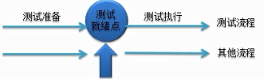

## 软件测试V模型W模型H模型

### 软件测试&软件工程

- 软件测试与软件工程息息相关，软件测试是软件工程组成中不可或缺的一部分。
- 在软件工程、项目管理、质量管理得到规范化应用的企业，软件测试也会进行得比较顺利，软件测试发挥的价值也会更大。
- 要关注软件工程、质量管理以及配置管理与软件测试的关系；在不同的开发模式下，如何进行软件测试。

### 测试模型

随着测试过程的管理和发展，测试人员通过大量的实践，从而总结出了不少测试模型，如常见的V模型、W模型、H模型等。这些模型与开发紧密结合，对测试活动进行了抽象，成为了测试过程管理的重要参考依据。

#### V模型

V模型示意图（重要）

V模型（测试 ）

1、单元测试

又称模块测诚，针对软件设计中的最小单位—模块或程序单元或程序模块，进行正确性检查的测试工作。单元测试需要从程序的内部结构出发设计测试用例。多个模块可以平行地独立进行单元测试。

单元定义：C中指一个函数，Java中指一个类，在图形化的软件中，单元一般指1个窗口，1个菜单。

2、集成测试

又叫组装测试，通常在单元测试的基础上，将所有程序模块进行有序的、递增的测试。重点测试不同模块的接口部分。

3、系统测试(system testing)：

指的是将整个软件系统看为一个整体进行测试，包括对功能、性能、以及软件所运行的软硬件环境进行测试。

系统测试在系统集成完毕后进行测试，前期主要测试系统的功能是否满足需求，后期主要测试系统运行的性能是否满足需求，以及系统在不同的软硬件环境中的兼容性等。

4、验收测试

α测试：Alpha是内测版本，即现在所说的C8，比版本表示该软件仅仅是一个初步完成品，通常只在软件开发者内部交流，也有很少一部分发布给专业测试人员。一般而言，该版本软件的bug较多，普通用户最好不要安装。

β测试：Beta是公测版本，是对所有用户开放的测试版本。该版本相对于a颜已有了很大的改进，消除了严重的错误，但还是存在着一些陷需要经过大规模的发布试来进一步消除。这一版本通常由软件公司免费发布，用户可从相关的站点下载。通过一些专业爱好者的测试，将结果反馈给开发者，开发者们再进行有针对性的修改。该版本也不适合一般用户安装。

λ测试：Camma版本，指的是软件版本正式发行的候选版。该版本已经相当成熟了，与即将发行的正式版相差无几，成为正式反布的候选版本。

软件正式版本推出之前的几个版本，需要有人测试一下，看看是不是有问题。

在开发该软件的公司内部的由该公司内部人员式的称为：Alpha测试，Alpha 测式主要看有没有功能缺失或系统错误，Alpha 测试完后一般不会有大问题了。

然后把软件拿给用户测试称为：beta 测试，主要是看用户对软件外观、使用方便等的反应。

这么多的式版一方面为了最终产品尽可能地满足用户的需要，另一方面也尽量成少了软件中的bug。

然后做过一些修改，成为正式发布的候选版本时，叫做gamma（现在叫做RC-ReleaseCandidate)。

简单来说，阿尔法测试主要是测试人员在开发环境下的测试，贝塔测试是在实际环境中的测试，或者公司内部人员在模拟真实环境中的测试。

V模型的优缺点（测试重点）

1、优点：

- 包含了底层测试（单元测试）和高层测试（系统测试）；
- 清楚的标识了开发和测试的各个阶段；
- 自上而下逐步求精，每个阶段分工明确，便于整体项目的把控。

2、缺点：
- 自上而下的顺序导致了，测试工作在编码之后，就导致错误不能及时的进行修改；
- 实际工作中，需求经常变化，导致v模型步骤，反复执行，返工量很大，灵活度较低。

3、改良：
- 每个步骤都可以进行小的迭代工作。

#### W模型（重要）

定义：开发一个v；测试一个v组合起来的模型（w模型也叫双v模型）

W模型示意图

优点：
- 开发伴随着整个开发周期，需求和设计同样要测试；
- 更早的介入测试，可以发现初期的缺陷，修复成本低；
- 分阶段工作，方便项目整体管理。

缺点：
- 开发和测试依然是线性的关系，需求的变更和调整，依然不方便；
- 如果没有文档，根本无法执行w模型；对于项目组成员的技术要求更高！

#### H模型（了解）

H模型示意图

H模型的优点：
- 开发的H模型揭示了软件测试除测试执行外，还有很多工作；
- 软件测试完全独立，贯穿整个生命周期，且与其他流程并发进行；
- 软件测试活动可以尽早准备、尽早执行，具有很强的灵活性；
- 软件测试可以根据被测物的不同而分层次、分阶段、分次序的执行，同时也是可以被迭代的。

H模型的缺点：
- 管理型要求高：由于模型很灵活，必须要定义清晰的规则和管理制度，否则测试过程将非常难以管理和控制；
- 技能要求高：H模型要求能够很好的定义每个迭代的规模，不能太大也不能太小；
- 测试就绪点分析困难：测试很多时候，你并不知道测试准备到什么时候是合适的，就绪点在哪里，就绪点的标准是什么，这就对后续的测试执行的启动带来很大困难；
- 对于整个项目组的人员要求非常高：在很好的规范制度下，大家都能高效的工作，否则容易混乱。例如：你分了一个小的迭代，但是因为人员技能不足，使得无法有效完成，那么整个项目就会受到很大的干扰。

### 总结
- V模型适用于中小企业，

- W模型适用于中大型企业（因为人员要求高），

- H模型人员要求非常高，很少有公司使用。

### 参考
[V模型、W模型、H模型](https://www.cnblogs.com/zhuifeng-mayi/p/9853123.html)
