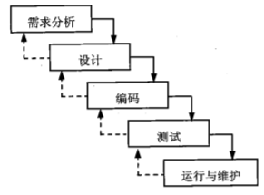
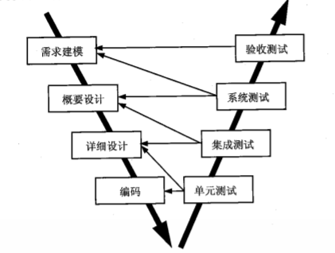
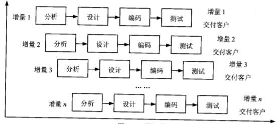
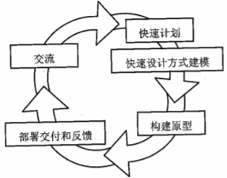
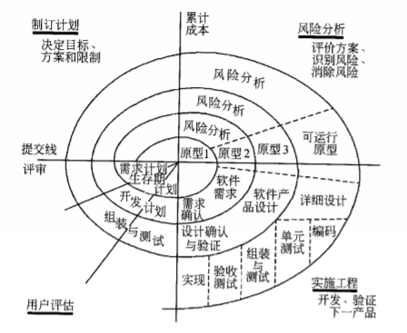
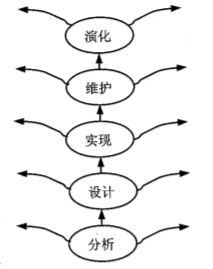
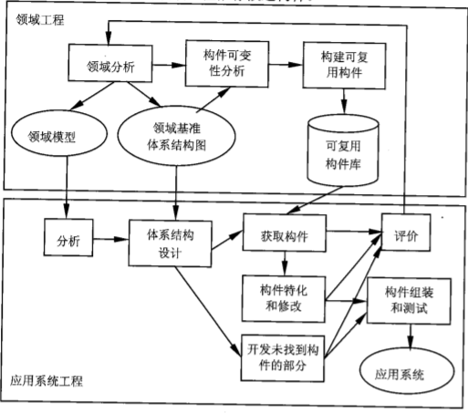

## 软件生存周期模型
软件生存周期模型是描述软件开发过程中各种活动如何执行的模型。

软件生存周期模型确立了软件开发和演绎中各阶段的次序限制以及各阶段或机动的准则，确立开发过程所遵守的规定和限制，便 于各种活动的协调，便于各种人员的有效通信，有利于活动重用，有利于活动管理。

常见的软件生存周期模型有瀑布模型、演化模型、螺旋模型和喷泉模型等。

### 1、瀑布模型 (自上而下，相互衔接，呈线性，逐级下落)（Waterfall Model）

瀑布模型是将软件生存周期各个活动规定为依线性顺序连接的若干阶段的模型。它包括可行性分析、项目开发计划、需求分析、概要设计、详细设 计、编码、测试和维护。它规定了由前至后、相互衔接的固定次序，如同瀑布流水，逐级下落。

    
     
    
瀑布模型

瀑布模型为软件的开发和维护提供了一种有效的管理模式，根据这一模式制定开发计划，进行成本预算，组织开发力量，以项目的阶段评审和文档 控制为手段有效地对整个开发过程进行指导，所以它是以文档作为驱动、适合于软件需求很明确的软 件项目的模型。

但是，瀑布模型在大量的软件开发实践中也逐渐暴露出它的严重缺点。它是一种理想的线性开发模式，缺乏灵活性，特别是无法解决软件需求不明确或不准确的问题。

瀑布模型的一个变体是V模型

    
     
    
V模型

优点：容易理解、管理成本低

缺点：
- 客户必须能够完整、正确和清晰地表达他们的需求
- 在开始的两个或三个阶段，很难评估正确的进度状态
- 当接近项目结束时，会出现大量的集成和测试工作
- 直到项目结束之前，都不能演示系统的能力
- 需求或设计中的错误往往只有到了项目后期才能被发现，对于项目风险的控制能力较弱，从而导致项目常常延期完成，研发费用超出预算

### 2、增量模型（Incremental Model）

增量模型融合了瀑布模型的基本成分和原型实现的迭代特征，它假设可以将需求分段为一系列增量产品，每一增量可以分别开发。

该模型采用随着日程时间的进展而交错的线性序列，每一个线性序列产生软件的一个可发布的“增量”。

    
     
    
增量模型

客户对每个增量的使用和评估都作为下一个增量发布的新特征和功能。

增量模型强调每个增量均发布一个可操作的产品。

优点：
- 具有瀑布模型的所有优点
- 第一个可交付版本所需要的成本和时间很少
- 开发由增量表示的小系统所承担的风险不大
- 可以减少用户需求的变更
- 在项目开始时，可以仅对一个或两个增量投资

缺点：
- 若没有对用户的变更要求进行规划，那么产生的初始增量可能会造成后来增量的不稳定
- 如果需求不像早期思考的那样稳定和完整，那么一些增量就可能需要重新开发，重新发布
- 管理发生的成本、进度和配置的复杂性可能会超出组织的能力

### 3、演化模型 (先原型，再改进优化)（Evolutionary Model）

大量的软件开发实践表明，许多开发项目在开始时对软件需求的认识是模糊的，因此很难一次开发成功。为了减少因对软件需求的了解不够确切而给开发工作带来的风险，可以在获取了一组基本的需求后，通过快速分析构造出该软件的一个初始可运行版本，这个初始的软件通常称为原型 (Prototype)，然后根据用户在使用原型的过程中提出的意见和建议对原型进行改进，获得原型的新版本。重复这一过程，最终可得到令用户满意的软件产品。

采用演化模型的开发过程，实际上就是从初始的原型逐步演化成最终软件产品的过程。演化模型特别适用于对软件需求缺乏准确认识的情况。

#### 原型模型（Prototype Model）

在开放初期，很难得到一个完整、准确的需求规格说明书，在开发过程中，用户还会不断产生新的需求，因此，原型模型就出现了。

    
     
    
原型模型

原型是预期系统的一个可执行版本，反映了系统性质的一个选定的子集。

原型模型始于沟通，目的是定义软件的总体目标，标识需求，然后快速制定原型开发的计划，确定原型的目标和范围，采用快速射击的方式对其进行建模，并构建原型。

原型的分类：

- 探索型原型（弄清目标要求，确定希望的特性，探讨多种方案的可行性）
- 实验型原型（验证方案或算法的合理性）
- 演化型原型（将原型作为目标系统的一部分，通过对原型的多次改进，逐步将原型演化为最终的目标系统）

#### 螺旋模型 (迭代演化思想)（Spiral Model）

对于复杂的大型软件，开发一个原型往往达不到要求。螺旋模型将瀑布模型和演化模型结合起来，加入了两种模型均忽略的风险分析，弥补了两种模型的不足。

    
     
    
螺旋模型

螺旋模型将开发过程分为几个螺旋周期，每个螺旋周期大致和瀑布模型相符合。在每个螺旋周期分为如下4个工作步。

(1) 制定计划。确定软件的目标，选定实施方案，明确项目开发的限制条件。

(2) 风险分析。分析所选的方案，识别风险， 消除风险。

(3) 实施工程。实施软件开发，验证阶段性产品。

(4) 用户评估。评价开发工作，提出修正建议，建立下一个周期的开发计划。

螺旋模型适用于庞大、复杂及具有高风险的系统。

### 4、喷泉模型 (自底向上)（Water Fountain Model）

喷泉模型是一种以用户需求为动力，以对象作为驱动的模型，适合于面向对象的开发方法。

它克服了瀑布模型不支持软件重用和多项开发活动集成的局限性。

喷泉模型使开发过程具有迭代性和无间隙性。

迭代意味着模型中的开发活动常常需要重复多次，在迭代过程中不断地完善软件系统。

无间隙是指在开发活动(如分析、设计、编码)之间不存在明显的边界，开发人员可以同步进行。

也就是说，它不像瀑布模型那样，需求分析活动结束后才开始设计活动，设计活动结束后才开始编码活动，而是允许各开发活动交叉、 迭代地进行。

    
     
    
喷泉模型

### 5、基于构件的开发模型（Component-based Development Model）

基于构件的开发是指利用预先包装的构件来构造应用系统。

构件可以是组织内部开发的构件，也可以是商品化成品软件构件。

基于构件的开发模型具有许多螺旋模型的特点，本质上是演化模型，需要以迭代方式构建软件。其不同之处在于，基于构件的开发模型采用预先打包的软件构件开发应用系统。

    
     
    
基于构件的开发模型

基于构件的开发模型包括领域工程和应用系统工程两部分：
- 领域工程（构建领域模型、领域基准体系结构和可复用构件库）
- 应用系统工程（使用可复用构件组装应用系统）

### 6、形式化方法模型（Formal Methods Model）
形式化方法是建立在严格数学基础上的一种软件开发方法，其主要活动是生存计算机软件形式化的数学规格说明。

形式化方法用严格的数学语言和语义描述功能规约和设计规约，通过数学的分析和推导，易于发现需求的歧义性、不完整性和不一致性，易于对分析模型、设计模型和程序进行验证。

### 7、统一过程(UP) 模型
统一过程模型是一种**用例和风险驱动，以架构为中心，迭代并且增量**的开发过程，由**UML**方法和工具支持。

迭代的意思是将整个软件开发项目划分为许多个小的“袖珍项目”，每个“袖珍项目”都包含正常软件项目的所有元素:计划、分析和设计、构造、集成和测试，以及内部和外部发布。

统一过程定义了5个阶段及其制品。

(1)起始阶段--生命周期目标。专注于项目的初创活动。产生的主要工作产品有愿景文档、初始用例模型、初始项目术语表、初始业务用例、初始风险评估、项目计划(阶段及迭代)、业务模型以及一个或多个原型(需要时)。

(2)精化阶段--生命周期架构。理解了最初的领域范围之后， 进行需求分析和架构演进方面。产生的主要工作产 品有用例模型、补充需求(包括非功能需求)、分析模型、软件体系结构描述、可执行的软件体系结 构原型、初步的设计模型、修订的风险列表、项目计划(包括迭代计划、调整的工作流、里程碑和技术工作产品)以及初始用户手册。

(3)构建阶段--初始运作功能。关注系统的构建，产生实现模型。产生的主要工作产品有设计模型、软件构件、 集成的软件增量、测试计划及步骤、测试用例以及支持文档(用户手册、安装手册和对于并发增量的 描述)。

(4)移交阶段--产品发布。关注于软件提交方面的工作， 产生软件增量。产生的主要工作产品有提交的软件 增量、β测试报告和综合用户反馈。

(5)产生阶段。运行软件并监控软件的持续使用，提供运行环境的支持，提交并评估缺陷报告和变更请求。

每次迭代产生包括最终系统的部分完成的版本和任何相关的项目文档的基线，通过逐步迭代基线之间相互构建，直到完成最终系统。

在每个迭代中，有5个核心工作流:捕获系统应该做什么的需求工作流，精化和结构化需求的分析工作流，在系统构架内实现需求的设计工作流，构造软件的实现工作流，验证实现是否如期望那样工作的测试工作流。随着UP的阶段进展，每个核心工作流的工作量发生了变化。前4个技术阶段由主要里程碑所终止。

统一过程的典型代表是RUP(Rational Unified Process)。RUP是UP的商业扩展，完全兼容UP， 但比UP更完整、更详细。

#### 软件过程模式中四要素
生命周期，人员，方法，产品

#### 六个最佳实践
- 迭代式开发
- 需求管理
- 使用基于构件的体系结构
- 可视化建模(UML)
- 验证软件质量
- 控制软件变更

#### 软件过程能力评估的三个标准
- CMM(Carnegie Mellon University)能力成熟度模型(五个级别：初始级、可重复级、已定义级、已管理级、优化级)
- ISO 9000
- 六西格码

**能力成熟度集成模型 (Capacity Maturity Model Integrated, CMMI)**
是CMM模型的最新版本。随着应用的推广与模型本身的发展，该方法演绎成为一种被广泛应用的综合性模型。

CMMI有两种不同的表述方式，不同的表述方式，其级别表示不同的内容。

CMMI的一种表述方 式为连续表述，主要是关注某特定域的过程改进和能力评估;

另一种表述方式为阶段式，主要是衡量一个企业的成熟度，而不把单个过程是否完成作为重点。

和CMM的5个成熟度等级一样，基于阶段式表述的CMMI有5个成熟度级别:初始级、已管理级、已定义级、量化管理级(quantitatively managed)和优化级。

这5个成熟度等级中，要一级一级逐级进行。每一个成熟度等级为过程改进达 到下一个等级提供基础。

企业在实施CMMI的时候，当前一个等级没有达到时，不能进入下一个等级。

基于连续表述的CMMI共有6个(0~5)能力等级:

未完整级(incomplete)、已执行级 (performed)、已管理级、已定义级、量化管理级和优化级

这样的描述方式主要强调能力度等级，一个过程是否完成非常重要，因此分为6个等级。

每个能力等级对应到一个一般目标，以及一组一般执行方法和特定方法。

### 8、敏捷过程 (AP) / 敏捷方法（Agile Development）

#### 目标
通过“尽可能早地、持续地对有价值的软件的交付”使客户满意。

#### 流派
极限编程，SCRUM，动态系统开发，特征驱动开发等

#### 敏捷统一过程(Agile Unified Process，AUP)

敏捷统一过程采用**在大型(任务)上连续**及在**在小型(活动)上迭代**的原理来构件软件系统。**采用经典的UP阶段性活动（初始、精化、构建和转换）**，提供了一系列活动，能够使团队为软件项目构想出一个全面的过程流。在每个活动里，一个团队迭代了使用敏捷，并将有意义的软件增量尽可能快地交付给最终用户。

建模 ->  实现 -> 测试 -> 部署 -> 配置及项目管理 -> 环境管理

以RUP为框架，对其进行适当的剪裁，并吸取了其他敏捷方法，如XP、FDD等的先进思想。主要适用于20人以下的团队采用面向对象的方法进行中小型项目的开发。主要有以下3个特点。

- 以架构为中心

尽管敏捷方法认为系统设计应该随着软件开发而不断演化，但是，系统的架构设计应该在系统开始编码之前给予充分的斟酌。因为架构关心的不仅是功能性需求，更多关心的是非功能性需求，如系统的性能等。一个没有经过深思熟虑的架构往往会在开发后期或系统移交之后暴露出很多性能上的问题，那时再进行重构的代价是非常大的。

- 注重数据库设计

很多项目的失败都是由于数据库设计不合理，性能未给予优化所造成的。AUP认为数据库设计应随系统的开发一同演进。良好的数据库设计能够让系统的性能得到可靠保证。由于系统要处理大量的生产数据，数据库最终会达到千万行以上的记录。在项目进行的初期，需要对数据库进行充分的测试，以保证达到性能的要求。因此在项目投用以后，随着遗留系统的数据导入，数据库很快膨胀到几百万行记录，但由于前期工作比较充分，系统仍能很好地满足性能的需求。

- 强调与用户的沟通

软件需求的不稳定，加之很多用户在没有看到最终系统之前，并不了解自己到底需要什么样的一个系统。因此，AUP在开发过程中，始终强调与用户进行直接、有效的沟通。在初始和细化阶段，开发人员通过界面原型不断与用户讨论需求的内容，聆听用户的反馈意见，不断改进需求。在构造和移交阶段，不断通过小型发布向用户提交可运行的版本，让用户在使用过程中提出新的需求，并不断地加以改进。

#### 四条基本价值观:
- 个体和交互胜过过程和工具
- 可以工作的软件胜过面面俱到的文档
- 客户合作胜过合同谈判
- 响应变化胜过遵循计划

#### 由价值观引出的12条敏捷原则
1、我们最优先要做的是通过尽早的、持续的交付有价值的软件来使客户满意。

2、即使到了开发的后期，也欢迎改变需求。敏捷过程利用变化来为客户创造竞争优势。

3、经常性地交付可以工作的软件，交付的间隔可以从几个星期到几个月，交付的时间间隔越短越好。

4、在整个项目开发期间，业务人员和开发人员必须天天都在一起工作。

5、围绕被激励起来的个体来构建项目。给他们提供所需的环境和支持，并且信任他们能够完成工作。

6、在团队内部，最具有效果并且富有效率的传递信息的方法，就是面对面的交谈。

7、工作的软件是首要的进度度量标准。

8、敏捷过程提倡可持续的开发速度。责任人、开发者和用户应该能够保持一个长期的、恒定的开发速度。

9、不断地关注优秀的技能和好的设计会增强敏捷能力。

10、简单——使未完成的工作最大化的艺术——是根本的。

11、最好的构架、需求和设计出自于自组织的团队。

12、每隔一定时间，团队会在如何才能更有效地工作方面进行反省，然后相应地对自己的行为进行调整。

#### 方法一：极限编程(xp) extreme Programming 
XP是一种轻量级(敏捷)、高效、低风险、柔性、可预测的、科学的软件开发方式。

它由价值观、原则、实践和行为4个部分组成，彼此相互依赖、关联，并通过行为贯穿于整个生存周期。

四大价值观：改善沟通、寻求简单、获得反馈、富有勇气

5个原则：快速反馈、简单性假设、逐步修改、提倡更改和优质工作。

**12个最佳实践(常考)**

计划游戏(快速制定计划、 随着细节的不断变化而完善)、小型发布(系统的设计要能够尽可能早地交付)、隐喻(找到合适的 比喻传达信息)、简单设计(只处理当前的需求， 使设计保持简单)、测试先行(先写测试代码，然 后再编写程序)、重构(重新审视需求和设计，重新明确地描述它们以符合新的和现有的需求)、结队编程、集体代码所有制、持续集成(可以按日甚至按小时为客户提供可运行的版本)、每周工作40 个小时、现场客户和编码标准。

适用范围：具有有限资源及有限时间的小项目

#### 方法二：水晶法(Crystal)
它认为每一个不同的项目都需要一套不同的策略、约定和方法论。认为人对软件质量有重要的影响，因此随着项目质量和开发人员素质的提高，项目和过程的质量也随之提高。通过更好地交流和经常性的交付，软件生产力得到提高。

#### 方法三：并列争求法(Scrum)
该方法使用迭代的方法，其中把每30天一次的迭代称为一个“冲刺”，并按需求的优先级别来实现产品。多个自组织和自治的小组并行地递增实现产品。协调是通过简短的日常情况会议来进行，就像橄榄球中的“并列争球”。

#### 方法四：自适应软件开发(ASD)
它有6个基本的原则:

- 有一个使命作为指导;

- 特征被视为客户价值的关键点;

- 过程中的等待是很重要的，因此“重做”与“做”同样关键;

- 变化不被视为改正，而是被视为对软件开发实际情况的调整;

- 确定的交付时间迫使开发人员认真考虑每一个生产的版本的关键需求;

- 风险也包含其中。

### 9、微软过程(MP)
#### 微软过程原则：
1 制定计划时兼顾未来不确定因素

2 通过有效的风险管理减少不确定因素的影响

3 经常生成过渡性的版本并快速测试来提高产品的稳定性及可测性

4 快速循环递进的开发过程

5 从产品特性和成本控制出发创造性地工作

6 创建确定的进度表

7 使用小型项目组并发完成工作，并设置多个同步

8 将大型项目分解成多个可管理的单元，以便更快地发布产品

9 用产品的前景目标和概要说明指导项目开发工作-先基线后冻结

10 避免产品走形

11使用原型验证概念，进行开发前的测试

12 零缺陷概念

13 非责难式的里程碑评审会

#### 微软开发产品的每个生命周期（五个阶段）
1 构想阶段
2 计划阶段
3 开发阶段
4 稳定阶段
5 发布阶段

#### 参考
[统一过程,敏捷过程,微软过程(收集)](https://www.cnblogs.com/zhegebucuo/archive/2010/03/05/1679213.html)

[敏捷统一过程(Agile Unified Process，AUP)](http://wap.boraid.cn/articleShow.php?articleid=192269)

[软件设计师考试 | 第五章 软件工程基础知识 | 软件过程模型](https://www.jianshu.com/p/ced0c2f143b4)
