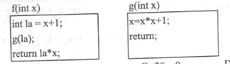

# 2019上半年软件设计师考试真题-上午卷

<h4>【答题/学习模式】将<code>README.md</code>中的<code>display</code>属性全部设置为<code>none/inline</code></h4>

## 索引
||||||
|:|:|:|:|:|
| [1、计算机执行指令](#1、) | [2、DMA控制方式](#2、) | [3、程序的局限性 ](#3、) | [4、可靠度](#4、) | [5、模2运算](#5、) |
| [6、RISC (精简指令系统计算机)技术](#6、) | [7、防火墙](#7、) | [8、安全电子邮箱服务](#8、) | [9-10、安全通信](#9-10、) | / |
| [11、震网(Stuxnet)病毒](#11、) | [12、发明的权利归属](#12、) | [13-14、软件著作权](#13-14、) | / | [15、数据流图建模](#15、) |
| [16、结构图](#16、) | [17、排列组合](#17、) | [18、进度网络图](#18、) | [19、软件风险特性](#19、) | [20、高级程序设计语言](#20、) |
| [21、编译阶段](#21、) | [22、符号表](#22、) | [23-24、单处理机系统进程的状态转换图](#23-24、) | / | [25、位示图(bitmap)记录磁盘](#25、)  |
| [26、相对路径和绝对路径](#26、)  | [27、PV操作](#27、) | [28、嵌入式操作系统优点](#28、) | [29-30、软件生存周期模型](#29、) | / |
| [31、ISO/IEC和McCall软件质量模型](#31、) | [32、耦合类型](#32、) | [33、Theo Mandel黄金分割准则](#33、) | [34、白盒测试技术](#34、) | [35、无效等价类](#35、) |
| [36、软件维护](#36、) | [37、重载](#37、) | [38、组合关系](#38、) | [39、面向对象设计的七大原则](#39、) | [40、聚合对象](#40、) |
| [41、UML图分类](#41、) | [42-43、序列图](#42-43、) | / | [44-46、设计模式](#44-46、) | / |
| / | [47、观察者模式](#47、) | [48、阶段划分的编译器](#48、) | [49、NFA/DFA](#49、)  | [50、引用调用（call by reference）和值调用（call by value）](#50、) |
| [51、自然连接运算](#51、) | [52-53、候选键分析、传递依赖、冗余函数依赖](#52-53、) | [54、授权语句格式](#54、) | [55、事务的共享锁和排他锁](#55、) | / |
| [56、分布式数据库](#56、)  | [57、n 阶的三对角矩阵](#57、) | [58、二叉树](#58、) | [59、双端队列](#59、) | [60、线件探查法解决冲突构造的哈希表](#60、) |
| [61、二分法查找](#61、) | [62-65、算法的时间、空间复杂度](#62-65、) | / | / | / |
| [66、无痕浏览模式](#66、) | [67、HTTP的一次请求过程](#67、) | [68、TCP和UDP协议](#68、) | [69、IPConfig](#69、) | [70、无线网络技术](#70、) |
| [71-75、Good project management](#71-75、) |
***
考试时间：150分钟

考试总分：75分（45分及格）

**遵守考场纪律，维护知识尊严，杜绝违纪行为，确保考试结果公正。**

单选题(共 75 题,共 75 分)
***
#### 1、
计算机执行指令的过程中，需要由( )产生每条指令的操作信号并将信号送往相应的部件进行处理，以完成指定的操作。 

A.CPU 的控制器
B.CPU 的运算器
C.DMA 控制器
D.Cache 控制器

<h4>答案</h4>

A

<h4>解析</h4>

控制器（Control Unit）：是中央处理器的核心，主要功能就是统一指挥并控制计算机各部件协调工作，所依据的是机器指令。其实就是向计算机其他部件发送控制指令。控制器的组成包含程序计数器（PC）、指令寄存器（IR）、指令译码器、时序部件、微操作控制信号形成部件（PSW）和中断机构。

#### 2、
DMA控制方式是在( )之间直接建立数据通路进行数据的交换处理。 

A.CPU 与主存
B.CPU 与外设
C.主存与外设
D.外设与外设

<h4>答案</h4>

C

<h4>解析</h4>

DMA（Direct Memory Access）控制器是一种在系统内部转移数据的独特外设，可以将其视为一种能够通过一组专用总线将内部和外部存储器与每个具有DMA能力的外设连接起来的控制器。它之所以属于外设，是因为它是在处理器的编程控制下来执行传输的。 
DMA存取方式，是一种完全由硬件执行I/O数据交换的工作方式。它既考虑到中断的响应，同时又要节约中断开销。此时，DMA控制器代替CPU完全接管对总线的控制，数据交换不经过CPU，直接在内存和外围设备之间成批进行。

#### 3、
CPU 访问存储器时，被访问数据一般聚集在一个较小的连续存储区域中。若一个存储单元已被访问，则其邻近的存储单元有可能还要被访问，该特性被称为( )

A.数据局部性
B.指令局部性
C.空间局部性
D.时间局部性

<h4>答案</h4>

C

<h4>解析</h4>

程序的局限性表现在时间局部性和空间局部性： 
（1）时间局部性是指如果程序中的某条指令一旦被执行，则不久的将来该指令可能再次被执行； 
（2）空间局部性是指一旦程序访问了某个存储单元，则在不久的将来，其附近的存储单元也最有可能被访问。 
题干的描述指的是空间局部性。

#### 4、

某系统由3个部件构成，每个部件的千小时可靠度都为R，该系统的千小时可靠度为<code>(1-(1-R)²)R</code>,则该系统的构成方式是（ ）。

A.3 个部件串联
B.3 个部件并联
C.前两个部件并联后与第三个部件串联
D.第一个部件与后两个部件并联构成的子系统串联

<h4>答案</h4>

C

<h4>解析</h4>

A选项可靠度为R×R×R； 
B选项可靠度为1-（1-R）×（1-R）×（1-R）； 
C选项可靠度为（1-（1-R）×（1-R））×R； 
D选项可靠度为R×（1-（1-R）×（1-R））。 
综合4个选项来看，符合题干描述的是C选项。

#### 5、
在( )校验方法中,采用模2运算来构造校验位。 

A.水平奇偶
B.垂直奇偶
C.海明码
D.循环冗余

<h4>答案</h4>

D

<h4>解析</h4>

模2运算是一种二进制算法，属于CRC（Cyclic Redundancy Check）校验技术中的核心部分，具体用的模二除算法。 
垂直奇偶校验又称为纵向奇偶校验，它是将要发送的整个信息块分为定长p位的若干段(比如说q段)，每段后面按"1"的个数为奇数或偶数的规律加上一位奇偶位。 
水平奇偶校验又称为横向奇偶校验，它是对各个信息段的相应位横向进行编码，产生一个奇偶校验冗余位。 
奇偶校验用的是模二加运算法则。

#### 6、
以下关于 RISC (精简指令系统计算机)技术的叙述中，错误的是( )。 

A.指令长度固定、指令种类尽量少
B.指令功能强大、寻址方式复杂多样
C.增加寄存器数目以减少访存次数 
D.用硬布线电路实现指令解码，快速完成指令译码

<h4>答案</h4>

B

<h4>解析</h4>

RISC鼓励尽可能使用较少的寻址方式，这样可以简化实现逻辑、提高效率。相反地，CISC则提倡通过丰富的寻址方式来为用户编程提供更大的灵活性。 

#### 7、
( )防火墙是内部网和外部网的隔离点,它可对应用层的通信数据流进行监控和过滤。 

A.包过滤
B.应用级网关
C.数据库
D.WEB

<h4>答案</h4>

B

<h4>解析</h4>

防火墙分为一般分为包过滤型（网络层）、应用级网关和复合型防火墙(集合包过滤与应用级网关技术)，而Web防火墙是一种针对网站安全的入侵防御系统，一般部署在Web服务器上或者Web服务器的前端。 
题干中提到可对应用层的通信数据流进行监控，可知应选应用级网关防火墙。 
防火墙能够工作在三种模式下：路由模式、透明模式、混合模式。

#### 8、
下述协议中与安全电子邮箱服务无关的是( )。 

A.SSL
B.HTTPS
C.MIME
D.PGP

<h4>答案</h4>

C

<h4>解析</h4>

SSL协议位于TCP/IP协议与各种应用层协议之间，为数据通信提供安全支持。使用SSL的方式发送邮件，会对发送的信息进行加密，增加被截取破解的难度。  
HTTPS (超文本传输安全协议)，是以安全为目标的HTTP通道，即在HTTP下加入SSL层。  
MIME (多用途互联网邮件扩展类型)是一个互联网标准，扩展了电子邮件标准，使其能够支持：非ASCII字符文本;非文本格式附件(二进制、声音、图像等)；由多部分(multiple parts)组成的消息体；包含非ASCII字符的头信息(Header information)。  
PGP(优良保密协议)是一个基于RSA公匙加密体系的邮件加密软件。可以用它对邮件保密以防止非授权者阅读，还能对邮件加上数字签名从而使收信人可以确认邮件的发送方。  
基于上述分析，只有MIME与电子邮箱服务的安全无关。  
SMTP、POP3分别是实现邮件的发送和接收的协议，也是没有提供相应的安全机制。

#### 9-10、
用户 A 和 B 要进行安全通信，通信过程需确认双方身份和消息不可否认。A 和 B 通信时可使用(  )来对用户的身份进行认证;使用( )确保消息不可否认。

问题1选项

A.数字证书
B.消息加密
C.用户私钥 
D.数字签名 

问题2选项

A.数字证书 
B.消息加密 
C.用户私钥 
D.数字签名

<h4>答案</h4>

A、D

<h4>解析</h4>

数字证书就是互联网通讯中标志通讯各方身份信息的一系列数据，提供了一种在Internet上验证您身份的方式，其作用类似于司机的驾驶执照或日常生活中的身份证。它是由一个由权威机构-CA机构，又称为证书授权（CA）中心发行的，人们可以在网上用它来识别对方的身份。最简单的证书包含一个公开密钥、名称以及证书授权中心的数字签名。可以更加方便灵活地运用在电子商务和电子政务中。

#### 11、
震网(Stuxnet)病毒是一种破坏工业基础设施的恶意代码，利用系统漏洞攻击工业控制系统，是一种危害性极大的( )。

A.引导型病毒
B.宏病毒
C.木马病毒 
D.蠕虫病毒

<h4>答案</h4>

D

<h4>解析</h4>

震网（Stuxnet）病毒于2010年6月首次被检测出来，是第一个专门定向攻击真实世界中基础（能源）设施的“蠕虫”病毒这种病毒可以破坏世界各国的化工、发电和电力传输企业所使用的核心生产控制电脑软件。  
引导型病毒，指寄生在磁盘引导区或主引导区的计算机病毒。此种病毒利用系统引导时，不对主引导区的内容正确与否进行判别的缺点，在引导系统的过程中侵入系统，驻留内存，监视系统运行，待机传染和破坏。按照引导型病毒在硬盘上的寄生位置又可细分为主引导记录病毒和分区引导记录病毒。主引导记录病毒感染硬盘的主引导区，如大麻病毒、2708病毒、火炬病毒等；分区引导记录病毒感染硬盘的活动分区引导记录，如小球病毒、Girl病毒等。  
宏病毒是一种寄存在文档或模板的宏中的计算机病毒。一旦打开这样的文档，其中的宏就会被执行，于是宏病毒就会被激活，转移到计算机上，并驻留在Normal模板上。从此以后，所有自动保存的文档都会“感染”上这种宏病毒，而且如果其他用户打开了感染病毒的文档，宏病毒又会转移到他的计算机上。  
木马病毒是指隐藏在正常程序中的一段具有特殊功能的恶意代码，是具备破坏和删除文件、发送密码、记录键盘和攻击Dos等特殊功能的后门程序。木马病毒其实是计算机黑客用于远程控制计算机的程序，将控制程序寄生于被控制的计算机系统中，里应外合，对被感染木马病毒的计算机实施操作。一般的木马病毒程序主要是寻找计算机后门，伺机窃取被控计算机中的密码和重要文件等。可以对被控计算机实施监控、资料修改等非法操作。木马病毒具有很强的隐蔽性，可以根据黑客意图突然发起攻击。  
蠕虫病毒是一种常见的计算机病毒，是无须计算机使用者干预即可运行的独立程序，它通过不停的获得网络中存在漏洞的计算机上的部分或全部控制权来进行传播。计算机病毒是指编制或者在计算机程序中插入的破坏计算机功能或者破坏数据和恶意篡改系统．影响计算机使用并且能够自我复制的一组计算机指令或者程序代码。

#### 12、
刘某完全利用任职单位的实验材料、实验室和不对外公开的技术资料完成了一项发明。 以下关于该发明的权利归属的叙述中，正确的是( )。

A.无论刘某与单位有无特别约定，该项成果都属于单位 

B.原则上应归单位所有，但若单位与刘某对成果的归属有特别约定时遵从约定 

C.取决于该发明是否是单位分派给刘某的

D.无论刘某与单位有无特别约定，该项成果都属于刘某

<h4>答案</h4>

B

#### 13-14、
甲公司购买了一工具软件，并使用该工具软件开发了新的名为“恒友”的软件。 甲公司在销售新软件的同时，向客户提供工具软件的复制品，则该行为( )。
甲公司未对“恒友” 软件注册商标就开始推向市场，并获得用户的好评。三个月后，乙公司也推出名为“恒友” 的类似软件，并对之进行了商标注册，则其行为( )。

问题1选项

A.侵犯了著作权
B.不构成侵权行为
C.侵犯了专利权 
D.属于不正当竞争

问题2选项

A.侵犯了著作权
B. 不构成侵权行为 
C.侵犯了商标权
D. 属于不正当竞争

<h4>答案</h4>

A、A

<h4>解析</h4>

第一空，涉及向客户提供工具软件的复制品，这里侵犯了工具软件的著作权； 
第二空，甲公司没有注册商标，并且没有描述商业秘密相关内容，所以不涉及商标权保护和不正当竞争法保护，而著作权是自作品完成之时就开始保护，所以甲公司当软件产品完成之后，该作品就已经受到著作权保护了，乙公司的行为侵犯了著作权。

#### 15、
数据流图建模应遵循( )的原则。 

A.自顶向下、从具体到抽象 B.自顶向下、从抽象到具体 C.自底向上、从具体到抽象 D.自底向上、从抽象到具体

<h4>答案</h4>

B

<h4>解析</h4>

数据流图是结构化分析的工具，结构化方法就是采用自顶向下逐层分解的思想进行分析建模的。随着分解层次的增加，抽象的级别也越来越低，即越来越接近问题的解。数据流图建模应遵循：自顶向下、从抽象到具体的原则。

#### 16、
结构化设计方法中使用结构图来描述构成软件系统的模块以及这些模块之间的调用关系。结构图的基本成分不包括( )。

A.模块
B.调用
C.数据 
D.控制

<h4>答案</h4>

D

<h4>解析</h4>

结构化设计方法中使用结构图来描述系统的体系结构，指出一个系统由哪些模块组成，以及模块之间的调用关系。结构图的基本成分有：模块、调用和数据。

#### 17、
10个成员组成的开发小组，若任意两人之间都有沟通路径，则一共有( )条沟通路径。 

A.100
B.90
C.50
D.45

<h4>答案</h4>

D

<h4>解析</h4>
<pre><code>P(n, n) = n!
P(m, n) = m!/(m-n)!
C(m, n) = P(m, n)/P(n, n) = m!/(m-n)!/n!
</code></pre>

#### 18、
某项目的活动持续时间及其依赖关系如下表所示，则完成该项目的最少时间为( )天。

 | 活动 | 持续时间(天)| 依赖关系 |
 |:-:|:-:|:-:|
 |A1|8|-|
 |A2|15|-|
 |A3|15|A1|
 |A4|10|-|
 |A5|10|A2,A4|
 |A6|5|A1,A2|
 |A7|20|A1|
 |A8|25|A4|
 |A9|15|A3,A6|
 |A10|15|A5,A7|
 |A11|7|A9|
 |A12|10|A8,A10,A11|

A.43 B.45 C.50 D.55

<h4>答案</h4>

D

<h4>解析</h4>

根据表格能够画出进度网络图如下所示：

    
     
    

据此分析每个活动的最早开始和最早完成时间如下所示：

    
     
    

综上，完成该项目的最少时间即项目工期为55天。

#### 19、
以下不属于软件项目风险的是( )。 

A.团队成员可以进行良好沟通 B.团队成员离职 C.团队成员缺乏某方面培训 D.招不到符合项目技术要求的团队成员

<h4>答案</h4>

A

<h4>解析</h4>

一般认为软件风险包含两个特性：不确定性和损失。不确定性是指风险可能发生也可能不发生；损失是指如果风险发生，就会产生恶性后果。 
A选项不满足软件风险的损失特性。

#### 20、
通用的高级程序设计语言一般都会提供描述数据、运算、控制和数据传输的语言成分，其中，控制包括顺序、(  )和循环结构。

A.选择
B.递归
C.递推 
D.函数

<h4>答案</h4>

A

<h4>解析</h4>

程序设计语言的基本成分包括数据、运算、控制和传输等。 
程序设计语言的控制成分包括顺序、选择和循环3种结构。

#### 21、
以编译方式翻译C/C++源程序的过程中，( )阶段的主要任务是对各条语句的结构进行合法性分析。

A.词法分析
B.语义分析
C.语法分析 
D.目标代码生成

<h4>答案</h4>

C

<h4>解析</h4>

词法分析阶段依据语言的词法规则，对源程序进行逐个字符地扫描，从中识别出一个个“单词”符号，主要是针对词汇的检查。 
语法分析的任务是在词法分析的基础上，根据语言的语法规则将单词符号序列分解成各类语法单位，如“表达式”“语句”和“程序”等。语法规则就是各类语法单位的构成规则，主要是针对结构的检查。 
语义分析阶段分析各语法结构的含义，检查源程序是否包含语义错误，主要针对句子含义的检查。 
本题描述的是语法分析。

#### 22、
在对高级语言源程序进行编译或解释处理的过程中，需要不断收集、记录和使用源程序中一些相关符号的类型和特征等信息，并将其存入( )中。

A.哈希表
B.符号表
C.堆栈 
D.队列

<h4>答案</h4>

B

<h4>解析</h4>

符号表在编译程序工作的过程中需要不断收集、记录和使用源程序中一些语法符号的类型和特征等相关信息。这些信息一般以表格形式存储于系统中。

#### 23-24、
在单处理机系统中，采用先来先服务调度算法。系统中有 4 个进程 Pl、P2、P3、 P4 (假 设进程按此顺序到达)，其中 P]为运行状态，P2 为就绪状态，P3 和 P4 为等待状态，且 P3 等待打印机，P4 等待扫描仪。若 P1 ( ),则 Pl、P2、P3 和 P4 的状态应分别 为( )。 

A.时间片到
B.释放了扫描仪 
C.释放了打印机
D.已完成 

A.等待、就绪、等待和等待
B.运行、就绪、运行和等待
C.就绪、运行、等待和等待 
D.就绪、就绪、等待和运行

<h4>答案</h4>

A、C

<h4>解析</h4>

本题部分信息比较隐晦，首先这里采用的是先来先服务调度算法，即按照申请的顺序来安排运行，申请顺序已在题干假设为P1-P2-P3-P4。 
其次，单个空无法判断结构，那么结合第二空的选项来分析。首先不能2个进程同时运行，因此B选项排除。 
再根据原本P1-P2-P3-P4的状态分别是（运行、就绪、等待、等待），因此接下来能够在运行态的，要么是保持运行未改变的P1，否则应该是已经进入就绪态的P2（依据先来先服务的调度原则），由于第二空4个选项中，符合的只有C选项，因此这里应该选择C选项，此时P1-P2-P3-P4的状态分别是（就绪、运行、等待、等待）。 
据此再来分析第一空，P1由运行态转变为就绪态，条件应该是时间片到，所以选择A选项。

    
     
    

    
     
    

#### 25、
某文件系统采用位示图(bitmap)记录磁盘的使用情况。若计算机系统的字长为 64 位，磁盘的容量为1024GB,物理块的大小为4MB,那么位示图的大小需要( )个字。

A.1200
B.2400
C.4096 
D.9600

<h4>答案</h4>

C

<h4>解析</h4>

位示图是利用二进制的一位来表示磁盘中的一个盘块的使用情况。当其值为“0”时，表示对应的盘块空闲；为“1”时，表示已经分配。 
系统中字长为64位，一个字（一个单元的一组二进制码）可记录64个物理块的使用情况， 
根据题意，若磁盘的容量为1024GB，物理块的大小为4MB，那么该磁盘就有256×1024个物理块，位示图的大小为256×1024/64=4096个字。  
计算机采用二进制编码方式表示数、字符、指令和其它控制信息。   计算机在存储、传送或操作时，作为一个单元的一组二进制码称为字，一个字中的二进制位的位数称为字长。  
通常称处理字长为8位数据的CPU叫8位CPU，32位CPU就是在同一时间内处理字长为32位的二进制数据。二进制的每一个0或1是组成二进制的最小单位，称为位（bit）。常用的字长为8位、16位、32位和64位。字长为8位的编码称为字节，是计算机中的基本编码单位。  
字长与计算机的功能和用途有很大的关系，是计算机的一个重要技术指标。字长直接反映了一台计算机的计算精度，为适应不同的要求及协调运算精度和硬件造价间的关系，大多数计算机均支持变字长运算，即机内可实现半字长、全字长（或单字长）和双倍字长运算。在其他指标相同时，字长越大计算机的处理数据的速度就越快。  
我们先来看一下人脑是如何进行计算的，例如5×6则立即可以得到答案是30，但对于55×66，就不可能立即得到正确的答案，这就是说55或66已走出了人脑的“字长”，这是为了得出结果，就必须把复杂的问题（如55×66）分解成易于处理的问题（如55×66可分解为50×60，50×6，5×60，5×6），然后再综合起来，得出结果。
同样PC机也是这样处理问题的，一台16位字长的PC机，可以直接处理2的16次方（65536）之内的数字，对于超过65536的数字就需要分解的方法来处理。32位pc机比16位机优越的原因就在于它在一次操作中能处理的数字大，32位字长的PC机能直接处理的数字高达40亿（2的32次方），能处理的的数字越大，则操作的次数就越少，从而系统的效率也就越高。  
CPU大多是64位的，但大多都以32位字长运行，都没能展示它的字长的优越性，因为它必须与64位软件（如64位的操作系统等）相辅相成，也就是说，字长受软件系统的制约，例如，在32位软件系统中64位字长的CPU只能当32位用。

#### 26、
若某文件系统的目录结构如下图所示，假设用户要访问文件 book2.doc，且当前工作目录 为MyDrivers,则该文件的绝对路径和相对路径分别为( )。

A.MyDrivers\user2\和\user2\

B.\MyDrivers\user2\和\user2\

C.\MyDrivers\user20 和 user2\ 

D.MyDrivers\user2\和 user2\

<h4>答案</h4>

C

<h4>解析</h4>

路径又分相对路径和绝对路径。绝对路径是指从根目录开始的路径，也称为完全路径；相对路径是指从用户工作目录开始的路径。应该注意到，在树型目录结构中到某一确定文件的绝对路径和相对路径均只有一条。绝对路径是确定不变的，而相对路径则随着用户工作目录的变化而不断变化。

#### 27、
PV操作是操作系统提供的具有特定功能的原语。利用PV操作可以( ) 

A.保证系统不发生死锁
B.实现资源的互斥使用
C.提高资源利用率
D.推迟进程使用共享资源的时间

<h4>答案</h4>

B

<h4>解析</h4>

PV操作是一种实现进程互斥与同步的有效方法。PV操作与信号量的处理相关，P表示通过的意思，V表示释放的意思。
PV操作是典型的同步机制之一。用一个信号量与一个消息联系起来，当信号量的值为0时，表示期望的消息尚未产生；当信号量的值非0时，表示期望的消息已经存在。用PV操作实现进程同步时，调用P操作测试消息是否到达，调用V操作发送消息

#### 28、
从减少成本和缩短研发周期考虑，要求嵌入式操作系统能运行在不同的微处理器平台上， 能针对硬件变化进行结构与功能上的配置。该要求体现了嵌入式操作系统的( )。 

A.可定制性
B.实时性
C.可靠性 
D.易移植性

<h4>答案</h4>

A

<h4>解析</h4>

嵌入式操作系统优点： 
可裁剪性：支持开发性和可伸缩性的体系结构。 
强实时性：EOS实时性一般较强，可用于各种设备控制。 
统一的接口：提供设备统一的驱动接口。 
操作方便、简单、提供友好的图形GUI和图形界面，追求易学易用。 
强稳定性，弱交互性：嵌入式系统一旦开始运行就不需要用户过多的干预，这是要负责系统管理的。EOS有较强的稳定性。嵌入式操作系统的用户接口一般不提供操作命令，通过系统的调用命令向用户程序提供服务。 
固化代码，在嵌入式系统中，嵌入式操作系统和应用软件被固化在嵌入式系统的ROM中。 
更好的硬件适应性，也就是良好的移植性。 
可定制：是指减少成本和缩短研发周期考虑，要求嵌入式操作系统能运行在不同的微处理器平台上，能针对硬件变化进行结构与功能上的配置，以满足不同应用需要。

#### 29、
以下关于系统原型的叙述中，不正确的是( )。 
A.可以帮助导出系统需求并验证需求的有效性
B.可以用来探索特殊的软件解决方案 
C.可以用来指导代码优化 
D.可以用来支持用户界面设计

<h4>答案</h4>

C

#### 30、
以下关于极限编程(XP)的最佳实践的叙述中，不正确的是( )。 

A.只处理当前的需求，使设计保持简单 

B.编写完程序之后编写测试代码 

C.可以按日甚至按小时为客户提供可运行的版本 

D.系统最终用户代表应该全程配合 XP 团队

<h4>答案</h4>

C

<h4>解析</h4>

极限编程（Extreme Programming）是一个轻量级的、灵巧的软件开发方法；同时它也是一个非常严谨和周密的方法。它的基础和价值观是交流、朴素、反馈和勇气；即，任何一个软件项目都可以从四个方面入手进行改善：加强交流；从简单做起；寻求反馈；勇于实事求是。  
XP是一种近螺旋式的开发方法，它将复杂的开发过程分解为一个个相对比较简单的小周期；通过积极的交流、反馈以及其他一系列的方法，开发人员和客户可以非常清楚开发进度、变化、待解决的问题和潜在的困难等，并根据实际情况及时地调整开发过程。  
XP就提倡结对编程（Pair Programming），而且代码所有权是归于整个开发队伍。其中的结对编程就是一种对代码的审查过程，XP主要解决代码质量低的问题，编码速度不能改变。  
<strong>结对编程（英语：Pair programming）</strong>是一种敏捷软件开发的方法，两个程序员在一个计算机上共同工作。一个人输入代码，而另一个人审查他输入的每一行代码。输入代码的人称作驾驶员，审查代码的人称作观察员（或导航员）。两个程序员经常互换角色。 
在结对编程中，观察员同时考虑工作的战略性方向，提出改进的意见，或将来可能出现的问题以便处理。这样使得驾驶者可以集中全部注意力在完成当前任务的“战术”方面。观察员当作安全网和指南。结对编程对开发程序有很多好处。比如增加纪律性，写出更好的代码等。

#### 31、
在ISO/IEC9126软件质量模型中，软件质量特性( )包含质量子特性安全性。

A.功能性
B.可靠性
C.效率
D.可维护性

<h4>答案</h4>

A

<h4>解析</h4>

<a href="../../知识点/ISO:IEC和McCall软件质量模型">ISO/IEC和McCall软件质量模型</a>

#### 32、
已知模块A给模块B传递数据结构X,则这两个模块的耦合类型为( )。 

A.数据耦合
B.公共耦合
C.外部耦合
D.标记耦合

<h4>答案</h4>

D

<h4>解析</h4>

一般可将耦合度从低到高分为以下七级： 
非直接耦合：指两个模块中任一个都不依赖对方独立工作。这类耦合度最低。 
数据耦合： 指两个模块间只是通过参数表传递简单数据。 
标记耦合（特征耦合）： 指两个模块都与同一个数据结构有关。 
控制耦合： 指两个模块间传递的信息中含有控制信息。 
外部耦合： 指若干模块都与同一个外部环境关联，例如I/O处理使所有I/O模块与特定的设备、格式和通信协议相关联。（访问同一全局变量不通过参数表传递） 
公共耦合： 指两个或多个模块通过引用一个公共区的数据而发生相互作用。 
内容耦合：最高耦合度的是内容耦合。出现内容耦合的情形包括：当一个模块使用另一模块内部的控制和控制信息；一个模块直接转移到另一模块内部等等。

#### 33、
TheoMandel在其关于界面设计所提出的三条“黄金准则”中，不包括( )。 

A.用户操纵控制
B.界面美观整洁
C.减轻用户的记忆负担
D.保持界面一致

<h4>答案</h4>

B

<h4>解析</h4>

Theo Mandel在其关于界面设计的著作中提出的3条黄金分割
1.置用户于控制之下
2.减少用户的记忆分担
3.保持界面一致

#### 34、
以下关于测试的叙述中，正确的是( )。 

A.实际上，可以采用穷举测试来发现软件中的所有错误 

B.错误很多的程序段在修改后错误一般会非常少 

C.测试可以用来证明软件没有错误 

D.白盒测试技术中，路径覆盖法往往能比语句覆盖法发现更多的错误

<h4>答案</h4>

D

<h4>解析</h4>

一个高效的测试是指用少量的测试用例，发现被测软件尽可能多的错误。软件测试不能说明软件中不存在错误，不能用穷举法来进行测试。A选项错误。 
经验表明，测试中存在集群规律，即未发现的错误数量与已发现的错误数量成正比，已发现的错误数量越多，则该模块未被发现的错误也就越多。B选项错误。 
软件测试的目的就是在软件投入生产性运行之前，尽可能多地发现软件产品(主要是指程序)中的错误和缺陷。C选项错误。 
D选项的描述是正确的，白盒测试中语句覆盖是覆盖度最弱的，所以路径覆盖往往能比语句覆盖发现更多的错误。

#### 35、
招聘系统要求求职的人年龄在 20 岁到 60 岁之间(含)，学历为本科、硕士或者博士，专业为计算机科学与技术、通信工程或者电子工程。其中( )不是好的测试用例。 

A.(20, 本科, 电子工程)
B.(18, 本科, 通信工程)
C.(18, 大专, 电子工程) 
D.(25, 硕士, 生物学)

<h4>答案</h4>

C

<h4>解析</h4>

在设计测试用例时，一个好的无效等价类，应该只从一个角度违反规则。C选项有2个维度错误，不能直接定位到错误的位置。

#### 36、
系统交付用户使用了一段时间后发现，系统的某个功能响应非常慢。修改了某模块的一个算法使其运行速度得到了提升，则该行为属于( )维护。

A.改正性
B.适应性 
C.改善性 
D.预防性

<h4>答案</h4>

C

<h4>解析</h4>

改善性维护是为扩充功能和改善性能而进行的修改。题干中“使其运行速度得到提升”是对性能的提升，所以这里应该选择改善性维护。

#### 37、
一个类中可以拥有多个名称相同而参数表(参数类型或参数个数或参数类型顺序) 不同的方法，称为( )。

A.方法标记
B.方法调用
C.方法重载 
D.方法覆盖

<h4>答案</h4>

C

<h4>解析</h4>

重载，简单说，就是函数或者方法有同样的名称，但是参数列表不相同的情形，这样的同名不同参数的函数或者方法之间，互相称之为重载函数或者方法。

#### 38、
采用面向对象方法进行软件开发时，将汽车作为一个系统。以下( )之间不属于组成 (Composition)关系。

A.汽车和座位
B.汽车和车窗
C.汽车和发动机 
D.汽车和音乐系统

<h4>答案</h4>

D

<h4>解析</h4>

Composition组成关系，即组合关系，指的是整体与部分的关系，并且整体与部分的生命周期并不相同。本题中A、B、C选项中，将汽车作为一个系统，当汽车报废后，座位、车窗、发动机都可以再次利用，而D选项音乐系统不可以。

#### 39、
进行面向对象设计时，就一个类而言，应该仅有一个引起它变化的原因，这属于(  )设计原则。

A.单一责任
B.开放-封闭
C.接口分离 
D.里氏替换

<h4>答案</h4>

A

<h4>解析</h4>

<strong>面向对象设计的七大原则</strong>  
单一职责原则： 
一个类应该只有一个引起它变化的原因，也就是说，一个类应该只有一个职责。如果一个类有多个职责，那么一个职责的变化可能就削弱或抑制了这个类完成其他职责的能力。所以在构造一个类时，应该将类的不同职责分离至多个类中，确保引起该类变化的原因只有一个。  
开闭原则： 
软件组成实体应该是可扩展的，但是不可修改。开放-封闭原则认为应该试图设计永远也不需要改变的模块。可以添加新代码来扩展系统的行为，不能对已有代码进行修改。  
里氏替换原则： 
子类应当可以替换父类并可以出现在父类能够出现的任何地方。  
依赖倒置原则： 
在进行业务设计时，与特定业务有关的依赖关系应该尽量依赖接口和抽象类，而不是具体类。  
接口分离原则： 
采用多个与特定客户类有关的接口比采用一个通用的涵盖多个业务方法的接口好。  
组合重用原则： 
能用组合实现的地方，尽量用组合来实现。  
迪米特原则： 
一个对象应该对于其他对象有最少的了解。

#### 40、
聚合对象是指一个对象( ) 

A.只有静态方法 B.只有基本类型的属性 C.包含其它对象 D.只包含基本类型的属性和实例方法

<h4>答案</h4>

C

#### 41、
在UML图中，( )图用于展示所交付系统中软件和硬件之间的物理关系。 

A.类
B.组件
C.通信
D.部署

<h4>答案</h4>

D

<h4>解析</h4>

类图(Class Diagram)展现了一组对象、接口、协作和它们之间的关系。在面向对象系统的建模中，最常见的就是类图，它给出系统的静态设计视图。 
组件图(Component Diagram)展现了一组组件之间的组织和依赖。 
通信图(Communication Diagram)。通信图也是一种交互图，它强调收发消息的对象或参与者的结构组织。 
部署图(Deploy Diagram)是用来对面向对象系统的物理方面建模的方法，展现了运行时处理结点以及其中构件(制品)的配置。

#### 42-43、
下图所示UML图为( )，用于展示系统中( )

 
 问题1选项
 
A.用例图
B.活动图
C.序列图
D.交互图

问题2选项

A.—个用例和一个对象的行为 

B.一个用例和多个对象的行为 

C.多个用例和一个对象的行为 

D.多个用例和多个对象的行为

<h4>答案</h4>

C、B

#### 44-46、
以下设计模式中，( )模式使多个对象都有机会处理请求,将这些对象连成 一条链，并沿着这条链传递该请求，直到有一个对象处理为止，从而避免请求的发送者和接收者之间的耦合关系;

(  )模式提供一种方法顺序访问一个聚合对象中的各个元素，且不需要暴露该对象的内部表示。这两种模式均为( )。

问题1选项

A.责任链(Chain of Responsibility) 

B.解释器(Interpreter) 

C.命令(Command) 

D.迭代器(Iterator) 

问题2选项

A.责任链(Chain of Responsibility) 

B.解释器(Interpreter) 

C.命令(Command) 

D.迭代器(Iterator) 

问题3选项

A.创建型对象模式 

B.结构型对象模式 

C.行为型对象模式 

D.行为型类模式

<h4>答案</h4>

A、D、C

<h4>解析</h4>

试题解析：责任链模式(Chain of Responsibility)：通过给多个对象处理请求的机会，减少请求的发送者与接收者之间的耦合。将接收对象链接起来，在链中传递请求，直到有一个对象处理这个请求。  
迭代器模式(Iterator)：提供一种方法来顺序访问一个聚合对象中的各个元素，而不需要暴露该对象的内部表示。  
命令模式(Command)：将一个请求封装为一个对象，从而可用不同的请求对客户进行参数化，将请求排队或记录请求日志，支持可撤销的操作。  
解释器模式(Interpreter)：给定一种语言，定义它的文法表示，并定义一个解释器，该解释器用来根据文法表示来解释语言中的句子。  
责任链模式和迭代器模式都是行为型对象模式。

#### 47、
观察者(Observer)模式适用于( )。 

A.访问一个聚合对象的内容而无须暴露它的内部表示

B.减少多个对象或类之间的通信复杂性 

C.将对象的状态恢复到先前的状态

D.一对多对象依赖关系，当一个对象修改后，依赖它的对象都自动得到通知

<h4>答案</h4>

D

<h4>解析</h4>

观察者模式(Observer)：定义对象间的一种一对多的依赖关系，当一个对象的状态发生改变时，所有依赖于它的对象都得到通知并自动更新。

#### 48、
在以阶段划分的编译器中，( )阶段的主要作用是分析构成程序的字符及由字符按照构 造规则构成的符号是否符合程序语言的规定。

A.词法分析
B.语法分析
C.语义分析 
D.代码生成

<h4>答案</h4>

A

<h4>解析</h4>

在词法分析阶段，其任务是从左到右逐个字符地读入源程序，对构成源程序的字符流进行扫描和分解，从而识别出一个个单词(也称单词符号或符号)。这里所谓的单词是指逻辑上紧密相连的一组字符，这些字符组合在一起才表示某一含义。

#### 49、
下图所示为一个不确定有限自动机(NFA)的状态转换图，与该 NFA 等价的 DFA 是( )。

A. 

B. 

C. 

D. 

<h4>答案</h4>

C

<h4>解析</h4>

本题可以直接以实例方式排除错误选项。 
本题给出的NFA，能够识别字符串000，010等，以这两个字符串为例进行分析。 
与之等价的DFA，也必须能够识别这样的串。 
A选项不能识别000，B选项不能识别010，D选项不能识别010。只有C选项能够同时识别这2个串，因此本题选择C选项。 

    
     
    
带有和不带有“ε-边”的NFA 的等价性

    
     
    
从正则表达式到有穷自动机

#### 50、
函数 f、g 的定义如下，执行表达式“y = f(2)”的运算时，函数调用 g(la)分别采用引用调用(call by reference)方式和值调用(call by value)方式，则该表达式求值结束后 y 的值分别为( )。

A.9、 6

B.20、6

C.20、9

D.30、9

<h4>答案</h4>

B

#### 51、

给定关系R（A，B，C，D，E）和关系S(A，C，E，F，G)，对其进行自然连接运算R&nbsp;&nbsp;S后其结果集的属性列为（&nbsp; ）。

A.6个，即为R.A，R.C，R.E，S.A，S.C，S.E
B.7个，即为R.A，R.B，R.C，R.D，R.E，S.F，S.G
C.8个，即为R.A，R.B，R.C，R.D，R.E，S.A，S.C，S.E
D.10个，即为R.A，R.B，R.C，R.D，R.E，S.A，S.C，S.E，S.F，S.G

<h4>答案</h4>

B

<h4>解析</h4>

自然连接的结果以左侧R为主，右侧关系S去除重复列。因此最终结果为R的5个属性列，以及S的非重复列。 
自然连接：是一种特殊的等值连接：要求两个关系中进行比较的分量必须是相同的属性组；并且在结果中将重复的属性列去掉。 
本题中，关系R和关系S进行笛卡尔积运算后有10个属性，其中A，C，E是重复的，所以自然连接的属性应该为10-3=7个。  
<strong>笛卡尔乘积</strong>是指在数学中，两个集合X和Y的笛卡尔积（Cartesian product），又称直积，表示为X×Y，第一个对象是X的成员而第二个对象是Y的所有可能有序对的其中一个成员 。

#### 52-53、
假设关系R<U,U={A1,A2,A3,A4},F={A1A3→A2,A1A2→A3,A2→A4}那么在关系R中( )， 和候选关键字中必定含有属性( )

问题1选项

A.有 1 个候选关键字 A2A3

B.有 1 个候选关键字 A2A4

C.有 2 个候选关键字 A1A2 和 A1A3

D.有 2 个候选关键字 A1A2 和 A2A3

问题2选项

A.A1,其中 A1A2A3 主属性，A4 为非主属性 

B.A2,其中 A2A3A4 主属性，A1 为非主属性 

C.A2A3,其中 A2A3 为主属性，A1A4 為为非主属性 

D.A2A4,其中 A2A4 为主属性，A1A3 为非主属性

<h4>答案</h4>

C、A

<h4>解析</h4>

首先判断候选码，先找入度为0的结点，本题中A1没有在函数依赖右侧出现，因此体现在图示中，即入度为0，候选码必定包含属性A1。根据项，只有C选项符合。
第二空，候选码必定包含A1，并且根据候选码为A1A2、A1A3，可以得出主属性有A1A2A3，非主属性有A4。 

#### 54、
要将部门表 Dept 中 name 列的修改权限赋予用户 Ming,并允许 Ming 将该权限授予他人。 实现该要求的 SQL 语句如下:
`GRANT UPDATE(name) ON TABLE Dept TO Ming ( ):`

A.FOR ALL

B.CASCADE

C.WITH GRANT OPTION 

D.WITH CHECK OPTION

<h4>答案</h4>

C

<h4>解析</h4>

本题为SQL固定语句。
授权语句格式：
<code>GRANT <权限>[，…n] [ON <对象类型><对象名>] TO<用户>[，…n] [WITH GRANT OPTION]</code>
其中 WITH GRANT OPTION，将授予用户相关权限外，用户还被授予了将相关权限授予其他用户的权利。 

#### 55、
若事务 T1 对数据 D1 加了共享锁，事务 T2T3 分别对数据 D2 和数据 D3 加了排它锁， 则事务( )。

A.T1 对数据 D2D3 加排它锁都成功，T2T3 对数据 D1 加共享锁成功

B.T1 对数据 D2D3 加排它锁都失败，T2T3 对数据 D1 加排它锁成功

C.T1 对数据 D2D3 加共享锁都成功，T2T3 对数据 D1 加共享锁成功 

D.T1 对数据 D2D3 加共享锁都失败，T2T3 对数据 D1 加共享锁成功

<h4>答案</h4>

D

<h4>解析</h4>

共享锁（S锁）：又称读锁，若事务T对数据对象A加上S锁，其他事务只能再对A加S锁，而不能加X锁，直到T释放A上的S锁。 
排他锁（X锁）：又称写锁。若事务T对数据对象A加上X锁，其他事务不能再对A加任何锁，直到T释放A上的锁。 

#### 56、
当某一场地故障时，系统可以使用其他场地上的副本而不至于使整个系统瘫痪。 这称为分布式数据库的( )。

A.共享性
B.自治性
C.可用性 
D.分布性

<h4>答案</h4>

D

<h4>解析</h4>

分布性：数据存储在多个不同的节点上 
逻辑相关性：数据库系统内的数据在逻辑上具有相互关联的特性 
场地透明性：使用分布式数据库中的数据时不需指明数据所在的位置 
场地自治性：每一个单独的节点能够执行局部的应用请求

#### 57、
某 n 阶的三对角矩阵 A 如下图所示，按行将元素存储在一维数组 M 中，设 a1,1 存储在 M[l],那么ai,j(l<=i,j<=n且ai,j位于三条对角线中)存储在M( )

 
 A.i+2j 
 
 B.2i+j 
 
 C.i+2j-2 
 
 D.2i+j-2
 
 

 <h4>答案</h4>
 
D

 <h4>解析</h4>
 

 这类题型可以直接用实例来排除错误选项。a11存在M[1]，将i=1,j=1带入选项，A、B不正确。然后根据题干描述按行存储，下一个元素应该是a12，存放在M[2]中，将i=1,j=2带入选项，只有D选项符合题意。
 

 
 
 
 #### 58、
具有3个结点的二叉树有5种，可推测出具有4个结点的二叉树有( )种。 

A.10
B.11
C.14
D.15

<h4>答案</h4>

C

<h4>解析</h4>

题干给出具有3个结点的二叉树有5种，多增加一个根节点之后，可以有左右不同的3结点二叉树，所以左右分别有单个3结点子树的二叉树有2*5=10种；除此之外，3个结点可以构造成2结点子树和单节点子树，所有不同共有4种。 
综上，具有4个结点的二叉树有14种。

 

#### 59、
双端队列是指在队列的两个端口都可以加入和删除元素，如下图所示。现在要求元素进队 列和出队列必须在同一端口，即从 A 端进队的元素必须从 A 端出、从 B 端进队 的元素必须 从 B 端出，则对于 4 个元素的序列 a、b、c、d,若要求前 2 个元素(a、b)从 A 端口按次序全部 进入队列，后两个元素(c、d)从B端口按次序全部进入队列，则不可能得到的出队序列是( )。

A.d、a、b、c 

B.d、c、b、a 

C.b、a、d、c 

D.b、d、c、a

<h4>答案</h4>

A

<h4>解析</h4>

a、b从A端口进入，c、d从B端口进入。
根据题意：从A端进入的元素必须从A端出、从B端进入的元素必须从B端出；则出队顺序中b在a前面，d在c前面。
只有答案A不满足。 

 

#### 60、
设散列函数为 H(key)=key%ll,对于关键碍序列(23,40, 91, 17, 19, 10, 31, 65, 26), 用线件探查法解决冲突构造的哈希表为( )。

A. 

B.  

C.  

D.  

<h4>答案</h4>

B

<h4>解析</h4>

本题主要考查的是哈希表的线性探测法。首先根据关键码序列，分别求取H(Key)=key%11。得到如下所示关键字散列值：

    
     
    

当关键码65对11取模余10的时候，此时10号位置已经存放了关键码10，因此放到下一个位置，即0号位置。本题B选项正确。

 

#### 61、
对于有序表(8, 15, 19, 23, 26, 31,40, 65, 91),用二分法进行查找时，可能的关键字比较顺序为 ( )。

A.26, 23, 19

B.26, 8, 19

C.26, 40, 65 

D.26, 31, 40

<h4>答案</h4>

C

<h4>解析</h4>

将有序表放入数组如下：

    
     
    

根据二分法的查找过程： 
（1）第一轮比较对象（0+8）/2=4，即与序号为4的关键字26进行比较； 
（2）第二轮如果选择左侧较小列，则下一个比较对象应该为（0+3）/2=1（向下取整），即与序号为1的关键字15比较，没有对应的选项； 
（3）第二轮如果选择右侧较大列，则下一个比较对象应该为（5+8）/2=6（向下取整），即与序号为6的关键字40进行比较。 
所以应该选择C选项。

 

#### 62-65、
已知矩阵 Am*n 和 Bn*p 相乘的时间复杂度为 O(mnp)。矩阵相乘满足结合律，如三个矩 阵 A、B、C 相乘的顺序可以是(A*B)*C 也可以是 A*(B*C)。不同的相乘顺序所需进行的乘法次 数可能有很大的差别。因此确定 n 个矩阵相乘的最优计算顺序是一个非常重要的问题。已知 确定 n 个矩阵 A,A2......An 相乘的计算顺序具有最优子结构，即 A1A2......An 的最优计算顺序包 含其子问题 A1A2......Ak 和 Ak+1Ak+2......An (l<=k<n)的最优计算顺序。 可以列出其递归式为:
其中，Ai 的维度为 pi-1*pi m[i，j]表示 AiAi+1......Aj 最优计算顺序的相乘次数。 先采用自底向上的方法求 n 个矩阵相乘的最优计算顺序。则求解该问题的算法设计策 略为( )。算法的时间复杂度为( )，空间复杂度为( )。 给定一个实例，(POPi......P5)=(20,15,4,10,20,25),最优计算顺序为( )。 

问题1选项

A.分治法
B.动态规划法
C.贪心法
D.回溯法

问题2选项

A.O(n²)
B.O(n²lgn)
C.O(n³)
D.O(2^n)

问题3选项

A.O(n²)
B.O(n²lgn)
C.O(n³)
D.O(2^n)

问题4选项

A.(((A1×A2)×A3)×A4)×A5
B.A1×(A2×(A3×(A4×A5)))
C.((A1×A2)×A3)× (A4×A5)
D.(A1×A2) ×( (A3×A4)×A5)

<h4>答案</h4>

第1题:B 第2题:C 第3题:A 第4题:D

<h4>解析</h4>

第一空：本题提到“已知确定n个矩阵A1A2......An相乘的计算顺序具有最优子结构，即A1A2......An的最优计算顺序包含其子问题A1A2......Ak和Ak+1Ak+2……An（1≤k）的最优计算顺序”，即规模为n的问题的解与较小规模为k的问题的解有关，具有最优子结构，并且提到“m[i,j]表示AiAi+1……Aj最优计算顺序的相乘次数”即，用中间数组m[i,j]存放中间子结果，所以本题描述的算法策略是动态规划法，特点是具有最优子结构，并且会利用中间表记录中间结果，最后利用查表得到最优解。 
第二空：题干给出“已知矩阵Am*n和Bn*p相乘的时间复杂度为O(mnp)”，即矩阵乘法的实现过程，可以简单理解为3层嵌套循环，所以时间复杂度为O(n^3)。 
下面给出一个简单的矩阵乘法的代码段（只列出动态规划过程，具体变量声明已忽略）： 
<pre><code>int cmm(int n,int p[]){
//n为矩阵个数，p[]为维度记录，本题n=5，p[]={20,15,4,10,20,25}
for(t=1;t for(i=0; i j=i+t ;
tempCost = -1;
for(k = i;k temp= m[i][k]+m[k+1][j]+p[i]*p[k+1]*p[j+1] ;
if(tempCost==-1||tempCost>temp){
tempCost = temp;
tempTrace=k ;
}
}
m[i][j] = tempCost; //m[][]：二维数组，长度为n*n，其中元素m[i][j]表示Ai+1*Ai+2*…Aj+1的最优计算的计算代价
trace[i][j] = tempTrace; // trace[][]：二维数组，长度为n*n，其中元素trace[i][j]表示Ai+1*Ai+2*Aj+1的最优计算对应的划分位置，即k 
}
}
return m[0][n-1]; //返回值为最优计算的计算代价，即乘法的次数
｝
</code></pre>
第三空：本题在计算过程中，需要临时存储空间存放中间结果m[][]，二维数组占据空间为n*n，即空间复杂度为O(n^2)。 
第四空：可以按照选项直接计算出相应乘法次数进行判断。 
给定一个实例，（p0p1……p5）=（20,15,4,10,20,25）, 表示A1(20×15)，A2(15×4)，A3(4×10)，A4(10×20)，A5(20×25)。 
选项A：(((A1×A2) ×A3) ×A4) ×A5，根据括号计算顺序，先计算A1×A2=A12(20×4)，乘法次数为20×15×4=1200；然后计算A12×A3=A123(20×10)，乘法次数为20×4×10=800；接着计算A123×A4=A1234(20×20)，乘法次数为20×10×20=4000；最后计算A1234×A5=A12345(20×25)，乘法次数为20×20×25=10000。 
A选项乘法次数为1200+800+4000+10000=16000次； 
选项A1×(A2×(A3×(A4×A5))) ，根据括号计算顺序，先计算A4×A5=A45(10×25)，乘法次数为10×20×25=5000；然后计算A3×A45=A345(4×25)，乘法次数为4×10×25=1000；接着计算A2×A345=A2345(15×25)，乘法次数为15×4×25=1500；最后计算A1×A2345=A12345(20×25)，乘法次数为20×15×25=7500。 
B选项乘法次数为5000+1000+1500+7500=15000次； 
C：((A1×A2)×A3)× (A4×A5) ，根据括号计算顺序，先计算A1×A2=A12(20×4)，乘法次数为20×15×4=1200；然后计算A12×A3=A123(20×10)，乘法次数为20×4×10=800；接着计算A4×A5=A45(10×25)，乘法次数为10×20×25=5000；最后计算A123×A45=A12345(20×25)，乘法次数为20×10×25=5000。 
C选项乘法次数为1200+800+5000+5000=12000次； 
选项D：(A1×A2) ×( (A3×A4)×A5) ，根据括号计算顺序，先计算A1×A2=A12(20×4)，乘法次数为20×15×4=1200；然后计算A3×A4=A34(4×20)，乘法次数为4×10×20=800；接着计算A34×A5=A345(4×25)，乘法次数为4×20×25=2000；最后计算A12×A345=A12345(20×25)，乘法次数为20×4×25=2000。 
D选项乘法次数为1200+800+2000+2000=6000次； 
D选项为最优计算顺序。

 

#### 66、
浏览器开启了无痕浏览模式后，( )依然会被保存下来 

A.浏览历史
B.搜索历史
C.下载文件
D.临时文件

<h4>答案</h4>

C

<h4>解析</h4>

无痕浏览是指不留下上网浏览记录的互联网浏览方式。
在隐私浏览过程中，浏览器不会保存任何浏览历史、搜索历史、下载历史、表单历史、Cookie或者Internet 临时文件。但是，用户下载的文件和建立的收藏夹或书签会保存下来（当然这些是可以自己手动删除的）。

 

#### 67、
下面是HTTP的一次请求过程，正确的顺序是( )。 

1浏览器向 DNS 服务器发出域名解析请求并获得结果 

2在浏览器中输入 URL,并按下回车键 

3服务器将网页数据发送给浏览器

4根据目的 IP 地址和端口号，与服务器建立 TCP 连接 

5浏览器向服务器发送数据请求 

6浏览器解析收到的数据并显示

7通信完成，断开 TCP 连接

A.2145376 

B.2154376 

C.2145367 

D.2143576

<h4>答案</h4>

A

<h4>解析</h4>

当在Web浏览器的地址栏中输入某URL按下回车，处理过程如下: 
(1)对URL进行DNS域名解析，得到对应的IP地址； 
(2)根据这个IP,找到对应的服务器，发起TCP连接，进行三次握手； 
(3)建立TCP连接后发起HTTP请求； 
(4)服务器响应HTTP请求，浏览器得到HTML代码； 
(5)浏览器解析HTML代码，并请求HTML代码中的资源(如js、css 图片等)； 
(6)浏览器把页面呈现给用户； 
(7)通信完成，断开TCP连接。 
对比之后，最佳答案选A。 
希赛点拨：HTTP协议在传输层默认使用TCP 80端口。 
注意解析中才是正确顺序，考试中出现不严谨的考题时，切记选择一个最合适的答案选项。

 

#### 68、
TCP和UDP协议均提供了( )能力, 

A.连接管理
B.差错校验和重传
C.流量控制
D.端口寻址

<h4>答案</h4>

D

<h4>解析</h4>

TCP和UDP均提供了端口寻址功能。 
UDP是一种不可靠的、无连接的协议，没有连接管理能力，不负责重新发送丢失或出错的数据消息，也没有流量控制的功能。

 

#### 69、
在Windows命令行窗口中使用( )命令可以查看本机DHCP服务是否己启用 

A.ipconfig
B.ipconfig /all
C.ipconfig /renew
D.ipconfig /release

<h4>答案</h4>

B

<h4>解析</h4>

<code>ipconfig /all</code>——当使用all选项时，IPConfig能为DNS和WINS服务器显示它已配置且所要使用的附加信息（如IP地址等），并且显示内置于本地网卡中的物理地址（MAC）。如果IP地址是从DHCP服务器租用的，IPConfig将显示DHCP服务器的IP地址和租用地址预计失效的日期。 
ipconfig 显示信息 
ipconfig /all 显示详细信息 ，可查看DHCP服务是否已启用 
ipconfig /renew 更新所有适配器 
ipconfig /release 释放所有匹配的连接 

#### 70、
下列无线网络技术中，覆盖范围最小的是( ) 

A.802.15.1 蓝牙

B.802.11n 无线局域网

C.802.15.4 ZigBee

D.802.16m 无线城域网

<h4>答案</h4>

A

<h4>解析</h4>

1、WIFI，WIFI是目前应用最广泛的无线通信技术，传输距离在100-300M，速率可达300Mbps，功耗10-50mA。 
2、Zigbee，传输距离50-300M，速率250kbps，功耗5mA，最大特点是可自组网，网络节点数最大可达65000个。 
3、蓝牙，传输距离2-30M，速率1Mbps，功耗介于zigbee和WIFI之间。  
ZigBee，也称紫蜂，是一种低速短距离传输的无线网上协议，常见对讲机使用，应用于智能家居的比较多。而蓝牙应用于特别短距离的文件传输。

#### 71-75、
A project is a [temporary] ( ) of unique, complex, and connected activities having one goal or purpose and that must be completed by a specific time, within budget, and according to ( ).Project management is the process of scoping, planning, staffing，organizing, directing, and controlling the development of a(n) ( ) system at a minimum cost within a specified time frame.

For any systems development project, effective project management is necessary to ensure that the project meets the ( ) , is developed within an acceptable budget, and fulfills customer expectations and specifications. Project management is a process that starts at the beginning of a project, extends through a project, and doesn’t culminate until the project is completed.

The prerequisite for good project management is a well-defined system development process. Process management is an ongoing activity that documents, manages the use of, and improves an organization’s chosen methodology (the “process”)for system development. Process management is concerned with the activities, deliverables, and quality standards to be applied to ( ) project(s).

A.task
B.work
C.sequence
D.activity

A.specifications
B.rules
C.estimates
D.designs

A.perfect
B.acceptable
C.controlled
D.completed

A.deadline
B.specification
C.expectation
D.requirement

A.a single
B.a particular
C.some
D.all

<h4>答案</h4>

第1题:C    第2题:A   第3题:B   第4题:A   第5题:D

<h4>解析</h4>

一个项目是一个(临时)独特的、复杂的、相关的活动序列，它有一个目标或目的,必须在特定的时间完成,在预算之内，并且遵循相关说明书。 
项目管理是针对在有限时间内以最低成本完成一个可接受系统的开发，其范围、计划、人员、组织、指导和控制的过程。 
对于任何系统开发项目而言，有效的项目管理是必要的，以确保该项目在工期截止前，能够以一个可接受的预算开发和实现，并且符合用户的期望和规范。 
项目管理是一个从项目开始，到项目结束，贯穿整个项目，直到项目完成才结束的过程。 
良好的项目管理的先决条件是定义良好的系统开发过程。过程管理是一种持续的活动，它记录、管理和改进组织为系统开发所选择的方法（“过程”）。流程管理涉及的活动、可交付成果和质量标准适用于所有的项目。 
（1）A-任务    B-工作    C-序列    D-活动 
（2）A-规格说明书    B-规则    C-估计    D-设计 
（3）A-完美的    B-可接受的    C-受约束的    D-完整的 
（4）A-工期    B-规范    C-期望    D-需求 
（5）A-单个的    B-特定的    C-一些的    D-所有的

