# 2019上半年软件设计师考试真题-下午卷

## 索引
||||||
|:|:|:|:|:|
| [试题一](#试题一) | [试题二](#试题二) | [试题三](#试题三) | [试题四](#试题四) | [试题五](#试题五) |
***
考试时间：150分钟

考试总分：75分（最后两题选做一题，45分及格）

**遵守考场纪律，维护知识尊严，杜绝违纪行为，确保考试结果公正。**

问答题(共 16 题,共 90 分)

#### 试题一
(共 15 分)

阅读下列说明和图，回答问题 1 至问题 4,将解答填入答题纸的对应栏内。 

【说明】

某学校欲开发一学生跟踪系统，以便更自动化、更全面地对学生在校情况(到课情况和健 康状态等)进行管理和追踪，使家长能及时了解子女的到课情况和健康状态，并在有 健康 问题时及时与医护机构对接。该系统的主要功能是:

(1)采集学生状态。通过学生卡传感器，采集学生心率、体温(摄氏度)等健康指 标及 其所在位置等信息并记录。每张学生卡有唯一的标识(ID)与一个学生对应。

(2)健康状态告警。在学生健康状态出问题时，系统向班主任、家长和医护机构健 康服 务系统发出健康状态警告，由医护机构健康服务系统通知相关医生进行处理。

(3)到课检查。综合比对学生状态、课表以及所处校园场所之间的信息对学生到课 情况 进行判定。对旷课学生，向其家长和班主任发送旷课警告。

(4)汇总在校情况。定期汇总在校情况，并将报告发送给家长和班主任。

(5)家长注册。家长注册使用该系统，指定自己子女，存入家长信息，待审核。

(6)基础信息管理。学校管理人员对学生及其所用学生卡和班主任、课表(班级、 上课
时间及场所等)、校园场所(名称和所在位置区域)等基础信息进行管理;对家长注册申请 进行审核，更新家长状态，将家长 ID 加入学生信息记录中使家长与其子女进行关 联，向家长发送注册结果。一个学生至少有一个家长，可以有多个家长。课表信息包括班 级、班主 任、时间和位置等。

现采用结构化方法对学生跟踪系统进行分析与设计，获得如图 1-1 所示的上下文数据流 图和图 1-2 所示的 0 层数据流图。

    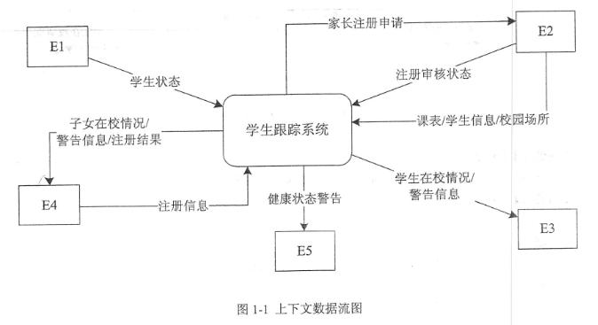
     
    

    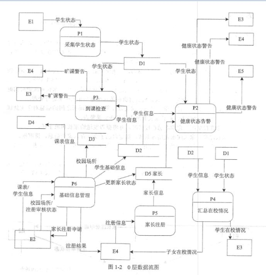
     
    

  
  【问题 1】(5 分)
  
使用说明中的词语，给出图 1-1 中的实体 E1〜E5 的名称。

【问题 2】(4 分)

使用说明中的词语，给出图 1-2 中的数据存储 D1〜D4 的名称。

【问题 3】(3 分)

根据说明和图中术语，补充图 1-2 中缺失的数据流及其起点和终点(三条即可)。

【问题 4】(3 分)

根据说明中的术语，说明图 1-1 中数据流“学生状态”和“学生信息”的组成。

<h4>参考答案</h4>

E1：学生     E2：学校管理人员       E3：班主任 
E4：家长     E5：医护机构健康服务系统  

D1：学生状态记录表         D2：学生信息表 
D3 ：校园场所记录表         D4：课表信息记录  

课表信息      D4   ->   p3到课检查 
校园场所信息    D3->P3到课检查 
家长ID    P6基础信息管理->  D2学生信息表  

学生状态：学生卡ID，学生心率，体温（摄氏度）等健康信息，所在位置 
学生信息：家长ID，学生ID，学生卡ID，班主任等信息

***
#### 试题二
(共 15 分)

阅读下列说明，回答问题 1 至问题 3,将解答填入答题纸的对应栏内。

【说明】 

某创业孵化基地管理若干孵化公司和创业公司，为规范管理创业项目投资业务，需要 开
发一个信息系统。请根据下述需求描述完成该系统的数据库设计。 

【需求描述】

(1)记录孵化公司和创业公司的信息。孵化公司信息包括公司代码、公司名称、法 人代 表名称、注册地址和一个电话;创业公司信息包括公司代码、公司名称和一个电话。 孵化 公司和创业公司的公司代码编码不同。

(2)统一管理孵化公司和创业公司的员工。员工信息包括工号、身份证号、姓名、 性别、 所属公司代码和一个手机号，工号唯一标识每位员工。

(3)记录投资方信息。投资方信息包括投资方编号、投资方名称和一个电话。

(4)投资方和创业公司之间依靠孵化公司牵线建立创业项目合作关系，具体实施由 孵化 公司的一位员工负责协调投资方和创业公司的一个创业项目。一个创业项目只属于一个创业 公司，但可以接受若干投资方的投资。创业项目信息包括项目编号、创业公司代码、 投资 方编号和孵化公司员工工号。

【概念模型设计】 

根据需求阶段收集的信息，设计的实体联系图(不完整)如图 2-1 所示。

    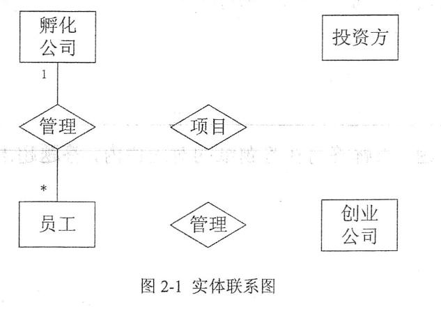
     
    

【逻辑结构设计】 

根据概念模型设计阶段完成的实体联系图，得出如下关系模式(不完整):

孵化公司(公司代码，公司名称，法人代表名称，注册地址，电话) 

创业公司(公司代码，公司名称，电话) 

员工(工号，身份证号，姓名，性别， (a),手机号) 

投资方(投资方编号、投资方名称，电话) 

项目(项目编号，创业公司代码(b)，孵化公司员工号)

【问题 1】(5 分)

根据问题描述，补充图 2-1 的实体联系图。

【问题 2】(4 分) 

补充逻辑结构设计结果中的(a)、(b)两处空缺及完整性约束关系。
 
【问题 3】(6 分) 

若创业项目的信息还需要包括投资额和投资时间，那么:

(1)是否需要增加新的实体来存储投资额和投资时间?

(2)如果增加新的实体，请给出新实体的关系模式，并对图 2-1 进行补充。如果不需要增加新的实体，请将“投资额”和“投资时间”两个属性补充连线到图 2-1 合适的对象上，并对变 化的关系模式进行修改。

<h4>参考答案</h4>

【问题 1】 

    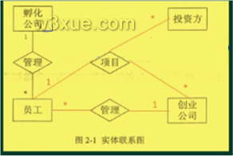
     
    

【问题 2】 
a：所属公司代码   b：投资方编号 
员工-外键：所属公司代码      项目-外键：投资方编号 
项目-主键：（项目编号、投资方编号）组合  

【问题 3】 
不需要 
项目增加投资额、投资时间，如下图： 

    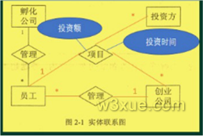
     
    

***
#### 试题三
(共 15 分)

阅读下列说明和图，回答问题 1 至问题 3,将解答填入答题纸的对应栏内。

【说明】

某图书公司欲开发一个基于 Web 的书籍销售系统，为顾客(Customer)提供在线购买书籍
(Books)的功能，同时对公司书籍的库存及销售情况进行管理。系统的主要功能描述如下: 

(1)首次使用系统时，顾客需要在系统中注册(Register detail)。顾客填写注册信息表要求 的信息，包括姓名(name)、收货地址(address)、电子邮箱(email)等，系统将为其生成一个注
册码。

(2)注册成功的顾客可以登录系统在线购买书籍(Buy books)。购买时可以浏览书籍 信息，
包括书名(title)、作者(author)、内容简介(introduction)等。如果某种书籍的库存量为 0，那 么顾客无法查询到该书籍的信息。顾客选择所需购买的书籍及购买数量 (quantities),若购买 数量超过库存量，提示库存不足;若购买数量小于库存量，系统将显示验证界面，要求顾 客输入注册码。注册码验证正确后，自动生成订单(Order),否则， 提示验证错误。如果顾客 需要，可以选择打印订单(Printorder)。

(3)派送人员(Dispatcher)每天早晨从系统中获取当日的派送列表信息(Produce picklist),按 照收货地址派送顾客订购的书籍。

(4)用于销售的书籍由公司的采购人员(Buyer)进行采购(Reorderbooks)。采购人员每天从 系统中获取库存量低于再次订购量的书籍信息，对这些书籍进行再次购买，以保证充足的 库存量。新书籍到货时，采购人员向在线销售目录(Catalog)中添加新的书籍信息(Addbooks)。

(5)采购人员裉据书籍的销售情况，对销量较低的书籍设置折扣或促销活动(Promote books)。

(6)当新书籍到货时，仓库管理员(Warehouseman)接收书籍，更新库存(Update stock)。 现采用面向对象方法开发书籍销售系统，得到如图 3-1 所示的用例图和图 3-2 所示的初始
类图(部分)。
 
 

     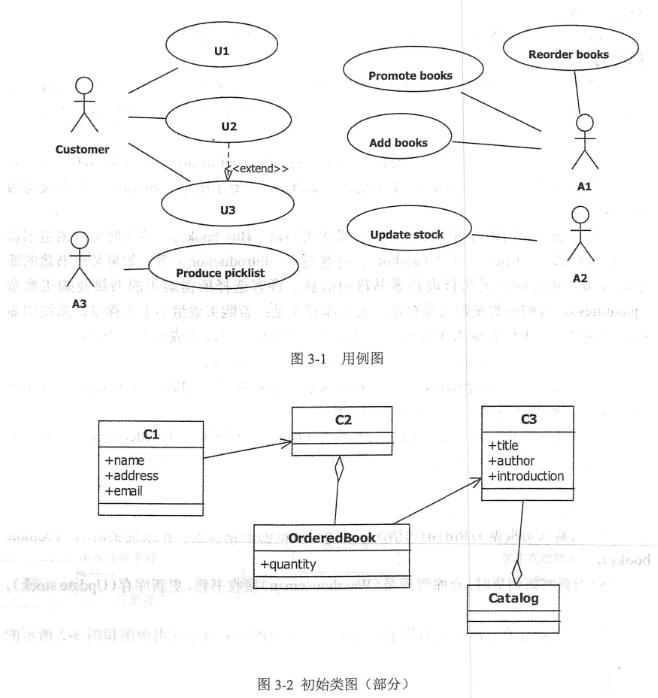
      
     

 

  
【问题 1】(6 分)

根据说明中的描述，给出图 3-1 中 A1〜A3 所对应的参与者名称和 U1〜U3 处所对应 的用
例名称。

【问题 2】(6 分)

根据说明中的描述，给出图 3-1 中用例 U3 的用例描述。(用例描述中必须包括基本事 件 流和所有的备选事件流)。

【问题 3】(3 分)

根据说明中的描述，给出图 3-2 中 C1〜C3 所对应的类名。

<h4>参考答案</h4>

A1：采购人员或Buyer 

A2：仓库管理员或Warehouseman 

A3：派送人员或Dispatcher 

U1：注册或Register  detail 

U2：打印订单 

U3：购买书籍或Buy Books  

参与者：顾客 

主要事件流：1、顾客登录系统；2、顾客浏览书籍信息；3、系统检查某种书籍的库存是否为0；4、顾客选择所需购买的书籍及购买数量；5、系统检查库存量是否足够；6、系统显示验证界面；7、顾客验证；8、系统自动生成订单。 

备选事件流：3a、若库存量为0则无法查询到该书籍信息，退回到2；5a，若购买数量超过库存量，则提示库存不足，并退回到4；7a，若验证错误，则提示验证错误，并退回到6；8a、若顾客需要可选择打印订单  

C1：顾客或Customer      C2：订单或Order     C3：书籍或Books 

***
#### 试题四
(共 15 分)

阅读下列说明和 C 代码，回答问题 1 至 3，将解答写在答题纸的对应栏内

【说明】

n 皇后问题描述为:在一个 nXn 的棋盘上摆放 n 个皇后，要求任意两个皇后不能冲突, 即任意两个皇后不在同一行、同一列或者同一斜线上。

算法的基本思想如下:

将第 i 个皇后摆放在第 i 行，i 从 1 开始，每个皇后都从第 1 列开始尝试。尝试时判断 在
该列摆放皇后是否与前面的皇后有冲突，如果没有冲突，则在该列摆放皇后，并考虑摆 放 下一个皇后;如果有冲突，则考虑下一列。如果该行没有合适的位置，回溯到上一个皇后 考虑在原来位置的下一个位置上继续尝试摆放皇后，......，直到找到所有合理摆放方案。 

【C 代码】

下面是算法的 C 语言实现。

(1)常量和变量说明
 
 

     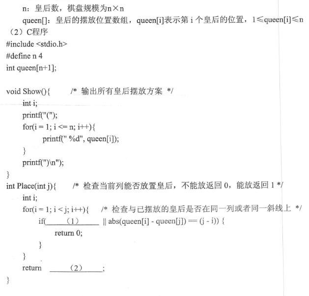
      
     

 

 

     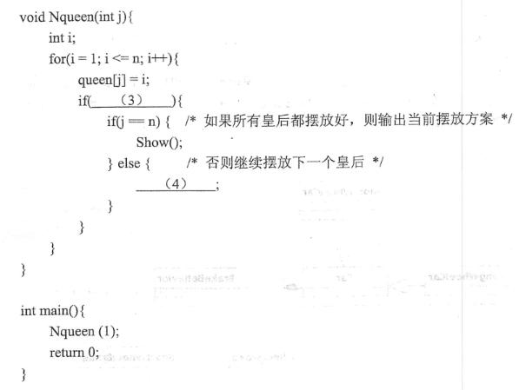
      
     

 

 
【问题 1】(8 分)
  
根据题干说明，填充 C 代码中的空(1)〜(4)。

【问题 2】(3 分)

根据题干说明和 C 代码，算法采用的设计策略为 (5)

【问题 3】(4 分)

当 n=4 时，有 (6) 种摆放方式，分别为 (7) 。

<h4>参考答案</h4>

【问题 1】 
(1) queen[i]==queen[j] 或其等价形式 

(2)1 

(3) Place(j) && j<=n或其等价形式 

(4) Nqueen(j+1)  

【问题 2】 
回溯法  

【问题 3】 
2 

分别为：2413   3142

***
**【试题五和试题六中任选 1 题解答。若解答超过 1 题，则题号小的 1 题解答有效。】** 
#### 试题五
(共 15 分)

阅读下列说明和 Java 代码，将应填入(n)处的字句写在答题纸的对应栏内。 

【说明】

某软件公司欲开发一款汽车竞速类游戏，需要模拟长轮胎和短轮胎急刹车时在路面上 留 下的不同痕迹，并考虑后续能模拟更多种轮胎急刹车时的痕迹。现采用策略(Strategy) 设 计模式来实现该需求，所设计的类图如图 5-1 所示。

    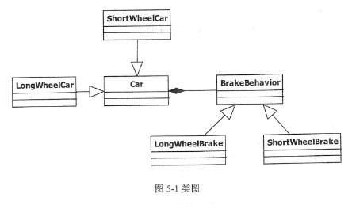
     
    

    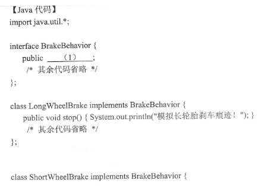
     
    

    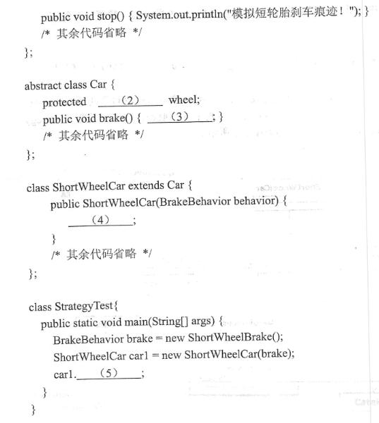
     
    

<h4>参考答案</h4>

Java： 

(1)void stop() 

(2)BrakeBehavior 

(3)wheel.stop() 

(4)this.wheel=behavior 

(5)break() 

