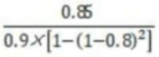

# 2019下半年软件设计师考试真题-上午卷

<h4><font color=orange>【答题/学习模式】将<code>README.md</code>中的<code>display</code>属性全部设置为<code>none/inline</code></font></h4>

## 索引
||||||
|:|:|:|:|:|
| [1、高速缓冲存储器](#1、) | [2、系统的可靠性](#2、) | [3、程序中断方式](#3、) | [4、字节编址](#4、) | [5、执行指令](#5、) |
| [6、电子邮箱服务](#6、) | [7、公开密钥加密算法](#7、) | [8、防止重放攻击](#8、) | [9、数字证书](#9、) | [10、软件的权利归属](#10、) |
| [11、软件的著作权](#11、) | [12、数据流图](#12、) | [13、软件设计原则](#13、) | [14、内聚类型](#14、) | [15、活动图](#15、) |
| [16、软件风险](#16、) | [17、编译器的工作过程](#17、) | [18、后缀式（逆波兰式）](#18、) | [19、前趋图](#19、) | [20、I/O软件](#20、) |
| [21、磁盘调度管理](#21、) | [22、系统的响应序列](#22、) | [23、敏捷开发方法scrum](#23、) | [24、CMM](#24、) | [25、 ISO/IEC软件质量模型](#25、) |
| [26、MVC（模型-视图-控制器）体系结构](#26、) | [27、文档撰写](#27、) | [28、白盒测试](#28、) | [29、软件维护](#29、) | [30、成员变量和成员函数](#30、) |
| [31、面向对象方法](#31、) | [32、面向对象系统设计](#32、) | [33、运行时](#33、) | [34、UML状态图](#34、) | [35、UML图](#35、) | 
| [36、设计模式](#36、) | [37、传递依赖](#37、) | [38、关系代数表达式](#38、) | [39、事务的ACID](#39、) | [40、n阶的对称矩阵](#40、) |
| [41、二叉树的后序遍历序列](#41、) | [42、叶子结点的个数](#42、) | [43、有向图](#43、) |[44、排序算法](#44、) | [45、贪心算法](#45、) |
| [46、霍夫曼编码](#46、) | [47、TCP/IP网络](#47、) | [48、IPV6](#48、) | [49、无线通信技术](#49、) | [50、邮件传输](#50、) |
| [51、sevver-side enterprise application](#51、) |
***
考试时间：150分钟

考试总分：75分（45分及格）

**遵守考场纪律，维护知识尊严，杜绝违纪行为，确保考试结果公正。**

单选题(共 75 题,共 75 分)
***
#### 1、
在CPU内外常设置多级高速缓存（Cache），其主要目的是（ ）。

A.扩大主存的存储容量

B.提高CPU访问主存数据或指令的效率

C.扩大存储系统的容量

D.提高CPU访问外存储器的速度

<div style="display: inline;">
<h4>答案</h4>
B
<h4>解析</h4>
由于在CPU与存储系统之间存在着数据传送带宽的限制，因此在其中设置了Cache（高速缓冲存储器，简称高速缓存，通常速度比内存快），以提高整体效率。但由于其成本更高，因此Cache的容量要比内存小得多。
<br>
缓存主要用于缓和CPU和主存速率不匹配的矛盾，是常考知识点
</div>

#### 2、
某系统的可靠性结构框图如下图所示，假设部件1、2、3的可靠度分别为0.90；0.80；0.80（部件2、3为冗余系统）若要求该系统的可靠度不小于0.85，则进行系统设计时，部件4的可靠度至少应为（ ）。


A、

B、

C、

D、

<div style="display: inline;">
<h4>答案</h4>
A
<h4>解析</h4>
设部件4的可靠性为x，根据图示，系统整体可靠性 <code>0.9×[1-(1-0.8)2]×x</code>，要求其不小于0.85，即
<code>0.9×[1-(1-0.8)2]×x≥0.85</code>，可以得到
<center>
    
    <br>
    <div style="color:orange; border-bottom: 1px solid #d9d9d9;
    display: inline-block;
    color: #999;
    padding: 2px;"></div>
</center>
</div>

#### 3、
计算机运行过程中，进行中断处理时需保存现场，其目的是（ ）。

A、防止丢失中断处理程序的数据

B、防止对其他程序的数据造成破坏

C、能正确返回到被中断的程序继续执行

D、能为中断处理程序提供所需的数据

<div style="display: inline;">
<h4>答案</h4>
C
<h4>解析</h4>
程序中断方式：某一外设的数据准备就绪后，它“主动”向CPU发出中断请求信号，请求CPU暂时中断目前正在执行的程序转而进行数据交换；当CPU响应这个中断时，便暂停运行主程序，自动转去执行该设备的中断服务程序；当中断服务程序执行完毕（数据交换结束）后，CPU又回到原来的主程序继续执行。
<br><br>
中断是指计算机在执行期间，系统内发生任何非寻常的或非预期的急需处理事件，使得CPU暂时中断当前正在执行的程序而转去执行相应的事件处理程序，待处理完毕后又返回原来被中断处继续执行的过程
</div>

#### 4、
内存按字节编址，地址从A0000H到CFFFFH的内存，共存（ ）字节，若用存储容量为64k*8bit的存储器芯片构成该内存空间，至少需要（ ）片。

A、80k

B、96 k

C、160 k

D、192 k

A、2

B、3

C、5

D、8
<div style="display: inline;">
<h4>答案</h4>
第1题:D
第2题:B
<h4>解析</h4>
<strong>
B(Binary):二进制<br>
D(Decimal):十进制(默认不写)<br>
O(Octal):八进制<br>
H(Hexadecimal):十六进制<br>
</strong>
<br>
地址从A0000H到CFFFFH，存储单元个数共有CFFFFH+1-A0000H=30000H，即<br>
(3×2^4)^(2^4)=3x(2^16)个；按字节编址，即每个存储单元存放1个字节，也就是1B；<br>
该存储区域总容量=存储单元个数×存储单元内容=3x(2^16)=3x(2^6)x(2^10)=3x64KB=192KB。
<br><br>
若用存储容量为64K×8bit的存储芯片构成，即单位芯片容量为64K×8bit，总容量=单位芯片容量×片数，即片数=总容量/单位芯片容量<br>
=(192KB/64K)*(8bit/8bit)=3。
<br><br>
<p style="font-style:italic">
某计算机内存按字节编址,内存地址区域从44000H到6BFFFH,共有多少KB?<br>
若采用16K*4b的SRAM芯片,构成核内存区域共需多少片？</p>
6BFFFH-44000H+1=6BFFFH+1-44000H=6C000H-44000H=28000H<br>
=(28000B)^(2^4)=2*2^(4x4)+8*2^(3x4)=160*2^10=160*1024=160K<br>
按字节编址，即每个存储单元存放1个字节，也就是1Byte,故总容量为160KB<br>
<strong>1Bytes（字节）=8bit（比特）</strong><br>
按字位扩展，需要：(160K/16K)*(8/4)=20片<br>
<br>
<strong>Byte和bit区别</strong><br><br>
1、容量大小不同<br>
一个byte由8 bits组成，是数据存储的基础单位，1byte又称为一个字节，用一个字节（Byte)储存，可区别256个数字。bit(比特）是表示信息的最小单位，是二进制数的一位包含的信息或2个选项中特别指定1个的需要信息量。<br>
<br>
2、存储数据类型不同<br>
一个byte由8bits所组成，可代表一个字元（A~Z)、数字（0~9)、或符号（，．?!%&+-*/)，是记忆体储存资料的基本单位，至於每个中文字则须要两bytes。bit是电脑记忆体中最小的单位，在二进位电脑系统中，每一bit可以代表0或1的数位讯号。<br>
<br>
3、用途不同<br>
Bit意为＂位＂或＂比特＂，是计算机运算的基础单位；Byte意为＂字节＂，是计算机文件大小的基本计算单位。
</div>

#### 5、
<p>执行指令时，将每一节指令都分解为取指、分析和执行三步。已知取指时间t<sub>取指</sub>=5△t，分析时间t<sub>分析</sub>= 2△t，执行时间t<sub>执行</sub>= 3△t如果按照[执行]<sub>k</sub>，[分析]<sub>k+1</sub>，[取指]<sub>k+2</sub>重叠的流水线方式执行指令，从头到尾执行完500条指令需（ ）△t。</p>

A、2500

B、2505

C、2510

D、2515
<div style="display: inline;">
<h4>答案</h4>
B
<h4>解析</h4>
流水线执行时间=流水线建立时间+（n-1）×流水线周期=5+2+3+（500-1）×5=2505△t。
</div>

#### 6、
下列协议中，与电子邮箱服务的安全性无关的是（ ）

A、SSL

B、HTTPS

C、MIME

D、PGP
<div style="display: inline;">
<h4>答案</h4>
<p>C</p>
<h4>解析</h4>
<p>
MIME它是一个多用途互联网邮件扩展类型的标准，扩展了电子邮件标准，使其能够支持多媒体信息传输，与安全无关。与安全电子邮件相关的是S/MIME安全多用途互联网邮件扩展协议。

A选项SSL和B选项HTTPS涉及到邮件传输过程的安全，D选项PGP（全称：Pretty Good Privacy，优良保密协议），是一套用于信息加密、验证的应用程序，可用于加密电子邮件内容。
</p>
</div>

#### 7、
下列算法中，不属于公开密钥加密算法的是（ ）。

A、ECC

B、DSA

C、RSA

D、DES
<div style="display: inline;">
<h4>答案</h4>
<p>D</p>
<h4>解析</h4>
<p>
公开密钥加密也称为非对称密钥加密。该加密算法使用两个不同的密钥，加密密钥和解密密钥。前者公开，又称公开密钥，简称公钥。后者保密，又称私有密钥，简称私钥。这两个密钥是数学相关的，用某用户加密密钥加密后所得的信息只能用该用户的解密密钥才能解密。公钥加密的另一用途是身份验证：用私钥加密的信息，可以用公钥对其解密，接收者由此可知这条信息确实来自于拥有私钥的某人。公钥的形式就是数字证书。

非对称密钥加密算法有RSA、Elgamal、背包算法、Rabin、D-H、DSA、ECC（椭圆曲线加密算法）。
</p>
</div>

#### 8、
kerberos系统中可通过在报文中加入（ ）来防止重放攻击。

A、会话密钥

B、时间戳

C、用户ID

D、私有密钥
<div style="display: inline;">
<h4>答案</h4>
B
<h4>解析</h4>
防止重放攻击可通过加时间戳方式实现。
<br>
在网络安全中，防重放攻击的方案基本是添加时间戳
</div>

#### 9、
某电子商务网站向CA申请了数字证书，用户可以通过使用（ ）验证（ ）的真伪来确定该网站的合法性。

A、CA的公钥

B、CA的签名

C、网站的公钥

D、网站的私钥

A、CA的公钥

B、CA的签名

C、网站的公钥

D、网站的私钥
<div style="display: inline;">
<h4>答案</h4>
第1题:A
第2题:B
<h4>解析</h4>
本题考查数字证书相关知识点。
<br>
数字证书是由权威机构——CA证书授权（Certificate Authority）中心发行的，能提供在Internet上进行身份验证的一种权威性电子文档，人们可以在因特网交往中用它来证明自己的身份和识别对方的身份。
数字证书包含版本、序列号、签名算法标识符、签发人姓名、有效期、主体名和主体公钥信息等并附有CA的签名，用户获取网站的数字证书后通过CA的公钥验证CA的签名，从而确认数字证书的有效性，然后验证网站的真伪。
</div>

####10、
李某受非任职单位委托，利用该单位实验室实验材料和技术资料开发了一项软件产品，对该软件的权利归属，表达正确的是（ ）。

A、该软件属于委托单位

B、若该单位与李某对软件的归属有特别的约定，则遵从约定；无约定的原则上归属于李某

C、取决于该软件是否属于单位分派给李某的

D、无论李某与该单位有无特别约定，该软件属于李某
<div style="display: inline;">
<h4>答案</h4>
B
<h4>解析</h4>
根据题干描述，这里不能排除职务作品，对于A选项和B选项来看，B选项更严谨，因此，本题选择B选项
</div>

####11、
李工是某软件公司的软件设计师，每当软件开发完成均按公司规定申请软件著作权，该软件的著作权（ ）。

A、应由李工享有

B、应由公司和李工共同享有

C、应由公司享有

D、除署名权以外，著作权的其他权利由李工享有
<div style="display: inline;">
<h4>答案</h4>
C
<h4>解析</h4>
李某属于软件开发者，拥有署名权，其他著作权归属单位。
<br>
在著作权法中规定，著作权包括人身权和财产权，共计17项，人身权包括发表权、署名权、修改权和保护作品完整权；财产权包括复制权、发行权、出租权、展览权、表演权、放映权、广播权、信息网络传播权、摄制权、改编权、翻译权、汇编权和应当由著作权人享有的其他权利。
<br>
考试中通常考察著作权中的署名权
</div>

####12、
某考试系统的部分功能描述如下，审核考生报名表，通过审核的考生登录系统，系统自动为其生成一套试题，考试中心提供标准答案，问卷老师问卷，提交考生成绩，考生查看自己的成绩。若用数据流图对该系统进行建模，则（ ）不是外部实体。.

A、考生

B、考试中心

C、问卷老师

D、试题
<div style="display: inline;">
<h4>答案</h4>
D
<h4>解析</h4>
外部实体一般为组织机构、人员、第三方系统，D选项不是外部实体
</div>

####13、
以下关于软件设计原则的叙述中，不正确的是（ ）

A、系统需要划分多个模块，模块的规模越小越好

B、考虑信息隐蔽，模块内部的数据不能让其他模块直接访问模块独立性要好

C、尽可能高内聚和低耦合

D、采用过程抽象和数据抽象设计
<div style="display: inline;">
<h4>答案</h4>
A
<h4>解析</h4>
对于软件设计过程中，需要遵循高内聚、低耦合，模块大小适中，因此A选项描述不正确，本题选择A选项。B、C、D的描述都是正确的。
</div>

####14、
某模块中各个处理元素都密切相关于同一功能且必须顺序执行，前一处理元素的输出就是下一处理元素的输入，则该模块的内聚类型为（ ）内聚

A、过程

B、时间

C、顺序

D、逻辑
<div style="display: inline;">
<h4>答案</h4>
C
<h4>解析</h4>
A选项过程内聚。如果一个模块内部的处理成分是相关的，而且这些处理必须以特定的次序执行，则称为过程内聚。
<br>
B选项时间内聚。如果一个模块完成的功能必须在同一时间内执行（如系统初始化），但这些功能只是因为时间因素关联在一起，则称为时间内聚。
<br>
C选项顺序内聚。如果一个模块的各个成分和同一个功能密切相关，而且一个成分的输出作为另一个成分的输入，则称为顺序内聚。本题描述的是C选项。
<br>
D选项逻辑内聚。几个逻辑上相关的功能被放在同一模块中，则称为逻辑内聚。如一个模块读取各种不同类型外设的输入。尽管逻辑内聚比偶然内聚合理一些，但逻辑内聚的模块各成分在功能上并无关系，即使局部功能的修改有时也会影响全局，因此这类模块的修改也比较困难。
</div>

#### 15、
下图是一个软件项目的活动图，其中顶点表示项目里程碑，连接顶点的边表示包含的活动。边上的权重表示活动的持续时间（天），则里程碑（ ）不在关键路径上。在其他活动都按时完成的情况下，活动BE最多可以晚 （ ） 天开始而不影响工期。


A、B

B、C

C、D

D、J

A、0

B、1

C、2

D、3
<div style="display: inline;">
<h4>答案</h4>
第1题:B
第2题:C
<h4>解析</h4>
本题考查知识内容为进度管理-单代号网络图，其中结点表示里程碑，边表示活动，在边上标注各活动的最早开始时间、活动持续时间、最早完成时间，然后从后往前推导出ABEHJL路径上各活动的最晚开始时间、总时差、最晚完成时间如下图：
<center>
    
    <br>
    <div style="color:orange; border-bottom: 1px solid #d9d9d9;
    display: inline-block;
    color: #999;
    padding: 2px;"></div>
</center>
根据提示，该项目有两条关键路径，分别为：ABFJL，ADGIJL，其中B、D、J活动都在关键路径上，C活动不在，第一空选择B选项。
<br>
BE活动总时差为2天，即EB活动最多可以晚2天开始而不影响工期，第二空选择C选项。
</div>

####16、
以下关于软件风险的叙述中，不正确的是（ ）

A、风险是可能发生的事件

B、如果发生风险，风险的本质、范围和时间可能会影响风险所产生的后果

C、如果风险可以预测，可以避免其发生

D、可以对风险进行控制
<div style="display: inline;">
<h4>答案</h4>
C
<h4>解析</h4>
一般认为软件风险包含两个特性：不确定性和损失，不确定性即指风险可能发生也可能不发生，A选项正确。
<br>
评估风险的影响，如果风险真的发生，有3个因素可能会影响风险所产生的后果，即风险的本质、范围和时间，B选项正确。
<br>
如果风险可以预测，可以避免其发生，有些风险可以预测但无法避免，C选项错误。
<br>
风险控制的目的是辅助项目组建立处理风险的策略，D选项正确。
</div>

####17、
编译器的工作过程划分为词法分析，语法分析，语义分析，中间代码生成，代码优化和目标代码生成。<br>
语法分析阶段的输入是（ ）若程序中的括号不配对，则会在（ ）阶段检查出错误。

A、记号流

B、字符流

C、源程序

D、分析树

A、词法分析

B、语法分析

C、语义分析

D、目标代码生成
<div style="display: inline;">
<h4>答案</h4>
第1题:A
第2题:B
<h4>解析</h4>
A选项记号流，词法分析的输出是记号流，也就是语法分析的输入，第一空选择A选项。
<br>
B选项字符流，在Java中，根据处理的数据单位不同，分为字节流和字符流。字符流是由字符组成的，例如 File Reader、File Writer、Buffered Reader、Buffered Writer、Input Stream Reader、Output Stream Writer 等。与本题无关。
<br>
C选项源程序，词法分析的任务是把源程序的字符串转换成单词符号序列。
<br>
D选项分析树，如果没有语法错误，语法分析后就能正确的构造出其语法树。
<br>
括号不匹配是典型的语法错误，会在语法分析阶段检测出来。
<br><br>
<p>
<strong>编译器的工作过程<strong>划分为：词法分析、语法分析、语义分析、中间代码生成、代码优化和目标代码生成。
<br><br>
词法分析器的任务是把源文件的字符流转换成记号流；语法分析器根据语法规则识别出记号流中的结构（短语、句子），并构造一棵能够正确反映该结构的语法树；语法分析主要检查句子的结构是否符合语法规则，“程序中的括号不配对”属于语法错误。
<br><br>
在语法分析阶段，语法分析器以单词符号作为输入，分析单词符号是否形成符合语法规则的语法单位，如表达式、赋值、循环等，按语法规则分析检查每条语句是否有正确的逻辑结构。
<br><br>
在编译方式下，编译过程生成的是与源程序等价的目标代码，源程序和编译程序都不再参与目标程序的执行过程；而在解释过程生成的不是源程序的目标程序，而是中间代码。
</p>
</div>

####18、
表达式（a-b）*（c+d）的后缀式（逆波兰式）是（ ）

A、abcd-+*

B、ab-c+d*

C、abc-d/-*

D、ab-cd+*
<div style="display: inline;">
<h4>答案</h4>
D
<h4>解析</h4>
根据表达式（a-b）*（c+d），可以构造出语法树如下：
<center>
    
    <br>
    <div style="color:orange; border-bottom: 1px solid #d9d9d9;
    display: inline-block;
    color: #999;
    padding: 2px;"></div>
</center>
其后续遍历即其后缀表达式（逆波兰式）为 `ab-cd+*`，选择D选项。
</div>

####19、
进程p1、p2、p3、p4和p5的前趋图如下所示：


若用PV操作控制这5个进程的同步与互斥的程序如下，那么程序中的空①和空②处应分别为（ ）；空③和空④处应分别为（ ）；空⑤和空⑥处应分别为（ ）


A、V（S1）和P（S2）P（S3）

B、P（S1）和V（S1）V（S2）

C、V（S1）和V（S2）V（S3）

D、P（S1）和V（S1）P（S2）

A、V（S4）V（S5）和P（S3）

B、V（S3）V（S4）和V（S5）

C、P（S4）P（S5）和V（S5）

D、P（S4）P（S5）和V（S4）

A、P（S6）和P（S5）V（S6）

B、V（S5）和V（S5）V（S6）

C、P（S6）和P（S5）P（S6）

D、V（S6）和P（S5）P（S6）
<div style="display: inline;">
<h4>答案</h4>
第1题:C
第2题:A
第3题:D
<h4>解析</h4>
本题是典型的PV操作与前趋图结合考查题型。
<br>
前趋图中，进程存在明确的前趋和后继关系。前趋进程完成后以V()操作通知后继进程。后继进程开始前需要以P()操作检查前趋进程是否已完成。
也可以直接在图示中进行标注，结点间的→表示二者关系，箭头流出的结点是前趋进程，结束后也就是箭头流出位置，标注为V()操作以通知后继进程；箭头流入的结点是后继进程，开始前也就是箭头流入的位置，标注为P()操作以检查前趋进程。
<br>
此时：
<br>
P1没有前趋，有1个后继，P1执行后需要1个V()操作通知后继进程，即①填写V()操作；
<br>
P2有1个前趋，有2个后继，P2执行前需要有1个P()操作检查前趋，P2执行后需要2个V()操作通知后继进程，即②填写2个V()操作。
<br>
因此第一空，选择C选项，即满足3个V操作。不需要区别信号量。
<br>
P3有1个前趋，有2个后继，P3执行前需要有1个P()操作检查前趋，P3执行后需要2个V()操作通知后继进程，即③填写2个V()操作。 
<br>
P4有2个前趋，有1个后继，P4执行前需要有2个P()操作检查前趋，④缺少1个P()操作，P4执行后需要1个V()操作通知后继进程，即⑤填写1个V()操作。
<br>
P5有2个前趋，没有后继，P5执行前需要有2个P()操作检查前趋，即⑥填写2个P()操作。  
<br>
因此第二空，选择A选项，即满足2个V操作1个P操作。不需要区别信号量。  第三空，选择D选项，即满足1个V操作2个P操作。不需要区别信号量。  
</div>

####20、
以下关于I/O软件的叙述中，正确的是（ ）

A、I/O软件开放了I/O操作实现的细节，方便用户使用I/O设备

B、I/O软件隐藏了I/O操作实现的细节，向用户提供物理接口

C、I/O软件隐藏了I/O操作实现的细节，方便用户使用I/O设备

D、I/O软件开放了I/O操作实现的细节，用户可以使用逻辑地址访问I/O设备
<div style="display: inline;">
<h4>答案</h4>
C
<h4>解析</h4>
I/O软件隐藏了I/O操作实现的细节，所以A选项和D选项错误。I/O软件向用户提供的是逻辑接口，B选项错误。I/O软件将硬件与较高层次的软件隔离开来，而最高层软件向应用提供一个友好的、清晰且统一的接口，方便用户使用，所以C选项正确。
</div>

####21、
在磁盘调度管理中通常（ ）

A、先进行旋转调度，再进行移臂调度

B、在访问不同柱面的信息时，只需要进行旋转调度

C、先进行移臂调度，再进行旋转调度

D、在访问不同磁盘的信息时，只需要进行移臂调度
<div style="display: inline;">
<h4>答案</h4>
C
<h4>解析</h4>
磁盘调度管理中，先进行移臂调度寻找磁道，再进行旋转调度寻找扇区。
</div>

####22、
假设磁盘臂位于15号柱面上，进程的请求序列如下表表示，如果采用最短移臂调度算法，那么系统的响应序列应为（ ）


A、①②③④⑤⑥

B、⑤①②④③⑥

C、②③④⑤①⑥

D、④②③⑤①⑥
<div style="display: inline;">
<h4>答案</h4>
B
<h4>解析</h4>
最短移臂调度算法，即优先响应距离较近磁道的申请。
<br>
<code>1、当前磁头位于15号柱面（柱面号即磁道编号），请求序列分别位于12号柱面（①⑤）、19号柱面（②④）、23号柱面（③）、28号柱面（⑥）；</code>
<br>
<code>2、距离15号柱面最近的应该是12号柱面（①⑤），优先响应（①⑤），次序不限；</code>
<br>
<code>3、此时磁头位于12号柱面，距离最近的应该是19号柱面（②④），次序不限；</code>
<br>
<code>4、此时磁头位于19号柱面，距离最近的应该是23号柱面（③）；</code>
<br>
<code>5、此时磁头位于23号柱面，距离最近的应该是28号柱面（⑥）。</code>
<br>
满足要求的只有B选项。
</div>

####23、
敏捷开发方法scrum的步骤不包括（ ）

A、Product Backlog

B、Refactoring

C、Sprint Backlog

D、Sprint
<div style="display: inline;">
<h4>答案</h4>
B
<h4>解析</h4>
A选项Product Backlog 产品待办事项清单；B选项Refactoring 重构，不属于Scrum的步骤；C选项Sprint Backlog，Sprint待办事项清单；D选项 Sprint，冲刺迭代。
</div>

####24、
以下关于CMM的叙述中，不正确的是（ ）

A、CMM是指软件过程能力成熟度模型

B、CMM根据软件过程的不同成熟度划分了5个等级，其中，1级被认为成熟度最高，5级被认为成熟度最低

C、CMMI的任务是将已有的几个CMM模型结合在一起，使之构成"集成模型"

D、采用更成熟的CMM模型，一般来说可以提高最终产品的质量
<div style="display: inline;">
<h4>答案</h4>
B
<h4>解析</h4>
CMM（Capability Maturity Model）是能力成熟度模型的缩写，CMM是国际公认的对软件公司进行成熟度等级认证的重要标准。CMM共分五级。在每一级中，定义了达到该级过程管理水平所应解决的关键问题和关键过程。每一较低级别是达到较高级别的基础。其中五级是最高级，即优化级，达到该级的软件公司过程可自发地不断改进，防止同类问题二次出现；四级称为已管理级，达到该级的软件公司已实现过程的定量化；三级为已定义级，即过程实现标准化；二级为可重复级，达到该级的软件公司过程已制度化，有纪律，可重复；一级为初始级，过程无序，进度、预算、功能和质量等方面不可预测。
</div>

####25、
ISO/IEC软件质量模型中，易使用性是指与使用所需的努力由一组规定或隐含的用户对这样使用所作的个别评价有关的一组属性，其易使用性的子特性不包括（ ）。

A、易理解性

B、易学性

C、易分析性

D、易操作性
<div style="display: inline;">
<h4>答案</h4>
C
<h4>解析</h4>
易用性的自特性包括易理解性、易学性、易操作性，其中C选项易分析性属于可维护性的子特性。
</div>

####26、
（ ）不是采用MVC（模型-视图-控制器）体系结构进行软件系统开发的优点

A、有利于代码重用

B、提高系统的运行效率

C、提高系统的开发效率

D、提高系统的可维护性
<div style="display: inline;">
<h4>答案</h4>
B
<h4>解析</h4>
MVC是分层架构风格的一种，采用关注点分离的方针，将可视化界面呈现（View）、UI处理逻辑（Controller）和业务逻辑（Model）三者分离出来，并且利用合理的交互方针将它们之间的依赖降至最低。解耦之后，有利于代码重用、提高系统的可维护性，也可提高系统的开发效率，但是由于分层之后，调用也需要分层调用，所以不能提高系统的运行效率。
</div>

####27、
以下关于各类文档撰写阶段的叙述中，不正确的是（ ）

A、软件需求规格说明书在需求分析阶段撰写

B、概要设计规格说明书在设计阶段撰写

C、测试设计必须在测试阶段撰写

D、测试分析报告在测试阶段撰写
<div style="display: inline;">
<h4>答案</h4>
C
<h4>解析</h4>
测试过程基本上与开发过程平行进行，在需求分析阶段，就需要对验收测试、系统测试设计相关测试，撰写相关测试设计文档。C选项描述错误，其他选项的说法是正确的。
</div>

####28、
下图用白盒测试方法进行测试，图中有（ ）条路径采用McCabe度量计算该程序图的环路复杂性为（ ）


A、3

B、4

C、5

D、6

A、3

B、4

C、5

D、6
<div style="display: inline;">
<h4>答案</h4>
第1题:B
第2题:B
<h4>解析</h4>
将所有结点标注序号，根据图示，可以找到不同的路径共4条：1-2-3-11；1-2-3-4-5-6-10-11；1-2-3-4-5-7-9-10-11；1-2-3-4-5-7-8-9-10-11。第一空选择B选项。

根据环路复杂度计算公式V（G）=M-N+2=13-11+2=4，第二空选择B选项。


</div>

####29、
以下关于软件维护的叙述中，不正确的是（ ）

A、软件维护解决软件产品交付用户之后进行中发生的各种问题

B、软件维护期通常比开发期长得多，投入也大得多

C、软件可维护性是软件开发阶段各个时期的关键目标

D、相对于软件开发任务而言，软件维护工作要简单得多
<div style="display: inline;">
<h4>答案</h4>
D
<h4>解析</h4>
软件维护是软件生命周期最长的一段，相对于软件开发任务而言，软件维护工作要更加复杂，D选项描述不正确。
</div>

####30、
一个类中成员变量和成员函数有时也可以分别被称为（ ）

A、属性和活动

B、值和方法

C、数据和活动

D、属性和方法
<div style="display: inline;">
<h4>答案</h4>
D
<h4>解析</h4>
类的成员变量即对应属性，成员函数即对应方法。
</div>

####31、
采用面向对象方法进行系统开发时，需要对两者之间关系会建新类的是（ ）

A、汽车和座位

B、主人和宠物

C、医生和病人

D、部门和员工
<div style="display: inline;">
<h4>答案</h4>
C
<h4>解析</h4>
这里可以参照E-R图中的联系转换，多对多联系需要单独转换为一个关系模式，也需要重新建类。
</div>

####32、
进行面向对象系统设计时，软件实体（类、模块、函数等）应该是可以扩展但不可修改的，这属于（ ）设计原则。

A、共同重用

B、开放封闭

C、接口分离

D、共同封闭
<div style="display: inline;">
<h4>答案</h4>
B
<h4>解析</h4>
题干描述的是开闭原则。
</div>

####33、
（ ）绑定是指在运行时把过程调用和响应调用所需要执行的代码加以结合。

A、动态

B、过载

C、静态

D、参数
<div style="display: inline;">
<h4>答案</h4>
A
<h4>解析</h4>
本题考查面向对象中的动态绑定机制，其内涵是需要进行过程、方法或函数的调用时，在不同的情况下所执行的代码可能不同。典型的实例就是面向对象语言中的函数或方法的重载。
</div>

####34、
以下关于UML状态图的叙述中，不正确的是（ ）

A、活动可以在状态内执行，也可以在迁移时执行

B、若事件触发一个没有特定监护条件的迁移，则对象离开当前状态

C、迁移可以包含事件触发器，监护条件和状态

D、事件触发迁移
<div style="display: inline;">
<h4>答案</h4>
C
<h4>解析</h4>
状态图展现了一个状态机，它由状态、转换、事件和活动组成，通常包括简单状态和组合状态、转换（事件和动作）。
由于状态可以是单一的，也可以是嵌套的（嵌套在另一个状态中的状态称为子状态，含有子状态的状态称为组合状态），所以活动可以在状态内执行，也可以在状态迁移时执行，A选项说法是正确的。
转换（迁移）是两个状态之间的一种关系，表示对象将在源状态执行一定的事件或动作，并在某个特定事件发生而且某个特定的监护条件满足时离开当前状态而进入目标状态，事件触发没有特定监护条件的迁移，对象也会离开当前状态，B选项正确。
转换（迁移）是从源状态和目的状态之间的一种关系，可以包含触发事件、监护条件、状态（源状态和目的状态）、动作，C选项说法不准确，本题选择C选项。
当某个事件发生后，对象的状态将发生变化，事件可以触发迁移，D选项说法是正确的。
</div>

####35、
下图所示UML图为（ ），有关该图的叙述中，不正确的是（ ）


A、对象图

B、类图

C、组件图

D、部署图

A、如果B的一个实例被删除，所有包含A的实例都被删除

B、A的一个实例可以与B的一个实例关联.

C、B的一个实例被唯一的一个A的实例所包含

D、B的一个实例可与B的另外两个实例关联
<div style="display: inline;">
<h4>答案</h4>
第1题:B
第2题:A
<h4>解析</h4>
根据图示，本题UML为类图。注意：对象图的对象名会有：标识，并且对象图的关联关系一般不会出现多重度。因此第一空选择B选项。

根据图示，B依赖于A，也就是说，A发生变化会影响B，但是反过来，当B的一个实例被删除，不会影响A的实例。
</div>

####36、
欲开发一个绘图软件，要求使用不同的绘图程序绘制不同的图形，该绘图软件的扩展性要求将不断扩充新的图形和新的绘图程序，以绘制直线和图形为例，得到如下图所示的类图，该设计采用（ ）模式将抽象部分与其实现部分分离，使它们都可以独立的变化。其中 （ ） 定义了实现类接口，该模式适用于 （ ） 的情况，该模式属于 （ ） 模式。


A、适配器（ adapten）

B、装饰（Decorator）

C、桥接（Bridge）

D、组合（ composite ）

A、Shape

B、Circle和Rectangle

C、V1Drawing和V2Drawing

D、Drawing

A、不希望在抽象和它的实现部分之间有一个固定判定关系

B、想表示对象的部分-整体层次结构.

C、想使用一个已经存在的类，而它的接口不符合要求

D、在不影响其他对象的情况下，以动态透明的方式给单个对象添加职责

A、创建型对象

B、结构型对象

C、行为型对象

D、结构型类
<div style="display: inline;">
<h4>答案</h4>
第1题:C
第2题:D
第3题:A
第4题:B
<h4>解析</h4>
根据题干描述，该设计模式将抽象部分与其实现部分分离，使它们都可以独立的变化，指的是桥接模式，第一空选择C选项。

桥接模式是结构型对象模式，所以第四空选择B选项。

第三空，B选项描述的是组合模式，C选项描述的是适配器模式，D选项描述的是装饰模式，A选项描述的是桥接模式，本空选择A选项。

本题难度最大的是第二空，根据桥接模式的结构，实现类接口，定义实现类的接口，这个接口不一定要与抽象类的接口完全一致，事实上这两个接口可以完全不同，一般的讲实现类接口仅仅给出基本操作，而抽象类接口则会给出很多更复杂的操作。本题仅仅给出基本操作的是Drawing，第二空选择D选项。
</div>

####37、
给定关系R（U，Fr）其中属性属U={A，B，C，D}，函数依赖集Fr={A→BC，B→D}关系S（U，Fs），其中属性集U={ACE}，函数依赖集Fs={A→C，C→E}R和S的主键分别为（ ），关于Fr和Fs的叙述，正确的是（ ）

A、A和A

B、AB和A

C、A和AC

D、AB和AC

A、Fr蕴含A→B，A→C，但Fr不存在传递依赖

B、Fs蕴含A→E，Fs存在传递依赖，但Fr不存在传递依赖

C、Fr，Fs分别蕴含A→D，A→E，故Fr，Fs都存在传递依赖

D、Fr蕴含A→D，Fr存在传递依赖，但是Fs不存在传递依赖
<div style="display: inline;">
<h4>答案</h4>
第1题:A
第2题:C
<h4>解析</h4>
根据题干给出的信息，对于关系R，满足A能够遍历全图；对于关系S，满足A能够遍历全图；所以R和S的主键都是A。

并且，对于关系R，A→BC，即满足A→B且A→C，又有B→D，所以可以推导即蕴含A→D，存在传递函数依赖；对于关系S，存在A→C，C→E，所以可以推导即蕴含了A→E，存在传递函数依赖。描述正确的是C选项。
</div>

####38、
<p>给定关系R（A，B，C，D）和S（B，C，E，F）与关系代数表达式π<sub>1,5,7</sub>（σ<sub>2=5</sub>（R×S））等价的SQL语句如下：</p>

```
SELECT（ ）
FROM R，S（ ）；
```

A、 R.A，R.B，S.F

B、 R.A，S.B，S.E

C、R.A，S.E，S.F

D、R.A，S.B，S.F

A、WHERE R.B=S.B

B、HAVING R.B=S.B

C、WHERE R.B=S.E

D、HAVING R.B=S.E
<div style="display: inline;">
<h4>答案</h4>
第1题:B
第2题:A
<h4>解析</h4>
本题考查的是关系代数与SQL语句的结合，根据查询语句的格式：
```
SELECT [ALL|DISTINCT] <目标表达式> [， <目标表达式>]…]
FROM <表名> [，<表名>]…
[WHERE <条件表达式>]
```
SELECT后跟随的是结果属性列，即对R × S结果第1、5、7列的投影，对应属性R.A、S.B、S.E，第一空选择B选项；

FROM R,S后跟随的是结果元组行的WHERE筛选条件，即对R × S结果选择第2列=第5列的元组，对应属性为R.B=S.B，第二空选择A选项
</div>

####39、
事务的（ ）是指，当某个事务提交（COMMIT）后，对数据库的更新操作可能还停留在服务器磁盘缓冲区而未写入到磁盘时，即使系统发生障碍事务的执行结果仍不会丢失

A、原子性

B、一致性

C、隔离性

D、持久性
<div style="display: inline;">
<h4>答案</h4>
D
<h4>解析</h4>
本题考查事务的ACID特性：

1、原子性（Atomicity）：事务是原子的，要么做，要么都不做。

2、一致性（Consistency）：事务执行的结果必须保证数据库从一个一致性状态变到另一个一致性状态。

3、隔离性（lsolation）：事务相互隔离。当多个事务并发执行时，任一事务的更新操作直到其成功提交的整个过程，对其他事物都是不可见的。

4、持久性（Durability）：一旦事务成功提交，即使数据库崩溃，其对数据库的更新操作也永久有效。题干描述的是持久性。
</div>

####40、
对于一个n阶的对称矩阵A，将其下三角区域（含主对角线）的元素按行存储在一维数组中，设元素A[i][j]存放在S[k]中，且S[1]=A[0][0]，则R与i，j（i<=j）的对应关系是（ ）

A、K=i（i+1）/2+j-1

B、k=i（i+1）/2+j+1

C、K=i（i-1）/2+j-1

D、k=i（i-1）/2+j-1
<div style="display: inline;">
<h4>答案</h4>
B
<h4>解析</h4>
本题有隐含条件需要注意，虽然前半段描述的是我们存储的下三角部分元素，但是最后提问的是i<=j情况下，元素下标与k的对应关系，此时已经指向的是其对称元素位置了。

【方法1】可用代入法解决问题。

将S[1]=A[0][0]实例，对应上三角元素A[0][0]，代入选项验证可得，只有B和C选项符合要求；

根据按行存储的顺序来看，下一个元素应该是A[1][0]，对应上三角元素A[0][1]，对应的一维数组位置为S[2]，代入BC选项进行验证，选项结果都为2，无法区分；

根据按行存储的顺序来看，接下来元素应该是A[1][1]，对应上三角元素A[1][1]，对应的一维数组位置为S[3]，代入BC选项进行验证，选项结果都为3，无法区分；  

根据按行存储的顺序来看，接下来元素应该是A[2][0]，对应上三角元素A[0][2]，对应的一维数组位置为S[4]，代入BC选项进行验证，选项C结果为3不符合要求，选项B结果为4是正确的选项；

所以本题选择B选项。    

【方法2】也可以根据规律分析。对于对称矩阵A[][]结构如下：
```
A[0][0]    A[0][1]    A[0][2]    ...    A[0][n-1]   A[0][n]     
A[1][0]    A[1][1]    A[1][2]    ...    A[1][n-1]   A[1][n]     
A[2][0]    A[2][1]    A[2][2]    ...    A[2][n-1]   A[2][n]     
...    
A[n-1][0]    A[n-1][1]    A[n-1][2]    ...    A[n-1][n-1]   A[n-1][n]     
A[n][0]        A[n][1]        A[n][2]        ...    A[n][n-1]       A[n][n]  
```
S[1]对应A[0][0]，对于下三角元素A[i][j]（i>=J），按行存储时，先处理前i-1行元素，此时每行对应元素分别为1、2、3、...、i-1、i个，求和，结果为（1+i）*i/2。

接着处理第i行数据，本行列下标分别为0、1、2、...、j-1、j，共有j+1个元素。

所以A[i][j]元素从S[1]开始，对应k=i（i+1）/2+j+1下标。这是下三角位置的分析过程。

再根据本题问题，i<=j的元素，此时是对称的上三角区域元素，对称关系为A[i][j]=A[j][i]，将上面的表达式i、j位置互换即可，结果为k=j（j+1）/2+i+1。

答案选择B选项。
</div>

####41、
某二叉树的中序，先序遍历序列分别为{20，30，10，50，40}，{10，20，30，40，50}则该二叉树的后序遍历序列为（ ）

A、50，40，30，20，10.

B、30，20，10，50，40

C、30，20，50，40，10

D、20，30，10，40，50
<div style="display: inline;">
<h4>答案</h4>
C
<h4>解析</h4>
根据中序遍历和先序遍历，可以反向构造出这棵二叉树如下：


其后序遍历为30，20，50，40，10，即C选项。
</div>

####42、
某树共有n个结点，其中所有分支结点的度为k（即每个非叶子结点的子树数目），则该树中叶子结点的个数为（ ）

A、（n（k+1）-1）/k

B、（n（k+1）+1）/k

C、（n（k-1）+1）/k

D、（n（k-1）-1）/k
<div style="display: inline;">
<h4>答案</h4>
C
<h4>解析</h4>
本题可以画一棵简单的树验证4个选项，比如，以2个结点的树来看：


结点总数n=2，非叶子结点的子树数目为k=1，叶子结点的个数应该为1，带入4个选项验证（n=2,k=1，验算表达式是否结果为1即可）：

A：（2×2-1）/1=3；B选项（2×2+1）/1=5；C选项（2×0+1）/1=1；D选项（2×0-1）/1=-1。

因此本题选择C选项。
</div>

####43、
对于如下所示的有向图，其邻接矩阵是一个（ ）的矩阵，采用邻接链表存储时顶点的表结点个数为2，顶点5的表结点个数为0，顶点2和3的表结点个数分別为（ ）


A、5*5

B、5*7

C、7*5

D、7*7

A、2.1

B、2.2

C、3.4

D、4.3
<div style="display: inline;">
<h4>答案</h4>
第1题:A
第2题:B
<h4>解析</h4>
根据邻接矩阵的定义，行列数都为结点个数，结点数为5，因此邻居矩阵行列数均为5，即5×5的矩阵。

根据邻接表的定义，一个顶点的表结点个数为其邻接顶点的个数，顶点2有2个邻接顶点，顶点3有2个邻接顶点。
</div>

####44、
对N个数排序，最坏情况下时间复杂度最低的算法是（ ）排序算法

A、插入

B、冒泡

C、归并

D、快速
<div style="display: inline;">
<h4>答案</h4>
C
<h4>解析</h4>

<p>其他选项在最坏情况下的时间复杂度都是O(n<sup>2</sup>)，只有C选项归并排序，在最坏情况下，时间复杂度仍然是O(nlog<sub>2</sub>n)。</p>
</div>

####45、
采用贪心算法保证能求得最优解的问题是（ ）

A、0-1背包

B、矩阵链乘

C、最长公共子序列

D、邻分（分数）背包
<div style="display: inline;">
<h4>答案</h4>
D
<h4>解析</h4>
贪心法在一般情况下一定能够得到满意解，不一定能够得到最优解。

**贪心法能够获得最优解的前提是：（1）问题具有最优子结构，即规模为n的问题的最优解与规模为n-1的问题的解相关；（2）问题具有贪心选择性质，即问题的整体最优解可以通过一系列局部最优的选择得到。**

部分背包问题具有以上性质，故可以通过贪心算法得到最优解。
</div>

####46、
已知某文档包含5个字符。每个字符出现的频率如下表所示。采用霍夫曼编码对该文档压缩存储，则单词“cade”的编码为（ ），文档的压缩比为（ ）


A、1110110101

B、1100111101

C、1110110100

D、1100111100

A、20%

B、25%

C、27%

D、30%
<div style="display: inline;">
<h4>答案</h4>
第1题:A
第2题:C
<h4>解析</h4>
根据题干，可以先构造出如下哈弗曼树：


对应c的编码111，a的编码0，d的编码110，e的编码101，第一空选择A选项。

压缩前，若要表示5个不同的字符，用二进制编码至少需要3位二进制，即每位字符占据空间3bit，平均字符长度为：

`3×40%+3×10%+3×20%+3×16%+3×14%=3`

压缩后，这5个字符的编码长度分别为 1、3、3、3、3，平均编码长度为：

`1×40%+3×10%+3×20%+3×16%+3×14%=2.2`

压缩比为 `(3-2.2)/3=27%`。
</div>

####47、
在TCP/IP网络中，建立连接进行可靠通信是在（ ）完成中，此功能在OSI/RM中是在（ ）层来实现的

A、网络层

B、数据链路层

C、应用层

D、传输层

A、传输层

B、会话层

C、表示层

D、网络层
<div style="display: inline;">
<h4>答案</h4>
第1题:D
第2题:B
<h4>解析</h4>
在TCP/IP网络中，建立连接进行可靠通信描述的是TCP协议，属于传输层协议。

在OSI/RM七层模型中，传输层以上还有会话层、表示层、应用层，传输层以下是网络层。

应用层主要实现具体的应用功能。

表示层主要处理数据的格式与表达、加密、压缩。

会话层为表示层提供建立、维护和结束会话连接的功能，并提供会话管理服务，也就是说会话层可以建立连接，第二空选择会话层。

网络层为传输层的数据传输提供建立、维护和终止网络连接的手段，这里针对的是网络连接，与可靠性连接无关，与本题不符。
</div>

####48、
IPV6的地址空间是IPV4的（ ）倍

<div style="font-size: 16px;">
A.4<br><br>
B.96<br><br>
C.128<br><br>
D.2<sup>96</sup><br><br>
</div>

<div style="display: inline;">
<h4>答案</h4>
D
<h4>解析</h4>

<p>IPv6的地址为128位，地址空间为2<sup>128</sup>; IPv4的地址为32位，地址空间为2<sup>32</sup>。</p>
<p>故IPv6地址空间是IPv4地址空间的2<sup>128</sup>/2<sup>32</sup>=2<sup>96</sup>倍。</p>
</div>

####49、
下列无线通信技术中，通信距离最短的是（ ）

A、蓝牙

B、窄带微波

C、CDMA

D、蜂窝通信
<div style="display: inline;">
<h4>答案</h4>
A
<h4>解析</h4>
在无线通信技术中，蓝牙的传输距离最短，一般为10 m左右，用于连接本地的外围设备，例如打印机、鼠标等。
</div>

####50、
在发送电子邮件附加多媒体数据时需采用（ ）协议来支持邮件传输

A、MIME

B、SMIP

C、POP3

D、IMAP4
<div style="display: inline;">
<h4>答案</h4>
A
<h4>解析</h4>
MIME；MIME(Multipurpose Internet Mail Extensions)多用途互联网邮件扩展类型。是设定某种扩展名的文件用一种应用程序来打开的方式类型，当该扩展名文件被访问的时候，浏览器会自动使用指定应用程序来打开。多用于指定一些客户端自定义的文件名，以及一些媒体文件打开方式。它是一个互联网标准，扩展了电子邮件标准，使其能够支持多媒体格式。

SMTP：邮件传输协议。SMTP 的全称是“Simple Mail Transfer Protocol”，即简单邮件传输协议。它是一组用于从源地址到目的地址传输邮件的规范，通过它来控制邮件的中转方式。SMTP 协议属于 TCP/IP 协议簇，它帮助每台计算机在发送或中转信件时找到下一个目的地。SMTP 服务器就是遵循 SMTP 协议的发送邮件服务器。SMTP是一个相对简单的基于文本的协议，无法处理多媒体数据。

POP3：邮件收取协议。POP3是Post Office Protocol 3的简称，即邮局协议的第3个版本,它规定怎样将个人计算机连接到Internet的邮件服务器和下载电子邮件的电子协议。它是因特网电子邮件的第一个离线协议标准,POP3允许用户从服务器上把邮件存储到本地主机（即自己的计算机）上,同时删除保存在邮件服务器上的邮件，而POP3服务器则是遵循POP3协议的接收邮件服务器，用来接收电子邮件的。

IMAP4：IMAP4(Internet Message Access Protocol 4) 即 交互式数据消息访问协议第四个版本。IMAP4协议与POP3协议一样也是规定个人计算机如何访问网上的邮件的服务器进行收发邮件的协议，但是IMAP4协议同POP3协议相比更高级。IMAP4支持协议客户机在线或者离开访问并阅读服务器上的邮件，还能交互式的操作服务器上的邮件。IMAP4协议更人性化的地方是不需要像POP3协议那样把邮件下载到本地，用户可以通过客户端直接对服务器上的邮件进行操作（这里的操作是指：在线阅读邮件 在线查看邮件主题 大小 发件地址等信息)。用户还可以在服务器上维护自己邮件目录（维护是指移动）新建 删除重命名共享 抓取文本等操作)。

其中B无法处理多媒体数据，C和D选项都是负责收取而不是传输邮件的协议。本题选择的是A选项。
</div>

####51、
You are developing a sevver-side enterprise application. It must support a variety of different clients including desktop browsers , mobile browsers and native mobile applications. The application might also expose an API for 3rd parties to customer. It might also（ ）with other applications via either web services or a message broker. The application handles requests（HTTP requests and messages）by executing business logic；accessing a databse；exchanging messages with other systems；and returning a HTML /JSON/XML （ ） . There are logical components corresponding to different functional areas of the application.

What's the application' s deployment architecture?

Define an architecture that structures the application as a set of （ ） ，collaborating services. This approach corresponds to the Y-axis of the ScaleCube. Each service is；
Flighly maintainable and testable-enables rapid and frequent development and deployment.

Loosely coupled with other services-enables a team to work independently（the majority of time on their servicers）without being impouted by changes to other services and without affecting other services.

（ ） deployable-enable a team to deploy their services without having to cortdinate with other teams.

Capable of being developed by a small team-essential for high productivity by avoiding the high communication head of large teams.
Services （ ） using either synchronous protocols such as HTTP/REST or a synchronous protocols such as AMQP. Services can be developed and deployed independently of one another. Each service has its own database in order to be decoupled from other services. Data consistency between services is maintained using some particular pattern.

A、integrate

B、Coordinate

C、cooperate

D、Communicate

A、request

B、response

C、text

D、file

A、loosely coupled

B、loosely cohesion

C、high coupled

D、highly cohesion

A、Dependently

B、Independently

C、Coordinately

D、Integratedly

A、interoprate

B、coordinate

C、communicate

D、depend
<div style="display: inline;">
<h4>答案</h4>
D、C、A、B、C
<h4>解析</h4>
A. intergrate(集成) B.coodinate(协作)
C.cooperate(合作) **D.communicate(通信)**

A.request(请求) B.response(响应)
**C.text(文本)** D.file(文件)

**A.loosely coupled(低耦合)** B.loosely cohesion(低内聚)
C.High coupled(高耦合) D.Highly cohesion(高内聚)

A.Dependently(非独立的) **B.Independently(独立的)**
C.Coordinatly(协作地) D.Integratedly(集成地)

A. intergrate(集成) B.coordinate(协作)
**C.communicate(通信)** D.depend(依赖)
</div>

####全文翻译

你正在开发 一个服务器端的企业应用。该应用要求支持多种客户端，如桌面浏览器，移动刘览器以及本地移动应用程序:可以向客户公开第三方接口;可以通过Web services或消息代理跟其他应用程序通信，应应用程序通过执行业务逻辑、连接数据库、与其他系统交互信息等操作来处理(HTTP请求以及消息)请求，并返回HTML/ISON/XML文本;它也会有一些逻辑组件对应任序的不同功能区。

这个应用程序的部署架构是什么样的?

将应用程序的架构定义为组在ScaleCube的y轴上低耦合 、互相协作的服务集合。每种服务具有以下特点:

◆高可维护性与可测试性–使得快速频繁地开发部署成为可能。

◆与其它服务低耦合使 开发团队能够独立工作(其所在服务的大部分时间)，而不会被其他服务的更改所影响，也不会影响其他服务。

◆独立部署一让团队无需跟其他团队协调就可部署他们的服务。

◆能够被小型的团队开发一-避免大团队高昂的沟通成本，这是提高产能的关键。

服务通过同步协议(如HTTP /REST)或异步协议(如AMQP)进行通信。服务可以彼此独立开发和部署。为了跟其他服务解耦，每种服务都有自己的数据库。服务之间使用特定的模式来维护数据的一致性。
