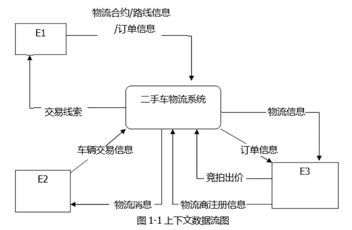
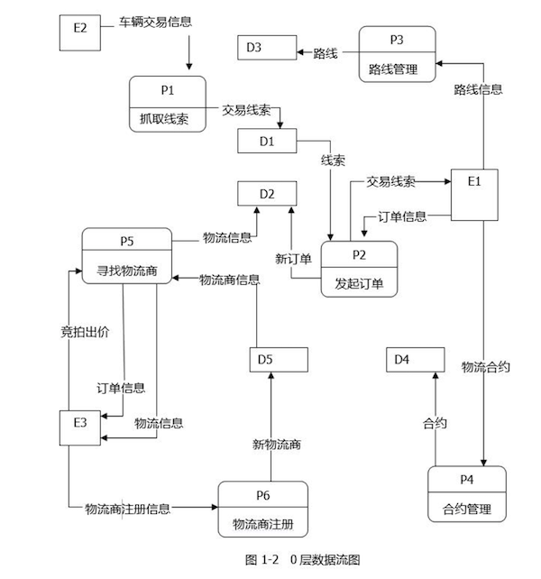
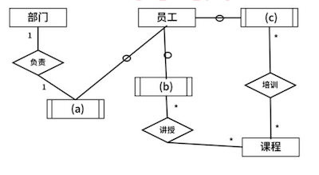
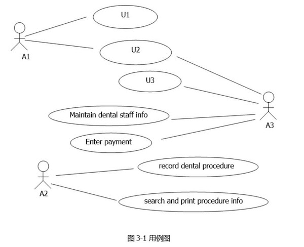
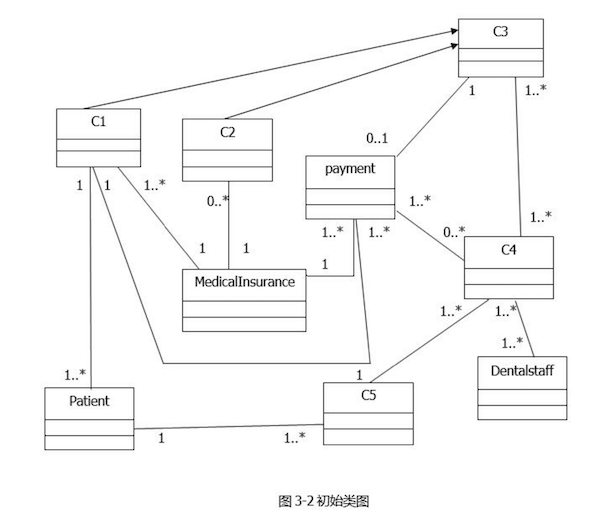
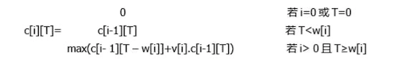
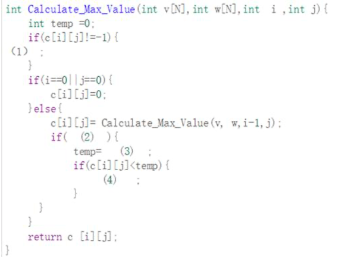
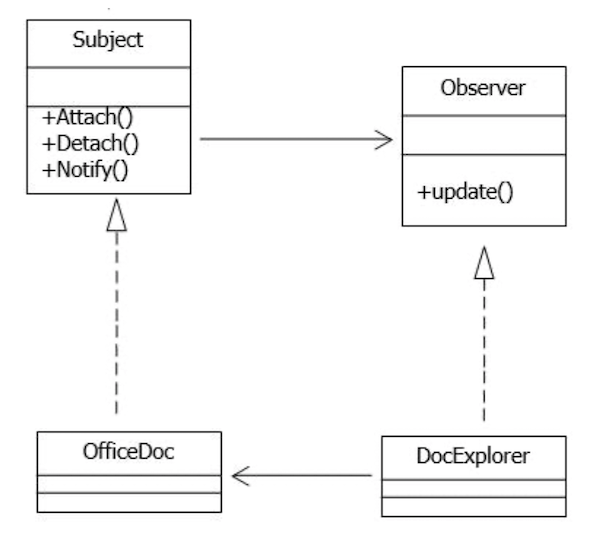
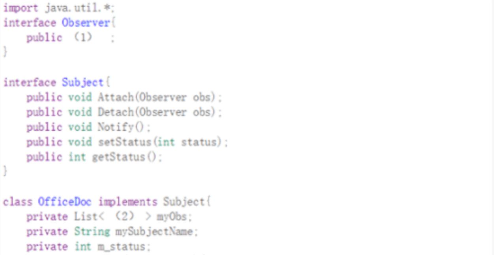
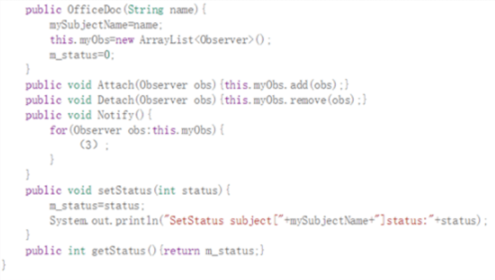

# 2019下半年软件设计师考试真题-下午卷
## 索引
||||||
|:|:|:|:|:|
| [试题一](#试题一) | [试题二](#试题二) | [试题三](#试题三) | [试题四](#试题四) | [试题五](#试题五) |
***
考试时间：150分钟

考试总分：75分（最后两题选做一题，45分及格）

**遵守考场纪律，维护知识尊严，杜绝违纪行为，确保考试结果公正。**

问答题(共 16 题,共 90 分)

### 试题一
(共 15 分)

阅读下列说明和图，回答问题 1 至问题 4。

【说明】 某公司欲开发一款二手车物流系统，以有效提升物流成交效率。该系统的主要功能是:

(1)订单管理:系统抓取线索，将车辆交易系统的交易信息抓取为线索。帮买顾 问看到有买车线索后，会打电话询问买家是否需要物流，若需要，帮买顾问就 将这个线索发起为订单并在系统中存储，然后系统帮助买家寻找物流商进行承 运。

(2)路线管理:帮买顾问对物流商的路线进行管理，存储的路线信息包括路线类 型、物流商、起止地点。路线分为三种，即固定路线、包车路线、竞拍体系， 其中固定路线和包车路线是合约制。包车路线的发车时间由公司自行管理，是 订单的首选途径。

(3)合约管理:帮买顾问根据公司与物流商确定的合约，对合约内容进行设置， 合约信息包括物流商信息、路线起止城市、价格、有效期等。

(4)寻找物流商:系统根据订单的类型(保卖车、全国购和普通二手车)、起止城 市，需要的服务模式(买家接、送到买家等)进行自动派发或以竞拍体系方式选 择合适的物流商。即:有新订单时，若为保卖车或全国购，则直接分配到竞拍体 系中:否则，若符合固定路线和/或包车路线，系统自动分配给合约物流商，若 不符合固定路线和包车路线，系统将订单信息分配到竞拍体系中。竞拍体系接 收到订单后，将订单信息推送给有相关路线的物流商，物流商对订单进行竞拍 出价，最优报价的物流商中标。最后，给承运的物流商发送物流消息，更新订 单的物流信息，给车辆交易系统发送物流信息。 

(5)物流商注册:物流商账号的注册开通。 现采用结构化方法对二手车物流系统进行分析与设计，获得如图 1-1 所示的上 下文数据流图和图 1-2 所示的 0 层数据流图。

<center>
    
    <br>
    <div style="color:orange; border-bottom: 1px solid #d9d9d9;
    display: inline-block;
    color: #999;
    padding: 2px;"></div>
</center>

<center>
    
    <br>
    <div style="color:orange; border-bottom: 1px solid #d9d9d9;
    display: inline-block;
    color: #999;
    padding: 2px;"></div>
</center>
   
   问题内容:
   
   【问题 1】(3 分)
   
   使用说明中的词语，给出图 1-1 中的实体 E1~E3 的名称。 
   
   【问题2】 (5分)
   
   使用说明中的词语，给出图 1-2 中的数据存储 D1~D5 的名称。 
   
   【问题 3】(4 分)
   
   根据说明和图中术语，补充图 1-2 中缺失的数据流及其起点和终点。 
   
   【问题 4】(3 分)
   
   根据说明，采用结构化语言对“P5: 寻找物流商”的加工逻辑进行描述。

#### 参考答案
【问题1】(3分)

E1:帮买顾问
E2:车辆交易系统
E3:物流商

【问题2】(5分)

D1:交易线索信息表
D2:订单信息表
D3:路线信息表
D4:合约信息表
D5:物流商信息表

【问题3】(4分)

数据名|起点|终点
:-:|:-:|:-:
物流信息|P5/寻找物流商|E2/车辆交易系统
新订单信息|D2/订单信息表|P5/寻找物流商
路线信息|D3/路线信息表|P5/寻找物流商
合约信息|D4/合约信息表|P5/寻找物流商

【问题4】(3分)
```
寻找物流商{
    WHILE(有新订单)
    DO{
        IF 订单.类型 IN('保卖车'，'全国购')
                    THEN 分配订单到竞拍体系;
        ELSE IF 订单.路线符合固定路线或包车路线
                    THEN 自动分配订单给合约物流商;
        ELSE 分配订单到竞拍体系;
        ENDIF
        给承运的物流商发送信息;
        更新订单的物流信息;
        给车辆交易系统发送物流信息;
    }ENDDO
}

竞拍体系{
    WHILE(收到订单)
    DO{
        推送订单信息给有相关路线的物流商;
        物流商竞拍出价;
        最优报价物流商中标;
    }ENDDO
}

或

寻找物流商{
    WHILE(有新订单)
    DO{
        IF 订单.类型==普通二手车'AND 订单.路线符合固定路线或包车路线
            THEN 自动分配订单给合约物流商;
        ELSE 分配订单到竞拍体系;
        ENDIF
        给承运的物流商发送信息;
        更新订单的物流信息;
        给车辆交易系统发送物流信息;
    }ENDDO
}

竞拍体系{
    WHILE(收到订单)
    DO{
        推送订单信息给有相关路线的物流商;
        物流商竞拍出价;
        最优报价物流商中标;
    }ENDDO
}
```
***
### 试题二
(共 15 分)

【说明】 

公司拟开发新入职员工的技能培训管理系统以便使新员工快速胜任新岗位。

1.部门信息包括:部门号、名称、部门负责人、电话等，部门号唯一标识部门关 系中的每一个元组，一个部门有多个员工，但一名员工只属于一个部门，每个 部门只有一名负责人，负责部门工作。 

2.员工信息包括员工号、姓名、部门号、岗位、基本工资、电话、家庭住址等， 其中员工号是唯一标示员工关系中的每一个元组。岗位有新入职员工，培训师、 部门负责人等不同岗位设置不同的基本工资，新入职员工要选择多门课程进行 培训，并通过考试取得课程成绩，一名培训师可以讲授多门课程、一门课程可 由多名培训师讲授。 

3.课程信息包括课程号，课程名称、学时等;其中课程号唯一标识课程关系的 每一个元组。

关系模式设计

部门(部门号，部门名，部门负责人，电话) 员工(员工号，姓名，部门号，d，电话，家庭住址)

课程(e，课程名称，学时)

讲授(课程号,培训师，培训地点)

培训(课程号，(f) )

根据需求阶段收集的信息，设计的实体联系图如图 2-1 所示



【问题 1】

(1)补充图 2 -1 中的空(a) - (c)

(2)图 2-1 中是否存在缺失联系，若存在，则说明所缺失的联系和联系类型 

【问题 2】

根据题意，将关系模式中的空(d) - (f) 补充完整

【问题 3】

员工关系模式的主键为(g) ，外键为(h) ，讲授关系模式的主键为(i) ，外键 为(j)

【问题 4】

员工关系是否存在传递依赖?用 100 字以内的文字说明理由

#### 参考答案
【问题1】(5分)

(1)(a)部门负责人(b)培训师(c)新入职员工

(2)存在缺失联系；部门与员工之间隶属关系，联系类型是1:*。

【问题2】(3分)

(d)岗位，基本工资

(e)课程号

(f)新入职员工/新入职员工工号，课程成绩

【问题3】(4分)

(g)员工号

(h)部门号

(i)课程号、培训师、培训地点

(j)课程号、培训师

【问题4】(3分)

存在传递函数依赖；

文中提到不同的岗位有不同的基本工资，基本工资依赖于岗位，岗位依赖于员工号，即存在传递函数依赖：员工号->岗位，岗位->基本工资。
***
### 试题三
(共 15 分)

阅读下列说明和图，回答问题1至问题3。

【说明】

某牙科诊所拟开发一套信息系统， 用于管理病人的基本信息和就诊信息。 诊所工作人员包括：医护人员(DentalStaff)、 接待员(Receptionist) 和办公人员(OfficeStaff) 等。系统主要功能需求描述如下：

1.记录病人基本信息(Maintain patient info)。初次就诊的病人， 由接待员将病人基本信息录入系统。病人基本信息包括病人姓名、身份证号、出生日期、性别、首次就诊时间和最后一次就诊时间等。每位病人与其医保信息(MedicalInsurance)关联。

2.记录就诊信息(Record office visit info)。 病人在诊所的每一次就诊，由接待员将就诊信息(Office Visit) 录入系统。就诊信息包括就诊时间、就诊费用、支付代码、病人支付费用和医保支付费用等。

3.记录治疗信息 (Record dental procedure)。 病人在就诊时，可能需要接受多项治疗，每项治疗(Procedure)可能由多位医护人员为其服务。治疗信息包括：治疗项目名称、治疗项目描述、治疗的牙齿和费用等。治疗信息由每位参与治疗的医护人员分别向系统中录入。

4.打印发票(Print invoices)。 发票(Invoice) 由办公人员打印。发票分为两种：给医保机构的发票(InsuranceInvoice) 和给病人的发票(PatientInvoice)。 两种发票内容相同，只是支付的费用不同。当收到治疗费用后，办公人员在系统中更新支付状态(Enterpayment)。

5.记录医护人员信息(Maintain dental staff info)。办公人员将医护人员信息录入系统。医护人员信息包括姓名、职位、身份证号、家庭住址和联系电话等。

6.医护人员可以查询并打印其参与的治疗项目相关信息(Search and print procedureinfo)。

现采用面向对象方法开发该系统，得到如图3-1所示的用例图和3-2所示的初始类图。





【问题1】(6分)

根据说明中的描述，给出图3-1中A1~A3所对应的参与者名称和U1~U3所对应的用例名称。

【问题2】 (5分)

根据说明中的描述，给出图3-2中C1~C5所对应的类名。

【问题3】 (4分)

根据说明中的描述，给出图3-2中类C4、C5、Patient 和DentalStaff的必要属性。
#### 参考答案
【问题1】

A1 Receptionist(接待人员)
A2: Dentalstaff(医护人员)
A3 offhcestaff(办公人员)

U1: Maintain patient info(记录病人基本信息)

U2: Record office visit info(记录就诊信息)

U3: Print invoices(打印发票)

【问题2】

C1: PatientInvoice(病人发票)

C2 Insurancelnvoice(机构发票)

C3: Invoice(发票)

C4: Procedure(治疗信息)

C5: OfficeVisit(就诊信息)

【问题3】

C4:治疗项目名称、治疗项目描述、治疗的牙齿和费用、Office Visit、Dental Staff

C5:就诊信息、就诊时间、就诊费用、支付代码、病人支付费用和医保支付费用、病人patient

Patient:姓名、身份证号、出生日期、性别、首次就诊时间、最后就诊时间等

Dentalstaff:姓名、职位、身份证号、住址、联系电话、职工号。
***
### 试题四
(共 15 分)

阅读下列说明和 C 代码，回答问题 1 至问题 3。 

【说明】

0-1 背包问题定义为:给定 i 个物品的价值 v[1...i]、小重量 w[1...i]和背包容 量 T，每个物品装到背包里或者不装到背包里。求最优的装包方案，使得所得 到的价值最大。

0-1 背包问题具有最优子结构性质。定义 c[i][T]为最优装包方案所获得的最大 价值，则可得到如下所示的递归式。



【c 代码】

下面是算法的 C 语言实现。

(1)常量和变量说明
```
T: 背包容量
v[]:价值数组
w[]:重量数组
c[][]:c[i][j]表示前 i 个物品在背包容量为 j 的情况下最优装包方案所能获得 的最大价值
```
(2) C程序




【问题1】 (8分)

根据说明和 C 代码，填充 C 代码中的空(1) ~ (4)。

【问题2】 (4分)

根据说明和 C 代码，算法采用了 (5) 设计策略。在求解过程中，采用了(6) (自底向上或者自顶向下)的方式。

【问题3】 (3分)

若 5 项物品的价值数组和重量数组分别为 v[]= {0,1,6,18,22,28}和 w[]= {0,1,2,5,6,7}背包容量为 T= 11,则获得的最大价值为 (7) 。
#### 参考答案
【问题1】

(1) `c[i][j]`

(2) `i>0&&j>=w[i]`

(3) `Calulate_Max_Value(v,w,i-1,j-w[i]) + v [i]`

(4) `c[i][j]=temp`

【问题2】

(5) 动态规划

(6) 自顶向下

【问题3】

(7) 40
***
### 试题五
(共 15 分)

阅读下列说明和 Java 代码，将应填入 (n) 处的字句写在答题纸的对应栏内。 

【说明】

某文件管理系统中定义了类 OfficeDoe 和 DocExplorer。当类 OfficeDoe 发生 变化时，类 DocExplorer 的所有对象都要更新其自身的状态。现采用观察者 (Observer) 设计模式来实现该需求，所设计的类图如图 6-1 所示。

<center>
    
    <br>
    <div style="color:orange; border-bottom: 1px solid #d9d9d9;
    display: inline-block;
    color: #999;
    padding: 2px;">图 6-1</div>
</center>

【Java 代码】






#### 参考答案
(1) `void update();`

(2) `Observer`

(3) `obs.update();`

(4) `Subject`

(5) `Attach(this);`
***
