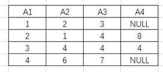
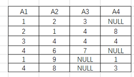

# 2020下半年软件设计师考试真题-上午卷
## 索引
||||||
|:|:|:|:|:|
| [1、地址映射](#1、) | [2、CPU组成](#2、) | [3、浮点数相加运算](#3、) | [4-5、计算机性能指标的计算](#4-5、) | / |
| [6、中断向量](#6、) | [7、信息安全认证和加密](#7、) | [8、信息安全机制](#8、) | [9、网关协议](#9、) | [10、信息安全](#10、) |
| [11、网络命令](#11、) | [12、计算机软件著作权](#12、) | [13、软件著作权](#13、) | [14、著作权法](#14、) | [15、数据流图和数据MTTF/MTBF/MTRF的概念字典](#15、) |
| [16、设计原则](#16、) | [17-18、项目管理关键路径](#17-18、) | / | [19、项目成本估算模型](#19、) | [20、语法树后序遍历](#20、) |
| [21、汇编语言的执行过程](#21、) | [22、递归调用](#22、) | [23、进程资源图](#23、) | [24、页式存储](#24、) | [25-26、 索引文件结构](#25-26、) |
| / | [27、PV操作信号量](#27、) | [28、进程和线程共享与独有信息](#28、) | [29-30、喷泉模型](#29-30、) | / |
| [31、软件工程的内聚性](#31、) | [32、软件质量属性](#32、) | [33、软件工程的设计原则](#33、) | [34、MTTF/MTBF/MTRF的概念](#34、) | [35-36、软件工程软件测试白盒测试](#35-36、) | 
| / | [37、面向对象基本属性](#37、) | [38、面向对象基本概念](#38、) | [39、面向对象的设计原则](#39、) | [40、面向对象中的多态](#40、) |
| [41、UML类图对象关联](#41、) | [42-43、UML图示](#42-43、) | / |[44-47、设计模式](#44-47、) | / |
| / | / | [48、函数的参数传值方式](#48、) | [49、CFG (上下文无关文法)](#49、) | [50、有限自动机的状态转换图](#50、) |
| [51-52、E-R图 (Entity Relationship Diagram) 冲突及解决](#51-52、) | / | [53、amstrong公理&候选键](#53、) | [54-55、数据关系代数](#54-55、) | / |
| [56、分布式数据库特点](#56、) | [57、Huffman (哈夫曼)树](#57、) | [58、不同存储的数据结构](#58、) | [59、二分查找](#59、) | [60-61、有向图的深度和广度遍历](#60-61、) |
| / | [62-63、快速排序](#62-63、) | / | [64、简单无向连通图](#64、) | [65、渐进分析](#65、) |
| [66、DHCP协议-无效的IP地址](#66、) | [67、计算机网络URL协议](#67、) | [68-69、计算机网络TCP协议](#68-69、) | / | [70、因特网中的域名系统](#70、) |
| [71-75、Systems support](#71-75、) |

***
考试时间：150分钟

考试总分：75分（45分及格）

**遵守考场纪律，维护知识尊严，杜绝违纪行为，确保考试结果公正。**

单选题(共 75 题,共 75 分)

***
#### 1、
在程序执行过程中，高速缓存（Cache）与主存间的地址映射由（  ）。

A.操作系统进行管理

B.存储管理软件进行管理

C.程序员自行安排

D.硬件自动完成

<div style="display: inline;">
<h4>答案</h4>
D
<h4>解析</h4>
本题考查的是Cache的概念。
Cache与主存地址映射是由硬件完成，与操作系统、存储管理软件、程序员无关。
本题选择D选项。
</div>
***
#### 2、
计算机中提供指令地址的程序计数器PC在（  ）中。

A.控制器
B.运算器
C.存储器
D.I/O设备
<div style="display: inline;">
<h4>答案</h4>
A
<h4>解析</h4>
本题是对CPU组成相关概念的考查。

存储器和I/O设备是计算机中的其他组成部分，与程序计数器PC无关。

CPU可以分为运算器和控制器两个部分。

运算器包括：算术逻辑单元ALU、累加寄存器AC、数据缓冲寄存器DR。状态条件寄存器PSW归属有争议，既可以属于运算器，也可以属于控制器。

控制器包括：程序计数器PC、指令寄存器IR、指令译码器ID、时序部件。

PC是控制器中的子部件。本题选择A选项。
</div>
***
#### 3、
以下关于两个浮点数相加运算的叙述中，正确的是（  ）。

A.首先进行对阶，阶码大的向阶码小的对齐

B.首先进行对阶，阶码小的向阶码大的对齐

C.不需要对阶，直接将尾数相加

D.不需要对阶，直接将阶码相加
<div style="display: inline;">
<h4>答案</h4>
B
<h4>解析</h4>
本题是对浮点数基本概念的考查。

浮点数运算的过程如下所示：对阶→尾数运算→规格化。所以C、D选项描述都是错误的。

其中对阶的过程如下所示：小数向大数看齐，较小数的尾数右移。所以A选项描述错误，本题选择B选项。
</div>
***
#### 4-5、
某计算机系统的CPU主频为 2.8GHz 。某应用程序包括3类指令，各类指令的 CPI (执行每条指令所需要的时钟周期数)及指令比例如下表所示。

执行该应用程序时的平均 CPI 为（  ）；运算速度用 MIPS 表示，约为（  ）。

||指令A|指令B|指令C|
|:-:|:-:|:-:|:-:|
|比例|35%|45%|20%|
|CPI|4|2|6|

问题1选项

A、25

B、3

C、3.5

D、4

问题2选项

A、700

B、800

C、930

D、1100
<div style="display: inline;">
<h4>答案</h4>
第1题:C
第2题:B
<h4>解析</h4>
本题考查计算机性能指标的计算。

第一问关于平均CPI，即对列出的CPI求平均数。
`4*35%+2*45%+6*20%=3.5。`

第二问求MIPS，即每秒执行的百万条指令数。

根据第一问CPI，每条指令需要的时钟周期为4，每个时钟周期为主频的倒数，即1/2.8G秒，则每条指令需要时间3.5/2.8G秒。

每秒执行指令数为`1/(3.5/2.8G)=2.8G/3.5=0.8G=800M`。
`（1M=10^6，1G=10^9）`
</div>
***
#### 6、
中断向量提供（  ）。

A.函数调用结束后的返回地址

B.I/O设备的接口地址

C.主程序的入口地址

D.中断服务程序入口地址
<div style="display: inline;">
<h4>答案</h4>
D
<h4>解析</h4>
本题是对中断的概念考查。

中断向量就是指中断服务程序的入口地址，它存放着一条跳转到中断服务程序入口地址的跳转指令。
</div>
***
#### 7、
以下关于认证和加密的叙述中，错误的是（  ）。

A.加密用以确保数据的保密性
B.认证用以确保报文发送者和接收者的真实性
C.认证和加密都可以阻止对手进行被动攻击
D.身份认证的目的在于识别用户的合法性，阻止非法用户访问系统
<div style="display: inline;">
<h4>答案</h4>
C
<h4>解析</h4>
本题考查信息安全认证和加密的情况。

认证一般有账户名/口令认证、使用摘要算法认证和基于PKI的认证。

认证只能阻止主动攻击，不能阻止被动攻击。

A、B、D都说法都是正确的，C选项说法错误。

故答案选择C选项。
</div>
***
#### 8、
访问控制是对信息系统资源进行保护的重要措施，适当的访问控制能够阻止未经授权的用户有意或者无意地获取资源。计算机系统中，访问控制的任务不包括（  ）。

A.审计
B.授权
C.确定存取权限
D.实施存取权限
<div style="display: inline;">
<h4>答案</h4>
A
<h4>解析</h4>
本题考查信息安全机制相关问题。

安全审计对主体访问和适用客体的情况进行记录和审查，以保证安全规则被正确执行，并帮助分析安全事故产生的原因。与访问控制无关。

授权、确定存取权限、实施存取权限都是安全访问控制的任务，故正确答案选择A选项。
</div>
***
#### 9、
由于Internet规模太大，常把它划分成许多小的自治系统，通常把自治系统内部的路由协议称为内部网关协议，自治系统之间的协议称为外部网关协议。以下属于外部网关协议的是（   ）。

A.RIP
B.OSPF
C.BGP
D.UDP
<div style="display: inline;">
<h4>答案</h4>
C
<h4>解析</h4>
本题考查的是网关协议相关内容，这一部分在软件设计师考试中涉及不多。

RIP：RIP（Routing Information Protocol，路由信息协议）是一种内部网关协议（IGP），是一种动态路由选择协议，用于自治系统（AS）内的路由信息的传递。

OSPF：OSPF（Open Shortest Path First，开放式最短路径优先）是一个内部网关协议（Interior Gateway Protocol，简称IGP），用于在单一自治系统（autonomous system,AS）内决策路由。是对链路状态路由协议的一种实现，隶属内部网关协议（IGP），故运作于自治系统内部。

BGP：边界网关协议（BGP）是运行于 TCP 上的一种自治系统的路由协议。 BGP 是唯一一个用来处理像因特网大小的网络的协议，也是唯一能够妥善处理好不相关路由域间的多路连接的协议。

UDP：传输层协议。
</div>
***
#### 10、
所有资源只能由授权方或以授权的方式进行修改，即信息未经授权不能进行改变的特性是指信息的（  ）。

A.完整性
B.可用性
C.保密性
D.不可抵赖性
<div style="display: inline;">
<h4>答案</h4>
A
<h4>解析</h4>
本题考查信息安全知识。

数据的机密性（保密性）是指数据在传输过程中不能被非授权者偷看；

数据的完整性是指数据在传输过程中不能被非法篡改，本题涉及到修改的只有完整性；

数据的真实性（不可抵赖性）是指信息的发送者身份的确认或系统中有关主体的身份确认，这样可以保证信息的可信度；

可用性指的是发送者和接受者双方的通信方式正常。

故正确答案选择A选项。
</div>
***
#### 11、
在Windows操作系统下，要获取某个网络开放端口所对应的应用程序信息，可以使用命令（  ）。

A.ipconfig
B.traceroute
C.netstat
D.nslookup
<div style="display: inline;">
<h4>答案</h4>
C
<h4>解析</h4>
本题考查的是网络命令的使用。

ipconfig（ linux: ifconfig）（显示TCP/IP网络配置值，如：IP地址，MAC地址，网关地址等）。

tracert（linux: traceroute）：用于确定 IP数据包访问目标所采取的路径，若网络不通，能定位到具体哪个结点不通。 

netstat：用于显示网络连接、路由表和网络接口信息。本题描述的是C选项。

nslookup（查询DNS记录）。
</div>
***
#### 12、
甲、 乙两个申请人分别就相同内容的计算机软件发明创造，向国务院专利行政部门门提出专利申请，甲先于乙一日提出，则（  ）。

A.甲获得该项专利申请权
B.乙获得该项专利申请权
C.甲和乙都获得该项专利申请权
D.甲和乙都不能获得该项专利申请权

<div style="display: inline;">
<h4>答案</h4>
A
</div>
***
#### 13、
小王是某高校的非全日制在读研究生，目前在甲公司实习，负责了该公司某软件项目的开发工作并撰写相关的软件文档。以下叙述中，正确的是（  ）。

A.该软件文档属于职务作品，但小王享有该软件著作权的全部权利

B.该软件文档属于职务作品，甲公司享有该软件著作权的全部权利

C.该软件文档不属于职务作品，小王享有该软件著作权的全部权利

D.该软件文档不属于职务作品，甲公司和小王共同享有该著作权的全部权利
<div style="display: inline;">
<h4>答案</h4>
B
<h4>解析</h4>
本题考查著作权归属问题。
本题是典型的职务作品，软件著作权属于公司所有。
本题答案选B。
</div>
***
#### 14、
按照我国著作权法的权利保护期，以下权利中，（  ）受到永久保护。

A.发表权
B.修改权
C.复制权
D.发行权
<div style="display: inline;">
<h4>答案</h4>
B
<h4>解析</h4>
本题考查著作权的保护期限问题。
著作权中修改权、署名权、保护作品完整权都是永久保护的。
故本题正确答案选择B选项。
</div>
***
#### 15、
结构化分析方法中，数据流图中的元素在（  ）中进行定义。

A.加工逻辑
B.实体联系图
C.流程图
D.数据字典
<div style="display: inline;">
<h4>答案</h4>
D
<h4>解析</h4>
本题考查软件工程的数据流图和数据字典。
数据字典会对数据流图中元素进行定义说明。用数据字典来对数据流图的元素进行解释说明，故本题正确答案选择D选项。
</div>
***
#### 16、
良好的启发式设计原则上不包括（  ）。

A.提高模块独立性
B.模块规模越小越好
C.模块作用域在其控制域之内
D.降低模块接口复杂性
<div style="display: inline;">
<h4>答案</h4>
B
<h4>解析</h4>
1、模块化设计要求高内聚、低耦合，模块独立体现的就是高内聚低耦合。A选项正确。

2、在结构化设计中，系统由多个逻辑上相对独立的模块组成，在模块划分时需要遵循如下原则：

（1）模块的大小要适中。系统分解时需要考虑模块的规模，过大的模块可能导致系统分解不充分，其内部可能包括不同类型的功能，需要进一步划分，尽量使得各个模块的功能单一；过小的模块将导致系统的复杂度增加，模块之间的调用过于频繁，反而降低了模块的独立性。不是越小越好。B选项错误。

（2）模块的扇入和扇出要合理。模块的扇入指模块直接上级模块的个数。模块的直属下级模块个数即为模块的扇出。

（3）深度和宽度适当。深度表示软件结构中模块的层数，如果层数过多，则应考虑是否有些模块设计过于简单，看能否适当合并。宽度是软件结构中同一个层次上的模块总数的最大值，一般说来，宽度越大系统越复杂，对宽度影响最大的因素是模块的扇出。在系统设计时，需要权衡系统的深度和宽度，尽量降低系统的复杂性，减少实施过程的难度，提高开发和维护的效率。需要控制模块接口的复杂性。D选项正确。

3、尽力使模块的作用域在其控制域之内。模块控制域：这个模块本身以及所有直接或间接从属于它的模块的集合。模块作用域：指受该模块内一个判定所影响的所有模块的集合。C选项正确。
</div>
***
#### 17-18、
如下所示的软件项目活动图中，顶点表示项目里程碑，连接顶点的边表示包含的活动，边上的权重表示活动的持续时间（天）， 则完成该项目的最短时间为（  ）天。在该活动图中，共有（  ）条关键路径。


问题1选项

A.17
B.19
C.20
D.22

问题2选项

A.1
B.2
C.3
D.4
<div style="display: inline;">
<h4>答案</h4>
第1题:D
第2题:B
<h4>解析</h4>
本题考查项目管理知识。

<center>
    
    <br>
    <div style="color:orange; border-bottom: 1px solid #d9d9d9;
    display: inline-block;
    color: #999;
    padding: 2px;"></div>
</center>

</div>
***
#### 19、
软件项目成本估算模型COCOMO II中，体系结构阶段模型基于（  ）进行估算。

A.应用程序点数量
B.功能点数量
C.复用或生成的代码行数
D.源代码的行数
<div style="display: inline;">
<h4>答案</h4>
D
<h4>解析</h4>
本题考查项目成本估算模型。

COCOMO II 模型也需要使用规模估算信息，体系结构阶段，在模型层次结构中有3种不同规模估算选择，即：对象点、功能点和代码行。应用组装模型使用的是对象点；早期设计阶段模型使用的是功能点，功能点可以转换为代码行。体系结构模型把工作量表示为代码行数。

故正确答案选择D选项。
</div>
***
#### 20、
某表达式的语法树如下图所示，其后缀式(逆波兰式)是（  ）。


A.abcd-+*
B.ab-c+d*
C.abc-d*+
D.ab-cd+*
<div style="display: inline;">
<h4>答案</h4>
C
<h4>解析</h4>
对图示的语法树做后序遍历即可，结果为C选项。
</div>
***
#### 21、
用C/C++语言为某个应用编写的程序，经过（  ）后形成可执行程序。

A.预处理、编译、汇编、链接

B.编译、预处理、汇编、链接

C.汇编、预处理、链接、编译

D.链接、预处理、编译、汇编
<div style="display: inline;">
<h4>答案</h4>
A
<h4>解析</h4>
本题考查汇编语言的执行过程。
对于编译型语言，处理过程为：预处理-编译-汇编-链接。
</div>
***
#### 22、
在程序的执行过程中，系统用（  ）实现嵌套调用（递归调用）函数的正确返回。

A.队列
B.优先队列
C.栈
D.散列表
<div style="display: inline;">
<h4>答案</h4>
C
<h4>解析</h4>
在递归调用中，需要在前期存储某些数据，并在后面又以存储的逆序恢复这些数据，以提供之后使用的需求，因此，需要用到栈来实现递归。

简单的说，就是在前行阶段，对于每一层递归，函数的局部变量、参数值以及返回地址都被压入栈中。在退回阶段，位于栈顶的局部变量、参数值和返回地址被弹出，用于返回调用层次中执行代码的其余部分，也就是恢复了调用的状态。
</div>
***
#### 23、
假设系统中有三个进程P1、P2和P3，两种资源R1、R2。如果进程资源图如图①和图②所示，那么（  ）。


A.图①和图②都可化简

B.图①和图②都不可化简

C.图①可化简，图②不可化简

D.图①不可化简，图②可化简
<div style="display: inline;">
<h4>答案</h4>
C
<h4>解析</h4>
本题考查的是进程资源图的分析。

图①当前状态下：

R1：已分配2个，剩余1个。

R2：已分配3个，剩余0个。

P1：已获得1个R1，1个R2，无其他资源需求，可化简，化简后释放当前1个R1，1个R2。

P2：已获得1个R2，仍需2个R1，此时R1资源不足，P2是阻塞结点。等待P1释放后可化简。

P3：已获得1个R1，1个R2，仍需1个R2，此时R2资源不足，P3是阻塞结点。等待P1释放后可化简。

图②当前状态下：

R1：已分配3个，剩余0个。

R2：已分配2个，剩余0个。

P1：已获得1个R1，仍需1个R2，此时R2资源不足，P1是阻塞结点。

P2：已获得1个R1，1个R2，仍需1个R1，此时R1资源不足，P2是阻塞结点。

P3：已获得1个R1，1个R2，仍需1个R2，此时R2资源不足，P3是阻塞结点。

所有结点均阻塞，无法化简。
</div>
***
#### 24、
假设计算机系统的页面大小为4KB，进程P的页面变换表如下表所示。若P要动问的逻辑地址为十六进制3C20H，那么该逻辑地址经过地址变换后，其物理地址应为（  ）。

|页号|物理块号|
|:-:|:-:|
|0|2|
|1|3|
|2|5|
|3|6|

A.2048H
B.3C20H
C.5C20H
D.6C20H
<div style="display: inline;">
<h4>答案</h4>
D
<h4>解析</h4>
本题考查的是页式存储相关的内容，属于典型的[已知逻辑地址求物理地址](../../../知识点/已知逻辑地址求物理地址)问题。

**汇编以后缀 H 表示十六进制；C语言以前缀 0x 表示十六进制**

1、根据页面大小4K（=2^12）可知，页内地址长度需要12位二进制表示。

2、根据逻辑地址3C20H，其中第12位二进制为页内地址，即对应十六进制第3位C20H为页内地址，剩余高位3H为页号，转换为十进制结果为3。

3、查表可得，页号3对应的物理块号为6（即十六进制6H），再拼接原页内地址C20H，即为最终的物理地址6C20H。本题选择D选项。
</div>
***
#### 25-26、
某文件系统采用索引节点管理，其磁盘索引块和磁盘数据块大小均为1KB字节且每个文件索引节点有8个地址项iaddr[0]~iaddr[7]，每个地址项大小为4字节，其中iaddr[0]~iaddr[4]采用直接地址索引，iaddr[5]和iaddr[6]采用一级间接地址索引，iaddr[7] 采用二级间接地址索引。若用户要访问文件userA中逻辑块号为4和5的信息，则系统应分别采用（  ）， 该文件系统可表示的单个文件最大长度是（  ）KB。

问题1选项

A.直接地址访问和直接地址访问

B.直接地址访问和一级间接地址访问

C.一级间接地址访问和一级间接地址访问

D.一级间接地址访问和二级间接地址访问

问题2选项

A.517
B.1029
C.65797
D.66053
<div style="display: inline;">
<h4>答案</h4>
第1题:B
第2题:D
<h4>解析</h4>
本题是对索引文件结构的考查。

根据题干可得：

其中0~4号节点为直接索引，对应逻辑块号为0~4。

其中5~6号节点为一级间接索引方式，对应逻辑块号从5开始。本题第一空选择B选项。

每个索引盘大小为1KB，地址项大小为4B，故每个索引盘有（1KB/4B）=256个索引。

一级间接索引有2个盘块，共有512个索引，对应512个逻辑盘块。

其中7号节点为二级间接索引，共有256*256=65536个索引，对应65536个逻辑盘块。

单个文件最大为：(5+512+65536)*1KB=66053KB。本题第二空选择D选项。
</div>
***
#### 27、
假设系统有n（n≥5）个进程共享资源R，且资源R的可用数为5。若采用PV操作，则相应的信号量S的取值范围应为（  ）。 

A.-1~n-1
B.-5~5
C.-(n-1)~1
D.-(n-5)~5
<div style="display: inline;">
<h4>答案</h4>
D
<h4>解析</h4>
本题考查的PV操作中信号量的分析。

PV信息量的取值表示资源数，最大值为初始可用资源5；

当信号量取值小于0时，可表示排队进程数，此时n个进程，最大排队数为n-5，信号量最小取值为-（n-5）。本题选择D选项。

资源数是5，被进程使用。没进程使用的时候，资源数是5，来一个进程使用，就是5-1，再来一个进程使用就是（5-1）-1，以此类推，当有n个进程使用时，就是5-n，也就是-（n-5）。
</div>
***
#### 28、
在支持多线程的操作系统中，假设进程P创建了线程TI、T2和T3， 那么以下叙述中错误的是( )。

A.线程T1、 T2和T3可以共享进程P的代码

B.线程T1、T2可以共享P进程中T3的栈指针

C.线程T1、T2和T3可以共享进程P打开的文件

D.线程T1、T2和T3可以共享进程P的全局变量
<div style="display: inline;">
<h4>答案</h4>
B
<h4>解析</h4>
本题考查的是操作系统的知识内容。

线程共享的内容包括：进程代码段、进程的公有数据（利用这些共享的数据，线程很容易的实现相互之间的通讯）、进程打开的文件描述符、信号的处理器、进程的当前目录、进程用户ID与进程组ID 。

线程独有的内容包括：线程ID、寄存器组的值、线程的堆栈、错误返回码、线程的信号屏蔽码。 
</div>
***
#### 29-30、
喷泉模型是一种适合于面向（  ）开发方法的软件过程模型。该过程模型的特点不包括（  ）。

问题1选项

A.对象
B.数据
C.数据流
D.事件

问题2选项

A.以用户需求为动力
B.支持软件重用
C.具有迭代性
D.开发活动之间存在明显的界限
<div style="display: inline;">
<h4>答案</h4>
第1题:A
第2题:D
<h4>解析</h4>
本题考查软件工程开发模型的特点。
喷泉模型是面向对象的开发模型。特点是：迭代无间隙，以用户需求为动力。
</div>
***
#### 31、
若某模块内所有处理元素都在同一个数据结构上操作，则该模块的内聚类型为（  ）。

A.逻辑
B.过程
C.通信
D.功能
<div style="display: inline;">
<h4>答案</h4>
C
<h4>解析</h4>
本题考查软件工程的内聚性。

内聚类型|描述
:-:|:-:
功能内聚|完成一个单一功能，各个部分协同工作，缺一不可
顺序内聚|处理元素相关，而且必须顺序执行
通信内聚|所有处理元素集中在一个数据结构的区域上
过程内聚|处理元素相关，而且必须按特定的次序执行
瞬时内聚（时间内聚）|所包含的任务必须在同一时间间隔内执行
逻辑内聚|完成逻辑上相关的一组任务
偶然内聚（巧合内聚）|完成一组没有关系或松散关系的任务
</div>
***
#### 32、
软件质量属性中，（  ）是指软件每分钟可以处理多少个请求。

A.响应时间
B.吞吐量
C.负载
D.容量
<div style="display: inline;">
<h4>答案</h4>
B
<h4>解析</h4>
本题考查的是计算机性能指标的概念。

吞吐量：指在给定的时间内，系统所能处理的任务的数量。

响应时间：指系统对请求作出响应的时间。

容量：存储器所能存储的全部信息量称为该存储器的容量。

负载：负载能力一般指的是系统能够承受的最大任务数。
</div>
***
#### 33、
提高程序执行效率的方法一般不包括（  ）。

A.设计更好的算法
B.采用不同的数据结构
C.采用不同的程序设计语言
D.改写代码使其更紧凑
<div style="display: inline;">
<h4>答案</h4>
D
<h4>解析</h4>
本题考查软件工程的设计原则。

改写代码仅使其结构上更紧凑，并不能提高执行效率问题。其他三项都能够提高执行效率。
</div>
***
#### 34、
软件可靠性是指系统在给定的时间间隔内、在给定条件下无失效运行的概率。若MTTF和MTTR分别表示平均无故障时间和平均修复时间，则公式（  ）可用于计算软件可靠性。

A.MTTF/(1+MTTF)

B.1/(1+MTTF)

C.MTTR/(1+MTTR)

D.1/(1+MTTR)
<div style="display: inline;">
<h4>答案</h4>
A
<h4>解析</h4>
本题考查的是计算机性能指标的概念： [MTTF/MTBF/MTRF的概念](../../知识点/MTTF:MTBF:MTRF的概念)。

`MTTF/(1+MTTF)` 可以用来度量可靠性。

`MTBF/(1+MTBF)` 可以用来度量可用性。

`1/(1+MTTR)` 可以用来度量可维护性。

没有 ~~`MTTR/(1+MTTR)`~~ 的表示。
</div>
***
#### 35-36、
用白盒测试技术对下面流程图进行测试，设计的测试用例如下表所示。至少采用测试用例（  ）才可以实现语句覆盖；至少采用测试用例（  ）才可以实现路径覆盖。


<center><div><strong>测试用例表</strong></div><center>

编号|A|B|X
:-:|:-:|:-:|:-:
①|2|0|4
②|1|1|1
③|2|1|1
④|4|0|2

问题1选项

A.①
B.②
C.③
D.④

问题2选项

A.①
B.①②
C.③④
D.①②③④
<div style="display: inline;">
<h4>答案</h4>
第1题:A
第2题:D
<h4>解析</h4>
本题考查软件工程软件测试问题。

根据测试用例：

用例①可以满足覆盖所有语句，满足语句覆盖。

用例①可以满足路径ace，用例②可以满足路径abd，用例③可以满足路径abe，用例④可以满足路径acd。

所以满足路径覆盖需要测试用例①②③④。
</div>
***
#### 37、
面向对象程序设计语言C++、JAVA中，关键字（  ）可以用于区分同名的对象属性和局部变量名。

A.private
B.protected
C.public
D.this
<div style="display: inline;">
<h4>答案</h4>
D
<h4>解析</h4>
本题考查面向对象基本属性。

public：表示全局，类内部外部子类都可以访问；

private：表示私有的，只有本类内部可以使用；

protected：表示受保护的，只有本类或子类或父类中可以访问；

this：可以区分同名的对象属性和局部变量名。
</div>
***
#### 38、
采用面向对象方法进行系统开发时，以下与新型冠状病毒有关的对象中，存在“一般-特殊“关系的是（  ）。

A.确诊病人和治愈病人
B.确诊病人和疑似病人
C.医生和病人
D.发热病人和确诊病人
<div style="display: inline;">
<h4>答案</h4>
A
<h4>解析</h4>
本题是对面向对象基本概念的考查。

特殊/一般关系也叫做泛化（Generalization）关系。特殊元素（子元素）的对象可替代一般元素（父元素）的对象，父元素是子元素的泛化（一般表示），子元素是父元素的特殊化。用这种方法，子元素共享了父元素的结构和行为。

在一般-特殊关系中，可以理解为特殊元素（即子类对象）是一般元素（即父类对象）的一种特殊体现。

本题中，“采用面向对象方法进行系统开发时，以下与新型冠状病毒有关的对象中”：

A选项“确诊病人”与“治愈病人”（“治愈病人”是一种特殊的“确诊病人”）存在一般-特殊的关系。本题选择A选项。

B选项“确诊病人”不一定是“疑似病人”并且 “疑似病人”  不一定成为“确诊病人”，不满足一般-特殊的关系 。

C选项“医生”不一定是“病人”并且“病人”   不一定是 “医生”  ，不满足一般-特殊的关系。

D选项“发热病人”不一定是“确诊病人”并且“确诊病人”也不一定是“发热病人”，不满足一般-特殊的关系
</div>
***
#### 39、
进行面向对象系统设计时，针对包中的所有类对于同一类性质的变化；一个变化若对一个包产生影响，则将对该包中的所有类产生影响，而对于其他的包不造成任何影响。这属于（  ）设计原则。

A.共同重用
B.开放-封闭
C.接口分离
D.共同封闭
<div style="display: inline;">
<h4>答案</h4>
D
<h4>解析</h4>
本题考查面向对象的设计原则。

共同封闭原则：包中的所有类对于同一种性质的变化应该是共同封闭的。一个变化若对一个封闭的包产生影响，则将对该包中的所有类产生影响，而对于其他包则不造成任何影响。面向对象设计的原则之一。

共同重用原则：面向对象编程术语，指一个包中的所有类应该是共同重用的。如果重用了包中的一个类，那么也就相当于重用了包中的所有类。

开放-封闭原则：对扩展开放，对修改封闭。

接口隔离原则：使用多个专门的接口比使用单一的总接口要好。
</div>
***
#### 40、
多态有不同的形式，（  ）的多态是指同一个名字在不同上下文中所代表的含义不同。

A.参数
B.包含
C.过载
D.强制
<div style="display: inline;">
<h4>答案</h4>
<h4>解析</h4>
本题考查面向对象概念。

参数多态：应用广泛、最纯的多态。

包含多态：同样的操作可用于一个类型及其子类型。包含多态一般需要进行运行时的类型检查。包含多态在许多语言中都存在，最常见的例子就是子类型化，即一个类型是另外一个类型的子类型。

强制多态：编译程序通过语义操作，把操作对象的类型强行加以变换，以符合函数或操作符的要求。

过载多态：同一个名（操作符﹑函数名）在不同的上下文中有不同的类型。 目前软设考查比较多的是过载多态。
</div>
***
#### 41、
关于以下UML类图的叙述中，错误的是（  ）。


A.一个A1的对象可能与一个A2的对象关联

B.一个A的非直接对象可能与一个A1 的对象关联

C.类B1的对象可能通过A2与C1的对象关联

D.有可能A的直接对象与B1的对象关联
<div style="display: inline;">
<h4>答案</h4>
D
<h4>解析</h4>
本题考查面向对象的知识。

本题图中B1与A类的继承层次关系有关联关系

1个A的对象可以与多个B1的对象关联,1个B1对象可以与2到多个A的对象关联;

1个A的对象可以与多个A的对象关联;1个A2的对象与多个C1类的对象关联，1个C1的对象与多个A2的对象关联;

那么1个B1对象可以通过A2与C1的对象关联。

因为A标识为 `{abstract}` ，即抽象类，抽象类不能直接进行实例化，即没有直接对象，只能有非直接对象，即子类的对象，因此，所有A的对象都是其子类的对象。
</div>
***
#### 42-43、
UML图中，对象图展现了（  ），（  ）所示对象图与下图所示类图不一致。


问题1选项

A.一组对象、接口、协作和它们之间的关系

B.一组用例、参与者以及它们之间的关系

C.某一时刻一组对象以及它们之间的关系

D.以时间顺序组织的对象之间的交互活动

问题2选项

A.


B.


C.


D.


<div style="display: inline;">
<h4>答案</h4>
第1题:C
第2题:D
<h4>解析</h4>
本题考查UML图示。

对象图：展现了某一个时刻一组对象以及它们之间的关系。

类图：展现了一组对象、接口、协作和它们之间的关系。

用例图：展现了一组用例、参与者以及它们之间的关系。

序列图：是场景的图形化表示，描述了以时间顺序组织的对象之间的交互活动。 

**多重度 (multiplicity；spin multiplicity)** ：指一个类的实例能够与另一个类的多少个实例相关联。
```
0-* 表示一个集合中的一个对象对应另一个集合中的0个或多个对象。（可以不对应）
1-* 表示一个集合中的一个对象对应另一个集合中的一个或多个对象。（至少对应一个）
* 表示一个集合中的一个对象对应另一个集合中的多个的对象。(注：0..*与*表达的意思一样)
```
图示表示的是1个A可以对应多个B，1个B只能对应1个A 。
</div>
***
#### 44-47、
某快餐厅主要制作并出售儿童套餐，一般包括主餐（各类比萨)、饮料和玩具，其餐品种类可能不同，但制作过程相同。前台服务员（Waiter） 调度厨师制作套餐。欲开发一软件，实现该制作过程，设计如下所示类图。该设计采用（  ）模式将一个复杂对象的构建与它的表示分离，使得同样的构建过程可以创建不同的表示。其中，（  ）构造一个使用Builder接口的对象。该模式属于（  ）模式，该模式适用于（  ）的情况。


问题1选项

A.生成器（Builder）
B.抽象工厂（Abstract Factory）
C.原型（Prototype）
D.工厂方法（Factory Method）

问题2选项

A.PizzaBuilder
B.SpicyPizaBuilder
C.Waiter
D.Pizza

问题3选项

A.创建型对象
B.结构型对象
C.行为型对象
D.结构型类

问题4选项

A.当一个系统应该独立于它的产品创建、构成和表示时

B.当一个类希望由它的子类来指定它所创建的对象的时候

C.当要强调一系列相关的产品对象的设计以便进行联合使用时

D.当构造过程必须允许被构造的对象有不同的表示时
<div style="display: inline;">
<h4>答案</h4>
第1题:A
第2题:C
第3题:A
第4题:D
<h4>解析</h4>
（1）本题类图中有明确的builder关键字，是生成器模式。

（2）生成器（构建器）模式的意图是：将一个复杂类的表示与其构造相分离，使得相同的构建过程能够得出不同的表示。

（3）类图：
</p>

<center>
    
    <br>
    <div style="color:orange; border-bottom: 1px solid #d9d9d9;
    display: inline-block;
    color: #999;
    padding: 2px;"></div>
</center>

<p>
Builder：抽象建造者，为创建一个Product对象各个部件指定抽象接口，把产品的生产过程分解为不同的步骤，从而使具体建造者在具体的建造步骤上具有更多弹性，从而创造出不同表示的产品。

ConcreteBuilder：具体建造者，实现Builder接口，构造和装配产品的各个部件定义并明确它所创建的表示，提供一个返回这个产品的接口。

Director：指挥者，构建一个使用Builder接口的对象。即对应本题waiter。

Product：产品角色，被构建的复杂对象，具体产品建造者，创建该产品的内部表示并定义它的装配过程。包含定义组成组件的类，包括将这些组件装配成最终产品的接口。

（4）适用场景（复杂对象构造）。

当创建复杂对象的算法应该独立于该对象的组成部分以及它们的装配方式时。

当构造过程必须允许被构造的对象有不同的表示时。
</div>
***
#### 48、
函数foo()、hoo()定义如下，调用函数hoo()时，第一个参数采用传值(call by value)方式，第二个参数采用传引用(call by reference)方式。设有函数调(函数foo(5)，那么"print(x)”执行后输出的值为（  ）。


A.24
B.25
C.30
D.36
<div style="display: inline;">
<h4>答案</h4>
A
<h4>解析</h4>
根据题干描述的调用过程，hoo()第一个参数是传值调用，第二个参数是引用调用，因此，在hoo()中对a的修改最终会影响到原foo()函数中传递的参数x，也就是最终x打印的值。

根据hoo()函数过程，x初始传参为原args=5，此时x=x-1=4（注意这里的x是局部变量，只在hoo()使用），a初始传参为原x=6，此时a=a*x=6*4=24，最终全局变量x值为24。

（注意这里的原x是全局变量，在hoo()参数中可以理解为别名为a，现x是局部变量，也就是之前求取的4）。
</div>
***
#### 49、
程序设计语言的大多数语法现象可以用CFG (上下文无关文法)表示。下面的CFG产生式集用于描述简单算术表达式，其中 `+`、`-`、`*` 表示加、减、乘运算，`id` 表示单个字母表示的变量，那么符合该文法的表达式为（  ）。
```
P：E→E+T|E-T|T
T→T*F|F
F→-F|id
```

A.`a+-b-c`
B.`a*(b+c)`
C.`a*-b+2`
D.`-a/b+c`
<div style="display: inline;">
<h4>答案</h4>
A
<h4>解析</h4>
根据本题的语法推导式，可以发现，这里没有终结符“(”、")"、"/"，因此选项B和D错误。

在推导的过程中，会发现"*"只能通过T推导，此时必定经过了E+T或E-T，不可能出现数字2。因此C错误。

只有A能够被推导，推导过程如下：

（1）通过E→E-T，从起始符E得到E-T；

（2）通过E→E+T，将上面的E展开为E+T，得到E+T-T；

（3）通过E→T→F→id→单个字母a；

（4）通过T→F→-F→-id→单个字母-b；

（5）通过T→F→id→单个字母c。

综上，可以从起始符E得到a+-b-c，即为A选项。

**CFG (context-free grammar)**

即上下文无关文法，是一种形式文法（formal grammar）。形式文法是形式语言（formal language）的文法，由一组产生规则 （production rules）组成，描述该形式语言中所有可能的字符串形式。

> 最常见的文法的分类系统是诺姆·乔姆斯基于1956年发展的乔姆斯基谱系，这个分类谱系把所有的文法分成四种类型：无限制文法、上下文相关文法、上下文无关文法和正规文法。四类文法对应的语言类分别是递归可枚举语言、上下文相关语言、上下文无关语言和正规语言。

上下文无关的产生式：

S -> ABC

A -> 人/天

B -> 吃 /下

C -> 雨/雪/饭/肉

英文字母都是非终结符（这里假设ABC 分别表示主谓宾），汉字都是终结符。其中一个句子组合推导过程为：S -> ABC -> 天BC -> 天吃C -> 天吃肉

这个文法可以生成如下句子｛人吃饭，天下雨，人吃肉，天下雪，人下雪，天下饭，天吃肉，……｝，其中有一些搭配在语义上并不恰当：例如“天吃肉”，这里面可以增加一些生成的约束，比如左边是”人“时，才允许它推导出”吃“。
</div>
***
#### 50、
某有限自动机的状态转换图如下图所示，该自动机可识别（  ）。


A.1001
B.1100
C.1010
D.0101
<div style="display: inline;">
<h4>答案</h4>
B
<h4>解析</h4>
A选项从s0出发，1001到达s1，没有到达终态s2，不能被自动机识别。

B选项从s0出发，1100成功到达终态s2，可以被自动机识别。

C选项从s0出发，1010到达s0，没有到达终态s2，不能被自动机识别。

A选项从s0出发，0101到达s1，没有到达终态s2，不能被自动机识别。
</div>
***
#### 51-52、
某高校信息系统设计的分E-R图中，人力部门定义的职工实体具有属性：职工号、姓名、性别和出生日期；教学部门定义的教师实体具有属性：教师号、姓名和职称。这种情况属于（  ），在合并E-R图时，（  ）解决这一冲突。

问题1选项

A、属性冲突
B、命名冲突
C、结构冲突
D、实体冲突

问题2选项

A、职工和教师实体保持各自属性不变

B、职工实体中加入职称属性，删除教师实体

C、教师也是学校的职工，故直接将教师实体删除

D、将教师实体所有属性并入职工实体，删除教师实体
<div style="display: inline;">
<h4>答案</h4>
第1题:C
第2题:B
<h4>解析</h4>
第1题:

属性冲突。同一属性可能会存在于不同的分E-R图，由于设计人员不同或是出发点不同，对属性的类型、取值范围和数据单位等可能会不一致。

命名冲突。相同意义的属性在不同的分E-R图中有着不同的命名，或是名词相同的属性在不同的分E-R图中代表这不同的意义。

结构冲突。同一实体在不同的分E-R图中有不同的属性，同一对象在某一分E-R图中被抽象为实体，而在另一分E-R图中又被抽象为属性，需要统一。

本题属于结构冲突没有实体冲突的说法。

第2题:

本题本身不够严谨。

根据题干来看，因为存在冲突，需要某些操作去解决，保持不变无法解决问题。直接删除教师实体，会丢失教师中的职称属性。

并入的方式，会重复记录姓名属性。将职称属性加入职工，然后删除职工实体，过程中还需要对属性名称进行统一调整。
</div>
***
#### 53、
假设关系R<U, F>, U={A,B,C,D,E}, F= {A→BC,AC→D,B→D}，那么在关系R中（  ）。

A.不存在传递依赖，候选关键字A

B.不存在传递依赖，候选关键字AC

C.存在传递依赖A→D，候选关键字A

D.存在传递依赖B→D，候选关键字C
<div style="display: inline;">
<h4>答案</h4>
C
<h4>解析</h4>
本题考查的是候选键相关内容。

根据函数依赖，首先找到入度为0的属性集合A，又根据A→BC，这里根据amstrong公理中的分解规则，可以得到A→B，A→C，同时存在B→D，此时有传递函数依赖A→D，可以通过A遍历全图，因此候选键为A。
</div>
***
#### 54-55、
关系R、S如下表所示，R⋈S的结果集为（  ），R、S的左外联接、右外联接和完全外联接的元组个数分别为（  ）。


问题1选项

A.{ (2,1,4),(3,4,4)}

B.{ (2,1,4,8),(3,4,4,4)}

C.{ (2,1,4,2,1,8),(3,4,4,3,4,4)}

D.{ (1,2,3,1,9,1),(2,1,4,2,1,8),(3,4,4,3,4,4),(4,6,7,4,8,3)}

问题2选项

A.2,2,4
B.2,2,6
C.4,4,4
D.4,4,6

<div style="display: inline;">
<h4>答案</h4>
第1题:B
第2题:D
<h4>解析</h4>
本题考查的是关系代数相关内容。

第一空根据自然连接的结果，属性列数是二者之和减去重复属性列，所以结果有4个属性列，只有B选项满足要求。

元组行满足同名属性列取值相等，B选项同样满足要求。

第二空左外连接、右外连接、完全外连接，在软设中考查较少。

左外连接：取出左侧关系中所有与右侧关系中任一元组都不匹配的元组，用空值NULL填充所有来自右侧关系的属性，将结果加入自然连接的结果中。

结果如下：
</p>

<center>
    
    <br>
    <div style="color:orange; border-bottom: 1px solid #d9d9d9;
    display: inline-block;
    color: #999;
    padding: 2px;"></div>
</center>

<p>
右外连接：取出右侧关系中所有与左侧关系中任一元组都不匹配的元组，用空值NULL填充所有来自左侧关系的属性，将结果加入自然连接的结果中。

结果如下：
</p>

<center>
    
    <br>
    <div style="color:orange; border-bottom: 1px solid #d9d9d9;
    display: inline-block;
    color: #999;
    padding: 2px;"></div>
</center>

<p>完全外连接：完成左外连接和右外连接操作，结果如下：</p>

<center>
    
    <br>
    <div style="color:orange; border-bottom: 1px solid #d9d9d9;
    display: inline-block;
    color: #999;
    padding: 2px;"></div>
</center>

</div>
***
#### 56、
某企业信息系统采用分布式数据库系统。“当某一场地故障时，系统可以使用其他场地上的副本而不至于使整个系统瘫痪”称为分布式数据库的( )。
A.共享性    B.自治性    C.可用性    D.分布性
<div style="display: inline;">
<h4>答案</h4>
C
<h4>解析</h4>
本题考查的是分布式数据库的基本概念。

分布式数据库是由一组数据组成的，这组数据分布在计算机网络的不同计算机上，网络中的每个节点具有独立处理的能力（称为场地自治），它可以执行局部应用，同时，每个节点也能通过网络通信子系统执行全局应用。分布式数据库系统是在集中式数据库系统技术的基础上发展起来的，具有如下特点：

（1）数据独立性。在分布式数据库系统中，数据独立性这一特性更加重要，并具有更多的内容。除了数据的逻辑独立性与物理独立性外，还有数据分布独立性（分布透明性）。

（2）集中与自治共享结合的控制结构。各局部的DBMS可以独立地管理局部数据库，具有自治的功能。同时，系统又设有集中控制机制，协调各局部DBMS的工作，执行全局应用。

（3）适当增加数据冗余度。在不同的场地存储同一数据的多个副本，这样，可以提高系统的可靠性和可用性，同时也能提高系统性能。

（4）全局的一致性、可串行性和可恢复性。 
</div>
***
#### 57、
以下关于Huffman (哈夫曼)树的叙述中，错误的是（  ）。

A.权值越大的叶子离根结点越近

B.Huffman（哈夫曼）树中不存在只有一个子树的结点

C.Huffman（哈夫曼）树中的结点总数一定为奇数

D.权值相同的结点到树根的路径长度一定相同
<div style="display: inline;">
<h4>答案</h4>
D
<h4>解析</h4>
本题选择的是错误的选项。

对于D选项，权值相同的结点可能会因为构造的形态不同，导致构造结果不一样，权值不一样，所以描述是错误的。

对于C选项，二叉树存在一个特定度为0的结点（叶子结点）记作n0，度为2的结点记作n2，满足n2+1= n0。哈弗曼树只有度为0和度为2的结点，二者必定差值为1，因此，结点总数即二者之和n0+n2=(n2+1)+n2=2n2+1时，必定为奇数，所以C选项正确。
</div>
***
#### 58、
通过元素在存储空间中的相对位置来表示数据元素之间的逻辑关系，是（  ）的特点。

A.顺序存储
B.链表存储
C.索引存储
D.哈希存储
<div style="display: inline;">
<h4>答案</h4>
A
<h4>解析</h4>
本题考查数据结构与算法基础。

顺序存储：通过元素在存储空间中的相对位置来表示数据元素之间的逻辑关系，元素的逻辑相对位置与物理相对位置是一致的。

链表存储：链表是一种物理存储单元上非连续、非顺序的存储结构，数据元素的逻辑顺序是通过链表中的指针链接次序实现的。

索引存储：分别存放数据元素和元素间关系的存储方式。

哈希存储：哈希存储的基本思想是以关键字Key为自变量，通过一定的函数关系（散列函数或哈希函数），计算出对应的函数值（哈希地址），以这个值作为数据元素的地址，并将数据元素存入到相应地址的存储单元中。
</div>
***
#### 59、
在线性表L中进行二分查找，要求L（  ）。

A.顺序存储，元素随机排列
B.双向链表存储，元素随机排列
C.顺序存储，元素有序排列
D.双向链表存储，元素有序排列
<div style="display: inline;">
<h4>答案</h4>
C
<h4>解析</h4>
二分查找的前提条件是顺序存储，且有序排列。
</div>
***
#### 60-61、
某有向图如下所示，从顶点v1出发对其进行深度优先遍历，可能得到的遍历序列是（  ）; 从顶点v1出发对其进行广度优先遍历，可能得到的遍历序列是（  ）。


①v1 v2 v3 v4 v5

②v1 v3 v4 v5 v2

③v1 v3 v2 v4 v5

④v1 v2 v4 v5 v3

问题1选项

A.①②③
B.①③④
C.①②④
D.②③④

问题2选项

A.①②
B.①③
C.②③
D.③④
<div style="display: inline;">
<h4>答案</h4>
第1题:D
第2题:B
<h4>解析</h4>
根据图示：

第一空，作为深度遍历，v1-v2，下一个遍历的结点，一定是有v2指向的v4或v5，序列①不符合要求。因此本题排除①后，选择D选项。

第二空，作为广度遍历，v1下一个访问的一定时期邻接顶点v2或v3，这2个顶点访问结束后，才能往后进行遍历，因此只有序列①③符合要求，此处选择B选项。
</div>
***
#### 62-63、
对数组A=(2,8,7,1,3,5,6,4)用快速排序算法的划分方法进行一趟划分后得到的数组A为（  ）（非递减排序，以最后一个元素为基准元素）。进行一趟划分的计算时间为（  ）。

问题1选项

A.(1,2,8,7,3,5,6,4)

B.(1,2,3,4,8,7,5,6)

C.(2,3,1,4,7,5,6,8)

D.(2,1,3,4,8,7,5,6)

问题2选项

A.O(1)
B.O(Ign)
C.O(n)
D.O(nlgn)
<div style="display: inline;">
<h4>答案</h4>
第1题:C
第2题:C
<h4>解析</h4>
本题根据快速排序的过程，首先选定基准元素为最后一个元素（题干给出的要求），下面进行排序过程：

（1）基准元素4与另一端待排第一个元素2进行比较，满足非递减，不需要交换；

（2）基准元素4与另一端待排第一个元素8进行比较，不满足非递减，交换位置，此时序列为（2，4，7，1，3，5，6，8）；

（3）基准元素4与另一端待排第一个元素6进行比较，满足非递减，不需要交换；

（4）基准元素4与另一端待排第一个元素5进行比较，满足非递减，不需要交换；

（5）基准元素4与另一端待排第一个元素3进行比较，不满足非递减，交换位置，此时序列为（2，3，7，1，4，5，6，8）；

（6）基准元素4与另一端待排第一个元素7进行比较，不满足非递减，交换位置，此时序列为（2，3，4，1，7，5，6，8）；

（7）基准元素4与另一端待排第一个元素1进行比较，不满足非递减，交换位置，此时序列为（2，3，1，4，7，5，6，8）。

综上，本题第一空选择C选项。

因为一趟划分的过程会与整个序列n个元素进行比较，因此一趟划分的时间复杂度为O(n)，第二空选择C选项。
</div>
***
#### 64、
某简单无向连通图G的顶点数为n，则图G最少和最多分别有（  ）条边。

A.`n`,`n^2/2`
B.`n-1`,`n*(n-1)/2`
C.`n`,`n*(n-1)/2`
D.`n-1`,`n^2/2`
<div style="display: inline;">
<h4>答案</h4>
B
<h4>解析</h4>
本题可以简单画出一个无相连通图，比如两个顶点相连接，此时结点n=2，边最少为1，最多也为1，满足要求的只有B选项。
</div>
***
#### 65、
<p>根据渐进分析，表达式序列：n<sup>4</sup>, lgn, 2<sup>n</sup>, 1000n, n<sup>2/3</sup>, n!从低到高排序为（&nbsp; ）。</p>

<div>
A.Ign,1000n,n<sup>2/3</sup>,n<sup>4</sup>,n!,2<sup>n</sup><br><br>
B.n<sup>2/3</sup>,1000n,lgn,n<sup>4</sup>,n!,2<sup>n</sup><br><br>
C.lgn,1000n,n<sup>2/3</sup>,2<sup>n</sup>,n<sup>4</sup>,n!<br><br>
D.Ign,n<sup>2/3</sup>,1000n,n<sup>4</sup>,2<sup>n</sup>,n!<br><br>
</div>

<div style="display: inline;">
<h4>答案</h4>
D
<h4>解析</h4>
<p>根据选项来看，1000n的渐进表示就是O(n)。因此lgn规模是小于1000n的，所以B选项错误，n<sup>2/3</sup>小于n，因此D选项正确。</p>
</div>
***
#### 66、
采用DHCP动态分配IP地址，如果某主机开机后没有得到DHCP服务器的响应。则该主机获取的IP地址属于网络（  ）。

A.202.117.0.0/24

B.192.168.1.0/24

C.172.16.0.0/16

D.169.254.0.0/16
<div style="display: inline;">
<h4>答案</h4>
D
<h4>解析</h4>
本题考查的是DHCP协议的应用。

无效的IP地址：169.254.X.X（windows） 和 0.0.0.0（linux）。
</div>
***
#### 67、
在浏览器的地址栏中输入xxxyftp.abc.can.cn，在该URL中（ ）是要访问的主机名。

A.xxxftp
B.abc
C.can
D.cn
<div style="display: inline;">
<h4>答案</h4>
A
<h4>解析</h4>
URL：协议名：//主机名.组名.最高层域名

在浏览器的地址栏中，协议名：默认为http或https，xxxftp为主机名，abc、can为组名，cn为最高层域名。
</div>
***
#### 68-69、
当接收邮件时，客户端与POP3服务器之间通过（  ）建立连接，所使用的端口是（  ）。

问题1选项

A.UDP
B.TCP
C.HTTP
D.HTTPS

问题2选项

A.25
B.52
C.1100
D.110
<div style="display: inline;">
<h4>答案</h4>
第1题:B
第2题:D
<h4>解析</h4>

<center>
    
    <br>
    <div style="color:orange; border-bottom: 1px solid #d9d9d9;
    display: inline-block;
    color: #999;
    padding: 2px;"></div>
</center>

当接收邮件时，客户端与POP3服务器之间通过TCP建立连接，所使用的端口是110。
</div>
***
#### 70、
因特网中的域名系统（Domain Name System）是一个分层的域名，在根域下面是顶级域，以下顶级域中，（  ）属于国家顶级域。

A.NET
B.EDU
C.COM
D.UK
<div style="display: inline;">
<h4>答案</h4>
D
<h4>解析</h4>
<center>
    
    <br>
    <div style="color:orange; border-bottom: 1px solid #d9d9d9;
    display: inline-block;
    color: #999;
    padding: 2px;"></div>
</center>
</div>
***
#### 71-75、
Regardless of how well designed, constructed, and tested a system or application may be, errors or bugs will inevitably occur. Once a system has been（  ）,it enters operations and support.
Systems support is the ongoing technical support for user, as well as the maintenance required to fix any errors, omissions,or new requirements that may arise. Before an information system can be（  ）, it must be in operation. System operation is the day-to-day, week-to-week, month-to-month, and year-t-year（  ）of an information system's business processes and application programs.
Unlike systems analysis, design, and implementation, systems support cannot sensibly be（  ）into actual phases that a support project must perform. Rather, systems support consists of four ongoing activities that are program maintenance, system recovery, technical support, and system enhancement.Each activity is a type of support project that is（  ）by a particular problem,event, or opportunity encountered with the implemented system.

问题1选项

A.designed
B.implemented
C.investigated
D.analyzed

问题2选项

A.supported
B.tested
C.implemented
D.constructed

问题3选项

A.construction
B.maintenance
C.execution
D.implementation

问题4选项

A.broke
B.formed
C.composed
D.decomposed

问题5选项

A.triggered
B.leaded
C.caused
D.produced
<div style="display: inline;">
<h4>答案</h4>
第1题:B
第2题:A
第3题:C
第4题:D
第5题:A
<h4>解析</h4>
无论系统或应用程序的设计、构造和测试有多好，错误或bug都不可避免地会发生。一旦系统被(实现)，它就进入了操作和支持。系统支持是对用户持续的技术支持，以及修复任何错误、遗漏或可能出现的新要求所需的维护。在信息系统(得到支持)之前，它必须处于运行状态。系统操作是信息系统的业务流程和应用程序的日常、周与周、月与月、年与年(执行)。与系统分析、设计和实现不同，系统支持不能合理地(分解)为支持项目必须执行的实际阶段。相反，系统支持包括四个正在进行的活动，它们是程序维护、系统恢复、技术支持和系统增强。每个活动都是一种支持项目，它是由在实现系统中遇到的特定问题、事件或机会(触发)的。

A、设计
B、实施
C、调查
D、分析

A、支持
B、测试
C、实施
D、建造

A、结构
B、维护
C、执行
D、实施

A、划分
B、形成
C、组成
D、分解

A、触发
B、导致
C、引起
D、产生
</div>
