# 2020下半年软件设计师考试真题-下午卷
## 索引
|||||||
|:|:|:|:|:|:|
| [试题一](#试题一) | [试题二](#试题二) | [试题三](#试题三) | [试题四](#试题四) | [试题五](#试题五) | [试题六](#试题六) |
***
考试时间：150分钟

考试总分：75分（最后两题选做一题，45分及格）

**遵守考场纪律，维护知识尊严，杜绝违纪行为，确保考试结果公正。**

问答题(共 16 题,共 90 分)

### 试题一
(共 15 分)

某工厂制造企业为了开发软件智能检测以有效提升检测效率，节约人力资源，该系统的主要功能是:

（1）基础信息管理。管理员对检测质量标准和监控规则等基础信息进行设置。

（2）检测模型部署。 管理员对常用机器学习方法建立的检测模型分布。

（3）图像采集。实时接收生产线上检测设备拍摄的产品待检信息进行存储和缺陷检测，待检信息包括产品编号、生产时间、图像序号和产品图像。

（4）缺陷检测。根据检测模型和检测质量标准对图像采集接收到的产品待检信息中所有图像进行检测。若所有图像检测合格，设置检测结果信息为合格;若一个产品出现一张图像检测不合格，就表示该产品不合格。对不合格的产品，其检测结果包括产品编号和不合格类型。给检测设备发送检测结果，检测设备剔除掉不合格产品。

（5）质量监控。根据监控规则对产品质量进行监控，将检测情况展示给检测业务员，若满足报警条件。向检测业务员发送质量报警，检测业务员发起远程控制命令，系统给检测设备发送控制指令进行处理。

（6）模型监控。在系统中部署的模型、产品的检测信息结合基础信息进行监测分析，将模型运行情况发给监控人员。

现采用结构化方法对智能检测系统进行分析与设计，获得如图1-1的上下文数据流图和图1-2所示的0层数据流图。

<center>
    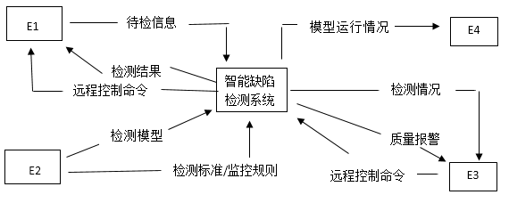
    <br>
    <div style="color:orange; border-bottom: 1px solid #d9d9d9;
    display: inline-block;
    color: #999;
    padding: 2px;">图1-1 顶层图</div>
</center>

<center>
    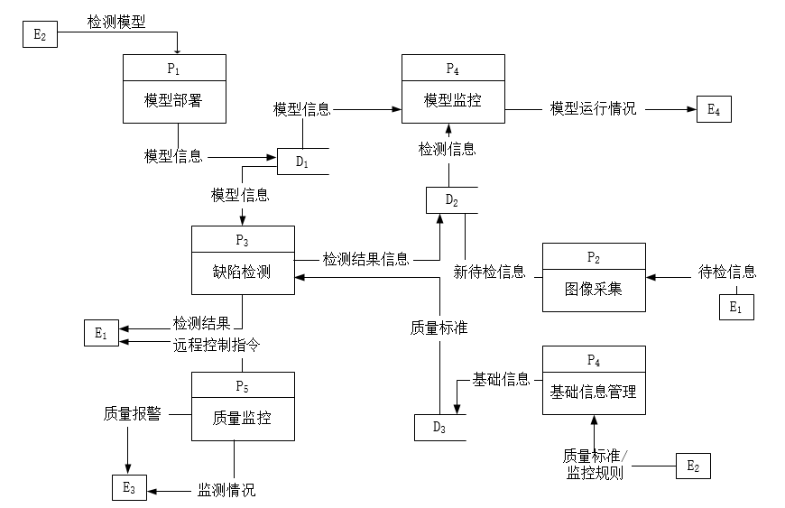
    <br>
    <div style="color:orange; border-bottom: 1px solid #d9d9d9;
    display: inline-block;
    color: #999;
    padding: 2px;">图1-2 0层图</div>
</center>
   
【问题1】（4分）  

使用说明中的语句，给出图1-1中的实体E1~ E4的名称。

【问题2】（3分）  

使用说明中的语句，给出图1-2中的数据存储D1~D3的名称。

【问题3】（5分）  

根据注明和图中术语，补充图1-2中缺失的数据及起点和终点。

【问题4】（3分）  

根据说明，采用结构化语言对“缺陷检测”的加工逻辑进行描述。

<div style="display: inline;">
<h4>参考答案</h4>
<p>
【问题1】（4分） <br>

E1：检测设备；E2：管理员；E3：检测业务员；E4：监控人员 <br> <br>

【问题2】（3分） <br>

D1：检测模型文件；D2：产品检测信息文件；D3：基础信息文件 <br> <br>

【问题3】（5分） <br>

待检信息 ，起点：P2，终点：P3   <br>

远程控制命令，起点：E3，终点：P5 <br>

监控规则，起点：D3，终点：P6 <br>

基础信息，起点：D3，终点：P5 <br>

检测信息，起点：D2，终点：P5 <br> <br>

【问题4】（3分）  <br>

根据说明，采用结构化语言对缺陷检测的加工逻辑进行描述。
</p>

<code>缺陷检测｛</code>
<code>WHILE(接收图像)</code>
<code>DO{</code>
<code>检测所收到的所有图像； </code>
<code>IF(出现一张图像检测不合格)</code>
<code>THEN{</code>
<code>返回产品不合格；</code>
<code>不合格产品检测结果=产品星号+不合格类型；</code>
<code>}</code>
<code>ENDIF</code>
<code>} ENDDO</code>
<code>｝</code>

</div>

<div style="display: inline;">
<h4>解析</h4>
<p>
问题1： <br>

对于这类型题型的分析，我们可以直接看到0层图比较合适，找到对应的实体与其所在加工名称，并在题干描述找到关键信息。 <br>

根据“实时接收生产线上检测设备拍摄的产品待检信息进行存储和缺陷检测”，”给检测设备发送检测结果”，“系统给检测设备发送控制指令进行处理”可知E1为检测设备； <br>

根据“管理员对常用机器学习方法建立的检测模型分布”，“管理员对检测标准和检测规则等基础信息设置”可知E2为管理员； <br>

根据“根据监控规则对产品质量进行监控，将检测情况展示给检测业务员，若满足报警条件。向检测业务员发送质量报警，检测业务员发起远程控制命令”可知E3为业务员； <br>

根据“在系统中部署的模型、产品的检测信息结合基础信息进行监测分析，将模型运行情况发给监控人员。”可知E4为监控人员。 <br> <br>

问题2： <br>

由于题干中没有对于这些存储进行介绍，所以我们根据关于该存储的信息流来判断该存储存放的内容，然后在其后附加文件、表、记录的关键词即可，表示数据存储，那D1、D2、D3可分别为： <br>

D1：检测模型文件；D2：产品检测信息文件；D3：基础信息文件 <br> <br>

问题3： <br>

可根据数据流图平衡原则得： <br>
0层图缺少了一条由E3流向检测系统的名为远程控制命令的数据流。 <br>

根据（5）质量监控描述可得应该补充一条由E3到P5的远程控制命令的数据流。其次再根据（5）质量监控的说明“ 根据监控规则对产品质量进行监控，将检测情况展示给检测业务员”说明加工“质量监控”需要D3“基础信息”中监控规则，产品信息来源于产品图像的D2“检测信息”；没有把说明（3）加工“图像采集”相关输出的数据流完整给出，缺少“产品待检信息进行缺陷检测”，即P2为起点、P3为终点的待检信息；说明（6）根据描述“对系统部署的模型、产品检测信息结合基础信息进行监测分析”可知需要从D3中读取“基础信息”。 <br> <br>

问题4： <br>
本问题采用结构化有语言描述“缺陷检测”加工逻辑。常用的加工逻辑描述方法有结构化语言、判定表和判定树。 <br>

根据规则说明：答案言之有理即可。
</p>
</div>

***
### 试题二
(共 15 分)

【说明】

M集团拥有多个分公司，为了方便集团公司对各个分公司职员进行有效管理，集团公司决定构建一个信息平台以满足公司各项业务管理需求。

【需求分析】

   1.分公司关系模式需要记录的信息包括分公司编号、名称、经理号、联系地址和电话。分公司编号唯一标识分公司关系模式中的每一个元组。 每个分公司只有一名经理，负责该分公司的管理工作。每个分公司设立仅为本分公司服务的多个业务部。业务部包括:研发部、财务部、采购部、销售部等。
   
   2.业务部关系模式需要记录的信息包括业务部编号、名称、主管号、电话和分公司编号。业务部编号唯一标 识业务部关系模式中的每一个元组。每个业务部只有一名主管，负责该业务部的管理工作。每个业务部有多名职员，每名职员只能隶属于一个业务部。
   
   3.职员关系模式需要记录的信息包括职员号、姓名、所属业务部编号、岗位、电话、家庭成员姓名和成员关系。其中，职员号唯一标识职员关系模式中的每一个 元组。岗位包括:经理、主管、研发员、业务员等。
   
【概念模式设计】

<center>
    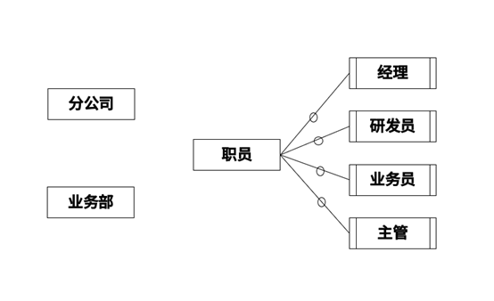
    <br>
    <div style="color:orange; border-bottom: 1px solid #d9d9d9;
    display: inline-block;
    color: #999;
    padding: 2px;">图2-1 实体-联系图</div>
</center>

【关系模式设计】

分公司（分公司编号、名称、(a)、 联系地址 ）

业务部（业务部号、名称、(b)、 电话）

职员（职员号、姓名、岗位、(c)、 电话、家庭成员姓名、成员关系）

【问题1】（4分）

根据问题描述，补充4个联系，完善图2-1的实体联系图，联系名可用联系1、联系2、联系3和联系4代替 ，联系的类型为1 : 1、1 : n和m: n（或1 : 1、1: *和*:*）

【问题2】（3分）

根据题意，将以上关系模式中的空(a) ~ (c)的属性补充完整，并填入答题纸的对应位置上。

【问题3】（4分）

（1）分析分公司关系模式的主建和外键。

（2）分析业务部关系模式的主建和外键。

【问题4】（4分）

在职员关系模式中，假设每个职员有多名家庭成员，那么职员关系模式存在什么问题？应如何解决？

<div style="display: inline;">
<h4>参考答案</h4>
<p>
【问题1】
</p>

<center>
    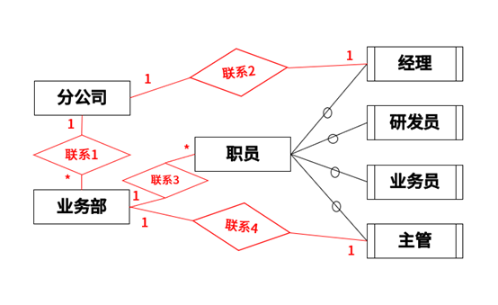
    <br>
    <div style="color:orange; border-bottom: 1px solid #d9d9d9;
    display: inline-block;
    color: #999;
    padding: 2px;"></div>
</center>

<p>
【问题2】

（a）经理号，电话

（b）分公司编号，主管号

（c）所属业务部编号

【问题3】
</p>

<center>
    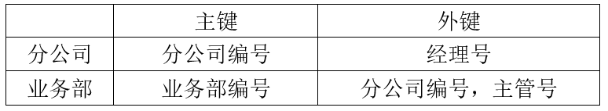
    <br>
    <div style="color:orange; border-bottom: 1px solid #d9d9d9;
    display: inline-block;
    color: #999;
    padding: 2px;"></div>
</center>

<p>
【问题4】

在职员关系中，如果每个职员有多名家庭成员，会重复记录多条职员信息及对应家庭成员，为了区分各条记录，职员关系的主键需要设定为（职员号，家庭成员姓名），会产生数据冗余、插入异常、更新异常、删除异常等问题。

处理方式：

对职员关系模式进行拆分，职员1（职员号、姓名、岗位、所属业务部编号，电话）；职员2（职员号，家庭成员姓名，关系）。
</p>

<div style="display: inline;">
<h4>解析</h4>
<p>
问题1：<br>

根据描述：“每个分公司只有一名经理”，可知分公司与经理是1：1的关系；“每个分公司设立仅为本分公司服务的多个业务部”可知分公司与业务部是1：*的关系；“每个业务部只有一名主管，负责该业务部的管理工作。每个业务部有多名职员，每名职员只能隶属于一个业务部。”可知业务部与主管为1：1，业务部与职员是1：*关系。<br><br>

问题2：<br>

补充联系属性需要依赖ER转关系模式的原则和题干描述。<br>

“分公司关系模式需要记录的信息包括分公司编号、名称、经理号、联系地址和电话”，对比可知a缺少  （经理号，电话）<br>

“业务部关系模式需要记录的信息包括业务部编号、名称、主管号、电话和分公司编号”，对比可知b缺少（主管号、分公司编号）<br>

“职员关系模式需要记录的信息包括职员号、姓名、所属业务部编号、岗位、电话、家庭成员姓名和成员关系”，对比可知c缺少（所属业务部编号）<br><br>

问题3：<br>

判断主外键的问题需要根据题目描述，带有唯一标识这类都是主键。<br>

由“ 分公司编号唯一标识分公司关系模式中的每一个元组”可知，分公司的主键是分公司编号，外键是经理与分公司1:1归并过来的经理号<br>

由“业务部编号唯一标 识业务部关系模式中的每一个元组”可知，业务部的主键是业务部编号，外键是分公司与业务部的1:*归并过来的分公司编号和业务部与主管1:1归并过来的主管号。<br><br>

问题4：<br>

在职员关系中，如果每个职员有多名家庭成员，会重复记录多条职员信息及对应家庭成员，为了区分各条记录，职员关系的主键需要设定为（职员号，家庭成员姓名），会产生数据冗余、插入异常、更新异常、删除异常等问题。<br><br>

处理方式：<br>

对职员关系模式进行拆分，职员1（职员号、姓名、岗位、所属业务部编号，电话）；职员2（职员号，家庭成员姓名，关系）。
</p>
</div>

***
### 试题三
(共 15 分)

某房产公司，欲开发一个房产信息管理系统，其主要功能描述如下：

1.公司销售的房产(Property) 分为住宅(House) 和公寓(Cando) 两类。针对每套房产，系统存储房产证明、地址、建造年份、建筑面积、销售报价、房产照片以及销售状态(在售、售出、停售)等信息。对于住宅，还需存储楼层、公摊面积、是否有地下室等信息；对于公寓，还需存储是否有阳台等信息。

2.公司雇佣了多名房产经纪(Agent)负贵销售房产。系统中需存储房产经纪的基本信息，包括：姓名、家庭住址、联系电话、受雇的起止时间等。一套房产同一时段仅由一名房产经纪负贵销售，系统中会记录房产经纪负责每套房产的起始时间和终止时间。

3.系统用户(User)包括房产经纪和系统管理员(Manager)。用户需经过系统身份验证之后才能登录系统。房产经纪登录系统之后，可以录入负责销售的房产信息，也可以查询所负责的房产信息。房产经纪可以修改其负责的房产信息，但需要经过系统管理员的审批授权。

4.系统管理员可以从系统中导出所有房产的信息报表。系统管理员定期将售出和停售的房产信息进行归档。若公司确定不再销售某套房产，系统管理员将该房产信息从系统中删除。
现采用面向对象方法开发该系统，得到如图3-1所示的用例图和图3-2所示的初始类图。

<center>
    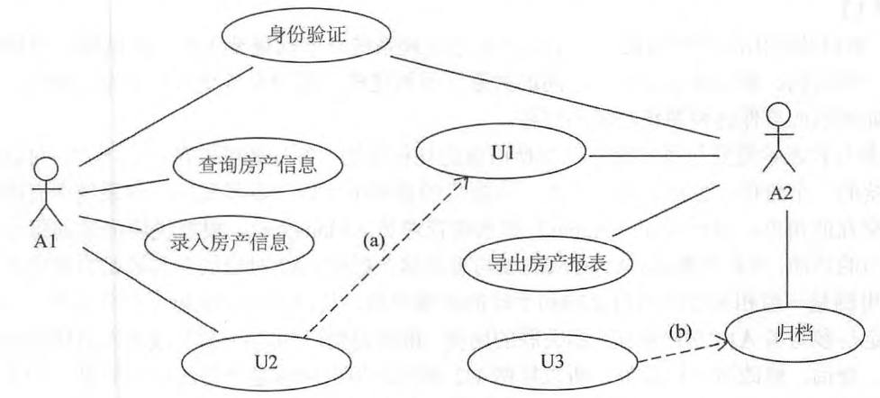
    <br>
    <div style="color:orange; border-bottom: 1px solid #d9d9d9;
    display: inline-block;
    color: #999;
    padding: 2px;">图3-1 用例图</div>
</center>

<center>
    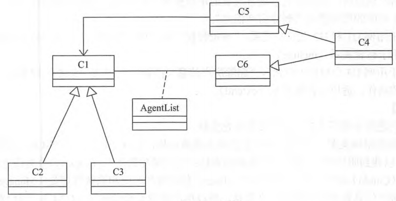
    <br>
    <div style="color:orange; border-bottom: 1px solid #d9d9d9;
    display: inline-block;
    color: #999;
    padding: 2px;">图3-2 类图</div>
</center>

【问题1】（7分）

（1）根据证明中描述，分别给图3-1中A1到A2所对应的名称以及U1~U3所对应的用例名称。

（2）根据证明中描述，分别给图3-1中(a)和(b)用例之间的关系。

【问题2】（6分）

根据证明中描述，分别给图3-2中C1~C6所对应的类名称。

【问题3】（2分）

图3-2中AgentList是一个英文名称，用来进一步阐述C1和C6之间的关系，根据注明中的描述，绘出AgentList的主要属性。

<div style="display: inline;">
<h4>参考答案</h4>
<p>
问题1】（7分）<br>

A1：房产经纪；A2：系统管理员<br>

U1：审批授权；U2：修改房产信息；U3：删除房产信息<br>

（a）：<code><<include>></code>；（b）：<code><<extend>></code><br><br>

【问题2】（6分）<br>

C1: Property              C2: House                     C3:  Cando<br>

C4： User                      C5：Manager             C6：Agent<br><br>

【问题3】（2分）<br>

AgentList的主要属性有：房产经纪负责该房产的起始时间和结束时间
</p>
</div>

<div style="display: inline;">
<h4>解析</h4>
<p>
问题1：<br>

关于该用例图中需要找出对应的参与者与用例，参与者一般指人名词表示，用例一般表示操作用动名词表示。<br>

“ 房产经纪登录系统之后，可以录入负责销售的房产信息，也可以查询所负责的房产信息。房产经纪可以修改其负责的房产信息”可知A1是房产经纪，<br>

“系统管理员可以从系统中导出所有房产的信息报表。系统管理员定期将售出和停售的房产信息进行归档”，可知A2是系统管理员。<br>

根据描述“房产经纪可以修改其负责的房产信息，但需要经过系统管理员的审批授权。”和“系统管理员将该房产信息从系统中删除。”可知U1为审批授权，U2为修改房产信息，U3为删除房产信息。<br>

a是U1和U2的关系，U2指向U1，先修改房产信息，再审批授权，典型的包含关系，使用关键词《include》<br>

b是U3与归档的关系，正常进行归档，对于不再销售的房产信息进行删除，典型的扩展关系，使用关键词《extend》<br><br>

问题2：<br>

根据类图对应的描述，两组泛化关系，C1与C2、C3以及C4与C5、C6，再根据C1与C6和C5有关系，以及题干典型的两组泛化关系可得：<br>

C1: Property              C2: House                     C3:  Cando<br>

C4： User                      C5：Manager             C6：Agent<br><br>

问题3：<br>

AgentList的主要属性有：房产经纪负责该房产的起始时间和结束时间<br>
</p>
</div>

***
### 试题四
(共 15 分)

希尔排序算法又称最小增量排序算法，其基本思想是：

步骤1：构造一个步长序列delta1、delta2…、deltak，其中delta1=n/2，后面的每个delta是前一个的1/2 ， deltak=1；

步骤2：根据步长序列、进行k趟排序；

步骤3：对第i趟排序，根据对应的步长delta，将等步长位置元素分组，对同一组内元素在原位置上进行直接插入排序。

【C代码】

下面是算法的C语言实现。

（1）常量和变量说明

data：待排序数组data，长度为n，待排序数据记录在data[0]、data[1]、…、data[n-1]中。

n：数组a中的元素个数。

delta：步长数组。

（2）C程序
```
#include <stdio.h>

void shellsort(int data[ ], int n){
    int *delta,k,i,t,dk,j;
    k=n;
    delta=(int *)nalloc(sizeof(int)*(n/2));
    if(i=0)
        do{
            ( 1 ) ; 
            delta[i++]=k;
        }while ( 2 ) ; 
    i=0;
    while((dk=delta[i])>0){
        for(k=delta[i];k<n;++k)
        if( ( 3 ) ) { 
            t=data[k];
            for(j=k-dk;j>=0&&t<data[j];j-=dk){
                data[j+dk]=data[j];
            }/*for*/
        ( 4 ) ; //data[j+dk]=t;
        }/*if*/
        ++i;
    }/*while*/
}
```

【问题1】（8分）

根据说明和c代码，填充c代码中的空（1）~ （4）。

【问题2】（4分）

根据说明和c代码，该算法的时间复杂度（5）O(n2) （小于、等于或大于）。该算法是否稳定（6）（是或否）。

【问题3】（3分）

对数组（15、9、7、8、20、-1、 4）用希尔排序方法进行排序，经过第一趟排序后得到的数组为（7）。

<div style="display: inline;">
<h4>参考答案</h4>
<p>
【问题1】（8分）<br>

（1）<code>k=k/2</code><br>

（2）<code>k>1</code><br>

（3）<code>data[k]<data[k-dk]</code><br>

（4）<code>data[j+dk]=t</code><br><br>

【问题2】（4分）<br>

（5）小于<br>

（6）否<br><br>

【问题3】（3分）<br>

（7）</code>(4，9，-1，8，20，7，15)</code>
</p>
</div>


***
### 试题五
(共 15 分)

阅读下列说明和C++代码，将应填入（n）处的字句写在答题纸的对应栏内。

【说明】

在线支付是电子商务的一个重要环节，不同的电子商务平台提供了不同的支付接口。现在需要整合不同电子商务平台的支付接口，使得客户在不同平台上购物时，不需要关心具体的支付接口。拟采用中介者(Mediator) 设计模式来实现该需求，所设计的类图如图5-1所示。

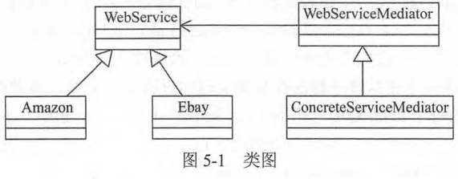

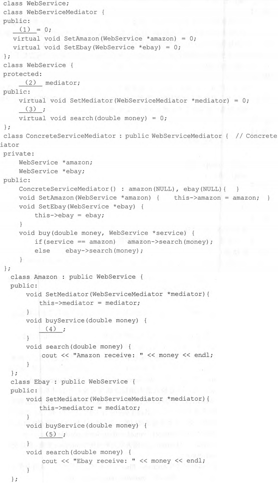

<div style="display: inline;">
<h4>参考答案</h4>
<p>
(1) <code>virtual void buy(double money, WebService *service)</code><br>
(2) <code>WebServiceMediator *</code><br>
(3) <code>virtual void buyService(double money)= 0</code><br>
(4) <code>mediator->buy(money, this)</code><br>
(5) <code>mediator->buy(money, this)</code><br>
</p>
</div>

<div style="display: inline;">
<h4>解析</h4>
<p>
（1）空是属于接口WebServiceMeditor内的方法，我们可以通过下文的实现类中找到ConcreteServiceMeditor可知缺少了一个buy（）方法
故第一空填写 virtual void buy(double money, WebService *service)  ；<br>

（2）空类WebService中属性的参数类型,Colleague与Mediator之间的关联关系由属性meditor实现，所以第2空应该填写WebServiceMediator*；<br>

（3）空类WebService中的 virtual 方法，根据其具体子类可以看到缺少的是buyService方法，书写成  virtual void buyService(double money)= 0  ；<br>

（4）空和（5）空具体同事类Amazon、Ebay与中介者的通信，调用中介者之间的支付接口，所以空（4）和（5）都填写 mediator->buy(money, this)  。
</p>
</div>

***
### 试题六
(共 15 分)

阅读下列说明和Java代码，将应填入（n） 处的字句写在答 题纸的对应栏内。

【说明】

在线支付是电子商务的一一个重要环节，不同的电子商务平台提供了不同的支付接口。现在需要整合不同电子商务平台的支付接口，使得客户在不同平台上购物时，不需要关心具体的支付接口。拟采用中介者(Mediator) 设计模式来实现该需求，所设计的类图如图6-1所示。


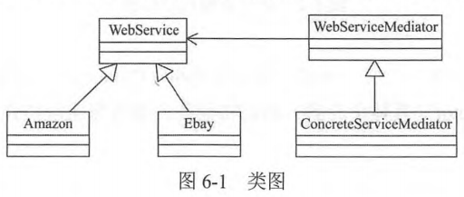

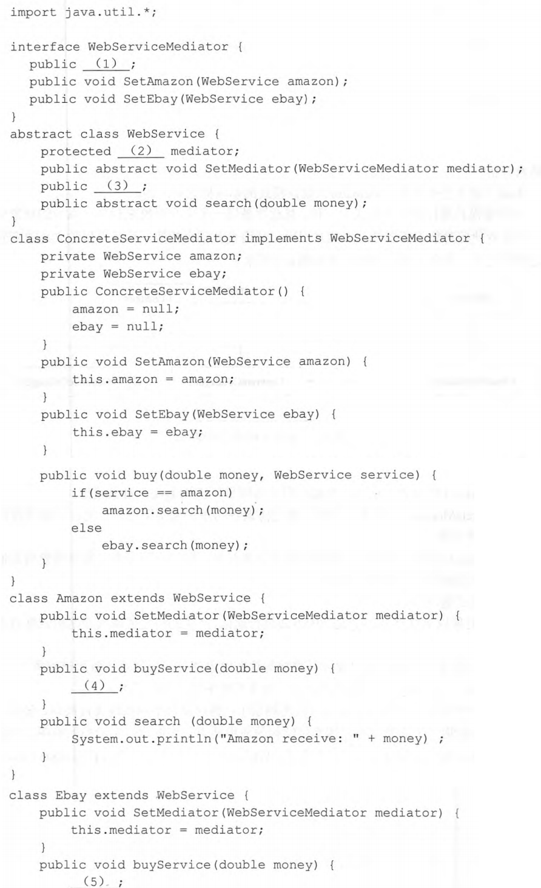

<div style="display: inline;">
<h4>参考答案</h4>
<p>
(1) <code>void buy(double money, WebService service)</code>
(2) <code>WebServiceMediator*</code>
(3) <code>abstract void buyService(double money)</code>
(4) <code>mediator.buy(money, this)</code>
(5) <code>mediator.buy(money, this)</code>
</p>
</div>

<div style="display: inline;">
<h4>解析</h4>
<p>
（1）空是属于接口WebServiceMeditor内的方法，我们可以通过下文的实现类中找到ConcreteServiceMeditor可知缺少了一个buy（）方法
故第一空填写void buy(double money, WebService service)；<br>

（2）空类WebService中属性的参数类型,Colleague与Mediator之间的关联关系由属性meditor实现，所以第2空应该填写WebServiceMediator*；<br>

（3）空类WebService中的抽象方法，根据其具体子类可以看到缺少的是buyService方法，书写成 abstract void buyService(double money)；<br>

（4）空和（5）空具体同事类Amazon、Ebay与中介者的通信，调用中介者之间的支付接口，所以空（4）和（5）都填写mediator.buy(money, this)。<br>
</p>
</div>

***
