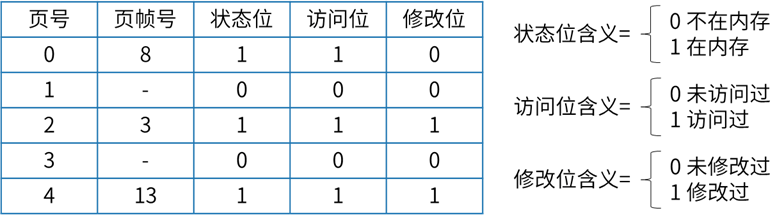

# 2021上半年软件设计师考试真题-上午卷
## 索引
||||||
|:|:|:|:|:|
| [1、寄存器](#1、) | [2、RISC和CISC计算机](#2、) | [3、DMA(Direct Memory Access，直接存储器访问) ](#3、) | [4、闪存(Flash Memory)](#4、) | [5、磁盘的转速](#5、) |
| [6、中断和异常](#6、) | [7、安全远程登录协议](#7、) | [8、攻击类型](#8、) | [9、加密算法](#9、) | [10、SQL注入攻击](#10、) |
| [11、IP数据报文进行加密](#11、) | [12、《计算机软件保护条例》](#12、) | [13、软件著作权](#13、) | [14、知识产权](#14、) | [15、数据字典中加工逻辑](#15、) |
| [16、模块设计原则](#16、) | [17-18、进度网络图分析](#17-18、) | / | [19、风险](#19、) | [20、二叉树表示的算术表达式](#20、) |
| [21、语义分析阶段](#21、) | [22、Java语言符合的特征](#22、) | [23、云计算有多种部署模型(Deployment Models)](#23、) | [24、位示图](#24、) | [25、页面变换表及状态位、访问位和修改位的含义](#25、)  |
| [26-28、前趋图与PV操作](#26-28、)  | / | / | [29-30、软件生存周期模型](#29、) | / |
| [31、数据耦合](#31、) | [32、软件详细设计阶段的主要任务](#32、) | [33、文档](#33、) | [34、白盒测试技术](#34、) | [35、软件可维护性计算公式](#35、) |
| [36、软件维护](#36、) | [37、面向对象分析](#37、) | [38、面向对象设计的几大原则](#38、) | [39-40、UML类图的几种关系](#39-40、) | / |
| [41-43、UML状态图](#41-43、) | / | / | [44-47、设计模式](#44-47、) | / |
| / | / | [48-49、有限自动机（DFA）](#48-49、) | / | [50、引用调用（call by reference）和值调用（call by value）](#50、) |
| [51、E-R转换为关系模式的转换规则](#51、) | [52-53、候选键分析、传递依赖、冗余函数依赖](#52-53、) | / | [54-56、数据关系代数](#54-56、) | / |
| / | [57、栈和队列](#57、) | [58、二叉树](#58、) | [59、对稀疏矩阵进行压缩存储](#59、) | [60、哈希查找表](#60、) |
| [61、排序方法](#61、) | [62、大顶堆和小顶堆](#62、) | [63、算法的时间复杂度](#63、) | [64-65、算法策略](#64-65、) | / |
| [66、IPv4 与 IPv6 的比较](#66、) | [67、应用层协议](#67、) | [68、邮件的协议](#68、) | [69、清除本地DNS缓存的命令](#69、) | [70、网络系统设计](#70、) |
| [71-75、Designing object -oriented software](#71-75、) |
</div>

***
考试时间：150分钟

考试总分：75分（45分及格）

**遵守考场纪律，维护知识尊严，杜绝违纪行为，确保考试结果公正。**

单选题(共 75 题,共 75 分)

</div>

***
#### 1、
1.在CPU中，用（  ）给出将要执行的下一条指令在内存中的地址。

A.程序计数器          B.指令寄存器          C.主存地址寄存器          D.状态条件寄存器
<div style="display: inline;">
<h4>答案</h4>
A
<h4>解析</h4>
A选项程序计数器PC：存储下一条要执行指令的地址。本题选择A选项。<br>

B选项指令寄存器IR：存储即将执行的指令。<br>

C选项主存地址寄存器MAR：用来保存当前CPU所访问的内存单元的地址。<br>

D选项状态条件寄存器PSW：存状态标志与控制标志 。<br>

- 程序计数器(Program Counter, PC):<br>

*用于存放下一条指令所在单元的地址。*<br>

当执行一条指令时，首先需要根据PC中存放的指令地址，将指令由内存取到指令寄存器中，此过程称为“取指令”。与此同时，PC中的地址或自动加1或由转移指针给出下一条指令的地址。此后经过分析指令，执行指令。完成第一条指令的执行，而后根据PC取出第二条指令的地址，如此循环，执行每一条指令。<br>

- 指令寄存器(Instruction Register, IR):<br>

*用于暂存当前正在执行的指令。*<br>

指令寄存器的时钟信号是clk，在clk的上升沿触发。指令寄存器将数据总线送来的指令存入16位的寄存器中，但并不是每次数据总线上的数据都需要寄存，因为数据总线上有时传输指令，有时传输数据。由CPU状态控制器的 Ir_ena信号控制数据是否需要寄存。复位时，指令寄存器被清零。<br>

- 主存地址寄存器(Address Register, AR):<br>

*用来保存当前CPU所访问的内存单元的地址。*<br>

由于在内存和CPU之间存在着操作速度上的差别，所以必须使用地址寄存器来保持地址信息，直到内存的读/写操作完成为止 。<br>

- 状态条件寄存器(Program Status Word, PSW):<br>

*保存由算术指令和逻辑指令运行或测试的结果建立的各种条件码内容。*<br>

如运算结果进位标志（C），运算结果溢出标志（V），运算结果为零标志（Z），运算结果为负标志（N），中断标志（I），方向标志（D）和单步标识等。这些标志位通常分别由1位触发器保存，保存了当前指令完成之后的状态，通常，一个算术操作产生一个运算结果，而一个逻辑操作则产生一个判决。<br>

除此之外，状态条件寄存器还保存中断和系统工作状态等信息，以便使CPU和系统能及时了解机器运行状态和程序运行状态。因此，状态条件寄存器是一个由各种状态条件标志拼凑而成的寄存器。 <br>

- 指令译码器(Instruction Decoder, ID):<br>

*对指令寄存器中的指令的操作码字段进行译码分析解释，指出指令的操作种类和寻址方式。*<br>

**计算机能且只能执行“指令”。指令由操作码和地址码组成。**<br>

操作码表示要执行的操作性质，即执行什么操作，或做什么；地址码是操作码执行时的操作对象的地址。计算机执行一条指定的指令时，必须首先分析这条指令的操作码是什么，以决定操作的性质和方法，然后才能控制计算机其他各部件协同完成指令表达的功能。这个分析工作由指令译码器来完成。指令执行通过控制部件进行指令译码，标量指令由标量处理机执行向量指令各Cache控制器监听总线所有操作，并对操作做相应处理（修改或作废），如MESI协议。
</div>

***
#### 2、
以下关于RISC和CISC计算机的叙述中，正确的是（  ）。

A.RISC不采用流水线技术，CISC采用流水线技术

B.RISC使用复杂的指令，CISC使用简单的指令

C.RISC采用很少的通用寄存器，CISC采用很多的通用寄存器

D.RISC采用组合逻辑控制器，CISC普遍采用微程序控制器
<div style="display: inline;">
<h4>答案</h4>
D
<h4>解析</h4>
CISC(Complex Instruction Set Computers，复杂指令集计算集) 和 RISC(Reduced Instruction Set Computers, 精简指令集计算机) 是两大类主流的CPU指令集类型，其中CISC以Intel，AMD的X86 CPU为代表，而RISC以ARM，IBM Power为代表。<br><br>

从计算机诞生以来，人们一直沿用CISC指令集方式。早期的桌面软件是按CISC设计的，并一直沿续到现在。目前，桌面计算机流行的x86体系结构即使用CISC。微处理器（CPU）厂商一直在走CISC的发展道路，包括Intel、AMD，还有其他一些现在已经更名的厂商，如TI（德州仪器）、IBM以及VIA（威盛）等。在CISC微处理器中，程序的各条指令是按顺序串行执行的，每条指令中的各个操作也是按顺序串行执行的。顺序执行的优点是控制简单，但计算机各部分的利用率不高，执行速度慢。CISC架构的服务器主要以IA-32架构（Intel Architecture，英特尔架构）为主，而且多数为中低档服务器所采用。<br><br>

RISC是一种执行较少类型计算机指令的微处理器，起源于80年代的MIPS主机（即RISC机），RISC机中采用的微处理器统称RISC处理器。这样一来，它能够以更快的速度执行操作（每秒执行更多百万条指令，即MIPS）。因为计算机执行每个指令类型都需要额外的晶体管和电路元件，计算机指令集越大就会使微处理器更复杂，执行操作也会更慢。<br><br>

A选项：RISC适合流水线，CISC不适合。<br>

B选项：RISC是精简指令集系统计算机简称，使用简单的指令。CISC是复杂指令集系统计算机简称，使用复杂的指令。<br>

C选项：RISC多寄存器寻址，所以会在实现过程中增加通用寄存器，CISC不需要采用很多通用寄存器。<br>

D选项：RISC采用硬布线逻辑（即组合逻辑控制器）实现，CISC采用微码（即微程序）实现。D选项的说法是正确的。<br>

<center>
    
    <br>
    <div style="color:orange; border-bottom: 1px solid #d9d9d9;
    display: inline-block;
    color: #999;
    padding: 2px;"></div>
</center>
</div>

#### 指令的寻址方式

指令的寻址方式包含顺序寻址方式和跳跃寻址方式，顺序寻址方式是当执行一段程序时，是一条指令接着一条指令地顺序执行。跳跃寻址方式是指下一条指令的地址码不是由程序计数器给出的，而是由指令直接给出的。程序跳跃后按新的指令地址开始顺序执行，因此程序计数器的内容也必须相应的改变，以便及时跟踪新的指令地址。

#### 指令操作数的寻址方式
指令操作数的寻址方式包含立即寻址方式、直接寻址方式、间接寻址方式、寄存器寻址方式、其他寻址方式。

立即寻址方式：指令的地址码字段指出的不是地址，而是操作数本身。

直接寻址方式：在指令的地址字段中直接指出操作数在主存中的地址。

间接寻址方式：指令地址码字段所指向的存储单元中存储的是操作数的地址。

寄存器寻址方式：指令中的地址码是寄存器的编码。

**指令流水线的原理**是将指令分成不同段，每段由不同的部分去处理，因此可以产生叠加的效果，所有的部件去处理指令的不同段。

#### CISC与RISC的区别
我们经常谈论有关“PC”与“Macintosh”的话题，但是又有多少人知道以Intel公司X86为核心的PC系列正是基于CISC体系结构，而 Apple公司的Macintosh则是基于RISC体系结构，CISC与RISC到底有何区别？

从硬件角度来看CISC处理的是不等长指令集，它必须对不等长指令进行分割，因此在执行单一指令的时候需要进行较多的处理工作。而RISC执行的是等长精简指令集，CPU在执行指令的时候速度较快且性能稳定。因此在并行处理方面RISC明显优于CISC，RISC可同时执行多条指令，它可将一条指令分割成若干个进程或线程，交由多个处理器同时执行。由于RISC执行的是精简指令集，所以它的制造工艺简单且成本低廉。

从软件角度来看，CISC运行的则是我们所熟识的DOS、Windows操作系统。而且它拥有大量的应用程序。因为全世界有65%以上的软件厂商都理为基于CISC体系结构的PC及其兼容机服务的，象赫赫有名的Microsoft就是其中的一家。而RISC在此方面却显得有些势单力薄。虽然在RISC上也可运行DOS、Windows，但是需要一个翻译过程，所以运行速度要慢许多。

目前CISC与RISC正在逐步走向融合，PenTIum Pro、Nx586、K5就是一个最明显的例子，它们的内核都是基于RISC体系结构的。他们接受CISC指令后将其分解分类成RISC指令以便在遇一时间内能够执行多条指令。由此可见，下一代的CPU将融合CISC与RISC两种技术，从软件与硬件方面看二者会取长补短。

特点区别各方面如下：

1、指令系统

CISC

计算机的指令系统比较丰富，有专用指令来完成特定的功能。因此，处理特殊任务效率较高。

RISC

设计者把主要精力放在那些经常使用的指令上，尽量使它们具有简单高效的特色。对不常用的功能，常通过组合指令来完成。因此，在RISC 机器上实现特殊功能时，效率可能较低。但可以利用流水技术和超标量技术加以改进和弥补。

2、存储器操作

CISC

机器的存储器操作指令多，操作直接。

RISC

对存储器操作有限制，使控制简单化。

3、程序

CISC

汇编语言程序编程相对简单，科学计算及复杂操作的程序社设计相对容易，效率较高。

RISC

汇编语言程序一般需要较大的内存空间，实现特殊功能时程序复杂，不易设计。

4、中断

CISC

机器是在一条指令执行结束后响应中断。

RISC

机器在一条指令执行的适当地方可以响应中断。

5、CPU

CISC

CPU包含有丰富的电路单元，因而功能强、面积大、功耗大。

RISC

CPU包含有较少的单元电路，因而面积小、功耗低。

6、设计周期

CISC

微处理器结构复杂，设计周期长。

RISC

微处理器结构简单，布局紧凑，设计周期短，且易于采用最新技术。

7、用户使用

CISC

微处理器结构复杂，功能强大，实现特殊功能容易。

RISC

微处理器结构简单，指令规整，性能容易把握，易学易用。

8、应用范围

CISC

机器则更适合于通用机。

RISC

由于RISC指令系统的确定与特定的应用领域有关，故RISC 机器更适合于专用机。

***
#### 3、
采用DMA方式传送数据时，每传送一个数据都需要占用一个（  ）。

A.指令周期    B.总线周期    C.存储周期    D.机器周期
<div style="display: inline;">
<h4>答案</h4>
C
<h4>解析</h4>
DMA(Direct Memory Access，直接存储器访问) 是所有现代电脑的重要特色，它允许不同速度的硬件装置来沟通，而不需要依赖于 CPU 的大量中断负载。否则，CPU 需要从来源把每一片段的资料复制到暂存器，然后把它们再次写回到新的地方。在这个时间中，CPU 对于其他的工作来说就无法使用。<br><br>

DMA是直接内存存取，传送数据的时间只与内存相关，与CPU的时间无关。<br><br>

采用DMA方式传送数据时，每传送一个数据需要占用CPU一个存取周期，即在该存取周期内，CPU不能访存。
</div>

***
#### 4、
以下关于闪存(Flash Memory)的叙述中，错误的是（  ）。

A.掉电后信息不会丢失，属于非易失性存储器

B.以块为单位进行删除操作

C.采用随机访问方式，常用来代替主存

D.在嵌入式系统中可以用Flash来代替ROM存储器
<div style="display: inline;">
<h4>答案</h4>
C
<h4>解析</h4>
闪存（Flash Memory）是一种长寿命的非易失性（在断电情况下仍能保持所存储的数据信息）的存储器，数据删除不是以单个的字节为单位而是以固定的区块为单位，区块大小一般为256KB到20MB。<br><br>

闪存是电子可擦除只读存储器（EEPROM）的变种，EEPROM与闪存不同的是，它能在字节水平上进行删除和重写而不是整个芯片擦写，这样闪存就比EEPROM的更新速度快。由于其断电时仍能保存数据，闪存通常被用来保存设置信息。<br><br>

闪存不像随机存取存储器(Random Access Memory, RAM) 一样以字节为单位改写数据，因此不能取代RAM，也不能替换主存，因此C选项错误。但是在嵌入式中，可以用闪存代替ROM存储器。
</div>

***
#### 5、
若磁盘的转速提高一倍，则（  ）。

A.平均存取时间减半  B.平均寻道时间加倍  C.旋转等待时间减半   D.数据传输速率加倍
<div style="display: inline;">
<h4>答案</h4>
C
<h4>解析</h4>
磁盘的平均存取时间、数据传输速率与磁盘转速以及移臂调度时间都相关，所以无法直接通过磁盘的转速提高一倍就直接提高效率。<br>

磁盘的平均寻道时间与磁盘转速无关，至于移臂调度有关，也无法因此加倍。<br>

只有C选项中，磁盘的旋转延迟时间至于磁盘转速相关，转速提高一倍，其时间会减半。<br>

磁盘的转速提高一倍只是提高了在选中磁道上的旋转等待时间，而**平均存取时间包括两部分，即平均寻道时间加上选中磁道上的旋转等待时间**。因此，“平均存取时间减半”的说法是错误的。<br>

平均寻道时间与磁盘的转速没有什么关系，因此，“平均寻道时间减半”的说法也是错误的。<br>

磁盘的道密度与磁盘的转速无关，绝不可能因磁盘的转速提高而使存储道密度提高一倍，因此“存储道密度提高一倍”也是错误的。<br>

数据传输速率是衡量硬盘速度的一个重要参数。它与硬盘转速、接口类型和系统总线类型有很大关系。因此“数据传输速率加倍”也是错误的。<br>

只有“平均寻道时间不变”/"旋转等待时间减半"的说法是正确的。

#### 磁盘访问时间
磁盘访问时间由寻道时间 Ts、旋转延迟时间 Tr、传输时间 Tt 三部分组成。

- 寻道时间 Ts

启动磁臂的时间s与磁头移动n条磁道所花费的时间之和

`t=m*n+s`（一般磁盘，m=0.2，高速磁盘，m<=0.1）

- 旋转延迟时间 Tr

是指定扇区移动到磁头下面所经历的时间

硬盘 15000r/min 时 Tr 为 2ms;软盘 300 或 600r/min 时 Tr 为 50~100ms。

-  传输时间 Tt

指把数据从磁盘读出或向磁盘写入数据所经历的时间

若每次读/写的字节数为b，磁盘每秒钟的转速为r，一条磁道上的字节数为N
`t=b/(rN)`
</div>

***
#### 6、
异常是指令执行过程中在处理器内部发生的特殊事件，中断是来自处理器外部的请求事件。以下关于中断和异常的叙述中，正确的是（  ）。

A.“DMA传送结束”、“除运算时除数为0”都为中断

B.“DMA传送结束”为中断，“除运算时除数为0”为异常

C.“DMA传送结束”为异常、“除运算时除数为0”为中断

D.“DMA传送结束”、“除运算时除数为0”都为异常
<div style="display: inline;">
<h4>答案</h4>
B
<h4>解析</h4>
DMA处理过程由DMAC负责，传送后会给CPU发送通知，此时属于处理器外部事件，因此属于中断。<br><br>

异常：是源自CPU执行指令内部的事件。如：除零算数错误，非法操作码，地址越界，算术溢出，虚存系统的缺页，陷入指令等引起的事件。"存储保护错“属于异常。也包括不可恢复的致命错误导致的终止，通常是一些硬件错误。内部异常不可被屏蔽，一旦出现立马处理。<br><br>

中断 ：来自CPU执行指令以外的事件。如：I/O中断，时钟中断等。<br><br>

一般而言，中断是异步的，异常是同步的，所谓同步和异步的概念，又与我们网络通信或函数调用中的同步异步有所不同。中断是来自处理器外部的I/O设备的信号的结果，它不是由指令流中某条指令执行引起的，从这个意义上讲，它是异步的，是来自指令流之外的。<br><br>

异常又分为三类：陷阱（Trap）、故障（Fault）和终止（Abort），它们都是执行当前指令流中的某条指令的结果，是来自指令流内部的，从这个意义上讲它们都是同步的。<br><br>

这种概念的识记题如果没有真的理解，就很麻烦。这里，需要特别强调的是CPU指令流相关一定是内中断，也即所谓的异常。而非CPU指令流导致的才是外中断，比如时钟中断，DMA中断等才是真正的外中断。<br><br>

访存时缺页，我们听过太多的缺页中断，缺页异常，后来根本分不清谁是谁了，只需要抓住：缺页是CPU访存指令时才有的。是CPU相关。“访存时缺页”属于异常。<br><br>

整数除0，当然是CPU干的。<br><br>

存储保护错，也是内存访问相关，属于异常，也叫内中断。
</div>

***
#### 7、
下列协议中，属于安全远程登录协议的是（  ）。

A.TLS   B.TCP    C.SSH    D.TFTP
<div style="display: inline;">
<h4>答案</h4>
C
<h4>解析</h4>
A选项：TLS安全传输层协议用于在两个通信应用程序之间提供保密性和数据完整性。<br><br>

B选项：TCP是可靠的传输层协议，与安全无关。<br><br>

C选项：SSH 为 Secure Shell 的缩写，由 IETF 的网络工作小组（Network Working Group）所制定；SSH 为建立在应用层和传输层基础上的安全协议。SSH 是目前较可靠，专为远程登录会话和其他网络服务提供安全性的协议。利用 SSH 协议可以有效防止远程管理过程中的信息泄露问题。本题选择C选项。<br><br>

D选项：TFTP（Trivial File Transfer Protocol,简单文件传输协议）是TCP/IP协议族中的一个用来在客户机与服务器之间进行简单文件传输的协议，提供不复杂、开销不大的文件传输服务。<br><br>

**SSH**<br>

SSH 为 Secure Shell 的缩写，由 IETF 的网络小组（Network Working Group）所制定；SSH 为建立在应用层基础上的安全协议。SSH 是较可靠，专为远程登录会话和其他网络服务提供安全性的协议。<br>

利用 SSH 协议可以有效防止远程管理过程中的信息泄露问题。<br>

SSH最初是UNIX系统上的一个程序，后来又迅速扩展到其他操作平台。SSH在正确使用时可弥补网络中的漏洞。SSH客户端适用于多种平台。几乎所有UNIX平台—包括HP-UX、Linux、AIX、Solaris、Digital UNIX、Irix，以及其他平台，都可运行SSH。
</div>

***
#### 8、
下列攻击类型中，（  ）是以被攻击对象不能继续提供服务为首要目标。

A.跨站脚本    B.拒绝服务    C.信息篡改    D.口令猜测
<div style="display: inline;">
<h4>答案</h4>
B
<h4>解析</h4>
A选项：跨站脚本（cross-site scripting，XSS），一种安全攻击，其中，攻击者在看上去来源可靠的链接中恶意嵌入译码。它允许恶意用户将代码注入到网页上，其他用户在观看网页时就会受到影响。不影响服务的提供。<br><br>

B选项：拒绝服务，对信息或其它资源的合法访问被无条件地阻止，会让服务器拒绝提供服务。本题选择B选项。<br><br>

C选项：信息篡改，指主动攻击者将窃听到的信息进行修改(如删除和/或替代部分或者全部信息)之后再将信息传送给原本的接受者。与提供服务无关。<br><br>

D选项：口令猜测，攻击者攻击目标时常常把破译用户的口令作为攻击的开始。只要攻击者能猜测或者确定用户的口令，他就能获得机器或者网络的访问权，并能访问到用户能访问到的任何资源。与提供服务无关。
</div>

**Dos攻击**
DoS是 Denial of Service 的简称，即拒绝服务，造成DoS的攻击行为被称为DoS攻击，其目的是使计算机或网络无法提供正常的服务。最常见的DoS攻击有计算机网络宽带攻击和连通性攻击。

SYN洪水攻击属于DoS攻击的一种，它利用TCP协议缺陷，通过发送大量的半连接请求，耗费CPU和内存资源。SYN攻击除了能影响主机外，还可以危害路由器、防火墙等网络系统，事实上SYN攻击并不管目标是什么系统，只要这些系统打开TCP服务就可以实施。

DoS的攻击方式有很多种，最基本的DoS攻击就是利用合理的服务请求来占用过多的服务资源，从而使合法用户无法得到服务的响应。

**分布式拒绝服务攻击(Distributed Denial of Service，DDoS)** 攻击手段是在传统的DoS攻击基础之上产生的一类攻击方式。单一的DoS攻击一般是采用一对一方式的，当攻击目标CPU速度低、内存小或者网络带宽小等等各项性能指标不高它的效果是明显的。随着计算机与网络技术的发展，计算机的处理能力迅速增长，内存大大增加，同时也出现了千兆级别的网络，这使得DoS攻击的困难程度加大了 - 目标对恶意攻击包的"消化能力"加强了不少，例如你的攻击软件每秒钟可以发送3,000个攻击包，但我的主机与网络带宽每秒钟可以处理10,000个攻击包，这样一来攻击就不会产生什么效果。

这时侯分布式的拒绝服务攻击手段（DDoS）就应运而生了。你理解了DoS攻击的话，它的原理就很简单。如果说计算机与网络的处理能力加大了10倍，用一台攻击机来攻击不再能起作用的话，攻击者使用10台攻击机同时攻击呢？用100 台呢？DDoS就是利用更多的傀儡机来发起进攻，以比从前更大的规模来进攻受害者。

**被DDoS攻击时的现象**

被攻击主机上有大量等待的TCP连接
网络中充斥着大量的无用的数据包，源地址为假
制造高流量无用数据，造成网络拥塞，使受害主机无法正常和外界通讯
利用受害主机提供的服务或传输协议上的缺陷，反复高速的发出特定的服务请求，使受害主机无法及时处理所有正常请求
严重时会造成系统死机

*一般来说，黑客进行DDoS攻击时会经过这样的步骤：*

1、搜集了解目标的情况 下列情况是黑客非常关心的情报：

被攻击目标主机数目、地址情况
目标主机的配置、性能
目标的带宽

2、占领傀儡机 黑客最感兴趣的是有下列情况的主机：

链路状态好的主机
性能好的主机
安全管理水平差的主机

3、实际攻击
*DoS具有代表性的攻击手段包括PingofDeath、TearDrop、UDPflood、SYNflood、LandAttack、IPSpoofingDoS等。*

要理解dos攻击，首先要理解**TCP连接的三次握手过程(Three-way handshake)**。

在TCP/IP协议中，TCP协议提供可靠的连接服务，采用三次握手建立一个连接。

第一次握手:建立连接时，客户端发送SYN包((SYN=i)到服务器，并进入SYN SEND状态，等待服务器确认;

第二次握手:服务器收到SYN包，必须确认客户的SYN (ACK=i+1 )，同时自己也发送一个SYN包((SYN=j)}即SYN+ACK包，此时服务器进入SYN_RECV状态; 

第三次握手:客户端收到服务器的SYN+ACK包，向服务器发送确认包ACK(ACK=j+1)，此包发送完毕，客户端和服务器进入ESTABLISHED状态，完成三次握手，客户端与服务器开始传送数据。

在上述过程中，还有一些重要的概念: 

半连接: 收到SYN包而还未收到ACK包时的连接状态称为半连接，即尚未完全完成三次握手的TCP连接。

半连接队列: 在三次握手协议中，服务器维护一个半连接队列，该队列为每个客户端的SYN包(SYN=i )开设一个条目，该条目表明服务器已收到SYN包，并向客户发出确认，正在等待客户的确认包。这些条目所标识的连接在服务器处于SYN_ RECV状态，当服务器收到客户的确认包时，删除该条目，服务器进入ESTABLISHED状态。
Backlog参数:表示半连接队列的最大容纳数目。

SYN-ACK重传次数: 服务器发送完SYN-ACK包，如果未收到客户确认包，服务器进行首次重传，等待一段时间仍未收到客户确认包，进行第二次重传，如果重传次数超过系统规定的最大重传次数，系统将该连接信息、从半连接队列中删除。注意，每次重传等待的时间不一定相同。

半连接存活时间: 是指半连接队列的条目存活的最长时间，也即服务从收到SYN包到确认这个报文无效的最长时间，该时间值是所有重传请求包的最长等待时间总和。有时也称半连接存活时间为Timeout时间、SYN_RECV存活时间。

#### DDoS的防范
- 主机上的设置

几乎所有的主机平台都有抵御DoS的设置，总结一下，基本的有几种：

关闭不必要的服务、限制同时打开的Syn半连接数目、缩短Syn半连接的time out 时间、及时更新系统补丁

- 网络设备上的设置

*企业网的网络设备可以从防火墙与路由器上考虑。这两个设备是到外界的接口设备，在进行防DDoS设置的同时，要注意一下这是以多大的效率牺牲为代价的，对你来说是否值得。*

１.防火墙

禁止对主机的非开放服务的访问、限制同时打开的SYN最大连接数、限制特定IP地址的访问、启用防火墙的防DDoS的属性、严格限制对外开放的服务器的向外访问、第五项主要是防止自己的服务器被当做工具去害人。

２.路由器 (以Cisco路由器为例)

Cisco Express Forwarding（CEF）、使用 unicast reverse-path、访问控制列表（ACL）过滤、设置SYN数据包流量速率、升级版本过低的ISO、为路由器建立log server

***
#### 9、
下列算法中属于非对称加密算法的是（  ）。

A.DES                 B.RSA                 C.AEC                D.MD5
<div style="display: inline;">
<h4>答案</h4>
B
<h4>解析</h4>
**摘要算法**<br>

典型的摘要算法：SHA，MD5等。<br>

SHA 安全散列算法（英语：Secure Hash Algorithm，缩写为SHA）是一个密码散列函数家族，是FIPS所认证的安全散列算法。能计算出一个数字消息所对应到的，长度固定的字符串（又称消息摘要）的算法。且若输入的消息不同，它们对应到不同字符串的机率很高。<br>

MD5 信息摘要算法（Message-Digest Algorithm），一种被广泛使用的密码散列函数，可以产生出一个128位（16字节）的散列值（hash value），用于确保信息传输完整一致。<br>

MD5由MD4、MD3、MD2改进而来，主要增强**算法复杂度**和**不可逆性**。MD5算法因其普遍、稳定、快速的特点，仍广泛应用于普通数据的加密保护领域。<br>

2004年，证实MD5算法无法防止碰撞（collision），因此不适用于安全性认证，如SSL公开密钥认证或是数字签名等用途。<br>
</div>

**对称加密算法**

对称加密算法在加密和解密时使用的是同一个秘钥。

DES、3DES、AEC、TDEA、Blowfish、RC2、RC4、RC5、IDEA、SKIPJACK 等。

**非对称加密算法**

非对称加密算法需要两个密钥来进行加密和解密，这两个密钥是公开密钥（public key，简称公钥）和私有密钥（private key，简称私钥）。

RSA：RSA 是一种目前应用非常广泛、历史也比较悠久的非对称秘钥加密技术。由于难于破解，RSA 是目前应用最广泛的数字加密和签名技术，比如国内的支付宝就是通过RSA算法来进行签名验证。它的安全程度取决于秘钥的长度，目前主流可选秘钥长度为 1024位、2048位、4096位等，理论上秘钥越长越难于破解，按照维基百科上的说法，小于等于256位的秘钥，在一台个人电脑上花几个小时就能被破解，512位的秘钥和768位的秘钥也分别在1999年和2009年被成功破解，虽然目前还没有公开资料证实有人能够成功破解1024位的秘钥，但显然距离这个节点也并不遥远，所以目前业界推荐使用 2048 位或以上的秘钥，不过目前看 2048 位的秘钥已经足够安全了，支付宝的官方文档上推荐也是2048位，当然更长的秘钥更安全，但也意味着会产生更大的性能开销。

DSA：既 Digital Signature Algorithm，数字签名算法，他是由美国国家标准与技术研究所（NIST）与1991年提出。和 RSA 不同的是 DSA 仅能用于数字签名，不能进行数据加密解密，其安全性和RSA相当，但其性能要比RSA快。

ECDSA：Elliptic Curve Digital Signature Algorithm，椭圆曲线签名算法，是**ECC（Elliptic curve cryptography，椭圆曲线密码学）和 DSA 的结合**，椭圆曲线在密码学中的使用是在1985年由Neal Koblitz和Victor Miller分别独立提出的，相比于RSA算法，ECC 可以使用更小的秘钥，更高的效率，提供更高的安全保障，据称256位的ECC秘钥的安全性等同于3072位的RSA秘钥，和普通DSA相比，ECDSA在计算秘钥的过程中，部分因子使用了椭圆曲线算法。

***
#### 10、
SQL是一种数据库结构化查询语言，SQL注入攻击的首要目标是（  ）。

A.破坏Web服务   B.窃取用户口令等机密信息

C.攻击用户浏览器，以获取访问权限   D.获取数据库的权限
<div style="display: inline;">
<h4>答案</h4>
D
<h4>解析</h4>
SQL注入攻击，就是通过把SQL命令插入到 Web表单提交或输入域名或页面请求的查询字符串，最终达到欺骗服务器执行恶意的SQL命令。其首要目的是获取数据库访问权限。<br><br>

SQL注入攻击是黑客对数据库进行攻击的常用手段之一。随着B/S模式应用开发的发展，使用这种模式编写应用程序的程序员也越来越多。但是由于程序员的水平及经验也参差不齐，相当大一部分程序员在编写代码的时候，没有对用户输入数据的合法性进行判断，使应用程序存在安全隐患。用户可以提交一段数据库查询代码，根据程序返回的结果，获得某些他想得知的数据，这就是所谓的SQL Injection，即SQL注入。<br><br>

SQL注入攻击属于数据库安全攻击手段之一，可以通过数据库安全防护技术实现有效防护，数据库安全防护技术包括：数据库漏扫、数据库加密、数据库防火墙、数据脱敏、数据库安全审计系统。<br><br>

SQL注入攻击会导致的数据库安全风险包括：刷库、拖库、撞库。<br><br>
</div>

**SQL注入攻击的例子**

某个网站的登录验证的SQL查询代码为：

`strSQL = "SELECT * FROM users WHERE (name = '" + userName + "') and (pw = '"+ passWord +"');" `

恶意填入

`userName = "1' OR '1'='1";`

与

`passWord = "1' OR '1'='1";`

时，将导致原本的SQL字符串被填为

`strSQL = "SELECT * FROM users WHERE (name = '1' OR '1'='1') and (pw = '1' OR '1'='1');"`

也就是实际上运行的SQL命令会变成下面这样的

`strSQL = "SELECT * FROM users;"`

因此达到无账号密码，亦可登录网站。所以SQL注入攻击被俗称为黑客的填空游戏。

**如何防范**

1）在构造动态SQL语句时，一定要使用类安全（type-safe）的参数加码机制。

2） 在部署你的应用前，始终要做安全审评（security review）。

3） 千万别把敏感性数据在数据库里以明文存放。

4）确认你编写了自动化的单元测试，

5）锁定你的数据库的安全，只给访问数据库的web应用功能所需的最低的权限。

***
#### 11、
通常使用（  ）为IP数据报文进行加密。

A.IPSec B.PP2P C.HTTPS D.TLS 
<div style="display: inline;">
<h4>答案</h4>
A
<h4>解析</h4>
A选项：IPSec工作于网络层，为IP数据报文进行加密。<br><br>

B选项：PP2P工作于数据链路层，用于链路加密。<br><br>

C选项：HTTPS是HTTP与SSL的结合体，为传输层以上层次数据加密。<br><br>

D选项：TLS安全传输层协议用于在两个通信应用程序之间提供保密性和数据完整性。
</div>

***
#### 12、
根据《计算机软件保护条例》的规定，对软件著作权的保护不包括（   ）。
 
A.目标程序 B.软件文档 C.源程序 D.开发软件所有的操作方法 
<div style="display: inline;">
<h4>答案</h4>
D
<h4>解析</h4>
《计算机软件保护条例》保护的是软件程序以及文档，其中软件程序包括源程序和目标程序。<br><br>

开发软件所用的思想、处理过程、操作方法或者数学概念不受软件著作权保护。本题选择D选项。
</div>

***
#### 13、
甲、乙两公司于2020年7月7日就各自开发的库存管理软件分别申请“宏达”和“鸿达”商标注册，两个库存管理软件相似，甲第一次使用时间为2019年7月，乙第一次使用时间为2019年5月，此情形下，（  ）能获准注册。

A.“宏达” B.“宏达”和“鸿达”均可以 C.由甲、乙协商哪个 D.“鸿达” 
<div style="display: inline;">
<h4>答案</h4>
D
<h4>解析</h4>
谁先申请谁拥有（除知名商标的非法抢注）<br><br>

同时申请，则根据谁先使用（需提供证据）<br><br>

无法提供证据，协商归属，无效时使用抽签（但不可不确定）
</div>

***
#### 14、
A经销商擅自复制并销售B公司开发的OA软件光盘已构成侵权，C企业在未知情形下从A处购入100张并已安装使用，在C企业知道了所使用的软件为侵权复制的情形下，以下说法正确的是（ ）。

A.  C企业的使用行为侵权，须承担赔偿责任

B.  C企业的使用行为侵权，支付合理费用后可以继续使用这100张软件光盘

C.  C企业的使用行为不侵权，可以继续使用这100张软件光盘

D.  C企业的使用行为不侵权，不需承担任何法律责任
<div style="display: inline;">
<h4>答案</h4>
B
<h4>解析</h4>
本题考查知识产权。<br><br>

我国计算机软件保护条例第30条规定<br><br>

“软件的复制品持有人不知道也没有合理理由应当知道该软件是侵权复制品的,不承担赔偿责任;但是,应当停止使用、销毁该侵权复制品。如果停止使用并销毁该侵权复制品将给复制品使用人造成重大损失的,复制品使用人可以在向软件著作权人支付合理费用后继续使用。”<br><br>

鸿达公司在获得软件复制品的形式上是合法的(向经销商购买),但是由于其没有得到真正软件权利人的授权,其取得的复制品仍是非法的,所以 鸿达公司的使用行为属于侵权行为。<br><br>

鸿达公司应当承担的法律责任种类和划分根据主观状态来确定。首先,法律确立了软件著作权人的权利进行绝对的保护原则,即软件复制品持有人不知道也没有合理理由应当知道该软件是侵权复制品的,也必须承担停止侵害的法律责任,只是在停止使用并销毁该侵权复制品将给复制品使用人造成重大损失的情况下,软件复制品使用人可继续使用,但前提是必须向软件著作权人支付合理费用。其次,如果软件复制品持有人能够证明自己确实不知道并且也没有合理理由应当知道该软件是侵权复制品的,软件复制品持有人除承担停止侵害外,不承担赔偿责任。<br><br>

软件复制品持有人一旦知道了所使用的软件为侵权复制品时,应当履行停止使用、销毁该软件的义务。不履行该义务,软件著作权人可以诉请法院判决停止使用并销毁侵权软件。如果软件复制品持有人在知道所持有软件是非法复制品后继续使用给权利人造成损失的,应该承担赔偿责任。
</div>

***
#### 15、
下列关于结构化分析方法的数据字典中加工逻辑的叙述中，不正确的是（ ）。

A.对每一个基本加工，应该有一个加工逻辑 

B.加工逻辑描述输入数据流变换位输出数据的加工规则 

C.加工逻辑必须描述实现加工的数据结构和算法 

D.结构化语言，判定树和判定表可以用来表示加工逻辑 
<div style="display: inline;">
<h4>答案</h4>
C
<h4>解析</h4>
本题是对数据字典中加工逻辑相关概念的考查。<br><br>

数据字典包含4类条目：数据流、数据项、数据存储和基本加工。<br><br>

其中基本加工条目是用来说明DFD中基本加工的处理逻辑的，由于下层的基本加工是由上层加工分解而来，只要有了基本加工的说明就可理解其他加工。对每一个基本加工，都应该有一个加工逻辑来说明。A选项描述正确。<br><br>

加工描述了输入数据流到输出数据流之间的编号，也就是输入数据流经过什么处理后变成了输出数据流。加工逻辑对其进行说明，也就是描述了改过程的加工规则，B选项描述正确。<br><br>

加工逻辑是位于需求分析阶段，此时具体的数据结构和算法并没有进行设计，C选项描述错误。本题选择C选项。<br><br>

常用的加工逻辑描述方法有结构化语言、判定表和判定树三种，D选项描述正确。
</div>

***
#### 16、
在软件设计阶段进行模块划分时，一个模块的（ ）。

A.控制范围应该在其作用范围之内 

B.作用范围应该在其控制范围之内 

C.作用范围与控制范围互不包含 

D.作用范围与控制范围不受任何限制 
<div style="display: inline;">
<h4>答案</h4>
B
<h4>解析</h4>
本题是对模块设计原则的考查。<br>
模块控制域：这个模块本身以及所有直接或间接从属于它的模块的集合。<br>
模块作用域：指受该模块内一个判定所影响的所有模块的集合。<br>
模块的作用域应该在控制域范围之内，本题选择B选项。
</div>

***
#### 17-18、
下面是一个软件项目活动图，其中顶点表示项目里程碑，连接顶点的边表示包含的活动，边上的权重表示活动的持续时间（天），则关键路径长度为（ ），在该活动图中，活动（ ）晚16天开始不会影响上班。


问题1选项 

A.20 
B.25 
C.27 
D.48 

问题2选项 

A.AC 
B.BE 
C.FI 
D.HJ
<div style="display: inline;">
<h4>答案</h4>
第1题:D
第2题:B
<h4>解析</h4>
本题是对进度网络图分析的考查。<br>

将各个活动的最早开始和完成时间、最晚开始和完成时间、持续时间和总时差分别进行标注，结果如下：<br>

<center>
    
    <br>
    <div style="color:orange; border-bottom: 1px solid #d9d9d9;
    display: inline-block;
    color: #999;
    padding: 2px;"></div>
</center>

其中最长路径为A-D-F-H-J，即为关键路径，其时间为完成整个项目的最短时间，也就是项目工期，结果为48天，选择D选项。<br>

第二空关于总时差的分析：<br>

A选项AC的总时差是8天，超过8天延误会推迟工期；<br>

B选项BE的总时差是21天，延误16天并没有超过21天，不会影响最终工期，本题选择B选项。<br>

C选项FI的总时差为14天，超过14天延误会推迟工期；<br>

D选项HJ是关键路径活动，总时差为0，不能有任何延误。
</div>

***
#### 19、
下列关于风险的叙述中，不正确的是（   ）。

A.风险是可能发生的事件 

B.如果能预测到风险，则可以避免其发生

C.风险是可能会带来损失的事件 

D.对于风险进行干预，以期减少损失 
<div style="display: inline;">
<h4>答案</h4>
B
<h4>解析</h4>
风险是可能发生的事件，并且可能会带来损失，预测到风险后，可以进行干预以期减少损失，但是无法避免。B选项的描述是错误的。
</div>

***
#### 20、
算数表达式a*(b+c/d)-e的后缀式为（  ）。

A.a b c d/+*e- 

B.a b c de*+/- 

C.a*b+c/d-e 

D.ab*cd/+e- 
<div style="display: inline;">
<h4>答案</h4>
A
<h4>解析</h4>
二叉树的遍历主要有三种（看根节点的位置）：<br>

（1）先(根)序遍历（根左右）<br>

（2）中(根)序遍历（左根右）<br>

（3）后(根)序遍历（左右根）<br>

该表达式的树形结构如下：<br>

<center>
    
    <br>
    <div style="color:orange; border-bottom: 1px solid #d9d9d9;
    display: inline-block;
    color: #999;
    padding: 2px;"></div>
</center>

其后序遍历即为后缀表达式为：abcd/+*e-<br>

本题选择A选项。
</div>

***
#### 21、
以编译方式翻译C/C++源程序的过程中，类型检查在（  ）阶段处理

A.词法分析 
B.语义分析 
C.语法分析 
D.目标代码生成 
<div style="display: inline;">
<h4>答案</h4>
B
<h4>解析</h4>
词法分析阶段处理的错误：非法字符、单词拼写错误等。<br>

语法分析阶段处理的错误：标点符号错误、表达式中缺少操作数、括号不匹配等有关语言结构上的错误。<br>

静态语义分析阶段（即语义分析阶段）处理的错误：运算符与运算对象类型不合法等错误。本题选择语义错误。<br>

目标代码生成（执行阶段）处理的错误：动态语义错误，包括陷入死循环、变量取零时做除数、引用数组元素下标越界等错误等。
</div>

***
#### 22、
Java语言符合的特征有（  ）和自动的垃圾回收处理
①采用即时编译
②采用静态优化编译
③对象在堆空间分配
④对象在栈空间分配

A.①③ 
B.①④ 
C.②③ 
D.②④ 

<div style="display: inline;">
<h4>答案</h4>
A
<h4>解析</h4>
JAVA是解释型语言，可以生成中间代码后再边解释为目标代码边执行，也就是即时编译，可以根据运行机器优化代码，采用的是动态优化编译。所以①的说法正确，②的说法错误。<br>

Java 程序最初都是通过解释器（Interpreter）进行解释执行的，当虚拟机发现某个方法或代码块的运行特别频繁，就会把这些代码认定为“ 热点代码 ”（Hot Spot Code），为了提高热点代码的执行效率，在运行时，虚拟机将会把这些代码编译成本地机器码，并以各种手段尽可能地进行代码优化，这个过程就叫即时编译，运行时完成这个任务的后端编译器被称为即时编译器。<br>

JAVA的栈空间只存放基本类型、引用类型变量和方法，而堆中存储实例对象。③的说法正确，④的说法错误。
</div>

***
#### 23、
云计算有多种部署模型(Deployment Models)。若云的基础设施是为某个客户单独使用而构建的，那么该部署模型属于（  ）。

A.公有云 
B.私有云 
C.社区云 
D.混合云 
<div style="display: inline;">
<h4>答案</h4>
B
<h4>解析</h4>
A选项公有云通常指第三方提供商为用户提供的能够使用的云，公有云一般可通过 Internet 使用，可能是免费或成本低廉的，公有云的核心属性是共享资源服务。<br><br>

B选项私有云(Private Clouds)是为一个客户单独使用而构建的，因而提供对数据、安全性和服务质量的最有效控制。该公司拥有基础设施，并可以控制在此基础设施上部署应用程序的方式。本题针对某个客户单独使用，属于B选项私有云。<br><br>

C选项社区云一般指社群云。社群云（Community cloud），也称社区云，是由几个组织共享的云端基础设施，它们支持特定的社群，有共同的关切事项，例如使命任务、安全需求、策略与法规遵循考量等。<br><br>

D选项混合云融合了公有云和私有云，是近年来云计算的主要模式和发展方向。我们已经知道私有云主要是面向企业用户，出于安全考虑，企业更愿意将数据存放在私有云中，但是同时又希望可以获得公有云的计算资源，在这种情况下混合云被越来越多的采用，它将公有云和私有云进行混合和匹配，以获得最佳的效果，这种个性化的解决方案，达到了既省钱又安全的目的。
</div>

***
#### 24、
若计算机系统的字长为128位，磁盘的容量为2048GB，物理块的大小为8MB，假设文件管理系统采用位示图(bitmap）法记录该计算机系统磁盘的使用情况，那么位示图的大小需要（  ）个字

A.1024 
B.2048 
C.4096 
D.8192 
<div style="display: inline;">
<h4>答案</h4>
B
<h4>解析</h4>
磁盘容量2048G，物理块大小8MB，则磁盘共有2048GB/8MB=256*2^10个物理块。<br><br>

采用位示图记录磁盘使用情况，每个磁盘块占据1bit，共需要256*2^10bit进行记录。<br><br>

每128个bit为为1个字，则共需要256*2^10/128个字，即2048个字。
</div>

***
#### 25、
进程P有5个页面，页号为0-4，页面变换表及状态位、访问位和修改位的含义如下图所示，若系统给进程P分配了3个存储块，当访问的页面3不在内存时，应该淘汰表中页号为（  ）的页面。



A.0 
B.1 
C.2 
D.4 
<div style="display: inline;">
<h4>答案</h4>
A
<h4>解析</h4>
被淘汰的页面首先必须在内存，也就是在0、2、4页面中进行选择。<br><br>

优先淘汰访问位为0的页面，此时0、2、4页面访问位都为1，无法判断。<br><br>

进一步淘汰的是修改位为0的页面，此时符合要求淘汰的是0号页面，选择A选项。
</div>

***
#### 26-28、
进程P1、P2、P3、P4、P5和P6的前驱图如下所示：


若用PV操作控制进程P1、P2、P3、P4、P5和P6开发执行的过程，需要设置6个信号量S1、S2、S3、S4、S5和S6，且信号量S1~S6的和值都等于零。下面的进程执行图中a和b处分别填写（ ），c和d处应分别填写（ ），e和f处应分别填写（ ）。

问题1选项 

A.V(S1)和P(S2)V(S3) 
B.P(S1)和P(S2)V(S3) 
C.V(S1)和V(S2)V(S3) 
D.P(S1)和V(S2)V(S3) 

问题2选项 

A.P(S2)和P(S4) 
B.V(S4)和P(S3) 
C.P(S2)和V(S4) 
D.V(S2)和V(S4)

问题3选项 

A.P(S4)V(S5)和V(S6) 
B.P(S4)V(S5)和P(S6) 
C.P(S4)P(S5)和V(S6) 
D.P(S4)P(S5)和P(S6) 
<div style="display: inline;">
<h4>答案</h4>
第1题:D
第2题:B
第3题:C
<h4>解析</h4>
本题是常规的前趋图与PV操作结合考查题型。<br><br>

对于前趋图，箭线表示前趋和后继关系，前趋进程完成需要通知后继进程（用V()操作通知），后继进程开始前需要检查前趋进程是否完成（用P()操作检查）。也就是说，在前趋图中，每一个箭头流出指向后继进程，都会有一个V()操作通知后继，每一个箭头的流入都是始于前趋进程，需要检查前趋进程是否完成，用P()操作进程检查。标识如下：<br><br>

<center>
    
    <br>
    <div style="color:orange; border-bottom: 1px solid #d9d9d9;
    display: inline-block;
    color: #999;
    padding: 2px;"></div>
</center>

根据缺失的填空位置：<br>

P2有1个前趋进程，执行前a位置有1个P()操作，P2有2个后继进程，执行后b位置有2个V()操作，第一空选择D选项。<br>

P3有1个后继进程，执行后c位置有1个V()操作，P4有1个前趋进程，执行前d位置有1个P()操作，第二空选择B选项。<br>

P5有2个前趋进程，执行前e位置有2个P()操作，P5有1个后继进程，执行后f位置有1个V()操作，第三空选择C选项。<br>
</div>

***
#### 29-30、
关于螺旋模型，下列陈述中不正确的是（  ），（  ）。

问题1选项 

A.将风险分析加入到瀑布模型中 

B.将开发过程划分为几个螺旋周期，每个螺旋周期大致和瀑布模型相符 

C.适合于大规模、复杂且具有高风险的项目 

D.可以快速的提供一个初始版本让用户测试 

问题2选项 

A.支持用户需求的动态变化 

B.要求开发人员具有风险分析能力 

C.基于该模型进行软件开发，开发成本低 

D.过多的迭代次数可能会增加开发成本，进而延迟提交时间 
<div style="display: inline;">
<h4>答案</h4>
第1题:D
第2题:C
<h4>解析</h4>
第一空选项中，可以快速提供一个初始版本给用户的是增量模型而不是瀑布模型。D选项描述错误。其他描述都是正确的。<br><br>

第二空选项中，在螺旋模型中过多的迭代次数会增加开发成本，C选项开发成本低的描述是错误的。其他描述都是正确的。
</div>

***
#### 31、
模块A通过非正常入口转入模块B内部，则这两个模块之间是（  ）耦合

A.数据 
B.公共 
C.外部 
D.内容 
<div style="display: inline;">
<h4>答案</h4>
D
<h4>解析</h4>
数据耦合是通过参数表传递简单信息。<br>

公共耦合是多个模块访问同一个公共数据环境。<br>

外部耦合是一组模块访问同一个全局简单变量而没有通过参数表传递。<br>

内容耦合是一个模块直接访问另一个模块的内部数据；一个模块不通过正常入口转到另一个模块的内部；两个模块有一部分程序代码重叠；一个模块有多个入口。<br>

<center>
    
    <br>
    <div style="color:orange; border-bottom: 1px solid #d9d9d9;
    display: inline-block;
    color: #999;
    padding: 2px;"></div>
</center>
</div>

***
#### 32、
软件详细设计阶段的主要任务不包括（  ）。

A.数据结构设计 
B.算法设计 
C.模块之间的接口设计 
D.数据库的物理设计 
<div style="display: inline;">
<h4>答案</h4>
C
<h4>解析</h4>
软件详细设计阶段的主要任务包括：<br>

对模块内的数据结构进行设计；对数据库进行物理设计；对每个模块进行详细的算法设计；代码设计、输入/输出设计、用户界面设计等其他设计。<br>

软件概要设计阶段的主要任务包括：<br>

（1） 软件系统总体结构设计，将系统划分成模块；确定每个模块的功能；确定模块之间的调用关系；确定模块之间的接口，即模块之间传递的信息；评价模块结构的质量。<br>

（2） 数据结构及数据库设计。<br>

本题A、B、D属于详细设计阶段的任务，C选项属于概要设计阶段的任务，本题选择C选项。
</div>

***
#### 33、
以下关于文档的叙述中，不正确的是（  ）。

A.文档也是软件产品的一部分，没有文档的软件就不能称之为软件 

B.文档只对软件维护活动有用，对开发活动意义不大 

C.软件文档的编制在软件开发工作中占有突出的地位和相当大的工作量 

D.高质量文档对于发挥软件产品的效益有着重要的意义 
<div style="display: inline;">
<h4>答案</h4>
B
<h4>解析</h4>
文档是开发中的重要工具，对开发有较大意义，B选项的说法是错误的。其他A、C、D的说法都是正确的。
</div>

***
#### 34、
用白盒测试技术对下面流程图进行测试,至少采用（  ）个测试用例才可以实现路径覆盖。


A.3 
B.4 
C.6 
D.8
<div style="display: inline;">
<h4>答案</h4>
A
<h4>解析</h4>
给程序流程图每个结点进行标号如下：

<center>
    
    <br>
    <div style="color:orange; border-bottom: 1px solid #d9d9d9;
    display: inline-block;
    color: #999;
    padding: 2px;"></div>
</center>

图示中不同的路径为：①②；①③；①③④。<br>

需要满足路径覆盖，则测试用例至少需要3组，以（x,y;result）格式记录，则可以设计为：<br>

（0,3;result）--①②；（0,1;result）--①③；（0,0;result）--①③④<br>

本题选择A选项。
</div>

***
#### 35、
软件可维护性是一个系统在特定的时间间隔内可以正常进行维护活动的概率。用MTTF和MTTR分别表示平均无故障时间和平均故障修复时间，则软件可维护性计算公式为（  ）。

A.MTTF/(1+MTTF) 
B.1/(1+MTTF) 
C.MTTR/(1+MTTR) 
D.1/(1+MTTR) 
<div style="display: inline;">
<h4>答案</h4>
D
<h4>解析</h4>
在软件外部，可以用MTTR来度量软件的可维护性，它指出处理一个有错误的软件需要花费的平均时间。如果用M表示可维护性指标，那么M=1/(1+MTTR)。本题选择D选项。<br>

A选项一般用来表示可靠性或可用性指标。
</div>

***
#### 36、
某搜索引擎在交付后，开发人员修改了其中的索引方法，使得用户可以更快地得到搜索结果。这种修改属于（  ）维护

A.正确性 
B.适应性 
C.完善性 
D.预防性 
<div style="display: inline;">
<h4>答案</h4>
C
<h4>解析</h4>
在系统运行过程中，软件需要维护的原因是多样的，根据维护的原因不同，可以将软件维护分为以下四种：<br>

（1）改正性维护。为了识别和纠正软件错误、改正软件性能上的缺陷、排除实施中的误使用，应当进行的诊断和改正错误的过程就称为改正性维护。<br>

（2）适应性维护。在使用过程中，外部环境（新的硬、软件配置）、数据环境（数据库、数据格式、数据输入/输出方式、数据存储介质）可能发生变化。为使软件适应这种变化，而去修改软件的过程就称为适应性维护。<br>

（3）完善性维护。在软件的使用过程中，用户往往会对软件提出新的功能与性能要求。为了满足这些要求，需要修改或再开发软件，以扩充软件功能、增强软件性能、改进加工效率、提高软件的可维护性。这种情况下进行的维护活动称为完善性维护。更快地得到搜索结果，即提升了搜索引擎的性能，扩充功能或提升性能是完善性维护的工作，本题选择C选项。<br>

（4）预防性维护。这是指预先提高软件的可维护性、可靠性等，为以后进一步改进软件打下良好基础。通常，预防性维护可定义为“把今天的方法学用于昨天的系统以满足明天的需要”。也就是说，采用先进的软件工程方法对需要维护的软件或软件中的某一部分（重新）进行设计、编码和测试。
</div>

***
#### 37、
面向对象分析时，执行的活动顺序通常是（  ）。

A.认定对象、组织对象、描述对象的相互作用、确定对象的操作 
B.认定对象、定义属性、组织对象、确定对象的操作 
C.认定对象、描述对象间的相互作用、确定对象的操作、识别包 
D.识别类及对象、识别关系、定义属性、确定对象的操作 
<div style="display: inline;">
<h4>答案</h4>
A
<h4>解析</h4>
本题考查面向对象分析的基本概念。<br>

**面向对象分析包含5个活动：认定对象、组织对象、描述对象间的相互作用、定义对象的操作、定义对象的内部信息。**<br>

认定对象是指：在应用领域中，按自然存在的实体确立对象。在定义域中，首先将自然存在的“名词”作为一个对象，这通常是研究问题定义域实体的良好开始。通过实体间的关系寻找对象常常没有问题，而困难在于寻找（选择）系统关心的实质性对象。实质性对象是系统稳定性的基础。例如在银行应用系统中，实质性对象应包含客户账务、清算等，而门卫值班表不是实质性对象，甚至可不包含在该系统中。<br><br>

组织对象含义是：分析对象间的关系，将相关对象抽象成类，其目的是为了简化关联对象，利用类的继承性建立具有继承性层次的类结构。抽象类时可从对象间的操作或一个对象是另一个对象的一部分来考虑；如房子由门和窗构成，门和窗是房子类的子类。由对象抽象类，通过相关类的继承构造类层次，所以说系统的行为和信息间的分析过程是一种迭代表征过程。<br><br>

描述对象间的相互作用是：描述出各对象在应用系统中的关系。如一个对象是另一个对象的一部分，一个对象与其他对象间的通信关系等。这样可以完整地描述每个对象的环境，由一个对象解释另一个对象，以及一个对象如何生成另一个对象，最后得到对象的界面描述。<br><br>

最后定义对象的操作和内部信息。

本题选择A选项。
</div>

***
#### 38、
采用面向对象方法进行系统设计时，不应该强迫客户依赖于他们不用的方法，接口属于客户，不属于它所在的类层次结构。即：依赖于抽象，不要依赖于具体，同时在抽象级别不应该有对于细节的依赖。这属于（  ）。

A.单一责任 
B.开放-封闭 
C.接口分离 
D.里氏替换 
<div style="display: inline;">
<h4>答案</h4>
C
<h4>解析</h4>
单一职责原则：设计目的单一的类。<br>

开放-封闭原则：对扩展开放，对修改封闭。<br>

里氏替换原则：子类可以替换父类。<br>

依赖倒置原则：要依赖于抽象，而不是具体实现；针对接口编程，不要针对实现编程。<br>

接口隔离原则：使用多个专门的接口比使用单一的总接口要好。不强迫客户依赖于他们不用的方法，即：依赖于抽象，不要依赖于具体，同时在抽象级别不应该有对于细节的依赖。<br>

本题题干看起来类似于依赖倒置原则，但依赖倒置不涉及强迫客户依赖于他们不用的方法。本题描述的应该是接口隔离原则。
</div>

***
#### 39-40、
假设Bird和Cat是Animal的子类,Parrot是Bird的子类，bird是Bird的一个对象，cat是Cat的一个对象，parrot是Parrot的一个对象。以下叙述中，不正确的是（  ）。
假设Animal类中定义接口move(), Bird、Cat和Parrot分别实现自己的move ()，调用move()时，不同对象收到同一消息可以产生各自不同的结果，这一现象称为（  ）。

问题1选项 

A.cat和bird可看作是Animal的对象 
B.parrot和bird可看作是Animal的对象 
C.bird可以看作是Parrot的对象 
D.parrot可以看作是Bird的对象 

问题2选项 

A.封装 
B.继承 
C.消息传递 
D.多态 
<div style="display: inline;">
<h4>答案</h4>
第1题:C
第2题:D
<h4>解析</h4>
封装：隐藏对象的属性和实现细节，仅对外公开接口（信息隐藏技术）。<br>

继承与泛化：复用机制（单重继承和多重继承），子类可以继承父类的一些属性和方法。<br>

消息和消息通信：对象之间进行通信的一种构造叫作消息。消息是异步通信的（消息传递：接收到信息的对象经过解释，然后予以响应）。<br>

<center>
    
    <br>
    <div style="color:orange; border-bottom: 1px solid #d9d9d9;
    display: inline-block;
    color: #999;
    padding: 2px;"></div>
</center>

cat、bird、parrot都可看作是Animal的对象，parrot可以看作是Bird的对象。<br>

而bird可以看作是Parrot的对象也就是鸟是鹦鹉类的对象，显然不正确。第一空选择C选项。<br>

不同对象接收到相同消息给出不同结果，这是多态的描述，第二空选择D选项。<br>
</div>

***
#### 41-43、
当UML状态图用于对系统、类或用例的动态方面建模时，通常是对(   )建模。以下UML状态图中，假设活动的状态是A，事件b=0发生并且a>5，发生条件是c状态到d状态的转换条件的是（  ），D变为活动的状态，有关状态图的叙述中，不正确的是（  ）。


问题1选项 

A.系统的词汇 
B.反应型对象 
C.活动流程 
D.对象快照 

问题2选项 

A.一旦状态A的exit动作完成，或如果当前执行do动作，则终止执行 
B.一旦状态A和B的所有动作完成 
C.一旦正在进行的状态A完成 
D.一旦状态B的exit动作完成 

问题3选项 

A.动作可以在状态内执行，也可以在状态转换时执行 
B.当触发转换的事件发生并且转换没有指定的监护条件时，对象将离开当前状态，并且其do动作终止 
C.when (b=5）称为时间事件 
D.状态由事件触发 
<div style="display: inline;">
<h4>答案</h4>
第1题:B
第2题:B
第3题:D
<h4>解析</h4>
当对系统、类或用例的动态方面建模时，通常是对反应型对象建模，第一空选择B选项。<br>

状态图通常包含简单状态和组合状态、转换（事件和动作）。<br>

状态是指对象的生命周期中某个条件或者某个状态，在此期间对象将满足某些条件、执行某些活动或等待某些事件，是对象执行了一系列活动的结果，当某个事件发生后，对象的状态将发生变化。<br>

嵌套在另外一个状态中的状态称为子状态（本题中的A、B为子状态），含有子状态的状态称为组合状态（也叫作超状态，C是组合状态）。状态C完成才会在when b=5[a>5]时，让D进入激活状态，当前状态为A，当A完成时进入状态B，状态B完成后才完成组合状态C。因此第二空应该选择B选项，需要状态A和B都完成。<br>

转换是两个状态之间的一种关系，表示对象将在源状态中执行一定的动作，并在某个特定事件发生而且某个特定的警戒（监护）条件满足时进入目标状态。动作是一个可执行的原子操作，是不可中断的，其执行时间可以忽略不计。转换由事件触发，而不是状态由事件触发，第三空D选项描述错误。
</div>

***
#### 44-47、
股票交易中，股票代理(Broker)根据客户发出的股票操作指示进行股票的买卖操作，设计如下所示类图。该设计采用（  ）模式将一个请求封装为一个对象，从而使得以用不同的请求对客户进行参数化；对请求排队或记录请求日志，以及支持可撤销的操作，其中，（  ）声明执行操作的接口。该模式属于（  ）模式，该模式适用于：（  ）。


问题1选项 

A.命令（Command） 
B.观察者（Observer） 
C.状态（State） 
D.中介者（Mediator） 

问题2选项 

A.Operation 
B.sellOperation/BayOperation/ViewOperation 
C.Broker 
D.Stock 

问题3选项 

A.结构类型 
B.结构型对象 
C.创建类型 
D.行为型对象 

问题4选项 

A.一个对象必须通知其他对象，而它又不能假定其他对象是谁 

B.抽象出待执行的动作以参数化某对象 

C.一个对象的行为决定于其状态且必须在运行时刻根据状态改变行为 

D.一个对象引用其他很多对象并且直接与这些对象通信，导致难以复用该对象 
<div style="display: inline;">
<h4>答案</h4>
第1题:A<br>
第2题:A<br>
第3题:D<br>
第4题:B<br>
<h4>解析</h4>
根据题干情景描述“将一个请求封装为一个对象，从而使得以用不同的请求对客户进行参数化；对请求排队或记录请求日志，以及支持可撤销的操作”，此时使用的是命令模式。第一空选择A选项。<br>

其中作为声明接口的应该是最高层次，根据图示应该为Operation，第二空选择A选项。<br>

命令模式属于行为型对象模式，第三空选择D选项。<br>

命令模式适用于：<br>
（1）抽象出待执行的动作以参数化某对象。<br>

（2）在不同的时刻指定、排列和执行请求。<br>

（3）支持取消操作。<br>

（4）支持修改日志。<br>

（5）用构建在原语操作上的高层操作构造一个系统。<br>

第四空选择B选项。<br>

A选项描述的是观察者模式，C选项描述的是状态模式，D选项描述的是中介者模式。
</div>

***
#### 48-49、
设有描述简单算术表达的上下文无关文法如下，其中id表示单字母。
```
E→E+T|T
T→F*T|F
F→id
```
与使用该文法描述的表达式 `a+b*c*d` 相符的语法树为（  ），
下图所示有限自动机（DFA）是（  ）。


问题1选项 

A.

 

B. 

 

C.

 

问题2选项 

A.确定的有限自动机，它能识别以bab结尾的 

B.确定的有限自动机，他不能识别以bab结尾的 

C.非确定的有限自动机，他能识别以bab结尾的 

D.非确定的有限自动机，他不能识别以bab结尾的 
<div style="display: inline;">
<h4>答案</h4>
第1题:A
第2题:D
<h4>解析</h4>
本题考查的是表达式和有限自动机相关内容。<br>

利用推导式构造语句 `a+b*c*d` 的过程如下：<br>

<center>
    
    <br>
    <div style="color:orange; border-bottom: 1px solid #d9d9d9;
    display: inline-block;
    color: #999;
    padding: 2px;"></div>
</center>

第一空选择A选项。<br>

第二空根据有限自动机判断，从初始状态开始，接收字符a可能会保持原状态不变，也可能会转入下一个状态，是不确定的，所以不确定的有限自动机。其次改自动机识别倒数第3个字符只有a，所以无法识别bab结尾的字符串，第二空选择D选项。
</div>

***
#### 50、
函数foo、hoo的含义如下所示，函数调用hoo(a,x)的两个参数分别采用引用调用（call by reference）和值调用（call by value）方式传递，则函数调用foo(5)的输出结果为（  ）。


A.2，5 
B.2，15 
C.13，5 
D.13，15 
<div style="display: inline;">
<h4>答案</h4>
C
<h4>解析</h4>
**通常 Java 中引用数据类型是引用传递（call by reference），基本数据类型是值传递（call by value）**<br>

- *值传递不可以改变原变量的内容和地址* -> 函数调用时是把实参的值传给形参，函数调用结束后形参的值不能带回给实参。<br>

- *引用传递不可以改变原变量的地址，但可以改变原变量的内容* -> 函数调用时是把实参的地址传给形参，也就是说实参和形参共用同一个存储空间，函数调用结束后，形参值改变，同时形参的值就“带回”给了实参。<br>

根据题干给出的信息，foo(5)，在该函数中，初始情况x=5，a=2。<br>

调用 hoo(a,x) 函数，此时 a=2 传给 hoo 函数中的 x ，并且由于是引用方式，此时 x 在 hoo 函数内的修改会影响原 a 的值（注意区别，hoo 函数的 x 与 foo 函数的 x 是不同的局部变量）。<br>

同时x=5传给hoo函数中的y，并且是值调用方式，此时y在hoo函数内的修改是不会影响原x的值。<br>

接着分析hoo()函数，x的初始值为2，y初始值为5。执行y=y+10=15，执行x=y-x=15-2=13，此时x的值会传回原foo函数的a，即a=x=13。<br>

返回foo函数进行分析，输出的a和x，取值分别为修改后的13和原数值5。
</div>

***
#### 51、
如下图如下E-R图中，两个实体R1、R2之间有一个联系E，当E的类型为（  ）时必须将E转换成—个独立的关系模式？


A. `1:1` 
B. `1:*`
C. `*:1` 
D. `*:*`
<div style="display: inline;">
<h4>答案</h4>
D
<h4>解析</h4>
本题考查的是E-R转换为关系模式的转换规则。<br>

`1:1` 和 `1:*` 、`*:1` 类型的联系可以归并到实体中，而 `*:*` 联系必须单独转换为1个独立的关系模式。
</div>

***
#### 52-53、
给定关系R (U,F)，其中U={A,B,C,D,E,H}，F={A→B，B→DH，A→H,C→E}。关系有（  ），F中（  ）。

问题1选项 

A.一个候选码A 

B.2个候选码A、B 

C.一个候选码AC 

D.两个候选码A、C 

问题2选项 

A.不存在传递依赖，但存在冗余函数依赖 

B.既不存在传递依赖,也不存在冗余函数依赖 

C.存在传递依赖A→D和A→H，但不存在冗余函数依赖 

D.存在传递依赖A→D和A→H，并且还存在冗余函数依赖 
<div style="display: inline;">
<h4>答案</h4>
第1题:C
第2题:D
<h4>解析</h4>
第一空关于候选键分析，其中A和C是入度为0的属性，所以候选键集合必须包含AC组合键，本题选择C选项。<br>

第二空，本题A→B，B→DH，存在传递函数依赖A→DH，此时根据armstrong公理，可以分解得到A→D和A→H，此时F中A→H是冗余函数依赖。第二空选择D选项。
</div>

***
#### 54-56、
某销售公司员工关系 E (工号、姓名、部门名、电话、住址)，商品关系 C (商品号、商品名、库存数)和销售关系 EC (工号、商品号、销售数、销售日期)。查询“销售部1”在2020年11月11日销售 “HUWEI Mate40” 商品的员工工号、姓名、部门名及其销售的商品名，销售数的关系代数表达式为
`π1,2,3,7,8( (  )  ⋈ ( (  ) ⋈ (  ) ) )`

问题1选项 

A.σ3=销售部1(E) 

B.σ3=销售部1(C) 

C.σ3=‘销售部1’(E) 

D.σ3=‘销售部1’(C) 

问题2选项 

A.π2,3(σ2=‘HUWEI Mate40’(C)) 

B.π1,2(σ2=‘HUWEI Mate40’(C)) 

C.π2,3(σ2=‘HUWEI Mate40’(EC)) 

D.π1,2(σ2=‘HUWEI Mate40’(EC)) 

问题3选项 

A.σ4=‘2020年11月11日’(C) 

B.σ3=‘2020年11月11日’(C) 

C.σ4=‘2020年11月11日’(EC) 

D.σ3=‘2020年11月11日’(EC) 
<div style="display: inline;">
<h4>答案</h4>
第1题:C
第2题:B
第3题:C
<h4>解析</h4>
本题考查的是关系代数相关知识内容。<br>

本题看起来逻辑非常复杂，涉及到了3个关系表的联合使用，但结合选项来看，可以快速找到正确答案。<br>

首先对于第一空，选择的对象一定是表E或表C，而此时C是没有部门名的，因此筛选对象一定是表E，其次判断某个列的取值，需要用引号标注，排除错误格式A，本题选择的应该是C选项。<br>

接着对于第二空，选择的对象一定是表C或表EC，而此时EC是没有商品名的，因此筛选对象一定是表C，并且投影需要保留商品号和商品名，因此投影的列号是1和2，本题选择的应该是B选项。<br>

接着对于第二空，选择的对象一定是表C或表EC，而此时C是没有销售日期的，因此筛选对象一定是表EC，并且位于EC的第4列即列号为4，本题选择的应该是C选项。
</div>

***
#### 57、
设有栈S和队列Q初始状态为空，数据元素序列a,b,c,d,e,f依次通过栈S，且多个元素从S出栈后立即进入队列Q，若出队的序列是b,d,f, e, c, a,则S中的元素最多时，栈底到栈顶的元素依次为（  ）。
问题1选项 
A.a,b,c 
B.a,c,d 
C.a,c,e,f 
D.a,d,f,e 
<div style="display: inline;">
<h4>答案</h4>
C
<h4>解析</h4>
队列：先入先出 (First Input First Outpu, FIFO)<br>

栈：先入后出/后进先出 (Last In First Out, LIFO)<br>

出队序列与入队序列是一致的，出队的序列是b,d,f, e, c, a，即入队序列也为b,d,f, e, c, a。<br>

此时出栈后即入队，即出栈顺序也为b,d,f, e, c, a。<br>

可推测出，元素出栈时，栈内情况依次如下：<br>

<center>
    
    <br>
    <div style="color:orange; border-bottom: 1px solid #d9d9d9;
    display: inline-block;
    color: #999;
    padding: 2px;"></div>
</center>

栈S中元素最多时，从栈底到栈顶的元素依次为a、c、e、f。本题选择C选项。
</div>

***
#### 58、
当二叉树中的结点数目确定时，（  ）的高度一定是最小的。

A.二叉排序数 
B.完全二叉树 
C.线索二叉树 
D.最优二叉树 
<div style="display: inline;">
<h4>答案</h4>
B
<h4>解析</h4>
完全二叉树是让二叉树的每一层的结点都尽可能全满，除了最底层，此时树的高度一定是最小的。排序二叉树可能会得到单枝树，每一层只有1个结点，此时树的高度可能最大。线索二叉树与二叉树遍历序列相关，高度并没有确定性，最优二叉树与结点的权值相关，构成的树的高度也是不确定的。本题选择B选项。
</div>

***
#### 59、
（  ）是对稀疏矩阵进行压缩存储的方式。

A.二维数组和双向链表 
B.三元组顺序表和十字链表 
C.邻接矩阵和十字链表 
D.索引顺序表和双向链表 
<div style="display: inline;">
<h4>答案</h4>
B
<h4>解析</h4>
存储矩阵的一般方法是采用二维数组，其优点是可以随机地访问每一个元素，因而能够较容易地实现矩阵的各种运算。<br>

但对于稀疏矩阵而言，若用二维数组来表示，会重复存储了很多个0了，浪费空间，而且要花费时间来进行零元素的无效计算。所以必须考虑对稀疏矩阵进行压缩存储。<br>

稀疏矩阵的三元组表的顺序存储结构称为三元组顺序表，常用的三元组表的链式存储结构是十字链表。
</div>

***
#### 60、
设用线性探查法解决冲突构造哈希表，且哈希函数为 `H(key)=key%m` ，若在该哈希表中查找某关键字e是成功的且与多个关键字进行了比较，则（  ）。

A.这些关键字形成一个有序序列 

B.这些关键字都不是e的同义词 

C.这些关键字都是e的同义词 

D.这些关键字的第一个可以不是e的同义词 
<div style="display: inline;">
<h4>答案</h4>
D
<h4>解析</h4>
本题是对哈希查找表的考查。<br>

关键字e的同义词，指的是其他关键字利用哈希函数进行求值时，得到的函数结果与e是一致的，此时这些关键字就是e的同义词。<br>

在哈希表查找关键字e时成功且经过多次比较，可以知道经过计算e的位置，此时该位置存放的并不是关键字e，并且这些关键字的顺序与原序列顺序相关，与大小无关，A选项有序序列说法不正确。<br>

由于本题采用的线性探测法解决哈希冲突，此时该位置对同义词开放，对非同义词也是开放的，也就是说，其他非同义关键字在使用线性探测法解决冲突时，也有可能直接占据该位置。所以对该位置进行比较的关键字，可能是e的同义词，也可能不是e的同义词，B和C的说法太过绝对，相比而言D的说法更合适，本题选择D选项。
</div>

***
#### 61、
对于一个初始无序的关键字序列，在下面的排序方法中，（）第一趟排序结束后，一定能将序列中的某个元素在最终有序序列中的位置确定下来。

①直接插入排序 ②冒泡排序 ③简单选择排序 ④堆排序 ⑤快速排序 ⑥归并排序

A.①②③⑥ 
B.①②③⑤⑥ 
C.②③④⑤ 
D.③④⑤⑥ 
<div style="display: inline;">
<h4>答案</h4>
C
<h4>解析</h4>
选择类排序，每一轮会选择最值（最大值或最小值）与第一个位置进行交换，此时确定第一个元素位置。③④都满足要求。<br>

冒泡排序，每一轮会让最值相邻交换直至放到最终的位置，②满足要求。<br>

快速排序，每一轮会根据基准元素划分左右数组，此时基准元素的位置可以确定，因此⑤也满足要求。<br>

其他排序方式每一轮只能确定元素的当前位置，不能确定该元素的最终位置。

本题选择C选项。
</div>

***
#### 62、
对数组A=(2,8,7,1,3,5,6,4）构建大顶堆为（  ）（用数组表示）

A.(1,2,3,4,5,6,7,8) 
B.(1,2,5,4,3,7,6,8) 
C.(8,4,7,2,3,5,6,1) 
D.(8,7,6,5,4,3,2,1) 
<div style="display: inline;">
<h4>答案</h4>
C
<h4>解析</h4>
堆是一种非线性结构，可以把堆看作一个数组，也可以被看作一个完全二叉树，通俗来讲堆其实就是利用完全二叉树的结构来维护的一维数组。<br>

按照堆的特点可以把堆分为大顶堆和小顶堆：<br>

大顶堆：每个结点的值都大于或等于其左右孩子结点的值<br>

小顶堆：每个结点的值都小于或等于其左右孩子结点的值<br>

（堆的这种特性非常的有用，堆常常被当做优先队列使用，因为可以快速的访问到“最重要”的元素）

<center>
    
    <br>
    <div style="color:orange; border-bottom: 1px solid #d9d9d9;
    display: inline-block;
    color: #999;
    padding: 2px;"></div>
</center>

我们用简单的公式来描述一下堆的定义就是：<br>

大顶堆：arr[i] >= arr[2i+1] && arr[i] >= arr[2i+2] <br>

小顶堆：arr[i] <= arr[2i+1] && arr[i] <= arr[2i+2] <br>

A数组初始构造如下：<br>

<center>
    
    <br>
    <div style="color:orange; border-bottom: 1px solid #d9d9d9;
    display: inline-block;
    color: #999;
    padding: 2px;"></div>
</center>

从最底层依次调整不符位置：<br>

<center>
    
    <br>
    <div style="color:orange; border-bottom: 1px solid #d9d9d9;
    display: inline-block;
    color: #999;
    padding: 2px;"></div>
</center>

<center>
    
    <br>
    <div style="color:orange; border-bottom: 1px solid #d9d9d9;
    display: inline-block;
    color: #999;
    padding: 2px;"></div>
</center>

<center>
    
    <br>
    <div style="color:orange; border-bottom: 1px solid #d9d9d9;
    display: inline-block;
    color: #999;
    padding: 2px;"></div>
</center>

此时满足大顶堆，此时序列记为：8、4、7、2、3、5、6、1。<br>
本题选择C选项。
</div>

***
#### 63、
最大尺寸和问题描述为，在n个整数（包含负数）的数组A中，求之和最大的非空连续子数组,如数组A= (-2, 11, -4，13, -5，-2) ，其中子数组B=  (11, -4, 13) 具有最大子段和 20 (11-4+13=20)。求解该问题时,可以将数组分为两个n/2个整数的子数组最大子段或或者在前半段，或者在后半段，或者跨越中间元素，通过该方法继续划分问题，直至最后求出最大子段和，该算法的时间复杂度为（  ）。

A.O(nlgn) 
B.O(n^2) 
C.O(n^2lgn) 
D.O(n^3) 
<div style="display: inline;">
<h4>答案</h4>
A
<h4>解析</h4>
本题中将数组不断进行二分，这个过程的时间复杂度为O(log2n)，划分后求解问题需要2个并列的for循环对划分后的数组进行求和比较，此时时间复杂度为O(n)，划分和求和过程应该是嵌套的，所以时间复杂度综合为O(nlgn)，本题应该选择A选项。<br>

其算法过程可以设计如下：
</div>

```
int MaxSubSum(int *Array,int left ,int right){
int sum=0;
int i ;
if(left==right){/*分解到单个整数，不可继续分解*/
if(Array[left]>0)
sum=Array[left];
else
sum=0; //和小于等于0时，最大和记作0
}/*if*/
else{
/*从left和right的中间分解数组*/
int center=(left+right)/2; /*划分位置*/
int leftsum=MaxSubSum(Array,left,center);
int rightsum=MaxSubSum(Array,center+1,right);
/*计算包含center的最大值，判断是情形1（前半段）--Array[1...n]的最大子段和与Array[1...n/2]的最大子段和相同、情形2（后半段）--Array[1...n]的最大子段和与Array[n/2+1...n]的最大子段和、还是情形3（跨越中间元素）--Array[1...n]的最大子段和为Array[i...j]的最大子段和，且1≤i≤n/2,n/2+1≤j≤n。*/
int s1=0;
int lefts=0;
for(i=center;i>=left;i--){
lefts+=Array[i];
if(lefts<s1)
s1=lefts;
}/*for*/
int s2=0;
int rights=0;
for(i=center+1;i<=right;i++){
rights+=Array[i];
if(rights>s2)
s2=rights;
}/*for*/
sum=s1+s2;
/*情形1*/
if(sum<leftsum)
suml=leftsum;
/*情形2*/
if(sum<lrightsum)
suml=rightsum;
}/*else*/
return sum;
}
```

***
#### 64-65、
在求解某问题时，经过分析发现该问题具有最优子结构和重叠子问题性质。则适用（）算法设计策略得到最优解。若了解问题的解空间，并以广度优先的方式搜索解空间,则采用的是（）算法策略。

问题1选项 

A.分治 
B.贪心 
C.动态规则 
D.回溯 

问题2选项 

A.动态规则 
B.贪心 
C.回溯 
D.分支限界
<div style="display: inline;">
<h4>答案</h4>
第1题:C
第2题:D
<h4>解析</h4>
要想直接解决一个较大的问题，有时是相当困难的，分治法的设计思想是将一个难以解决的大问题分解成一些规模较小的相同问题，以便各个击破，分而治之。

动态规划法与分治法类似，其基本思想也是将带求解问题分解为若干个子问题，先求解子问题再从这些子问题的解得到原问题的解。与分治法不同的是，适合用动态规划法求解的问题，经分解得到的子问题往往不是独立的。若用分治法来解这类问题，则相同的子问题会被求解多次，以至于最后解决原问题需要耗费指数级时间。此时用一个中间表记录重复子问题的解，可以避免大量的重复计算。这就是动态规划法的基本思路。动态规划法的应用场景一般会出现“最优子结构”的描述，并且针对重复子问题的计算通过记录-查表，可以提高效率。本题第一空描述的是C选项动态规划法。

贪心法也经常用于解决最优化问题，与之不同的是，贪心法在解决问题的策略上是仅根据当前已有的信息做出选择，而且一旦做出选择，无论未来如何都不会改变。也就是只考虑当前最优，不考虑全局最优。一般不涉及划分和求解重复子问题。

回溯法可以系统地搜索一个问题的所有解或任意解。它在包含问题的解空间树中，按照深度优先的策略的策略，从根结点出发搜索解空间树。

分支限界法类似于回溯法，也是一种在问题的解空间树T上搜索问题解的算法，但在一般情况下，分支限界法与回溯法的求解目标不同。分支限界法的求解目标是找出满足约束条件的一个解即可。由于求解目标不同，其探索方式与回溯法也不同，分支限界法以广度优先或以最小耗费优先的方式搜索解空间树。本题第二空描述的是D选项分支限界法。
</div>

***
#### 66、
IPv6地址长度为（  ）bit。

A.16 
B.32 
C.64 
D.128 
<div style="display: inline;">
<h4>答案</h4>
D
<h4>解析</h4>
本题考查IPv6的基本概念。IPv6地址由128位二进制表示。
</div>

[IPv4 与 IPv6 的比较](https://www.ibm.com/docs/zh/i/7.2?topic=6-comparison-ipv4-ipv6)

|描述|IPv4|IPv6|
|:|:|:|
|地址|长度为 32 位（4 个字节）。地址由网络和主机部分组成，这取决于地址类。根据地址的前几位，可定义各种地址类：A、B、C、D 或 E。IPv4 地址的总数为 4 294 967 296。<br>IPv4 地址的文本格式为 nnn.nnn.nnn.nnn，其中 0<=nnn<=255，而每个 n 都是十进制数。可省略前导零。最大打印字符数为 15 个，不计掩码。| 长度为 128 位（16 个字节）。基本体系结构的网络数字为 64 位，主机数字为 64 位。通常，IPv6 地址（或其部分）的主机部分将派生自 MAC 地址或其他接口标识。<br>根据子网前缀，IPv6 的体系结构比 IPv4 的体系结构更复杂。<br>IPv6 地址的数目比 IPv4 地址的数目大 10^28（79 228 162 514 264 337 593 543 950 336）倍。IPv6 地址的文本格式为 xxxx:xxxx:xxxx:xxxx:xxxx:xxxx:xxxx:xxxx，其中每个 x 都是十六进制数，表示 4 位。可省略前导零。可在地址的文本格式中使用一次双冒号（::），用于指定任意数目的 0 位。例如，::ffff:10.120.78.40 表示 IPv4 映射的 IPv6 地址。|

***
#### 67、
在地址栏输入www.abc.com，浏览器默认的应用层协议是（  ）。

A.HTTP 
B.DNS 
C.TCP 
D.FTP 
<div style="display: inline;">
<h4>答案</h4>
D
<h4>解析</h4>
本题考查URL基本知识。<br>

在没有录入协议的情况下，URL默认是HTTP协议。本题选择A选项。<br>

TCP：传输控制协议（TCP，Transmission Control Protocol）是一种面向连接的、可靠的、基于字节流的传输层通信协议，由IETF的RFC 793定义。TCP旨在适应支持多网络应用的分层协议层次结构。 连接到不同但互连的计算机通信网络的主计算机中的成对进程之间依靠TCP提供可靠的通信服务。TCP假设它可以从较低级别的协议获得简单的，可能不可靠的数据报服务。 原则上，TCP应该能够在从硬线连接到分组交换或电路交换网络的各种通信系统之上操作。<br>

HTTP：超文本传输协议（Hyper Text Transfer Protocol，HTTP）是一个简单的请求-响应协议，它通常运行在TCP之上。它指定了客户端可能发送给服务器什么样的消息以及得到什么样的响应。请求和响应消息的头以ASCII形式给出；而消息内容则具有一个类似MIME的格式。这个简单模型是早期Web成功的有功之臣，因为它使开发和部署非常地直截了当。<br>

DNS：域名系统（英文：Domain Name System，缩写：DNS）是互联网的一项服务。它作为将域名和IP地址相互映射的一个分布式数据库，能够使人更方便地访问互联网。DNS使用UDP端口53。当前，对于每一级域名长度的限制是63个字符，域名总长度则不能超过253个字符。<br>

FTP：文件传输协议（File Transfer Protocol，FTP）是用于在网络上进行文件传输的一套标准协议，它工作在 OSI 模型的第七层， TCP 模型的第四层， 即应用层， 使用 TCP 传输而不是 UDP， 客户在和服务器建立连接前要经过一个“三次握手”的过程， 保证客户与服务器之间的连接是可靠的， 而且是面向连接， 为数据传输提供可靠保证。FTP允许用户以文件操作的方式（如文件的增、删、改、查、传送等）与另一主机相互通信。然而， 用户并不真正登录到自己想要存取的计算机上面而成为完全用户， 可用FTP程序访问远程资源， 实现用户往返传输文件、目录管理以及访问电子邮件等等， 即使双方计算机可能配有不同的操作系统和文件存储方式。
</div>

***
#### 68、
使用电子邮件客户端向服务器发送邮件的协议是（  ）。

A.SMTP 
B.POP3 
C.IMAP4 
D.MIME 
<div style="display: inline;">
<h4>答案</h4>
A
<h4>解析</h4>
A选项SMTP邮件传输协议。本题选择A选项。<br>

B选项POP3邮件收取协议。<br>

C选项IMAP4协议与POP3协议一样也是规定个人计算机如何访问网上的邮件的服务器进行收发邮件的协议，但是IMAP4协议同POP3协议相比更高级。<br>

D选项MIME(Multipurpose Internet Mail Extensions)多用途互联网邮件扩展类型。是设定某种扩展名的文件用一种应用程序来打开的方式类型，当该扩展名文件被访问的时候，浏览器会自动使用指定应用程序来打开。
</div>

***
#### 69、
以下Windows系统中用于清除本地DNS缓存的命令是（  ）。

A.ipconfig/ release 
B.ipconfig/ flushdns 
C.ipconfig/ displaydns 
D.ipconfig/ registerdns 
<div style="display: inline;">
<h4>答案</h4>
B
<h4>解析</h4>
A选项ipconfig/release ：释放IP地址租约。<br>

B选项ipconfig/ flushdns：清楚本地DNS缓存，本题选择B选项。<br>

C选项ipconfig/ displaydns：显示本地DNS内容。<br>

D选项 ipconfig/ registerdns：DNS客户端手工向服务器进行注册。<br>

其他：<br>

ipconfig /all：显示本机TCP/IP配置的详细信息。<br>

ipconfig /renew：DHCP客户端手工向服务器刷新请求。<br>

ipconfig /showclassid：显示网络适配器的DHCP类别信息。<br>

ipconfig /setclassid：设置网络适配器的DHCP类别。<br>

ipconfig /renew “Local Area Connection”：更新“本地连接”适配器的由 DHCP 分配 IP 地址的配置。<br>

ipconfig /showclassid Local*：显示名称以 Local 开头的所有适配器的 DHCP 类别 ID。<br>

ipconfig /setclassid “Local Area Connection” TEST：将“本地连接”适配器的 DHCP 类别 ID 设置为 TEST。
</div>

***
#### 70、
在网络系统设计时，不可能使所有设计目标都能达到最优，下列措施中最为合理的是（  ）。

A.尽量让最低建设成本目标达到最优 

B.尽让最短的故障时间达到最优 

C.尽量让最大的安全性目标达到最优 

D.尽量让优先级较高的目标达到最优 
<div style="display: inline;">
<h4>答案</h4>
B
</div>

***
#### 71-75、
Designing object -oriented software is hard,and designing（  ）object -oriented software is even harder.You must find pertinent(相关的)objects,factor them into class at the right granularity,define class interfaces and inheritances,and establish key relationships among them.You design should be specific to the problem at hand but also（  ）enough to address future problems and requirements.You also want to avoid redesign,or at least minimize it.Experienced object -oriented designers will tell you that a reusable and flexible design is difficult if not impossible to get "right" the first time.Before a design is finished,they usually try to reuse it several times,modifying it each time.

Yet experienced object-oriented designers do make good designs.Meanwhile new designers are（  ）by the options available and tend to fall back on non-object-oriented techniques they've used before.lt takes a long time for novices to learn what good object-oriented design is all about.Experienced designers evidently know something inexperienced ones don't.What is it?

One thing expert designers know not to do is solve every problem from first principles.Rather, they reuse solutions that have worked for them in the past.When they find a good（  ）.They use it again and again.Such experience is part of what makes them experts.Consequently,you'll find（  ）patterns of classes and communicating objects in many object-oriented systems.

问题1选项 

A.runnable 
B.right 
C.reusable 
D.pertinent 

问题2选项 

A.clear 
B.general 
C.personalized 
D.customized 

问题3选项 

A.excited 
B.shocken 
C.surprised 
D.overwhelmed 

问题4选项 

A.tool 
B.component 
C.system 
D.solution 

问题5选项 

A.recurring 
B.right 
C.experienced 
D.past 
<div style="display: inline;">
<h4>答案</h4>
第1题:C
第2题:B
第3题:D
第4题:D
第5题:A
<h4>解析</h4>
设计面向对象的软件很难，而设计（可复用的）面向对象软件就更难了。<br>
你必须找到合适的对象，以适当的粒度将它们划分为类，定义类接口和继承，并在它们之间建立关键关系。<br>
你的设计应该针对眼前的问题，但（ 一般  ）足以解决未来的问题和要求。<br>
你也要避免重新设计，或者至少最小化它。<br>
有经验的面向对象设计师会告诉你，一个可重用和灵活的设计是很难第一次就“正确”的。<br>
在设计完成之前，他们通常会尝试多次重复使用，每次都是这样。<br>
然而，有经验的面向对象设计师确实能做出好的设计。<br>
同时，新的设计师们对可用的选项感到不安（应接不暇，不知所措），他们倾向于使用以前使用的非面向对象技术。<br>
电影要花很长时间才能了解好的面向对象的设计。<br>
经验丰富的设计师显然知道一些缺乏经验的东西。它是什么？有一件事专家设计师知道不能做的就是从第一原理解决每一个问题。相反，他们选择了过去对他们有效的解决方案。<br>
当他们找到一个好的（解决方案）。他们一次又一次地使用它。这样的经验是他们成为专家的部分原因。<br>
因此，您将在许多面向对象系统中找到（可循环的）个类和通信对象的模式。<br>

A. runnable可运行的<br>
B.right对的<br>
C. reusable可复用的<br>
D. pertinent中肯的，相关的<br>

A. clear清除<br>
B. general总则<br>
C. personalized个性化<br>
D.customized定制<br>

A. excited兴奋<br>
B. shocken 震惊<br>
C. surprised惊讶于<br>
D. overwhelmed应接不暇，不知所措<br>

A.tool工具<br>
B. component组成部分<br>
C. system系统<br>
D. solution解决方案<br>

A.recurring循环<br>
B.right是吗<br>
C.experienced经验丰富<br>
D.past过去<br>

</div>

***
