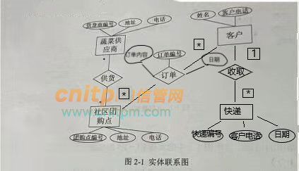
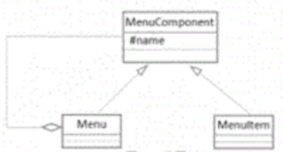

# 2021上半年软件设计师考试真题-下午卷
## 索引
|||||||
|:|:|:|:|:|:|
| [试题一](#试题一) | [试题二](#试题二) | [试题三](#试题三) | [试题四](#试题四) | [试题五](#试题五) | [试题六](#试题六) |
***
考试时间：150分钟

考试总分：75分（最后两题选做一题，45分及格）

**遵守考场纪律，维护知识尊严，杜绝违纪行为，确保考试结果公正。**

问答题(共 16 题,共 90 分)

### 试题一
(共 15 分)

阅读下列说明和图回答问题1至问题4，将解答填入答题纸的对应栏内。

【说明】某停车场运营方为了降低运营成本，减员增效，提供良好的停车体验，欲开发无人值守停车系统，该系统的主要功能是∶

1、 信息维护。管理人员对车位(总数、空余车位数等)计费规则等基础信息进行设置。

2、 会员注册。车主提供手机号、车牌号等信息进行注册，提交充值信息 (等级、绑定并授权支付系统进行充值或交费的支付账号) 不同级别和充值额度享受不同停车折扣点。

3、车牌识别。 当车辆进入停车场时，若有 (空余车位数大干1)，自动识别车牌号后进行道闸控制，当车主开车离开停车场时，识别车牌号，计费成功后，请求道闸控制。

4、 计费。

更新车辆离场时间，根据计费规则计算出停车费用，若车主是会员，提示停车费用∶若储存余额够本次停车费用，自动扣费，更新余额，若储值余额不足，自动使用授权缴费账号请求支付系统进行支付，获取支付状态。若非会员临时停车，提示停车费用，车主通过扫描费用信息中的支付码调用支付系统自助交费，获取支付状态。

5、 道闸控制。

根据道闸控制请求向道闸控制系统发送时干发行指令和接收道闸执行状态。若道闸执行状态为正常放行时，对入场车辆，将车牌号及其入场时间信息存入停车记录，修改空余车位数;对出厂车辆更新停车状态，修改空余车位数。当因道闸重置系统出现问题(断网断电或是故障为抬杠等情况)，而无法在规定的时间内接收到其返回的执行状态正常放行时，系统向管理人员发送异常告警信息，之后管理人员安排故障排查处理，确保车辆有序出入停车场。

现采用结构化方法对无人值守停车系统进行分析与设计，获得如图1-1所示的上下文数据流图和图1-2所示的 0层数据流图。

<center>
    
    <br>
    <div style="color:orange; border-bottom: 1px solid #d9d9d9;
    display: inline-block;
    color: #999;
    padding: 2px;">图1-1 上下文数据流图</div>
</center>

<center>
    
    <br>
    <div style="color:orange; border-bottom: 1px solid #d9d9d9;
    display: inline-block;
    color: #999;
    padding: 2px;">图1-2 0层数据流图</div>
</center>

【问题1】(5分)

使用说明中的词语，给出图1-1中的实体E1-E5的名称。

【问题2】(3分)

使用说明中的词语，给出图1-2中的数据存储D1-D3的名称。

【问题3】(4分)

根据说明和图中术语，补充图1-2中缺失的数据流及其起点和终点。

【问题4】(3分)

根据说明，采用结构化语言对“道闸控制”的加工逻辑进行描述。

#### 参考答案
问题1：

E1：汽车;
E2：车主;
E3：支付系统;
E4：管理人员;
E5：道闸控制系统

问题2：

D1：停车记录表
D2：用户或车主账号储存余额表
D3：车位信息表

问题3：

P3到D2：更新余额(若储存余额够本次停车费用，自动扣费并更新余额)

P5到D3：车位数(修改空余车位数)

P1到P5：道闸控制请求(车辆入场信息)

P4到P5：故障排查处理

D3到P3：计费规则信息

问题4：

```
IF (道闸执行状态正常)
    IF (车辆入场) THEN
        将车牌号及其入场时间信息存入停车记录，修改空余车位数
    ELSEIF (车辆出场) THEN
        更新停车状态，修改空余车位数
    ENDIF
ELSEIF (无法在规定的时间内接收到其返回的执行状态正常放行) THEN
    系统向管理人员发送异常告警信息
ENDIF
```
### 试题二
(共 15 分)

阅读下列说明，回答问题1至问题 3，将解答填入答题纸的对应栏内。

【说明】

某社区蔬菜团购网站，为规范商品收发流程，便于查询客户订单情况，需要开发个信息系统。请根据下述需求描述完成该系统的数据库设计。

【需求描述】

(1)记录蔬菜供应商的信息，包括供应商编号、地址和一个电话。

(2)记录社区团购点的信息，包括团购点编号、地址和一个电话。

(3)记录客户信息，包括客户姓名和一个电话。客户可以在不同的社区团购点下订单，不直接与蔬菜供应商发生联系。

(4)记录客户订单信息，包括订单编号、团购点编号客户电话，订单内容和日期。

【概念模型设计】

根据需求阶段收集的信息，设计的实体联系图，如图2-1 所示。【逻辑结构设计】

<center>
    
    <br>
    <div style="color:orange; border-bottom: 1px solid #d9d9d9;
    display: inline-block;
    color: #999;
    padding: 2px;">图2-1 实体联系图</div>
</center>

根据概念模型设计阶段完成的实体联系图，得出如下关系模式∶

蔬菜供货商(供货商编号，地址，电话)

社区团购点(团购点编号，地址，电话)

供货(供货商编号，(a))

客户(姓名，客户电话)

订单(订单编号，团购点编号，订单内容，日期，

问题内容∶

【问题1】(6分)
根据问题描述，补充图 1-1 的实体联系图

【问题2】(4分)
补充逻辑结构设计结果中的(a)、(b)两处空缺及完整性约束关系。

【问题3】(5分)
若社区蔬菜团购网站还兼有代收快递的业务，请增加新的"快递"实体，并给出客户实体和快递实体之间的"收取'联系，对图1进行补充。"快递"关系模式包括快递编号、客户电话和日期。

#### 参考答案

问题1：

客户(实体)与订单(联系)连线，订单(联系)与社区团购点(实体)连线;两个连线上的联系为**

问题2：

a：团购点编号。主键：供应商编号，团购点编号；外键：供应商编号，团购点编号。

b：客户电话。主键：订单编号；外键：团购点编号，客户电话。

问题3：

<center>
    
    <br>
    <div style="color:orange; border-bottom: 1px solid #d9d9d9;
    display: inline-block;
    color: #999;
    padding: 2px;">图2-1 实体联系图（补充）</div>
</center>

### 试题三
(共 15 分)

阅读下列说明和图，回答问题1至问题3，将解答填入答题纸的对应栏内。

[说明]

某中医医院拟开发一套线上抓药APP，允许患者凭借该医院医生开具的处方线上抓药，并提供免费送药上门服务。该系统的主要功能描述如下：

(1)注册。患者扫描医院提供的=维码进行注册，注册过程中，患者需提供其病历号，系统根据病历号自动获取患者基本信息。

(2)登录。已注册的患者可以登录系统进行线上抓药，未册的患者系统拒绝其登陆。

(3)确认处方。患者登录后，可以查看医生开具的所有处方。患者选择需要抓药的处方和数量(需要抓几副药)， 同时说明是否需要煎制。选择取药方式：自行到店取药或者送药上门,若选择送药上门，患者需要提供提供收贷人姓名、联系方式和收货地址。系统自动计算本次抓药的费用，患者可以使用微信或支付宝等支付方式支付费用。支付成功之后，处方被发送给药师进行药品配制。

<center>
    
    <br>
    <div style="color:orange; border-bottom: 1px solid #d9d9d9;
    display: inline-block;
    color: #999;
    padding: 2px;">图3-1 用例图</div>
</center>

<center>
    
    <br>
    <div style="color:orange; border-bottom: 1px solid #d9d9d9;
    display: inline-block;
    color: #999;
    padding: 2px;">图3-2 类图</div>
</center>

[问题1] (7分)

根据说明中的描述，给出图3-1中A1~ A3所对应的参与者名称和U1 ~U4处所对应的用例名称。

[问题2] (5分)

根据说明中的描述，给出图3-2中C1~C5所对应的类名。

[问题3] (3分)

简要解释用例之间的include、extend 和generalize关系的内涵。
#### 参考答案
问题1：

A1：患者; A2：快递员; A3：药师

U1：确认处方; U2：支付; U3：微信支付; U4：支付宝支付

问题2：

C1：处方; C2：煎制处方; C3：非煎制处方; C4：药品; C5：快递信息

问题3：

包含(include)∶

include 为包含关系，当两个或多个用例中共用一组相同的动作，这时可以将这组相同的动作抽出来作为一个独立的子用例，供多个基用例所共享。因为子用例被抽出，基用例并非一个完整的用例，所以 include 关系中的基用例必须和子用例一起使用才够完整，子用例也必然被执行。include 关系在用例图中使用带箭头的虚线表示(在线上标注 `<<include>>`)，箭头从基用例指向子用例。

扩展(extend)∶

extend 关系是对基用例的扩展，基用例是一个完整的用例，即使没有子用例的参与，也可以完成一个完整的功能。extend的基用例中将存在一个扩展点，只有当扩展点被激活时，子用例才会被执行。 extend 关系在用例图中使用带箭头的虚线表示(在线上标注 `<<extend>>`)，箭头从子用例指向基用例。

泛化(generalization)∶

泛化关系是一种继承关系，子用例将继承基用例的所有行为，关系和通信关系，也就是说在任何使用基用例的地方都可以用子用例来代替。泛化关系在用例图中使用空心的箭头表示，箭头方向从子用例指向基用例。

### 试题四
(共 15 分)

阅读下列说明和C代码，回答问题1和问题2，将解答填入答题纸的对应栏内。

[说明]

凸多边形是指多边形的任意两点的连线均落在多边形的边界或者内部。相邻的点连线落在多边形边上，称为边，不相邻的点连线落在多边形内部。称为弦。假设任意两点连线上均有权重，凸多边形最优三帮剂分问题定义为：求将凸多边形划分为不相交的三角形集合，且各三角形权重之和最小的剖分方案。每个三角形的权重为三条边权重之和。

假设N个点的凸多边形点编号为V1,V2,……,VN,若在VK处将原凸多边形划分为一个三角形V1VkVN，两个子多边形V1,V2,…,Vk和Vk,Vk+1,…VN，得到一个最优的剖分方案，则该最优剖分方案应该包含这两个子凸边形的最优剖分方案。用m[i][j]表示带你Vi-1,Vi,…Vj构成的凸多边形的最优剖分方案的权重，S[i][j]记录剖分该凸多边形的k值。

则


其中：

Wj,i-1分别为该三角形三条边的权重。求解凸多边形的最优剖分方案，即求解最小剖分的权重及对应的三角形集。

[C代码]
```
＃include＜stdio.h＞

＃define N 6                       

//凸多边形规模

int m[N＋1] [N＋1];         //m[i][j]表示多边形Vi-1到Vj最优三角剖分的权值

int S[N＋1] [N＋1]；        //S[i][j]记录多边形Vi-1 到Vj最优三角剖分的k值

int W[N＋1] [N＋1]；      //凸多边形的权重矩阵，在main函数中输入

/*三角形的权重a，b，c，三角形的顶点下标*/

int get_ triangle_weight（int a，int b，int c）{

return W[a][b]＋W[b][c]＋W[c][a];

}

/*求解最优值*/

void triangle_partition(){

int i,r,k,j;

int temp;

/*初始化*/

for(i=1;i<=N;i++){

m[i][i]=0;

}

/*自底向上计算m，S*/

for(r=2;（1）;r++){/*r为子问题规模*/                  //r<=N

for(i=1;k<=N-r+1;i++){

（2）;               //int j=i+r-1

m[i][j]= m[i][j]+m[i+1][j]+get_triangle_weight(i-1,i,j);     /*k=j*/

S[i][j]=i;

for(k=j+1;k<j;k++){/*计算 [i][j]的最小代价*/

temp=m[i][k]+m[k+1][j]+ge_triangle_ weight(i-1,k,j);

if((3)){/*判断是否最小值*/    //temp<m[i][j]

m[i][j]=temp;

S[i][j]=k;

}

}

}

}

}

/*输出剖分的三角形i，j：凸多边形的起始点下标*/

void print_triangle(int i,int j){

if(i==j)       return;

print_triangle(i,S[i][j]);

print_

triangle((4));           //s[i][j]+1,j

print(“V%d- -V%d-

-V%d\n“,i-1,S[i][j],j);

}
```

[问题1] (8分)

根据说明和C代码，填充C代码中的空(1) ~ (4)。

[问题2] (7分)

根据说明和C代码，该算法采用的设计策略为(5)，算法的时间复杂度为(6)，空间复杂度为(7) (用0表示)。
#### 参考答案
问题1：

(1) `i<=N`

(2) `int j=i+r-1`

(3) `temp<m[i][j]`

(4) `s[i][j]+1,j`

问题2：

(5) 动态规划

(6) O(n^3)

(7) O(n^2)

#### 基本算法设计策略

- 贪心法

求解问题最优解，将问题分解为若干步，每一步都取当前最优解，即局部最优解。 

例子：N人过桥问题

- 分治法（divide-and-conquer）

求解问题唯一解，将问题分解为小规模的子问题，子问题之间**相互独立**。 

例子：汉诺塔

- 回溯法

求解问题最优解或唯一解。 

就是深度优先搜索，常用递归实现。

约数条件：有不可行解时，判断当前选择是否符合可行解。 

限界条件：在找最优解时，判断当前选择是否符合最优解。 

例子：连通图着色问题。

- 分支限界法

求解问题最优解或唯一解。 

活结点。 

例子：集装箱分配问题

- 随机化算法

*随机化算法分类：*

(1)数值随机算法：用于数值问题的求解，得到近似解。

(2)蒙特卡洛算法：计算数学中的一种计算方法，用于求问题的准确解，得到正确解的概率以节约时间。原理(大数定律)是通过大量随机样本，去了解一个系统，进而得到所要计算的值。

(3)拉斯维加斯算法：与蒙特卡洛算法相似，但是绝不返回错误的解。

(4)舍伍德算法：在确定性算法中加入随机性来降低最坏情况出现的概率。

*随机化算法分类：*

(1)线性同余法 (2)平方取中法 (3)乘同余法 (4)混合同余法

例子：判断n是否为素数。 

相关定理：wilson定理、费马定理、二次探测定理。

- 动态规划

求解最优解。 

同分治法类似，只是动态规划保存了之前求得的所有子问题的解，以避免重复的计算。 

*适用条件：*

(1)最优化原理（最优子结构） (2)无后向性 (3)子问题的重叠性

动态规划的根本目的是：解决冗余，利用空间复杂度减少时间复杂度。

例子：师姐大赛胜率问题

### 试题五
(共 15 分)

阅读下列说明和C++代码，将应填入(n)处的字句写在答题纸的对应栏内。

【说明】

层叠菜单是窗口风格的软件系统中经常采用的一种系统功能组织方式。层叠菜单 (如图6-1示例)中包含的可能是一个菜单项(直接对应某个功能)，也可能是一个子菜单，现在采用组合(composite)设计模式实现层叠菜单，得到如图6-2所示的类图。

<center>
    
    <br>
    <div style="color:orange; border-bottom: 1px solid #d9d9d9;
    display: inline-block;
    color: #999;
    padding: 2px;">图5-1 层叠菜单示例</div>
</center>

<center>
    
    <br>
    <div style="color:orange; border-bottom: 1px solid #d9d9d9;
    display: inline-block;
    color: #999;
    padding: 2px;">图5-2 类图</div>
</center>


**[C++代码]**
```
#include <list>
#include <iostream> // std::cout std::endl
#include <string>
using namespace std;

class MenuComponent {//构成层叠菜单的元素
protected: //Qustion 1
    string name;
public:
    void printMenu() { cout << name << endl; }
    virtual void addMenuElement(MenuComponent *element) = 0;//Qustion 2
    virtual void removeMenuElement(MenuComponent *element) = 0;
    virtual list<MenuComponent *> * getElement() = 0;//Qustion 3
    string getMenuName() { return name; }
};

class MenuItem: public MenuComponent {
public:
    MenuItem(string name) { this->name = name; }
    void addMenuElement(MenuComponent *element) { return; }
    void removeMenuElement(MenuComponent *element) { return; }
    list<MenuComponent *> * getElement() { return NULL; }
};

class Menu: public MenuComponent {
private:
    //Use of class template 'list' requires template arguments
    list<MenuComponent *> elementList;//Qustion 4
public:
    Menu(string name) { this->name = name; }
    void addMenuElement(MenuComponent *element) { elementList.push_back(element); }
    void removeMenuElement(MenuComponent *element) { elementList.remove(element); }
    list<MenuComponent *> * getElement() { return &elementList; }
};

// 递归打印Menu
void printMenus(MenuComponent& ifile) {
    ifile.printMenu();
    list<MenuComponent *> *children = ifile.getElement();
    if (children == NULL) return;
    if (children->size()==0) return;
    
    list<MenuComponent *>::iterator iter;
    for (iter = children->begin(); iter != children->end(); iter++)
    {
        MenuComponent *comp = *iter;
        printMenus(*comp);
    }
}

void printString(string& stringToPrint)
{
    cout << stringToPrint << endl;
}

int main(int argc, const char * argv[]) {
    MenuComponent *mainMenu = new Menu("Insert");
    MenuComponent *subMenu = new Menu("Chart");
    MenuComponent *element = new MenuItem("On This Sheet");
    mainMenu->addMenuElement(subMenu);//Qustion 5
    subMenu->addMenuElement(element);
    printMenus(*mainMenu);
    cout << endl;
    return 0;
}
```

#### 参考答案
1：`protected`

2：`virtual void addMenuElement(MenuComponent *element) = 0;`

3：`virtual list<MenuComponent *> * getElement() = 0;`

4：`list<MenuComponent *> elementList;`

5：`mainMenu->addMenuElement(subMenu);`

#### Code Sample
[Menu-Component-Composite](https://github.com/MichaelLedger/SDE-Code-Samples/tree/main/C++/Menu-Component-Composite)

### 试题六
(共 15 分)

阅读下列说明和Java代码，将应填入(n)处的字句写在答题纸的对应栏内。

【说明】

层叠菜单是窗口风格的软件系统中经常采用的一种系统功能组织方式。层叠菜单 (如图6-1示例)中包含的可能是一个菜单项(直接对应某个功能)，也可能是一个子菜单，现在采用组合(composite)设计模式实现层叠菜单，得到如图6-2所示的类图。

<center>
    
    <br>
    <div style="color:orange; border-bottom: 1px solid #d9d9d9;
    display: inline-block;
    color: #999;
    padding: 2px;">图5-1 层叠菜单示例</div>
</center>

<center>
    
    <br>
    <div style="color:orange; border-bottom: 1px solid #d9d9d9;
    display: inline-block;
    color: #999;
    padding: 2px;">图5-2 类图</div>
</center>


**[Java代码]**
```
import java.util.*;

abstract class MenuComponent { // 构成层叠菜单的元素
    protected String name;      // 菜单项或子菜单名称 // Question_1
    public void printName() { System.out.println(name); }
    public abstract boolean addMenuElement(MenuComponent element);// Question_2
    public abstract boolean removeMenuElement(MenuComponent element);
    public abstract List<MenuComponent> getElement();// Question_3
}

class MenuItem extends MenuComponent {
    public  MenuItem(String name) { this.name = name; }
    public boolean addMenuElement(MenuComponent element) { return false; }
    public boolean removeMenuElement(MenuComponent element) { return false; }
    public List<MenuComponent> getElement() { return null; }
}

class Menu extends MenuComponent {
    private List<MenuComponent> elementList;// Question_4
    public Menu(String name) {
        this.name = name;
        this.elementList = new ArrayList<MenuComponent>();
    }
    public boolean addMenuElement(MenuComponent element) {
        return elementList.add(element);
    }
    public boolean removeMenuElement(MenuComponent element) {
        return elementList.remove(element);
    }
    public List<MenuComponent> getElement() {
        return elementList;
    }
}

class CompositeTest {
    public static void main(String[] args) {
        MenuComponent mainMenu = new Menu("Insert");
        MenuComponent subMenu = new Menu("Chart");
        MenuComponent element = new MenuItem("On This Sheet");
        mainMenu.addMenuElement(subMenu);// Question_5
        subMenu.addMenuElement(element);
        printMenus(mainMenu);
    }
    private static void printMenus(MenuComponent ifile) {
        ifile.printName();
        List<MenuComponent> children = ifile.getElement();
        if (children == null) return;
        for (MenuComponent element:children) {
            printMenus(element);
        }
    }
}
```

#### 参考答案
1：`protected`

2：`abstract boolean addMenuElement(MenuComponent element);`

3：`abstract List<MenuComponent> getElement();`

4：`List<MenuComponent> elementList;`

5：`mainMenu.addMenuElement(subMenu);`

#### Code Sample
[MenuComponent](https://github.com/MichaelLedger/SDE-Code-Samples/tree/main/Java/MenuComponent)
