# 2021下半年软件设计师考试真题-上午卷
## 索引
||||||
|:|:|:|:|:|
| [1、寻址方式](#1、) | [2、PCI总线和SCSI总线](#2、) | [3、中断方式与DMA方式](#3、) | [4、中断向量](#4、) | [5、存储器件](#5、) |
| [6、浮点数表示](#6、) | [7、防治计算机病毒](#7、) | [8、AES](#8、) | [9、远程登录或控制协议](#9、) | [10、包过滤防火墙](#10、) |
| [11、外网、 DMZ和内网防火墙](#11、) | [12、保护计算机软件著作权](#12、) | [13、软件著作权](#13、) | [14、知识产权](#14、) | [15、绘制分层数据流图](#15、) |
| [16、软件设计原则](#16、) | [17、风险监测](#17、) | [18-19、项目管理松弛时间](#18-19、) | / | [20、二叉树表示的算术表达式](#20、) |
| [21、语义分析阶段](#21、) | [22、NFA有限自动机](#22、) | [23、进程三态模型](#23、) | [24-26、 P,V操作 & 前驱图](#24-26、) | / |
| / | [27-28、磁盘管理](#27-28、) | / | [29、软件生存周期模型](#29、) | [30、敏捷统一过程（AUP）](#30、) |
| [31、ISO/IEC 9126和Mc Call软件质量模型](#31、) | [32、软件测试V模型W模型H模型](#32、) | [33、软件开发工程需求分析](#33、) | [34-35、McCabe度量法计算流程图的环路复杂性](#34-35、) | / |
| [36、系统可维护性](#36、) | [37、面向对象设计](#37、) | [38、面向对象设计的几大原则](#38、) | [39-40、UML类图的几种关系](#39-40、) | / |
| [41-43、UML状态图](#41-43、) | / | / | [44-46、设计模式](#44-46、) | / |
| / | [47、设计模式](#47、) | [48、Python 语言的特点](#48、) | [49、python语言的用法](#49、) | [50、Python语言深度学习](#50、) |
| [51、数据库三级模式两级映射](#51、) | [52-53、候选键的求法和函数依赖的判断](#52-53、) | / | [54-55、数据关系代数](#54-55、) | / |
| [56、数据库基础知识](#56、) | [57、栈](#57、) | [58、循环队列](#58、) | [59、二叉树的构造](#59、) | [60、堆排序的算法](#60、) |
| [61、拓扑序列](#61、) | [62-63、归并排序算法](#62-63、) | / | [64-65、哈弗曼树](#64-65、) | / |
| [66、计算机网络相关交互协议](#66、) | [67-68、计算机网络ARP协议](#67-68、) | / | [69、网页代码的起始和终止](#69、) | [70、路由协议](#70、) |
| [71-75、Software engineer vs  DevOps engineer](#71-75、) |
***
考试时间：150分钟

考试总分：75分（45分及格）

**遵守考场纪律，维护知识尊严，杜绝违纪行为，确保考试结果公正。**

单选题(共 75 题,共 75 分)
***
#### 1、
计算机指令系统采用多种寻址方式。立即寻址是指操作数包含在指令中，寄存器寻址是指操作数在寄存器中，直接寻址是指操作数的地址在指令中。这三种寻址方式操作数的速度（  ）。

A.立即寻址最快，寄存器寻址次之，直接寻址最慢 

B.寄存器寻址最快，立即寻址次之，直接寻址最慢 

C.直接寻址最快， 寄存器寻址次之，立即寻址最慢 

D.寄存器寻址最快，直接寻址次之，立即寻址最慢 
#### 答案
A
#### 解析
有关于寻址方式查询速度：

立即寻址是操作数直接在指令中，速度是最快的；

寄存器寻址是将操作数存放在寄存器中，速度中间；

直接寻址方式是指令中存放操作数的地址，速度最慢。
***
#### 2、
以下关于PCI总线和SCSI总线的叙述中，正确的是（  ）。

A.PCI总线是串行外总线，SCSI 总线是并行内总线 

B.PCI总线是串行内总线，SCSI总线是串行外总线 

C.PCI总线 是并行内总线，SCSI 总线是串行内总线 

D.PCI总线是并行内总线， SCSI 总线是并行外总线 
#### 答案
D
#### 解析
属于常见总线的分类：

PCI总线：Peripheral Component Interconnect (外设部件互连标准)  的缩写，它是目前个人电脑中使用最为广泛的接口，几乎所有的主板产品上都带有这种插槽。PCI插槽也是主板带有最多数量的插槽类型，在目前流行的台式机主板上，ATX结构的主板一般带有5～6个PCI插槽，而小一点的MATX主板也都带有2～3个PCI插槽，可见其应用的广泛性。**PCI是目前微型机上广泛采用的内总线，采用并行传输方式。**

SCSI总线：Small Computer System Interface (小型计算机系统接口) 的缩写， 是一种用于计算机及其周边设备之间（硬盘、软驱、光驱、打印机、扫描仪等）系统级接口的独立处理器标准。SCSI标准定义命令、通信协议以及实体的电气特性（换成OSI的说法，就是占据物理层、链接层、套接层、应用层），最大部分的应用是在存储设备上（例如硬盘、磁带机）；但，其实SCSI可以连接的设备包括有扫描仪、光学设备（像CD、DVD）、打印机……等等，SCSI命令中有条列出支持的设备SCSI周边设备。理论上，SCSI不可能连接所有的设备，所以有“1Fh - unknown or no device type”这个参数存在。**小型计算机系统接口是一条并行外总线，广泛用于连接软硬磁盘、光盘、扫描仪等。**
***
#### 3、
以下关于中断方式与DMA方式的叙述中，正确的是（  ）。

A.中断方式与DMA方式都可实现外设与CPU之间的并行在工作 

B.程序中断方式和DMA方式在数据传输过程中都不需要CPU的干预 

C.采用DMA方式传输数据的速度比程序中断方式的速度慢 

D.程序中断方式和DMA方式都不需要CPU保护现场 
#### 答案
A
#### 解析
输入/输出技术的三种方式：

直接查询控制：有无条件传送和程序查询方式，都需要通过CPU执行程序来查询外设的状态，判断外设是否准备好接收数据或准备好了向CPU输入的数据。在这种情况下CPU不做别的事情，只是不停地对外设的状态进行查询。

中断方式：当I/O系统与外设交换数据时，CPU无须等待也不必查询I/O的状态，而可以抽身来处理其他任务。当I/O系统准备好以后，则发出中断请求信号通知CPU，CPU接到中断请求信号后，保存正在执行的程序的现场，转入I/O中断服务程序的执行，完成于I/O系统的数据交换，然后再返回被打断的程序继续执行。与程序控制方式相比，中断方式因为CPU无需等待而提高了效率。

DMA：直接寄存器存取方式，是指数据在内存与I/O设备间的直接成块传送，即在内存与I/O设备间传送一个数据块的过程中，不需要CPU的任何干涉，只需要CPU正在过程开始启动与过程结束时的处理，实际操作由DMA硬件直接执行完成。
***
#### 4、
中断向量提供（  ）。

A.被选中设备的地址 

B.待传送数据的起始地址 

C.中断服务程序入口地址 

D.主程序的断点地址 
#### 答案
C
#### 解析
属于输入输出技术的中断方式。

中断向量表：中断向量表用来保存各个中断源的中断服务程序的入口地址。当外设发出中断请求信号以后，由中断控制器确定其中断号，并根据中断号查找中断向量表来取得其中断服务程序的入口地址，同时INTC把中断请求信号提交给CPU。
***
#### 5、
（  ）是一种需要通过周期性刷新来保持数据的存储器件。

A.SRAM 

B.DRAM 

C.FLASH 

D.EEPROM 
#### 答案
B
#### 解析
DRAM：动态随机存取器存储器，又叫主存，是与CPU直接交换数据的内部存储器。它可以随时读写（刷新时除外），而且速度很快，通常作为操作系统或其他正在运行中的程序的临时数据存储媒介，通过周期性刷新来保持数据的存储器件，断电丢失。

SRAM：静态随机存取器存储器，静态随机存取存储器是随机存取存储器的一种。所谓的“静态”，是指这种存储器只要保持通电，里面储存的数据就可以恒常保持。

FLASH：闪存，特性介于EPROM和EEPROM之间，类似于EEPROM，也可以使用电信号进行信息的擦除操作。整块闪存可以在数秒内删除。

EPROM：EPROM (electrically programmable read-only memory)是一种断电后仍能保留数据的计算机储存芯片——即非易失性的（非挥发性）。它是一组浮栅晶体管，被一个提供比电子电路中常用电压更高电压的电子器件分别编程。一旦编程完成后，EPROM只能用强紫外线照射来擦除。通过封装顶部能看见硅片的透明窗口，很容易识别EPROM，这个窗口同时用来进行紫外线擦除。可以将EPROM的玻璃窗对准阳光直射一段时间就可以擦除。

EEPROM：EEPROM (Electrically Erasable Programmable read only memory)是指带电可擦可编程只读存储器。是一种掉电后数据不丢失的存储芯片。 EEPROM 可以在电脑上或专用设备上擦除已有信息，重新编程。一般用在即插即用。EEPROM中的内容既可以读出，也可以进行改写。
***
#### 6、
某种机器的浮点数表示格式如下(允许非规格化表示)。若阶码以补码表示，尾数以原码表示，则1 0001 0 0000000001表示的浮点数是（）

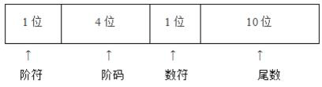

A.2^-16 × 2^-10 

B.2^-15 × 2^-10 

C.2^-16 × (1 - 2^-10)

D.2^-15 ×  (1-2^-10)
#### 答案
B
#### 解析
考查对于浮点数表示。

**浮点数表示：N=尾数*基数^指数**

其中尾数是用原码表示，是一个小数

通过表格和题干可知， 0 0000000001是尾数部分，共计后11位，其中第1位为0表示正数，展开得2^-10

阶码部分是用补码表示，是一个整数，通过表格和题干可知，1 0001是整数部分，共计前5位

要计算其具体数值需要将其转换成原码，通过第1位符号位1可知其为负数，补码：10001  ，反码：10000    原码：11111，数据为-15

基数在浮点数表示为2，可得2^-15 × 2^-10

把一个数的有效数字和数的范围在计算机的一个存储单元中分别予以表示。这种把数的范围和精度分别表示的方法，相当于数的小数点位置随比例因子的不同而在一定范围内可以自由浮动，所以称为**浮点表示法**。

在计算机中一个任意二进制数N可以写成： `N=2^e.M`

其中M称为浮点数的尾数，是一个纯小数。e是比例因子的指数，称为浮点数的指数，是一个整数。比例因子的基数2对二进记数制的机器是一个常数。

在机器中表示一个浮点数时，一是要给出尾数，用定点小数形式表示。尾数部分给出有效数字的位数，因而决定了浮点数的表示精度。二是要给出指数，用整数形式表示，常称为阶码，阶码指明小数点在数据中的位置，因而决定了浮点数的表示范围。浮点数也要有符号位。

| 符号位 | 阶码 | 尾数 |
|:-:|:-:|:-:|
|S|E|M|

不论是32位浮点数还是64位浮点数由于基数2是固定常数，对每一个浮点数都一样，所以不必用显示方式来表示它。

32位的浮点数中，S是浮点数的符号位，占1位，安排在最高位，S=0表示正数，S=1表示负数。M是尾数，放在低位部分，占用23位，小数点位置放在尾数域最左（最高）有效位的右边。E是阶码，占用8位，阶符采用隐含方式，，即采用移码方法来表示正负指数。移码方法对两个指数大小的比较和对阶操作都比较方便，因为阶码域值大者其指数值也大。采用这种方式时，将浮点数的指数真值e变成阶码E时，应将指数e加上一个固定的偏移值127（01111111），即 `E=e+127`。

为了提高数据的表示精度，当尾数的值不为0时，尾数域的最高有效位应为1，这称为浮点数的规格化表示。否则以修改阶码同时左右移动小数点位置的办法，使其变成规格化数的形式。

在IEEE754标准中，一个规格化的32位浮点数x的真值表示为

`x = (-1) ^s x (1.M) x 2^(E-127)`

`e = E - 127`

其中尾数域所表示的值是1.M。由于规格化的浮点数的尾数域最左位（最高有效位）总是1，故这一位经常不予存储，而认为隐藏在小数点的左边。于是用23位字段可以存储24位有效数。

64位的浮点数中符号位1位，阶码域11位，尾数域52位，植树偏移值是1023.因此规格化的64位浮点数x的真值为

`x = (-1)s x (1.M) x 2^(E-1023)`

`e = E - 1023`

**将176.0625表示为符合IEEE-754标准的单精度浮点数。**

首先将176.0625化为二进制：10110000.0001

尾数规格化：1.01100000001×27，因此尾数域求出来了，为01100000001

阶码的移码：7的二进制为00000111，移码为10000110

拼接：0 10000110 01100000001000000000000

尾数域记得要补0使尾数有23位。
***
#### 7、
以下可以有效防治计算机病毒的策略是（  ）。

A.部署防火墙 

B.部署入侵检测系统 

C.安装并及时升级防病毒软件 

D.定期备份数据文件 
#### 答案
C
#### 解析
部署防火墙：防火墙技术是通过有机结合各类用于安全管理与筛选的软件和硬件设备，帮助计算机网络于其内、外网之间构建一道相对隔绝的保护屏障，以保护用户资料与信息安全性的一种技术，并不能有效的防范病毒。

部署入侵检测系统：入侵检测系统（intrusion detection system，简称“IDS”）是一种对网络传输进行即时监视，在发现可疑传输时发出警报或者采取主动反应措施的网络安全设备。是对一种网络传输的监视技术，并不能有效的防范病毒。

安装并及时升级防病毒软件：针对于防病毒软件本身就是防范病毒最有效最直接的方式。

定期备份数据文件：数据备份是容灾的基础，是指为防止系统出现操作失误或系统故障导致数据丢失，而将全部或部分数据集合从应用主机的硬盘或阵列复制到其它的存储介质的过程。是为了防止系统数据流失，不能有效的防范病毒。
***
#### 8、
AES是一种（）算法。

A.公钥加密 

B.流密码 

C.分组加密 

D.消息摘要
#### 答案
C
#### 解析
AES是一个迭代的、对称密钥分组的密码，它可以使用128、192和256位密钥。并且使用128位分组加密和解密数据。
***
#### 9、
下列不能用于远程登录或控制的是（  ）。

A.IGMP 

B.SSH 

C.Telnet 

D.RFB 
#### 答案
A
#### 解析
IGMP：属于网络的组播协议，不能实现相关应用层的远程登录。

SSH：SSH 为建立在应用层基础上的安全协议。SSH 是较可靠，专为远程登录会话和其他网络服务提供安全性的协议。

Telnet：Telnet协议是TCP/IP协议族中的一员，是Internet远程登录服务的标准协议和主要方式。它为用户提供了在本地计算机上完成远程主机工作的能力。在终端使用者的电脑上使用telnet程序，用它连接到服务器。

RFB：RFB （ Remote Frame Buffer 远程帧缓冲） 协议是一个用于远程访问图形用户界面的简单协议。由于 RFB 协议工作在帧缓冲层，因此它适用于所有的窗口系统和应用程序。
***
#### 10、
包过滤防火墙对（）的数据报文进行检查。

A.应用层 

B.物理层 

C.网络层 

D.链路层 
#### 答案
C
#### 解析
考查包过滤防火墙的工作原理。

包过滤防火墙是最简单的一种防火墙，它在网络层截获网络数据包，根据防火墙的规则表，来检测攻击行为。包过滤防火墙一般作用在网络层（IP层），故也称网络层防火墙（Network Lev Firewall）或IP过滤器（IP filters）。

数据包过滤（Packet Filtering）是指在网络层对数据包进行分析、选择。通过检查数据流中每一个数据包的源IP地址、目的IP地址、源端口号、目的端口号、协议类型等因素或它们的组合来确定是否允许该数据包通过。在网络层提供较低级别的安全防护和控制。
***
#### 11、
防火墙通常分为内网、外网和DMZ三个区域，按照受保护程度，从低到高正确的排列次序为（）

A.内网、外网和DMZ 

B.外网、 DMZ和内网 

C.DMZ、内网和外网 

D.内网、DMZ和外网 
#### 答案
B
#### 解析
考查应用级关于屏蔽子网的防火墙。

在一个用路由器连接的局域网中,我们可以将网络划分为三个区域：安全级别最高的LAN Area（内网）,安全级别中等的DMZ区域和安全级别最低的Internet区域（外网）。

三个区域因担负不同的任务而拥有不同的访问策略。

我们在配置一个拥有DMZ区的网络的时候通常定义以下的访问控制策略以实现DMZ区的屏障功能。

**防火墙中的概念**

网络安全中首先定义的区域是trust区域和untrust区域，简单说就是一个是内网（trust），是安全可信任的区域，一个是internet，是不安全不可信的区域。防火墙默认情况下是阻止从untrust到trust的访问，当有服务器在trust区域的时候，一旦出现需要对外提供服务的时候就比较麻烦。

所以定义出一个DMZ的非军事区域，让trust和untrust都可以访问的一个区域，即不是绝对的安全，也不是绝对的不安全，这就是设计DMZ区域的核心思想。

**DMZ (demilitarized zone)**

DMZ是英文“demilitarized zone”的缩写，中文名称为“隔离区”，也称“非军事化区”。

它是为了解决安装防火墙后外部网络不能访问内部网络服务器的问题，而设立的一个非安全系统与安全系统之间的缓冲区。

这个缓冲区位于企业内部网络和外部网络之间的小网络区域内，在这个小网络区域内可以放置一些必须公开的服务器设施，如企业Web服务器、FTP服务器和论坛等。另一方面，通过这样一个DMZ区域，更加有效地保护了内部网络，因为这种网络部署，比起一般的防火墙方案，对攻击者来说又多了一道关卡。

网络设备开发商，利用这一技术，开发出了相应的防火墙解决方案。称“非军事区结构模式”。DMZ通常是一个过滤的子网，DMZ在内部网络和外部网络之间构造了一个安全地带。

DMZ防火墙方案为要保护的内部网络增加了一道安全防线，通常认为是非常安全的。同时它提供了一个区域放置公共服务器，从而又能有效地避免一些互联应用需要公开，而与内部安全策略相矛盾的情况发生。

在DMZ区域中通常包括堡垒主机、Modem池，以及所有的公共服务器，但要注意的是电子商务服务器只能用作用户连接，真正的电子商务后台数据需要放在内部网络中。

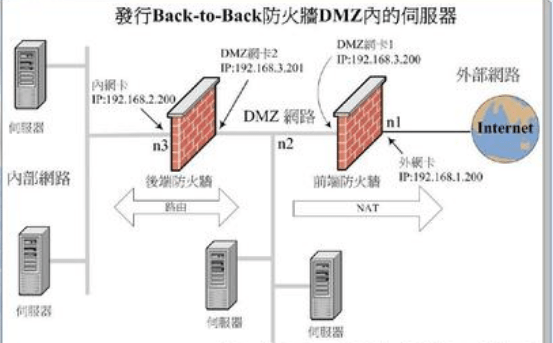

在这个防火墙方案中，包括两个防火墙，外部防火墙抵挡外部网络的攻击，并管理所有内部网络对DMZ的访问。内部防火墙管理DMZ对于内部网络的访问。内部防火墙是内部网络的第三道安全防线(前面有了外部防火墙和堡垒主机)，当外部防火墙失效的时候，它还可以起到保护内部网络的功能。而局域网内部，对于Internet的访问由内部防火墙和位于DMZ的堡垒主机控制。在这样的结构里，一个黑客必须通过三个独立的区域(**外部防火墙、内部防火墙和堡垒主机**)才能够到达局域网。攻击难度大大加强，相应内部网络的安全性也就大大加强，但投资成本也是最高的。
***
#### 12、
（）是 构成我国保护计算机软件著作权的两个基本法律文件。

A.《计算机软件保护条例》和《软件法》 

B.《中华人民共和国著作权法》和《软件法》 

C.《中华人民共和国著作权法》和《计算机软件保护条例》 

D.《中华人民共和国版权法》和《中华人民共和国著作权法》
#### 答案
C
#### 解析
考查知识产权的保护范围和对象。

对于软件著作权和软件作品受到《中华人民共和国著作权法》和《计算机软件保护条例》两个文件的保护。
***
#### 13、
X公司接受Y公司的委托开发了一款应用软件，双方没有订立任何书面合同。在此情形下，（）享有该软件的著作权。

A.X、Y公司共同 

B.X公司 

C.Y公司 

D.X、Y公司均不
#### 答案
B
#### 解析
考查委托开发的情况。

有合同约定，著作权归委托方，那么就归属委托方；而在合同中未约定著作权归属，归创作方。

对于题干描述说明未签订书面合同，则该著作权归创作方，（X公司接受Y公司的委托），即创作方X公司
***
#### 14、
广大公司(经销商)擅自复制并销售恭大公司开发的OA软件已构成侵权。鸿达公司在不知情时从广大公司(经销商)处购入该软件并已安装使用，在鸿达公司知道了所使用的软件为侵权复制的情形下其使用行为（）

A.侵权， 支付合理费用后可以继续使用该软件 

B.侵权， 须承担赔偿责任 

C.不侵权，可继续使用该软件 

D.不侵权， 不需承担任何法律责任 
#### 答案
A
#### 解析
本题考查知识产权。

我国计算机软件保护条例第30条规定
> “软件的复制品持有人不知道也没有合理理由应当知道该软件是侵权复制品的,不承担赔偿责任;但是,应当停止使用、销毁该侵权复制品。如果停止使用并销毁该侵权复制品将给复制品使用人造成重大损失的,复制品使用人可以在向软件著作权人支付合理费用后继续使用。”

鸿达公司在获得软件复制品的形式上是合法的(向经销商购买),但是由于其没有得到真正软件权利人的授权,其取得的复制品仍是非法的,所以 鸿达公司的使用行为属于侵权行为。

鸿达公司应当承担的法律责任种类和划分根据主观状态来确定。首先,法律确立了软件著作权人的权利进行绝对的保护原则,即软件复制品持有人不知道也没有合理理由应当知道该软件是侵权复制品的,也必须承担停止侵害的法律责任,只是在停止使用并销毁该侵权复制品将给复制品使用人造成重大损失的情况下,软件复制品使用人可继续使用,但前提是必须向软件著作权人支付合理费用。其次,如果软件复制品持有人能够证明自己确实不知道并且也没有合理理由应当知道该软件是侵权复制品的,软件复制品持有人除承担停止侵害外,不承担赔偿责任。

软件复制品持有人一旦知道了所使用的软件为侵权复制品时,应当履行停止使用、销毁该软件的义务。不履行该义务,软件著作权人可以诉请法院判决停止使用并销毁侵权软件。如果软件复制品持有人在知道所持有软件是非法复制品后继续使用给权利人造成损失的,应该承担赔偿责任。
***
#### 15、
绘制分层数据流图(DFD)时需要注意的问题中，不包括（）。

A.给图中的每个数据流、加工、数据存储和外部实体命名 

B.图中要表示出控制流 

C.一个加工不适合有过多的数据流 

D.分解尽可能均匀 

#### 答案
B
#### 解析
绘制分层数据流图，应该严格遵循**父子图平衡原则**。这就规定了不能出现**黑洞、灰洞和奇迹**的三种状况，分解子图尽可能细致一些。

所以对于：**给图中的每个数据流、加工、数据存储和外部实体命名**、**一个加工不适合有过多的数据流**、**分解尽可能均匀**都是需要注意的。

仅有B选项表示图中要表示出控制流不符合，在分层数据流图并没有强调过需要表示出控制流。
***
#### 16、
以下关于软件设计原则的叙述中，不正确的是（  ）。

A.将系统划分为相对独立的模块 

B.模块之间的耦合尽可能小 

C.模块规模越小越好 

D.模块的扇入系数和扇出系数合理 
#### 答案
C
#### 解析
考查关于软件设计原则。

软件设计原则始终强调高内聚、低耦合的设计原则。

具体包括：

保持模块的大小适中、尽可能减少调用的深度、多扇入少扇出、单入口单出口、模块的作用域应该在模块之内、功能应该是可以被预测的

综上所述，仅有C选项模块规模越小越好是不符合设计原则的。

*什么是扇入和扇出？* 

在软件设计中，扇入和扇出的概念是指应用程序模块之间的层次调用情况。

按照结构化设计方法，一个应用程序是由多个功能相对独立的模块所组成。

扇入：是指直接调用该模块的上级模块的个数。扇入大表示模块的复用程序高。

扇出：是指该模块直接调用的下级模块的个数。扇出大表示模块的复杂度高，需要控制和协调过多的下级模块；但扇出过小（总是1）也不好。扇出过大一般是因为缺乏中间层次，应该适当增加中间层次的模块。扇出太小时可以把下级模块进一步分解成若干个子功能模块，或者合并到它的上级模块中去。

设计良好的软件结构，通常顶层扇出比较大，中间扇出小，底层模块则有大扇入。
***
#### 17、
在风险管理中，通常需要进行风险监测，其目的不包括（  ）。

A.消除风险 

B.评估所预测的风险是否发生 

C.保证正确实施了风险缓解步骤 

D.收集用于后续进行风险分析的信息 
#### 答案
A
#### 解析
风险监测主要是对风险进行预测，评估，收集相关的信息，用来防止风险，从而做好相关的防范措施。

对于评估所预测的风险是否发生、保证正确实施了风险缓解步骤、收集用于后续进行风险分析的信息都是风险监测的目的。

至于A选项消除风险，风险是无法被消除掉的，只能尽量避免。
***
#### 18-19、
下图是一个软件项目的活动图，其中顶点表示项目里程碑，连接顶点的边表示活动，边上的权重表示完成该活动所需要的时间(天)，则活动（  ）不在关键路径上。活动BI和EG的松弛时间分别是（  ）。

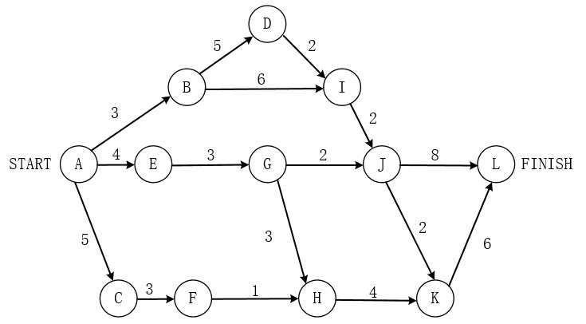

问题1选项 

A.BD 

B.BI 

C.GH 

D.KL 

问题2选项 

A.0和1 

B.1和0 

C.0和2 

D.2和0 
#### 答案
第1题:B
第2题:B
#### 解析
考查项目管理计算问题。

对于关键路径有两条分别是：ABDIJKL和AEGHKL两条**关键路径**，长度为20.

针对第一问，不在关键路径上的活动是BI，其余的BD，GH，KL都在关键路径上。

针对第二问，要求BI和EG的松弛时间，BI活动通过的路径有两条ABIJKL和ABIJL，其中两条路径的长度都为19，（**如果有两条不同的路径应该选择最大的一条**），用关键路径减去该路径的长度20-19=1，表示该活动的松弛时间。

活动EG位于该关键路径AEGHKL上，没办法延误，即松弛时间为0
***
#### 20、
下图所示的二叉树表示的算术表达式是（  ）（其中的*、/、一表示乘、除、减运算）。

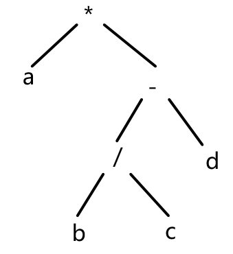

A.a*b/c- d 

B.a*b/(c-d) 

C.a*(b/c- d) 

D.a*(b-c/d) 
#### 答案
C
#### 解析
本题考查算术表达式相关问题。

算术表达式与树的中缀表达式类似，按照左根右的顺序，其中在算术表达式中符号位表示根。

根据该二叉树的表示，我们可以得知*为该树的总根，将左子树和右子树分隔开来。左边部分是a，右边部分是以-作为右子树的总根，左边是b/c，右边是d

综合得出算术表达式应该为a*（b/c-d）
***
#### 21、
对高级程序语言进行编译的过程中，使用（ ）来记录源程序中各个符号的必要信息，以辅助语义的正确性检查和代码生成。

A.决策表 

B.符号表 

C.广义表 

D.索引表
#### 答案
B
#### 解析
考查分析语义分析阶段相关问题。

语义分析阶段主要是分析各语法结构的含义，检查源程序是否包含静态语义错误，并收集类型信息提供后面的代码生成阶段使用。

在确认源程序的语法和语义后，可以对其进行翻译并给出源程序的内部表示。对于声明语句，需要记录所遇到的符号的信息，所以应该进行符号表的填查工作，用来记录源程序中各个符号的必要信息，以辅助语义的正确性检查和代码生成。

至于决策表是用于测试的，广义表是针对数据结构的表示，索引表是数据库中指示逻辑和物理记录对应的关系。
***
#### 22、
下图所示为一个非确定有限自动机（NFA），S0为初态，S3为终态。该NFA识别的字符串（  ）。


A.不能包含连续的字符“0” 

B.不能包含连续的字符“1” 

C.必须以“101”开头 

D.必须以“101”结尾 
#### 答案
D
#### 解析
本题考查NFA有限自动机相关问题。

针对这类问题，可以采取找出对应反例的形式表示。

S0是初态，S3是终态，识别出从S0为初态到S3为终态的路径。

可以看到无论如何到达S3终态都需要经过S1-S2，即末尾必须存在”101“结尾的。

对于A和B选项不能包含连续字符的”0“和“1”，我们可以看到在S0初态中，有1个字符串0和1自循环，是可以包含连续的”0“和”1“的，所以错误。

对于C选项必须以“101”开头，说法错误，可以任意1/0的字符开头。
***
#### 23、
在单处理机计算机系统中有1台打印机、1台扫描仪，系统采用先来先服务调度算法。假设系统中有进程P1、P2、P3、P4,其中P1为运行状态，P2为就绪状态，P3等待打印机，P4等待扫描仪。此时，若P1释放了扫描仪，则进程P1、P2、P3、P4的状态分别为（）。

A.等待、 运行、等待、就绪 

B.运行、就绪、等待、就绪 

C.就绪、就绪、等待、运行 

D.就绪、运行、等待、就绪 
#### 答案
B
#### 解析
考查三态模型相关问题。

在题干提示有相关进程P1，P2，P3，P4，两个资源打印机和扫描仪，三个状态：**运行，就绪，等待**。

首先题干已经明确说明P1处于运行态，释放了扫描仪，此时P1还有打印机没有运行完成，应该仍处于运行状态。

对于P2而言，**单处理机计算机系统只允许拥有1个运行状态**，P1此时还未运行完成，未分配对应的CPU，仍处于就绪态。

对于P3而言，等待打印机，处于等待状态，此时没有关于打印机的资源释放，仍处于等待状态。

对于P4而言，等待扫描仪，处于等待状态，有相关的扫描仪资源释放，应该得到相应的资源发生，从等待状态变成了就绪状态。
***
#### 24-26、
进程P1、 P2、P3、P4、P5和P6的前趋图如下所示。用PV操作控制这6个进程之间同步与互斥的程序如下，程序中的空①和空②处应分别为 （  ）  ，空③和空④处应分别为 （  ）  ， 空⑤和空⑥处应公别为（  ）

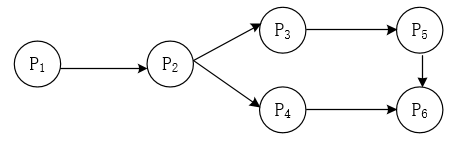

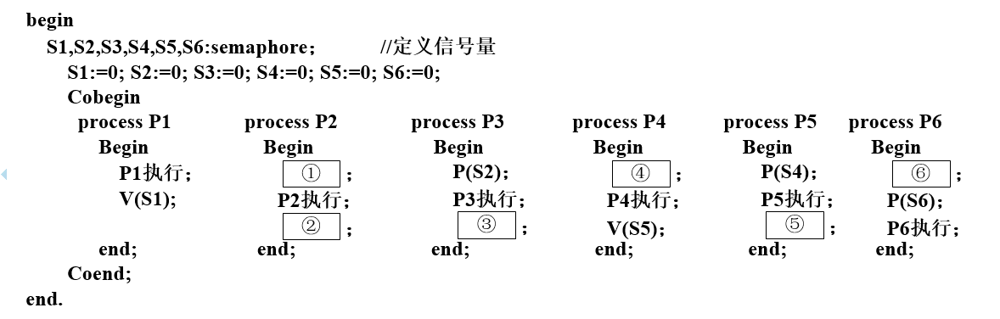

问题1选项 

A.V(S1)和P(S2)P(S3) 

B.V(S1)和V(S2)V(S3) 

C.P(S1)和P(S2)V(S3) 

D.P(S1)和V(S2)V(S3) 

问题2选项 

A.V(S3)和P(S3) 

B.V(S4)和P(S3) 

C.P(S3)和P(S4) 

D.V(S4)和P(S4) 

问题3选项 

A.V(S6)和P(S5) 

B.V(S5)和P(S6) 

C.P(S5)和V(S6) 

D.P(S5)和V(S5) 
#### 答案
第1题:D
第2题:B
第3题:A
#### 解析
本题考查 P,V操作 & 前驱图 相关问题。

**S 为信号量 Semaphore**

这是一个结构体，由一个值和一个队列组成。值是传递的信息（一个整数），而队列是允许进程挂在队列上的
```
struc semaphore
{
    int count;
    queueType queue;
}
```

**p操作可以理解为先去库存+等待取货**
```
P(s)
{
    s.count --;
    if (s.count < 0)
    {
        该进程状态置为阻塞状态；
        将改进程插入相应的等待队列 s.queue 末尾；
        重新调度；
    }
}
```
**v操作可以理解为立即补货+唤醒指定进程**
```
V(s)
{
    s.count ++;
    if (s.count <= 0)
    {
        唤醒相应等待队列 s.queue 中等待的一个进程；
        改变其状态为就绪态，并将其插入就绪队列；
    }
}
```

**前置分析，信号量按从上到下，从左到右的顺序标注箭头上的信号量 s，箭头开始是 P(s)，箭头结尾是 V(s)**

*信号量*

对于信号量，可以认为是一个仓库，有两个概念，容量和当前的货物个数。

P操作从仓库拿货，如果仓库中没有货，线程一直等待，直到V操作，往仓库里添加了货物，为了避免P操作一直等待下去，会有一个超时时间。

V操作往仓库送货，如果仓库满了，线程等待，直到有P操作，从仓库中拿走货物，有空的位置。

对信号量可以实施的操作：初始化、P、V。

P、V分别是荷兰语的 test(proberen) 和 increment(verhogen)。

**创建信号量，设置容量，如果容量初始化为0，先有V操作，才能P操作。**

P操作：货物个数减1，减过之后，货物个数大于等于0，说明已经拿到货物，线程继续。否者线程阻塞。

V操作：货物个数加1，加过之后，货物个数小于等于容量，说明添加成功，线程继续。否者线程阻塞。

- 0≤ 信号量≤容量 ，取值 表示当前可以使用的货物；

- 信号量<0 ，  取值 表示当前等待使用货物的线程；

- 信号量>容量 ，  信号量-容量 表示当前等待添加货物的线程。

通常，信号量的容量设置很大，可以一直V操作，不会阻塞，但是P操作的时候，很可能阻塞。

**当容量为1，也就是互斥，执行流程必定是V操作，P操作，V操作，P操作...**

*信号量如何做到线程同步？*

可以认为信号量关联一组线程，保存一个指针，指向线程数组的首地址。

比如当前信号量为-1，进行P操作，信号量为-2，说明没有拿到货物，线程等待，取值为-2，说明有两个线程等待那货物。这个时候，其他线程进行V操作，信号量加1，为-1，信号量通知等待的线程中，第一个线程继续执行，第二个线程继续等待。

也就是说，P操作等待的情况是减1后，信号量小于0，或者说信号量小于等于0则等待。

P操作继续执行的情况有两种：

a、减1后，信号量大于等于0，不需等待，直接执行；

b、信号量小于0，等待中，其他人进行了V操作，通知这个线程，继续执行。

对于这种问题，根据箭头的指向判断相应的PV操作，先理清楚前趋图中的逻辑关系：P1没有前驱，P2的前驱是P1，P3的前驱是P2，P4的前驱是P2，P5的前驱是P3，P6的前驱是P4，P5。

**前驱就是指只有在前驱进程完成后，该进程才能开始执行。**

由图可知，这里进程之间有6条有向弧，分别表示为P1→P2，P2→P3，P2→P4，P3→P5，P4→P6，P5→P6，各个进程间的逻辑关系，那么我们需要设定6个信号量（S1、S2、S3、S4、S5、S6），利用PV操作来控制这些过程。

对于进程P1，完成之后，需要通知P2，所以在P1执行了之后，实现了V（S1）操作。

对于进程P2，开始之前需要申请资源S1，实现P（S1），P2执行完成之后，需要通知P3和P4，实现两个V操作，分别是V（S2）和V（S3）

对于进程P3，开始之前需要申请资源S2，实现P（S2），P3执行完成之后，需要通知P5，实现V操作，为V（S4）

对于进程P4，开始之前需要申请资源S3，实现P（S3），P4执行完成之后，需要通知P6，实现V操作，为V（S5）

对于进程P5，开始之前需要申请资源S4，实现P（S4），P5执行完成之后，需要通知P6，实现V操作，为V（S6）

对于进程P6，开始之前需要申请资源S5和S6，实现两个P操作，分别为P（S5）和P（S6）
***
#### 27-28、
在磁盘上存储数据的排列方式会影响I/O服务的总时间。假设每个磁道被划分成10个物理块，每个物理块存放1个逻辑记录。逻辑记录R1,R2....R10存放在同一个磁道上，记录的排列顺序如下表所示：

 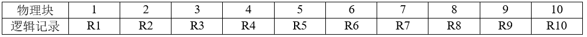

假定磁盘的旋转速度为10ms/周，磁头当前处在R1的开始处。若系统顺序处理这些记录，使用单缓冲区，每个记录处理时间为2ms，则处理这10个记录的最长时间为(  ）?若对存储数据的排列顺序进行优化，处理10个记录的最少时间为（  ）。

问题1选项 

A.30ms 

B.60ms 

C.94ms 

D.102ms 

问题2选项 

A.30ms 

B.60ms 

C.102ms 

D.94ms 
#### 答案
第1题:D
第2题:A
#### 解析
考查磁盘管理相关计算问题。

整个磁盘如下图所示，整个磁盘的旋转速度为10ms/周，共10个磁盘，可知每个磁盘的读取时间为1ms，对于每个磁盘而言，有读取的时间1ms，处理时间2ms。

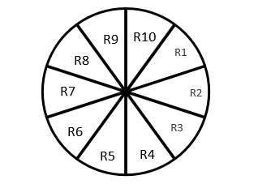

接下来具体的看分析：

对于磁盘R1而言，磁头首先位于R1的开始处（即R10的末尾位置那条线），读取R1花费1ms时间，磁头到了R1的末尾处，又需要花费2ms处理它，所以可以得知经过3ms时候，磁头已经旋转到了R4的开始处（即R3的末尾处）

接下来需要读取R2并处理R2，这个时候需要将磁头旋转到R2的开始处位置，那么需要顺时针移动（R4-R1，共计8个磁盘）才到R2的开始处

接下来，读取R2并处理R2同样需要花费3ms时间，磁盘也到了R5的开始，也需要旋转同样的8个磁盘，依次类推。

除第一个磁盘R1不需要移动磁头位置，其余9个磁盘都需要移动8个磁盘，即总时间为R1的时间（1+2）ms，后面9个磁盘的时间9*（8+1+2），共计102ms

改善后的磁盘，避免了磁头的移动，即每个磁盘读取和处理共计3ms，总共10个磁盘，需要花费3*10=30ms（如下图所示）

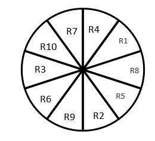
***
#### 29、
以下关于增量模型优点的叙述中，不正确的是（  ）。

A.强调开发阶段性早期计划 

B.第一个可交付版本所需要的时间少和成本低 

C.开发由增量表示的小系统所承担的风险小 

D.系统管理成本低、效率高、配置简单 
#### 答案
D
#### 解析
本题考查的是 [软件生存周期模型](../../../知识点/软件生存周期模型/README.md)

增量模型作为瀑布模型的一个变体，具有瀑布模型的所有优点。

此外，它还具有以下优点：第一个可交付版本所需要的成本和时间很少；开发由增量表示的小系统所承担的风险不大：由于很快发布了第一个版本，因此可以减少用户需求的变更：运行增量投资，即在项目开始时，可以仅对一个或两个增量进行投资。

增量模型有以下不足之处：

如果没有对用户变更的要求进行规划，那么产生的初始量可能会造成后来增量的不稳定；

如果需求不像早期思考的那样稳定和完整，那么一些增量就可能需要重新开发，重新发布；

管理发生的成本、进度和配置的复杂性可能会超出组织的能力。
***
#### 30、
以下关于敏捷统一过程（AUP） 的叙述中，不正确的是（  ）。

A.在大型任务上连续 

B.在小型活动上迭代 

C.每一个不同的系统都需要一套不同的策略、约定和方法论 

D.采用经典的UP阶段性活动，即初始、精化、构建和转换 
#### 答案
C
#### 解析
本题考查的是 [软件生存周期模型](../../../知识点/软件生存周期模型/README.md)

敏捷统一过程（AUP）采用“在大型上连续”以及在“小型上迭代”的原理来构建软件系统。采用经典的UP阶段性活动（初始、精化、构建和转换），提供了一系列活动，能够使团队为软件项目构想出一个全面的过程流。在每个活动里，一个团队迭代了使用敏捷，并将有意义的软件增量尽可能快地交付给最终用户。

在每一个不同地系统都需要一套不同地策略、约定和方法论是属于敏捷方法-----水晶法的描述。

注意区别这里面是考查敏捷统一过程，而非敏捷方法，两者之间有区别。
***
#### 31、
在ISO/IEC软件质量模型中，可移植性是指与软件可从某环境行移到另一环境的能力有关的一组属性，其子特性不包括（）。

A.适应性 

B.易测试性 

C.易安装性 

D.易替换性 
#### 答案
B
#### 解析
考查 [ISO/IEC 9126和Mc Call软件质量模型](../../../知识点/ISO:IEC和McCall软件质量模型/README.md)  的几大质量特性。

可移植性包括：适应性、易安装性、一致性、易替换性。

易测试性属于可维护性的范畴。
***
#### 32、
在软件开发过程中，系统测试阶段的测试目标来自于（）阶段。

A.需求分析 

B.概要设计 

C.详细设计 

D.软件实现 
#### 答案
A
#### 解析
考查 [软件测试V模型W模型H模型](../../../知识点/软件测试V模型W模型H模型/README.md) 相关问题。

可以根据V模型来理解，V模型是测试贯穿于始终。

<center>
    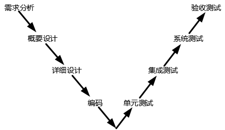
    <br>
    <div style="color:orange; border-bottom: 1px solid #d9d9d9;
    display: inline-block;
    color: #999;
    padding: 2px;">V模型</div>
</center>

其中系统测试和验收测试是针对于需求分析，集成测试针对于概要设计，单元测试针对于详细设计，软件实现应该是针对于编码部分。
***
#### 33、
信息系统的文档是开发人员与用户交流的工具。在系统规划和系统分析阶段，用户与系统分析人员交流所使用的文档不包括（  ）。

A.可行性研究报告 

B.总体规划报告 

C.项目开发计划 

D.用户使用手册 
#### 答案
D
#### 解析
本题考查软件开发工程需求分析相关问题。

用户与系统分析人员交流所使用的文档可以包括以下：

可行性研究报告：可行性研究报告是从事一种经济活动（投资）之前，双方要从经济、技术、生产、供销直到社会各种环境、法律等各种因素进行具体调查、研究、分析，确定有利和不利的因素、项目是否可行，估计成功率大小、经济效益和社会效果程度，为决策者和主管机关审批的上报文件。 是需求分析和客户人员之间交流所使用或参考的文档。

总体规划报告：至少市场/客户、新产品、人（引进、培养）、设备、成本等方面包括，也是需求分析和客户人员之间交流所使用或参考的文档。

项目开发计划：是指通过使用项目其他专项计划过程所生成的结果(即项目的各种专项计划)，运用整合和综合平衡的方法，制定出用于指导项目实施和管理的整合性、综合性、全局性、协调统一的整合计划文件。是对需求分析和客户人员交流所必要的文档。

用户使用手册：详细描述软件的功能、性能和用户界面，使用户了解到如何使用该软件的说明书。一般是开发完成之后交付给客户的。
***
#### 34-35、
如下所示代码(用缩进表示程序块)，要实现语句覆盖，至少需要( )个测试用例。

采用McCabe度量法计算该代码对应的程序流程图的环路复杂性为( )。
```
input A,n
for i = 2 to n
        key = A[i]
        j = i-1
        while j > 0 and A[j]>key
                  A[j+1]=A[j]
                  j = j-1
        A[j+1] = key
```
问题1选项 

A.1 

B.2 

C.3 

D.4 

问题2选项 

A.2 

B.1 

C.3 

D.4 
#### 答案
第1题:A
第2题:C
#### 解析
本题考查环路复杂度和 [McCabe度量计算](../../../知识点/McCabe环路复杂度计算方法/README.md) 的结合考查。

针对于伪代码而言，我们具体能够根据其关系判断，做得应该是将一组数据，按照从小到大的顺序进行排序的过程，实质是属于插入排序的算法。

首先对于第一个问题，要实现语句覆盖，至少需要多少个测试用例，我们只需要一组数据就能够得到不断重复排序后的输出结果。

对于第二个问题，计算环路复杂度，我们需要做个相关简图，如下图所示，可以根据环路公式V（G）=m-n+2也可以直接数闭环+1，得出其结果为3

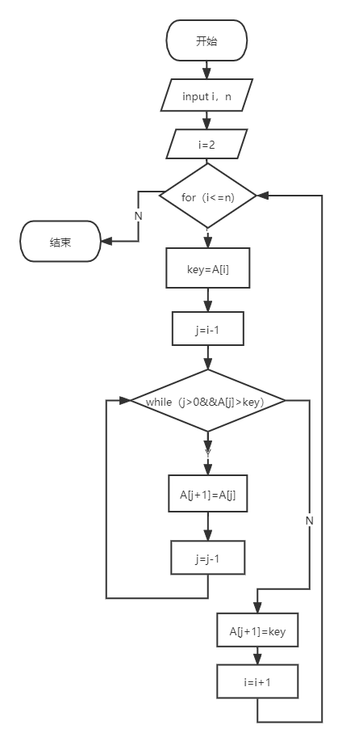

***
#### 36、
系统可维护性是指维护人员理解、改正、改动和改进软件系统的难易程度，其评价指标不包括（）。

A.可理解性 

B.可测试性 

C.可修改性 

D.一致性 
#### 答案
D
#### 解析
本题考查软件维护的问题。

注意区别这里面的软件维护不是 [ISO/IEC 9126和Mc Call软件质量模型](../../../知识点/ISO:IEC和McCall软件质量模型/README.md) 里的维护性，两者需要进行区别。

在这里的软件维护的可维护性应该包括：可理解性，可测试性，可修改性。

其中一致性属于可移植性的范畴。
***
#### 37、
面向对象设计时包含的主要活动是（  ）。

A.认定对象、组织对象、描述对象间的相互作用、确定对象的操作 

B.认定对象、定义属性、组织对象、确定对象的操作 

C.识别类及对象、确定对象的操作、描述对象间的相互作用、识别关系 

D.识别类及对象、定义属性、定义服务、识别关系、识别包 
#### 答案
D
#### 解析
考查关于面向对象的开发阶段。

面向对象分析阶段：认定对象，组织对象，对象间的相互作用，基于对象的操作。

面向对象设计阶段：识别类及对象、定义属性、定义服务、识别关系、识别包。

面向对象程序设计：程序设计范型、选择一种OOPL。

面向对象测试：算法层、类层、模板层、系统层。
***
#### 38、
在面向对象设计时，如果重用了包中的一个类，那么就要重用包中的所有类，这属于（）原则。

A.接口分离 

B.开放-封闭 

C.共同封闭 

D.共同重用 
#### 答案
D
#### 解析
考查关于面向对象设计的几大原则。

接口分离原则：使用多个专门的接口要比使用单一的总接口要好。

开放-封闭原则：对扩展开放，对修改关闭。

共同封闭原则：包中的所有类对于同一性质的变化应该是共同封闭的。一个变化若对一个包产生影响，则将对该包里的所有类产生影响，而对于其他的包不造成任何影响。

共同重用原则：一个包里的所有类应该是共同重用的。如果重用了包里的一个类，那么就要重用包中的所有类。
***
#### 39-40、
某电商系统在采用面向对象方法进行设计时，识别出网店、商品、购物车、订单买家、库存、支付（微信、支付宝）等类。其中，购物车与商品之间适合采用（  ）关系，网店与商品之间适合采用（  ）关系。

问题1选项 

A.关联 

B.依赖 

C.组合 

D.聚合 

问题2选项 

A.依赖 

B.关联 

C.组合 

D.聚合 
#### 答案
第1题:D
第2题:C
#### 解析
本题考查UML类图的几种关系。

关联关系：描述了一组链，链是对象之间的连接。

依赖关系：一件事物发生改变影响到另一个事务。

聚合关系：整体与部分生命周期不同的关系。

组合关系：整体与部分生命周期相同的关系。

对于购物车和商品而言，网上商店的购物车要能过跟踪顾客所选的的商品，记录下所选商品，还要能随时更新，可以支付购买，能给顾客提供很大的方便。购物车用于存放商品，购物车是整体，商品是部分，他们之间生命周期不同。属于聚合关系。

对于网店和商品而言，网点里面包含商品，属于整体和部分生命周期相同的情况，属于组合关系。
***
#### 41-43、
某软件系统限定：用户登录失败的次数不能超过3次。采用如所示的UML状态图对用户登录状态进行建模，假设活动状态是Logging in,那么当Valid Entry发生时，(  )。 其中，[tries<3]和tries+ +分别为(  )和(  )。

问题1选项 

A.保持在Logging in状态 

B.若[tries<3]为true，则Logged in变为下一个活动状态 

C.Logged in立刻变为下一 个活动状态 

D.若tries=3为true，则Logging Denied变为下一个活动状态 

问题2选项 

A.状态 

B.转换 

C.监护条件 

D.转换后效果 

问题3选项 

A.状态 

B.转换 

C.转换后效果 

D.监护条件 
#### 答案
第1题:B
第2题:C
第3题:B
#### 解析
本题考查UML状态图的问题。

通过状态图图示可知，假设活动状态是Logging in,那么当Valid Entry发生时，当限制条件【tries=3】会到达Logging   Denied状态，当限制条件【tries<3】Logged  in状态。针对于第一问的描述，仅有B符合状态图的表示。

[tries<3]和tries+ +分别表示监护条件和转换，带有【】表示限制条件，没带【】的具体操作表示一个状态到另外一个状态的转换。
***
#### 44-46、
在某系统中，不同组（GROUP）访问数据的权限不同，每个用户（User）可以是一个或多个组中的成员，每个组包含零个或多个用户。现要求在用户和组之间设计映射，将用户和组之间的关系由映射进行维护，得到如下所示的类图。该设计采用(  )模式，用一个对象来封装系列的对象交互；使用户对象和组对象不需要显式地相互引用，从而使其耦合松散，而且可以独立地改变它们之间的交互。该模式属于(  )模式，该模式适用 (  )。


问题1选项 

A.状态(State) 

B.策略(Strategy) 

C.解释器(Interpreter) 

D.中介者(Mediator) 

问题2选项 

A.创建型类 

B.创建型对象 

C.行为型对象 

D.行为型类 

问题3选项 

A.需要使用一个算法的不同变体 

B.有一个语言需要解释执行，并且可将句子表示为一个抽象语法树 

C.一个对象的行为决定于其状态且必须在运行时刻根据状态改变行为 

D.一组对象以定义良好但是复杂的方式进行通信，产生的相互依赖关系结构混乱且难以理解 

#### 答案
第1题:D
第2题:C
第3题:D
#### 解析
本题考查设计模式的问题。

针对于题干和图示来看，不同组（GROUP）访问数据的权限不同，每个用户（User）可以是一个或多个组中的成员，每个组包含零个或多个用户。现要求在用户和组之间设计映射，将用户和组之间的关系由映射进行维护，在组和用户之间用UserGroupMapper实现两者的交互，两者之间不直接交互，用一个对象来封装系列的对象交互；使用户对象和组对象不需要显式地相互引用，从而使其耦合松散，而且可以独立地改变它们之间的交互，是典型关于中介者模式的描述和应用。

中介者模式属于行为型对象模型，可以适用于一组对象以定义良好但是复杂的方式进行通信，产生的相互依赖关系结构混乱且难以理解。

其中以下场景中A选项是对策略模式的描述，B选项是对解释器的描述，C选项是对状态模式的描述。

综上所述，本题选择D，C，D
***
#### 47、
在设计某购物中心的收银软件系统时，要求能够支持在不同时期推出打折、返利、满减等不同促销活动，则适合采用（）模式。

A.策略(Strategy) 

B.访问者(Visitor) 

C.观察者(Observer) 

D.中介者(Mediator) 
#### 答案
A
#### 解析
在设计某购物中心的收银软件系统时，要求能够支持在不同时期推出打折、返利、满减等不同促销活动，收银软件系统的计入规则有：打折、返利、满减三种不同的策略，每种策略之间封装起来，可以相互替换，使它们可以独立的变换，属于典型的策略模式。
***
#### 48、
Python 语言的特点不包括（）。

A.跨平台、开源 

B.编译型 

C.支持面向对象程序设计 

D.动态编程 
#### 答案
B
#### 解析
本题考查python相关问题。

python语义的特点：

跨平台、开源、简单易学、面向对象、可移植性、解释性、开源、高级语言、可扩展性、丰富的库、动态编程等等

综上所述B选项错误，python不是编译型语言，而是解释型语言。
***
#### 49、
在Python语言中，（）是一种可变的、有序的序列结构，其中元素可以重复。

A.元组(tuple) 

B.字符串(str) 

C.列表(list) 

D.集合(set) 
#### 答案
C
#### 解析
本题考查python语言的用法相关问题。

在python中，元组(tuple)、字符串(str)、集合(set)元素都可以重复。并不能强调是一种可变的、有序的序列结构。

而列表（list）是python中最基本的数据结构，是一种有序可重复的集合,可以随时添加和删除其中的元素
***
#### 50、
以下Python语言的模块中，（）不支持深度学习模型。

A.TensorFlow 

B.Matplotlib 

C.PyTorch 

D.Keras 
#### 答案
B
#### 解析
本题考查python语言的语法相关。

其中支持Python语言深度学习的有：

TensorFlow：Tensorflow拥有多层级结构，可部署于各类服务器、PC终端和网页并支持GPU和TPU高性能数值计算，被广泛应用于谷歌内部的产品开发和各领域的科学研究，支持Python语言深度学习。

PyTorch：PyTorch是一个针对深度学习，并且使用GPU和CPU来优化的tensor library（张量库）是由Torch7团队开发，是一个以Python优先的深度学习框架，不仅能实现强大的GPU加速，同时还支持动态的神经网络。

Keras：Keras是一个由Python编写的开源人工神经网络库，可以作为Tensorflow、Microsoft-CNTK和Theano的高阶应用程序接口，进行深度学习模型的设计、调试、评估、应用和可视化。

仅有B选项表示的Matplotlib不是，Matplotlib 是一个 Python 的 2D绘图库，它以各种硬拷贝格式和跨平台的交互式环境生成出版质量级别的图形，不支持深度学习。
***
#### 51、
采用三级模式结构的数据库系统中，如果对一个表创建聚簇索引，那么改变的是数据库的（）。

A.外模式 

B.模式 

C.内模式 

D.用户模式 

#### 答案
C
#### 解析
本题考查 [数据库三级模式两级映射](../../../知识点/数据库三级模式两级映射/README.md)。

对于三级模式，分为外模式，模式和内模式。其中外模式对应视图级别，是用户与数据库系统的接口，是用户用到那部分数据的描述，比如说：用户视图；对于模式而言，又叫概念模式，对于表级，是数据库中全部数据的逻辑结构和特质的描述，由若干个概念记录类型组成，只涉及类型的描述，不涉及具体的值；而对于内模式而言，又叫存储模式，对应文件级，是数据物理结构和存储方式的描述，是数据在数据库内部表示的表示方法，定义所有内部的记录类型，索引和文件的组织方式，以及数据控制方面的细节。例如：B树结构存储，Hash方法存储，聚簇索引等等。
***
#### 52-53、
设关系模式R(U,F), U={A1，A2, A3, A4}，函数依赖集F={A1→A2, A1→A3，A2→A4}，关系R的候选码是(  )。下列结论错误的是(  )。

问题1选项 

A.A1 

B.A2 

C.A1A2 

D.A1A3 

问题2选项 

A.A1→A2A3为F所蕴涵 

B.A1- > A4为F所蕴涵 

C.A1A2→A4为F所蕴涵 

D.A2→A3为F所蕴涵 
#### 答案
第1题:A

第2题:D
#### 解析
本题考查候选键的求法和函数依赖的判断问题。

第一问求候选键，采用图示法，能够遍历所有属性的即为候选键，首先应该找出入度为0的节点，只有A1，如果入度为0的节点，遍历不了所有节点，那么需要加入一些中间结点（既有入度又有出度）的结点进行遍历，以它们的组合键作为候选键。

根据方法，找到入度为0的节点A1，可以发现第一步能够通过A1决定所有属性A2（A1→A2），A3（A1→A3），A4（A1→A2，A2→A4，传递律得A1→A4）
得出A1为候选键。

第二问考查 [Armstrong公理](../../../知识点/Armstrong公理/README.md) 进行求解相关：

A.A1→A2A3为F所蕴涵，通过A1→A2，A1→A3，得出A1→A2A3（合并规则）

B.A1- > A4为F所蕴涵，通过A1→A2，A2→A4，得出A1→A4（传递律）

C.A1A2→A4为F所蕴涵，通过A2→A4，A1→A4（传递律），那么两者的结合键为A1A2→A4自然能被F所蕴涵。

D.A2→A3为F所蕴涵，不能推导得出。
***
#### 54-55、
给定学生关系S(学号，姓名，学院名，电话,家庭住址)、课程关系C(课程号,课程名,选修课程号)、选课关系SC(学号,课程号,成绩)。查询“张晋”选修了“市场营销”课程的学号、学生名、学院名、成绩的关系代数表达式为: π1,2,3,7( π  1,2,3(  ) )∞(  ) ))。

问题1选项 

A.σ2=张晋(S) 

B.σ2='张晋'(S) 

C.σ2=张晋(SC) 

D.σ2='张晋'(SC) 

问题2选项 

A.π2,3(σ2='市场营销'(C))∞SC 

B.π2,3(σ2=市场营销(SC))∞C 

C.π1,2(σ2='市场营销'(C)∞SC 

D.π1,2(σ2=市场营销 (SC))∞C 
#### 答案
第1题:B

第2题:A
#### 解析
本题考查数据关系代数相关问题。

根据题干要求，查询“张晋”选修了“市场营销”课程的学号、学生名、学院名、成绩的关系代数表达式

给出以下三个关系表：

学生关系S(学号,姓名,学院名,电话,家庭住址)

课程关系C(课程号,课程名,选修课程号)

选课关系SC(学号,课程号,成绩)

根据题干的描述和选项的结合来看，只有学生名和选修课程的名称，这个表达式应该是由C和SC先进行自然连接，然后S再与 C和SC先自然连接后的关系再进行自然连接。

针对与表达式π1,2,3,7( π  1,2,3(  ) )∞(  ) ))。

内层表达式里面进行自然连接，对于第一空，  π  1,2,3，投影1，2，3列，应该来源于题干描述的来着S学生关系的张晋， 正确表达应该是σ2='张晋'(S)，人名字符串需要加引号。

对于第二空来说，应该是选修课程号的“市场营销”的C表与选课关的SC表进行自然连接，首先排除B、D。

对于A，C的区别再于两者的投影不同，A选项投影C表的2,3列即（课程名，选修课程号），而C选项投影C表的1,2列（课程号，课程名）。

针对与题干来看，市场营销是选修课程的名称，所以投影选修号比较合适一点。正确表达为π2,3(σ2='市场营销'(C))∞SC。

最后两层投影得到的表为A（学号，姓名，学院名，课程名，选修课程号，课程号，成绩)，对于外层的投影1,2,3,7列恰好是学号，姓名，学院名，成绩
***
#### 56、
数据库的安全机制中，通过提供（）供第三方开发人员调用进行数据更新，从而保证数据库的关系模式不被第三方所获取。

A.触发器 

B.存储过程 

C.视图 

D.索引 
#### 答案
B
#### 解析
本题考查的是数据库基础知识。

索引是数据库中提高查询效率的一种机制，不能进行数据更新。

视图一般是提供查询数据的，具有一定安全机制，但是不能进行数据更新。

触发器可以作为更新机制，但是无法避免数据库的关系模式被第三方所获取，并不安全。

存储过程方式，可以定义一段代码，从而提供给用户程序来调用，具体更新过程通过代码调用，避免了向第三方提供系统表结构的过程，体现了数据库的安全机制。所以本题选择B选项。
***
#### 57、
若栈采用顺序存储方式，现有两栈共享空间V[1..n],, top[i]代表i( i=1,2)个栈的栈顶(两个栈都空时top[1]= 1、top[2]= n)，栈1的底在V[1]，栈2的底在V[n]，则栈满(即n个元素暂存在这两个栈)的条件是（）

A.top[1]= top[2] 

B.top[1]+ top[2]==1 

C.top[1]+ top[2]==n 

D.top[1]- top[2]== 1 
#### 答案
D
#### 解析
本题考查栈的相关问题。

由题干描述可知，现有两栈共享空间V[1..n],, top[i]代表i( i=1,2)个栈的栈顶(两个栈都空时top[1]= 1、top[2]= n)，栈1的底在V[1]，栈2的底在V[n]。

若按照顺序从底到上从V【1】到V【n】都将存入栈内，这个栈共享空间V【1.....n】，可知该栈一分为二，栈1可以是开口向上，底为V【1】，栈2是开口向上，底为V【n】，要使栈满，就需要保持两个栈重合，即两个栈的开口位置相邻，有top【1】-top【2】==1，如下图所示：

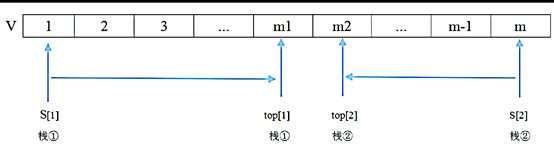
***
#### 58、
采用循环队列的优点是（）

A.入队和出队可以在队列的同端点进行操作 

B.入队和出队操作都不需要移动队列中的其他元素 

C.避免出现队列满的情况 

D.避免出现队列空的情况 

#### 答案
B
#### 解析
本题考查数据结构循环队列的问题。

1、循环队列的优点：

可以有效的利用资源。用数组实现队列时，如果不移动，随着数据的不断读写，会出现假满队列的情况。即尾数组已满但头数组还是空的；循环队列也是一种数组，只是它在逻辑上把数组的头和尾相连，形成循环队列，当数组尾满的时候，要判断数组头是否为空，不为空继续存放数据。

2、循环队列的缺点：

循环队列中，由于入队时尾指针向前追赶头指针；出队时头指针向前追赶尾指针，造成队空和队满时头尾指针均相等。因此，无法通过条件front==rear来判别队列是"空"是"满"。

3、拓展知识：

循环队列就是将队列存储空间的最后一个位置绕到第一个位置，形成逻辑上的环状空间，供队列循环使用。在循环队列结构中，当存储空间的最后一个位置已被使用而再要进入队运算时，只需要存储空间的第一个位置空闲，便可将元素加入到第一个位置，即将存储空间的第一个位置作为队尾。循环队列可以更简单防止伪溢出的发生，但队列大小是固定的。

在循环队列中，当队列为空时，有front=rear，而当所有队列空间全占满时，也有front=rear。为了区别这两种情况，规定循环队列最多只能有MaxSize-1个队列元素，当循环队列中只剩下一个空存储单元时，队列就已经满了。因此，队列判空的条件是front=rear，而队列判满的条件是front=（rear+1)%MaxSize。

为充分利用向量空间，克服"假溢出"现象的方法是：将向量空间想象为一个首尾相接的圆环，并称这种向量为循环向量。存储在其中的队列称为循环队列。

综上所述，C，D都不属于其优点，B选项是循环队列的优点，A是对栈的描述。

***
#### 59、
二叉树的高度是指其层数， 空二叉树的高度为0，仅有根结点的二叉树高度为1。若某二叉树中共有1024个结点，则该二叉树的高度是整数区间（  ）中的任一值。

A.(10, 1024) 

B.[10, 1024] 

C.(11, 1024) 

D.[11, 1024] 
#### 答案
D

#### 解析
本题考查关于二叉树的构造问题。

根据题干描述， 空二叉树的高度为0，仅有根结点的二叉树高度为1，当若某二叉树中共有1024个结点，求其取值范围？

我们不妨求出取值范围的极限值，当1024个结点都为根结点的时候，表示1024个二叉树高度为1，高度累计为1024，区间能够取到1024，属于闭区间，排除A，C

再求出其最小值的情况，最小值应该是按照满二叉树进行排列，对于二叉树的规律如下：第一层的结点树2^0=1，第二层2^1=2，第3层2^2=4，依次类推。

对于1024而言，2^10=1024，所以我们不能取到11层，应该先到第10层2^9=512，此时10层共累计的节点有：2^0+2^1+...+2^9=(2^9)*2-1=2^10-1=1023，共有1024还缺少1个结点，只能存放到第11层。

第11层仅有1个结点，但是它的层次已经到了11层，所以能取到11，属于闭区间，排除B选项，故表达式取值范围应该是[11, 1024]。
***
#### 60、
n个关键码构成的序列{k1,k2, ...Kn}当且仅当满足下列关系时称其为堆。

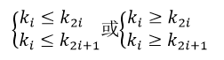

以下关键码序列中，（） 不是堆。

A.15,25,21,53,73, 65,33 

B.15,25,21,33,73,65,53 

C.73,65,25,21,15,53,33 

D.73,65,25,33,53,15,21 
#### 答案
C

#### 解析
本题考查堆排序的算法问题。

堆分为大顶堆（根节点大于左孩子和右孩子节点）和小顶堆（根节点小于左孩子节点和右孩子节点）。

根据选项来看，共7个节点，应该是3层的满二叉树，符号堆的有A，B，D三个选项。

仅有C选项73,65,25,21,15,53,33

73作为根节点，根大于其左孩子节点65和右孩子节点25都，是大顶堆的构造;

第二层65作为左子树的根节点，大于了其左孩子节点21和右孩子节点15，符合大顶堆的构造；

25作为右子树的根节点，却小于了其左孩子节点53和右孩子节点33，不符合大顶堆的构造了，故不是堆。

***
#### 61、
对有向图G进行拓扑排序得到的拓扑序列中，顶点Vi在顶点Vj之前，则说明G中（）

A.一定存在有向弧 `<Vi, Vj>`

B.一定不存在有向弧 `<Vj, Vi>`

C.必定存在从 Vi 到 Vj 的路径 

D.必定存在从 Vj 到 Vi 的路径 

#### 答案
B

#### 解析
本题考查拓扑序列的相关问题。

对于拓扑序列，需要按照有向弧的指向，明确其先后顺序，例如：存在一条 Vi 指向 Vj 的有向弧，那么在拓扑序列中 Vi 需要写出 Vj 前面，其次对于属于同一层次或者毫无关联的两个结点可以不用在意先后顺序。

根据题干描述，对有向图 G 进行拓扑排序得到的拓扑序列中，顶点 Vi 在顶点 Vj 之前，我们试着对以下选项进行分析：

A、 一定存在有向弧`<Vi, Vj>`，说法错误，不一定存在，Vi 和 Vj 可以是并列的，并不一定要存在 Vi 到 Vj 的有向弧。

B、一定不存在有向弧`<Vj, Vi>`，说法正确，如果存在有向弧`<Vj, Vi>`，那么 Vj 是需要在顶点 Vi 之前的，则与题干相悖，所以必定不存在。

C、必定存在从 Vi 到 Vj 的路径，说法错误，不一定存在，Vi 和 Vj 可以是两个毫无关联没有指向的关系，不会存在相关的路径。

D、必定存在从 Vj 到 Vi 的路径，说法错误，如果存在 Vj 到 Vi 的路径，Vj 就会出现在 Vi 前面。

**拓扑排序入门**

在图论中，拓扑排序（Topological Sorting）是一个有向无环图（DAG, Directed Acyclic Graph）的所有顶点的线性序列。且该序列必须满足下面两个条件：

*每个顶点出现且只出现一次。*

*若存在一条从顶点 A 到顶点 B 的路径，那么在序列中顶点 A 出现在顶点 B 的前面。*

有向无环图（DAG）才有拓扑排序，非DAG图没有拓扑排序一说。

在一个有向图中，对所有的节点进行排序，要求没有一个节点指向它前面的节点。

先统计所有节点的入度，对于**入度为0**的节点就可以分离出来，然后把这个节点指向的节点的入度减一。

一直做改操作，直到所有的节点都被分离出来。

如果最后不存在入度为0的节点，那就说明有环，不存在拓扑排序，也就是很多题目的无解的情况。

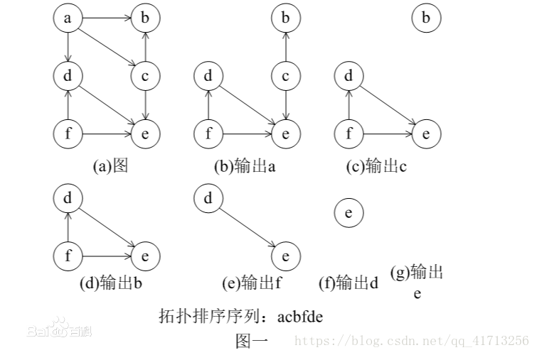

***
#### 62-63、
归并排序算法在排序过程中，将待排序数组分为两个大小相同的子数组，分别对两个子数组采用归并排序算法进行排序,排好序的两个子数组采用时间复杂度为0(n)的过程合并为一个大数组。

根据上述描述，归并排序算法采用了(  )算法设计策略。归并排序算法的最好和最坏情况下的时间复杂度为(  )。

问题1选项 

A.分治 

B.动态规划

C.贪心 

D.回溯 

问题2选项 

A.  

B.  

C.  

D.  
#### 答案
第1题:A

第2题:C

#### 解析
本题考查 [归并排序相关算法](../../../知识点/归并排序算法/README.md)。

归并排序（Merge Sort）是建立在归并操作上的一种有效，稳定的排序算法，该算法是采用分治法（Divide and Conquer）的一个非常典型的应用。

将已有序的子序列合并，得到完全有序的序列；即先使每个子序列有序，再使子序列段间有序。若将两个有序表合并成一个有序表，称为二路归并。

归并排序是运用分治法相关策略，其时间复杂度是由外层的n循环，与内层的归并过程log2n结合起来得到O（nlgn），归并排序没有所谓的最好和最坏排序算法，都为O（nlgn）
***
#### 64-65、
已知一个文件中出现的各字符及其对应的频率如下表所示。采用Huffman编码，则该文件中字符a和c的码长分别为(  )。

若采用Huffman编码，则字序列 “110001001101” 的编码应为(  )。

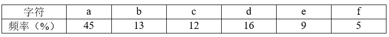

问题1选项 

A.1和3 

B.1和4 

C.3和3 

D.3和4 

问题2选项

A.face 

B.bace 

C.acde 

D.fade 

#### 答案
第1题:A

第2题:A

#### 解析
本题考查哈弗曼树的构造问题。

给定N个权值作为N个叶子结点，构造一棵二叉树，若该树的带权路径长度达到最小，称这样的二叉树为最优二叉树，也称为哈夫曼树(Huffman Tree)。

**哈夫曼树是带权路径长度最短的树，权值较大的结点离根较近。**

根据题中表格字符构造出如下的哈夫曼树。

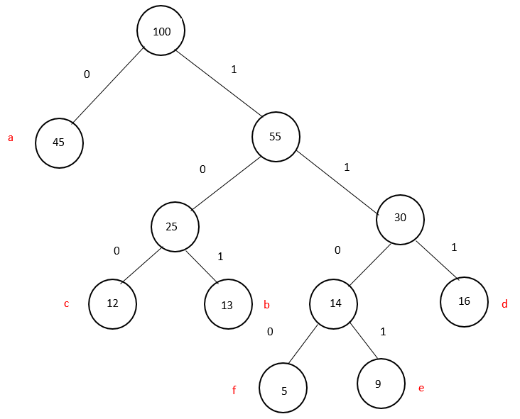

根据哈弗曼树可得：图中a的长度为1，c的长度为3。

而对于字序列 “110001001101” 编码 `1100 0 100 1101`应该为face。

***
#### 66、
用户在电子商务网站上使用网上银行支付时，必须通过(  )在 Internet 与银行专用网之间进行数据交换。

A.支付网关 

B.防病毒网关 

C.出口路由器 

D.堡垒主机 

#### 答案
A

#### 解析
本题计算机网络相关交互协议。

用户在电子商务网站上使用网上银行支付时，必须通过支付网关才能在Internet与银行专用网之间进行数据交换。

A、支付网关：是银行金融网络系统和Internet网络之间的接口，是由银行操作的将Internet上传输的数据转换为金融机构内部数据的一组服务器设备，或由指派的第三方处理商家支付信息和顾客的支付指令。

B、防病毒网关：防病毒网关是一种网络设备，用以保护网络内（一般是局域网）进出数据的安全。主要体现在病毒杀除、关键字过滤（如色情、反动）、垃圾邮件阻止的功能，同时部分设备也具有一定防火墙（划分Vlan）的功能。如果与互联网相连，就需要网关的防病毒软件。

C、出口路由器：一般指局域网出外网的路由器，或者指一个企业、小区、单位、城域网、省级网络、国家网络与外界网络直接相连的那台路由器。在网络间起网关的作用，是读取每一个数据包中的地址然后决定如何传送的专用智能性的网络设备。

D、堡垒主机：堡垒主机是一种被强化的可以防御进攻的计算机，作为进入内部网络的一个检查点，以达到把整个网络的安全问题集中在某个主机上解决，从而省时省力，不用考虑其它主机的安全的目的。
***
#### 67-68、
ARP 报文分为ARP Request和ARP Response，其中ARP Request采用(  )进行传送，ARP Response采用(  )进行传送。

问题1选项 

A.广播 

B.组播 

C.多播 

D.单播 

问题2选项 

A.组播 

B.广播 

C.多播 

D.单播 

#### 答案
第1题:A

第2题:D

#### 解析
本题考查计算机网络ARP协议。

ARP协议：地址解析协议，作用是由IP地址转换成MAC地址

RARP协议：反地址解析协议，作用是MAC地址转换成IP地址

对于ARP而言，请求是广播发送，ARP响应是单播发送。 

故有ARP Request采用广播进行传送，ARP Response采用单播进行传送
***
#### 69、
页面的标记对中(  )用于表示网页代码的起始和终止。

A.`<html></html>`

B.`<head></head>`

C.`<body></body>`

D.`<meta></meta>`

#### 答案
A

#### 解析
考查关于html相关知识。

`<html></html>` 标签限定了文档的开始点和结束点，在它们之间是文档的头部和主体。

`<head></head>` 标签就是我们常说的头部标签，在`<head>`与`</head>`之间是用来存放一个文档的头部元素的

`<body></body>` 主体标签，body 元素定义文档的主体。

`<meta></meta>` 标签位于文档的头部，不包含任何内容。`<meta>` 标签的属性定义了与文档相关联的名称/值对。
***
#### 70、
以下对于路由协议的叙述中，错误的是（  ）。

A.路由协议是通过执行一个算法来完成路由选择的一种协议 

B.动态路由协议可以分为距离向量路由协议和链路状态路由协议 

C.路由协议是一种允许数据包在主机之间传送信息的种协议 

D.路由器之间可以通过路由协议学习网络的拓扑结构 

#### 答案
C

#### 解析
本题考查计算机网络路由协议。

路由协议：是一种指定数据包转送方式的网上协议。Internet网络的主要节点设备是路由器，路由器通过路由表来转发接收到的数据。转发策略可以是人工指定的（通过静态路由、策略路由等方法）。

在具有较小规模的网络中，人工指定转发策略没有任何问题。但是在具有较大规模的网络中（如跨国企业网络、ISP网络），如果通过人工指定转发策略，将会给网络管理员带来巨大的工作量，并且在管理、维护路由表上也变得十分困难。为了解决这个问题，动态路由协议应运而生。

动态路由协议可以让路由器自动学习到其他路由器的网络，并且网络拓扑发生改变后自动更新路由表。网络管理员只需要配置动态路由协议即可，相比人工指定转发策略，工作量大大减少，其中动态路由协议又分为**距离向量路由协议**和**链路状态路由协议**。

工作原理：路由协议通过在路由器之间共享路由信息来支持可路由协议。路由信息在相邻路由器之间传递，确保所有路由器知道到其它路由器的路径。

总之，**路由协议创建了路由表，描述了网络拓扑结构；路由协议与路由器协同工作，执行路由选择和数据包转发功能**。

路由协议主要运行于路由器上，路由协议是用来确定到达路径的，它包括RIP，IGRP（Cisco私有协议），EIGRP（Cisco私有协议），OSPF，IS-IS，BGP。起到一个地图导航，负责找路的作用。它工作在网络层。

路由选择协议主要是运行在路由器上的协议，主要用来进行路径选择。
***
#### 71-75、
One is that of a software engineer and the other is a DevOps engineer. The biggest different is in their (  ). Software engineers focus on how well the computer software fits the needs of the client while a DevOps engineer has a broader focus that includes software development, how the software is deployed and providing (  ) support through the cloud while the software is continually (  ).

A software engineer creates computer programs for people to use based upon their security and function ability needs. A DevOps engineer also works on computer applications, but manages the building, deployment and operation as a(  ) autormated process. Software engineers often work separately from the operations side of a business. They create the software a business client needs and then monitor the performance of their software products to determine if up grades are necessary or if more serious improvements are needed. DevOps engineers work with the operational side of a business and manage the workflow to (  ) software to smoothly function with automated processes. Both professions require knowledge of Computer programming languages.

问题1选项 

A.focus 

B.process 

C.goal 

D.function 

问题2选项 

A.developing 

B.deploying 

C.training 

D.operational 

问题3选项 

A.developed 

B.functional 

C.constructed 

D.secure 

问题4选项 

A.single 

B.whole 

C.continuous 

D.independent 

问题5选项 

A.develop 

B.integrate 

C.analyse 

D.maintain 

#### 答案
第1题:A

第2题:D

第3题:B

第4题:C

第5题:B

#### 解析
本题考查英语专业知识。

译文：

一个是软件工程师，另一个是[DevOps工程师](https://baijiahao.baidu.com/s?id=1649919009474612596&wfr=spider&for=pc)。最大的不同在于他们的关注点。软件工程师关注计算机软件如何满足客户的需求，而DevOps工程师关注的范围更广，包括软件开发、软件如何部署以及在软件持续运行时通过云提供操作支持。

软件工程师根据人们的安全性和功能需求创建计算机程序供人们使用。DevOps工程师也处理计算机应用程序，但将构建、部署和操作作为一个连续的自动匹配过程进行管理。软件工程师通常与企业的运营部门分开工作。他们创建业务客户所需的软件，然后监控其软件产品的性能，以确定是否需要升级或是否需要更大的改进。DevOps工程师与业务的运营部门合作，并管理工作流，以集成软件，使其与自动化流程顺利运行。这两种职业都需要计算机编程语言的知识。

选项翻译：

A、focus  关注点    B、process   过程     C、goal  目标    D、function作用

A、developing发展中的  B、deploying 使展开，部署  C、training 训练、培养   D、operational 操作的

A、developed 先进的，发达的  B、functional  功能的   C、constructed 构件  D、secure 保护

A、 single 单一的       B、 whole 完整的，全部的     C、continuous  连续的,持续的    D、independent 自主的，不相干的

A、develop 发展  B、integrate 整合   C、analyse  分析  D、maintain 维持
