# 2021下半年软件设计师考试真题-下午卷
## 索引
|||||||
|:|:|:|:|:|:|
| [试题一](#试题一) | [试题二](#试题二) | [试题三](#试题三) | [试题四](#试题四) | [试题五](#试题五) | [试题六](#试题六) |
***
考试时间：150分钟

考试总分：75分（最后两题选做一题，45分及格）

**遵守考场纪律，维护知识尊严，杜绝违纪行为，确保考试结果公正。**

问答题(共 16 题,共 90 分)

### 试题一
(共 15 分)

阅读下列说明和图，回答问题1至问题4,将解答填入答题纸的对应栏内。

【说明】某现代农业种植基地为进一步提升农作物种植过程的智能化，欲开发智慧农业平台，集管理和销售于一体，该平台的主要功能有:

1.信息维护。农业专家对农作物、环境等监测数据的监控处理规则进行维护。

2.数据采集。获取传感器上传的农作物长势、土壤墒情、气候等连续监测数据，解析后将监测信息进行数据处理、可视化和存储等操作。

3.数据处理。对实时监测信息根据监控处理规则进行监测分析，将分析结果进行可视化并进行存储、远程控制对历史监测信息进行综合统计和预测，将预测信息进行可视化和存储。

4.远程控制。根据监控处理规则对分析结果进行判定，依据判定结果自动对控制器进行远程控制。平台也可以根据农业人员提供的控制信息对控制器进行远程控制。

5.可视化。实时向农业人员展示监测信息:实时给农业专家展示统计分析结果和预测信息或根据农业专家请求进行展示。

现采用结构化方法对智慧农业平台进行分析与设计，获得如图1-1所示的上下文数据流图和图1-2所示的0层数据流图。

<center>
    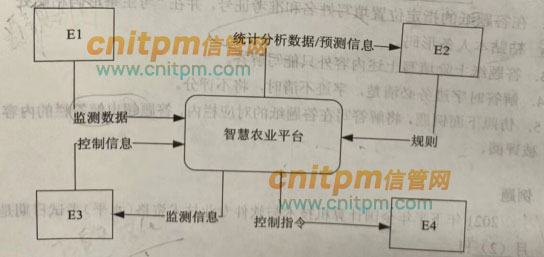
    <br>
    <div style="color:orange; border-bottom: 1px solid #d9d9d9;
    display: inline-block;
    color: #999;
    padding: 2px;">图1-1</div>
</center>

<center>
    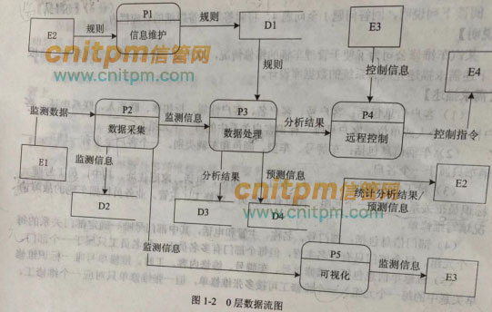
    <br>
    <div style="color:orange; border-bottom: 1px solid #d9d9d9;
    display: inline-block;
    color: #999;
    padding: 2px;">图1-2</div>
</center>

【问题1】(4分)

使用说明中的词语，给出图1-1中的实体E1~E4的名称。

【问题2】(4分)

使用说明中的词语，给出图1-2中的数据存储D1~D4的名称。

【问题3】(4分)

根据说明和图中术语，补充图1-2中缺失的数据流及其起点和终点。

【问题4】(3分)

根据说明，“数据处理”可以分解为哪些子加工?进一步进行分解时，需要注意哪三种常见的错误?
#### 参考答案

【问题1】(4分)

E1:传感器; E2:农业专家; E3:农业人员; E4:控制器

【问题2】(4分)

D1:监控处理规则文件 D2:监测信息表 D3:分析结果文件 D4:预测信息表

【问题3】(4分)

起点D1，终点P4，规则

起点E2，终点P5，请求

起点D3，终点P5，分析结果

起点D4，终点P5，预测信息

【问题4】(3分)

数据处理加工分为数据分析，可视化与存储;

黑洞、奇迹、灰洞
***
### 试题二
(共 15 分)
回答问题1至问题4，将解答填入答题纸的对应栏内。

【说明】

某汽车维修公司为了便于管理车辆的维修情况，拟开发一套汽车维修管理系统，请根据下述需求描述完成该系统的数据库设计。

【需求描述】

(1)客户信息包括:客户号、客户名、客户性质、折扣率、联系人、联系电话。客户性质有个人或单位。客户号唯 -标识客户关系中的每一个元组。

(2)车辆信息包括:车牌号、车型、颜色和车辆类别。-个客户至少有一辆车，一辆车只属于一个客户。

(3)员工信息包括:员工号、员工名、岗位、电话、家庭住址。其中，员工号唯一标识员工关系中的每一个元组。岗位有业务员、维修工、主管。业务员根据车辆的故障情况填写维修单。

(4)部门信息包括:部门号、名称、主管和电话，其中部门号唯一确定部门关系的每一个元组。每个部门只有一名主管，但每个部门有多名员工，每名员工只属于一个部门。

(5)维修单信息包括:维修单号、车牌号、维修内容、工时。维修单号唯一标识维修单关系中的每一个元组。一个维修工可接多张维修单，但一张维修单只对应一个维修工。

【概念模型设计】
根据需求阶段收集的信息，设计的实体联系图，如图2-1所示

<center>
    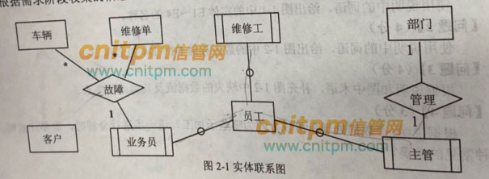
    <br>
    <div style="color:orange; border-bottom: 1px solid #d9d9d9;
    display: inline-block;
    color: #999;
    padding: 2px;">图2-1</div>
</center>

【逻辑结构设计】

根据概念模型设计阶段完成的实体联系图，得出如下关系模式(不完整):

客户(客户号，客户名，(a);折扣率，联系人，联系电话)

车辆(车牌号，(b)，车型，颜色，车辆类别)

员工(员工号，员工名，岗位，(c)，电话，家庭住址)

部门(部门号，名称，主管，电话)

维修单(维修单号，(d)，维修内容，工时)

【问题1】(6分)

根据问题描述，补充3个联系，完善图2-1的实体联系图。联系名可用联系1、联系2和联系3代替，联系的类型为`1:1`、`1:n` 和 `m:n` (或 `1:1` 、 `1:*` 和 `*.*` )。

【问题2】(4分)

根据题意，将关系模式中的空(a)~(d)的属性补充完整，并填入答题纸对应的位置上。

【问题3】(2分)

分别给出车辆关系和维修单关系的主键与外键。

【问题4】(3分)

如果一张维修单涉及多项维修内容，需要多个维修工来处理，那么哪个联系类型会发生何种变化?你认为应该如何解决这一问题?

#### 参考答案
【问题1】(6分)

联系1:客户和车辆，1:1

联系2:部门和员工，1:n

联系3:维修工和维修单，1:n

【问题2】(4分)

a:客户性质 b:客户号 c:部门号 d:车牌号，员工号

【问题3】(2分)

车辆关系的主键:(车辆号，客户号)，外键:客户号

维修单关系的主键:维修单号，外键:车牌号，员工号

【问题4】(3分)

维修工和维修单之间的联系类型会发生变化，从1:n变成m:n。
***
### 试题三
(共 15 分)
阅读下列说明和图，回答问题1至问题3，将解答填入答题纸的对应栏内。

【说明】

某游戏公司欲开发一款吃金币游戏。游戏的背景为一种回廊式迷宫(Maze),在迷宫的不同位置上设置有墙。迷宫中有两种类型的机器人(Robos):小精灵(PacMan)和幽灵(Ghost)。游戏的目的就是控制小精灵在迷宫内游走，吞吃迷宫路径上的金币，且不能被幽灵抓到。幽灵在迷宫中游走，并会吃掉遇到的小精灵。机器人游走时，以单位距离的倍数计算游走路径的长度。当迷宫中至少存在一个小精灵和一个幽灵时，游戏开始。

机器人上有两种传感器，使机器人具有一定的感知能力。这两种传感器分别是:

(1)前向传感器(FrontSensor)，探测在机器人当前位置的左边、右边和前方是否有墙(机器人遇到墙时，必须改变游走方向)。机器人根据前向传感器的探测结果，决定朝哪个方向运动。

(2)近距离传感器(ProxiSesor),探测在机器人的视线范围内(正前方)是否存在隐藏的金币或幽灵。近距离传感器并不报告探测到的对象是否正在移动以及朝哪个方向移动。但是如果近距离传感器的连续两次探测结果表明被探测对象处于不同的位置，则可以推导出该对象在移动。

另外，每个机器人都设置有一个计时器(Timer),用于支持执行预先定义好的定时事件。
机器人的动作包括:原地向左或向右旋转90°;向前或向后移动。

建立迷宫:用户可以使用编辑器(Editor) 编写迷宫文件，

建立用户自定义的迷宫。将迷宫文件导入游戏系统建立用户自定义的迷宫

现采用面向对象分析与设计方法开发该游戏，得到如图3-1所示的用例图以及图3-2所示的初始类图。
<center>
    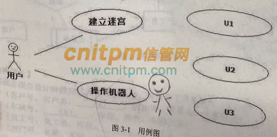
    <br>
    <div style="color:orange; border-bottom: 1px solid #d9d9d9;
    display: inline-block;
    color: #999;
    padding: 2px;">图3-1</div>
</center>

<center>
    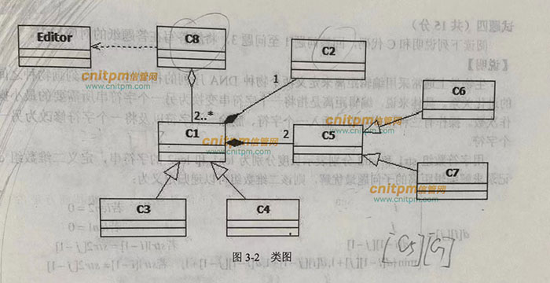
    <br>
    <div style="color:orange; border-bottom: 1px solid #d9d9d9;
    display: inline-block;
    color: #999;
    padding: 2px;">图3-2</div>
</center>

【问题1】(3分)

根据说明中的描述，给出图3-1中U1~U3所对应的用例名。

【问题2】(4分)

图3-1中用例U1~U3分别与哪个(哪些)用例之间有关系，是何种关系?

【问题3】(8分)

根据说明中的描述，给出图3-2中C1~C8所对应的类名。

#### 参考答案：
【问题1】(3分)

U1编写迷宫文件;

U2导入迷宫文件;

U3设置计时器

【问题2】(4分)

U1和U2与建立迷宫用例是泛化关系;U3与操作机器人是包含关系。

【问题3】(8分)

C1 机器人(Robos);

C2 计时器(Timer);

C3小精灵(PacMan);

C4幽灵(Ghost)

C5 传感器;

C6 前向传感器(FrontSensor)

C7 近距离传感器(ProxiSesor) ;

C8 迷宫(Maze)

其中C3与C4可换;C6与C7可换
#### 解析
在UML类图中，常见的有以下几种关系: 

泛化（Generalization）, 实现（Realization），关联（Association)，聚合（Aggregation），组合(Composition)，依赖(Dependency)

各种关系的强弱顺序：

泛化 = 实现 > 组合 > 聚合 > 关联 > 依赖

包含关系：主要描述的是组合关系。

泛化关系：主要描述的是分类关系。
***
### 试题四
(共 15 分)
阅读下列说明和C代码，回答问题1至问题3,将解答填入答题纸的对应栏内。

【说明】

生物学上通常采用编辑距离来定义两个物种DNA序列的相似性,从而刻画物种之间的进化关系。具体来说，编辑距离是指将首将一个字符串变换为另 一个字符所需要的最小操作次数。操作有三种,分别为:插入一个字符、删除一个字符以及将一个字符修改为另一个字符。用字符数组str1和str2分别表示长度分别为len1和len2的字符串,以二维数组d记录求解编辑距离的子问题最优解,则该二维数组可以递归定义为:
<center>
    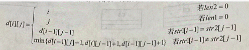
    <br>
    <div style="color:orange; border-bottom: 1px solid #d9d9d9;
    display: inline-block;
    color: #999;
    padding: 2px;"></div>
</center>
<center>
    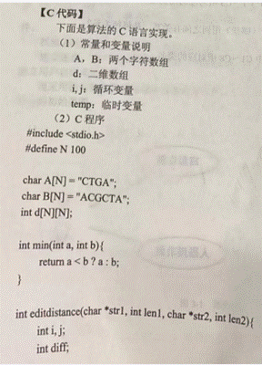
    <br>
    <div style="color:orange; border-bottom: 1px solid #d9d9d9;
    display: inline-block;
    color: #999;
    padding: 2px;"></div>
</center>
<center>
    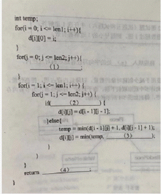
    <br>
    <div style="color:orange; border-bottom: 1px solid #d9d9d9;
    display: inline-block;
    color: #999;
    padding: 2px;"></div>
</center>

【C 代码】

下面是算法的C语言实现。

(1) 常量和变量说明

A，B：两个字符数组

d: 二维数组

i,j: 循环变量

temp: 临时变量

(2) C程序
```
#include <stdio.h>
#define N 100

char A[N] = "CTGA";
char B[N] = "ACGCTA";
int d[N][N];

int min(int a, int b) {
    return a < b ? a : b;
}

int editdistance(char *str1, int len1, char *str2, int len2) {
    int i,j;
    int diff;
    int temp;
    for(i = 0; i <= len1; i++) {
        d[i][0] = i;
    }
    for(j = 0; j <= len2; j++) {
        d[0][j] = j;
    }
    for(i = 1; i <= len1; i++) {
        for(j = 1; j<= len2; j++) {
            if(str1[i-1] == str2[j-1]) {
                d[i][j] = d[i-1][j-1];
            }else{
                temp = min(d[i-1][j] + 1, d[i][j-1] + 1);
                d[i][j] = min(temp, d[i-1][j-1] + 1);
            }
        }
    }
    return d[len1, len2];
}
```

问题：4.1   (8分) 

根据说明和C代码，填充C代码中的空(1)~(4)的。
 
问题：4.2   (4分)

根据说明和C代码，算法采用了(5)设计策略,时间复杂度为(6)(用O符号表示，两个字符串的长度分别用m和n表示)。
 
问题：4.3   (3分) 

已知两个字符串A="CTGA"和B="ACGCTA",根据说明和C代码，可得出这两个字符串的编辑距离为(7)。
#### 参考答案：
【问题1】

(1) d[0][j]=j 

(2)str1[i-1]==str2[j-1] 

(3)d[i-1][j-1] + 1

(4) d[len1][len2]

【问题2】

(5)动态规划法

(6)O(m*n)

【问题3】

(7)4

#### Code Sample
[DNA-Edit-Distance-Calculator](https://github.com/MichaelLedger/SDE-Code-Samples/tree/main/C/DNA-Edit-Distance-Calculator)

***
### 试题五
(共 15 分)
阅读下列说明和C++代码,将应填入(n)处的字句写在答题纸的对应栏内。 

【说明】 

享元(flyweight)模式主要用于减少创建对象的数量,以降低内存占用,提高性能。

现要开发一个网络围棋程序，允许多个玩家联机下棋。由于只有一台服务器，为节省内存空间，采用享元模式实现该程序，得到如图5-1所示的类图。 

<center>
    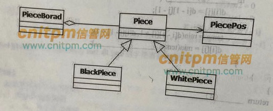
    <br>
    <div style="color:orange; border-bottom: 1px solid #d9d9d9;
    display: inline-block;
    color: #999;
    padding: 2px;">图5-1</div>
</center>
<center>
    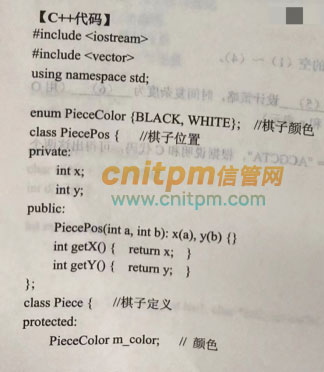
    <br>
    <div style="color:orange; border-bottom: 1px solid #d9d9d9;
    display: inline-block;
    color: #999;
    padding: 2px;"></div>
</center>
<center>
    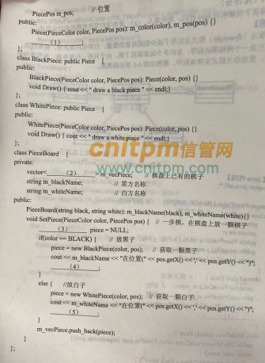
    <br>
    <div style="color:orange; border-bottom: 1px solid #d9d9d9;
    display: inline-block;
    color: #999;
    padding: 2px;"></div>
</center>

```
//
//  main.cpp
//  Go-FlyWeight
//
//  Created by MTX on 2022/3/12.
//
//  向量（Vector）是一个封装了动态大小数组的顺序容器（Sequence Container）可以认为是一个动态数组的抽象，其中一个vector中的所有对象都必须是同一种类型

#include <iostream>
#include <vector>
#include <string>
using namespace std;

enum PieceColor {BLACK, WHITE};//棋子颜色
class PiecePos {//棋子位置
private:
    int x;
    int y;
public:
    PiecePos(int a, int b): x(a), y(b) {}
    int getX() { return x; }
    int getY() { return y; }
};
class Piece {//棋子定义
protected:
    PieceColor m_color;//颜色
    PiecePos m_pos;//位置
public:
    Piece(PieceColor color, PiecePos pos): m_color(color), m_pos(pos) {}
    virtual void Draw() {}
    string description() {//描述棋子的颜色和位置
        const char *color = (m_color==BLACK)?"black":"white";
        int x = m_pos.getX();
        int y = m_pos.getY();
        char *buf = new char[100];//避免数组越界 malloc: Incorrect checksum for freed object
        sprintf(buf, "color:%s, position:(%d,%d)", color, x, y);
        return buf;
    }
};
class BlackPiece: public Piece {
public:
    BlackPiece(PieceColor color, PiecePos pos): Piece(color, pos){}
    void Draw() {cout << "draw a black piece" << endl;}
};
class WhitePiece: public Piece {
public:
    WhitePiece(PieceColor color, PiecePos pos): Piece(color, pos){}
    void Draw() {cout << "draw a white piece" << endl;}
};
class PieceBoard {
private:
    vector<Piece*> m_vecPiece;//棋盘上已有的棋子
    string m_blackName;//黑方名称
    string m_whiteName;//白方名称
public:
    PieceBoard(string black, string white): m_blackName(black), m_whiteName(white){}
    void setPiece(PieceColor color, PiecePos pos) {//一步棋，在棋盘上放一颗棋子
        Piece* piece = NULL;
        if (color == BLACK) {//放黑子
            piece = new BlackPiece(color, pos);
            cout << m_blackName << "在位置（" << pos.getX() << "," << pos.getY() << "）";
            piece->Draw();
        }
        else {//放白子
            piece = new WhitePiece(color, pos);
            cout << m_whiteName << "在位置（" << pos.getX() << "," << pos.getY() << "）";
            piece->Draw();
        }
        m_vecPiece.push_back(piece);
    }
    vector<Piece*> getAllPieces() {
        cout << "棋盘上所有的棋子(" << m_vecPiece.size() << "):" << endl;
        /*
         for(语句1;语句2;语句3) {}
         语句 1 在循环（代码块）开始前执行
         语句 2 定义运行循环（代码块）的条件
         语句 3 在循环（代码块）已被执行之后执行
         这就是循环中的 ++i 和 i++ 结果一样的原因，但是性能不一样，在大量数据的时候 ++i 的性能要比 i++ 的性能好原因:
         i++ 由于是在使用当前值之后 再+1 ，所以需要一个临时的变量来转存。 而 ++i 则是在直接 +1 ，省去了对内存的操作的环节，相对而言能够提高性能。
         */
        for(int i = 0;i < m_vecPiece.size();++i) {
            Piece* p = m_vecPiece[i];
            cout << "[" << i << "] " << p->description() << endl;//指针获取对象的成员函数可以使用 -> 操作符
        }
        cout << "========" << endl;
        for(vector<Piece*>::iterator item=m_vecPiece.begin();item<m_vecPiece.end();++item){//迭代器遍历
            Piece* p = *item;
            cout << p->description() << endl;//指针获取对象的成员函数可以使用 -> 操作符
        }
        return m_vecPiece;
    }
};

int main(int argc, const char * argv[]) {
    PieceBoard board = PieceBoard("blackPlayer", "whitePlayer");
    board.setPiece(BLACK, PiecePos(2, 3));
    board.setPiece(WHITE, PiecePos(3, 3));
    board.getAllPieces();
    return 0;
}

```

#### Code Sample
[Go-FlyWeight](https://github.com/MichaelLedger/SDE-Code-Samples/tree/main/C++/Go-FlyWeight)

***
### 试题六
(共 15 分)
阅读下列说明和Java代码,将应填入(n)处的字句写在答题纸的对应栏内。 

【说明】 

享元(flyweight)模式主要用于减少创建对象的数量,以降低内存占用,提高性能。

现要开发一个网络围棋程序，允许多个玩家联机下棋。由于只有一台服务器，为节省内存空间，采用享元模式实现该程序，得到如图6-1所示的类图。 

<center>
    
    <br>
    <div style="color:orange; border-bottom: 1px solid #d9d9d9;
    display: inline-block;
    color: #999;
    padding: 2px;">图6-1</div>
</center>

【Java代码】 

```
import java.util.*;
enum PieceColor{BLACK,WHITE}//棋子颜色
class PiecePos{//棋子位置
    private int x;
    private int y;
    public PiecePos(int a,int b){x=a;y=b;}
    public int getX(){return x;}
    public int getY(){return y;}
}
abstract class Piece {//棋子定义
    protected PieceColor m_color;//颜色
    protected PiecePos m_pos;//位置
    public Piece(PieceColor color, PiecePos pos){m_color=color;m_pos=pos;}
    //指向基类的指针在操作它的多态类对象时，会根据不同的类对象，调用其相应的函数，这个函数就是虚函数。C++ 中必须用 virtual 修饰。
    //java的普通成员函数（没有被static、native、final等关键字修饰）就是虚函数，原因很简单，它本身就实现虚函数实现的功能-多态。
    //从字节码指令的命名上也可以看出，java中的普通成员函数就是虚函数。
    //问题1: (1)
    void draw(){}
}
class BlackPiece extends Piece {//黑棋
    public BlackPiece(PieceColor color, PiecePos pos) {super(color, pos);}
    public void draw() {
        System.out.println("draw a black piece.");
    }
}
class WhitePiece extends Piece {//白棋
    public WhitePiece(PieceColor color, PiecePos pos) {super(color, pos);}
    public void draw() {
        System.out.println("draw a white piece.");
    }
}
class PieceBoard{//棋盘上已有的棋子
    //问题2: private static final ArrayList<(2)> m_arrayPiece=new ArrayList();
    private static final ArrayList<Piece> m_arrayPiece=new ArrayList();
    private String m_blackName;//黑方名称
    private String m_whiteName;//白方名称
    public PieceBoard(String black,String white){m_blackName=black;m_whiteName=white;}
    //一步棋,在棋盘上放一颗棋子
    public void SetPiece(PieceColor color,PiecePos pos) {
        //问题3: (3) piece = null;
        Piece piece = null;
        if (color == PieceColor.BLACK) {//放黑子
            piece = new BlackPiece(color, pos);//获取一颗黑子
            System.out.print(m_blackName + " 在位置（" + pos.getX() + "," + pos.getY() + ") ");
            //问题4: (4)
            piece.draw();
        } else {//放白子
            piece = new WhitePiece(color, pos);//获取一颗白子
            System.out.print(m_whiteName + " 在位置（" + pos.getX() + "," + pos.getY() + ") ");
            //问题5: (5)
            piece.draw();
        }
        m_arrayPiece.add(piece);
    }
}
class go{//围棋的英文为go
    public static void main(String[] args){
        //System.out.println("Hello World!");
        PieceBoard board=new PieceBoard("blackPlayer", "whitePlayer");
        BlackPiece black=new BlackPiece(PieceColor.BLACK, new PiecePos(1,2));
        board.SetPiece(PieceColor.BLACK, new PiecePos(2,3));
        board.SetPiece(PieceColor.WHITE, new PiecePos(3,3));
    }
}
```

#### Code Sample
[Go-FlyWeight](https://github.com/MichaelLedger/SDE-Code-Samples/tree/main/Java/Go-FlyWeight)

#### 参考
[信管网题库](http://www.cnitpm.com/st/459608903.html)

[软考在线免费智能真题库](http://www.rkpass.cn/tk_timu/6_735_4_anli.html)

[CSDN 软件设计师真题及答案解析](https://blog.csdn.net/xiaornshuo/article/details/121232150)
