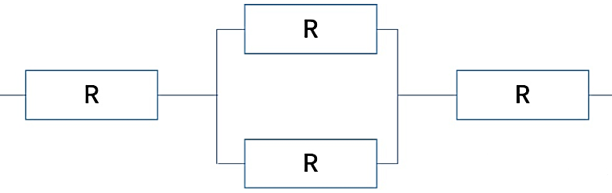
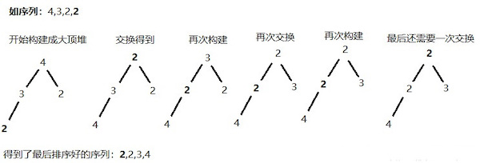
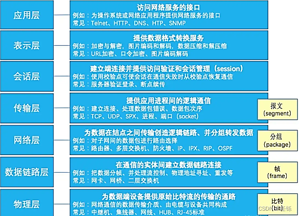

# 2022上半年软件设计师考试真题-上午卷
## 索引
||||||
|:|:|:|:|:|
| [1、冯诺依曼计算机](#1、) | [2、SRAM和DRAM](#2、) | [3、多级中断](#3、) | [4、RISC和CISC](#4、) | [5、可靠度](#5、) |
| [6、异步传输方式](#6、) | [7、文件安全传输](#7、) | [8、计算机病毒](#8、) | [9、杀毒软件](#9、) | [10、防火墙](#10、) |
| [11、SQL注入](#11、) | [12、专利申请权](#12、) | [13、《中华人民共和国商标法》](#13、) | [14、测试方法](#14、) | [15、软件维护](#15、) |
| [16、动态/静态绑定](#16、) | [17、面向对象系统设计原则](#17、) | [18-19、面向对象](#18-19、) | / | [20、pip安装numpy模块](#20、) |
| [21、Python程序List拷贝](#21、) | [22、Python序列结构](#22、) | [23、数据字典](#23、) | [24-25、 关系代数表达式](#24-25、) | / |
| [26、散列表(哈希表)及其查找特点](#26、) | [27、二叉树](#27、) | [28、树的度/结点/树枝](#28、) | [29、排序算法的稳定性](#29、) | [30、邻接表](#30、) |
| [31、OSI参考模型](#31、) | [32、TCP/IP协议](#32、) | [33、浏览器开启无痕浏览](#33、) | [34、电子邮件收发协议](#34、) | / |
***
考试时间：150分钟

考试总分：75分（45分及格）

**遵守考场纪律，维护知识尊严，杜绝违纪行为，确保考试结果公正。**

单选题(共 75 题,共 75 分)

#### 1、
以下关于冯诺依曼计算机的叙述中，不正确的是(  )。

A.程序指令和数据都采用二进制表示

B.程序指令总是存储在主存中，而数据则存储在高速缓存中

C.程序的功能都由中央处理器(CPU)执行指令来实现

D.程序的执行过程由指令进行自动控制

<h4>答案</h4>

B

<h4>解析</h4>

冯诺依曼计算机采用二进制形式表示数据和指令：在存储程序的计算机中，数据和指令都是以二进制形式存储在存储器中的。从存储器存储的内容来看两者并无区别．都是由0和1组成的代码序列，只是各自约定的含义不同而已。

#### 2、
以下关于SRAM和DRAM存储器的叙述中正确的是(  )。

A.与DRAM相比，SRAM集成率低，功率大、不需要动态刷新

B.与DRAM相比，SRAM集成率高，功率小、需要动态刷新

C.与SRAM相比，DRAM集成率高，功率大、不需要动态刷新

D.与SRAM相比，DRAM集成率高，功率大、需要动态刷新

<h4>答案</h4>

D

<h4>解析</h4>

主存储器种类： 
1、RAM (Random-Access Memory)： 随机存储器，可读/写，只能暂存数据，断电后数据丢失。 
☑️SRAM (Static)：静态随机存储器，在不断电时信息能够一直保持，读写速度快，生成成本高，多用于容量较小的高速缓冲存储器。 
☑️DRAM (Dynamic)：动态随机存储器，需要定时刷新以维持信息不丢失，读写速度较慢，集成度高，生产成本低，多用于容量较大的主存储器 
2、ROM (Read-Only Memory)：只读存储器，出厂前用掩膜技术写入，常用于存放BIOS和微程序控制。 

#### 3、
为了实现多级中断，保存程序现场信息最有效的方法是使用(  )。

A.通用寄存器    B.累加器   C.堆栈    D.程序计数器

<h4>答案</h4>

C

<h4>解析</h4>

#### 4、
以下关于RISC和CISC的叙述中，不正确的是(  )。

A.RISC的大多数指令在一个时钟周期内完成

B.RISC普遍采用微程序控制器，CISC则普遍采用硬布线控制器

C.RISC的指令种类和寻指方式相对于CISC更少

D.RISC和CISC都采用流水线技术

<h4>答案</h4>

B

<h4>解析</h4>

精简指令集计算机 (RISC: Reduced Instruction Set Computer)   是一种执行较少类型计算机指令的微处理器，起源于80年代的MIPS主机（即RISC机），RISC机中采用的微处理器统称RISC处理器。这样一来，它能够以更快的速度执行操作（每秒执行更多百万条指令，即MIPS）。因为计算机执行每个指令类型都需要额外的晶体管和电路元件，计算机指令集越大就会使微处理器更复杂，执行操作也会更慢。纽约约克镇IBM研究中心的John Cocke证明，计算机中约20%的指令承担了80%的工作，于1974年，他提出RISC的概念。许多当前的微芯片都使用RISC概念。
  
复杂指令集计算机 (CISC: Complex Instruction Set Computer)
计算机处理器包含有实现各种功能的指令或微指令，指令集越丰富，为微处理器编写程序就越容易，但是丰富的微指令集会影响其性能。复杂指令集计算机（CISC）体系结构的设计策略是使用大量的指令，包括复杂指令。与其他设计相比，在CISC中进行程序设计要比在其他设计中容易，因为每一项简单或复杂的任务都有一条对应的指令。程序设计者不需要写一大堆指令去完成一项复杂的任务。 但指令集的复杂性使得CPU和控制单元的电路非常复杂。

#### 5、
某计算机系统构成如下图所示，假设每个软件的千小时可靠度R为0.95，则该系统的小时可靠度约为(  )。

A.0.95 x (1-(1-0.95)^2) x 0.95

B.0.95 x (1-0.95)^2 x 0.95

C.0.95 x 2 x (1-0.95) x 0.95

D.0.95^4 x (1-0.95)^2

<h4>答案</h4>

A

<h4>解析</h4>

#### 6、
以下信息交换情形中，采用异步传输方式的是(  )。

A.CPU与内存储器之间交换信息

B.CPU与PCI总线交换信息

C.CPU与l/O接口交换信息

D.I/O接口与打印设备间交换

<h4>答案</h4>

C

<h4>解析</h4>

同步传输方式中发送方和接收方的时钟是统一的、字符与字符间的传输是同步无间隔的。 
异步传输方式并不要求发送方和接收方的时钟完全一样，字符与字符间的传输是异步的。

#### 7、
下列协议中，可以用于文件安全传输的是(  )。

A.FTP     B.SFTP    C.TFTP    D.ICMP

<h4>答案</h4>

B

<h4>解析</h4>

FTP（File Transfer Protocol，文件传输协议） 是 TCP/IP 协议组中的协议之一。FTP协议包括两个组成部分，其一为FTP服务器，其二为FTP客户端。其中FTP服务器用来存储文件，用户可以使用FTP客户端通过FTP协议访问位于FTP服务器上的资源。在开发网站的时候，通常利用FTP协议把网页或程序传到Web服务器上。此外，由于FTP传输效率非常高，在网络上传输大的文件时，一般也采用该协议。 

默认情况下FTP协议使用TCP端口中的 20和21这两个端口，其中20用于传输数据，21用于传输控制信息。但是，是否使用20作为传输数据的端口与FTP使用的传输模式有关，如果采用主动模式，那么数据传输端口就是20；如果采用被动模式，则具体最终使用哪个端口要服务器端和客户端协商决定。  

sftp是SSH File Transfer Protocol的缩写，安全文件传送协议。可以为传输文件提供一种安全的网络的加密方法。sftp 与 ftp 有着几乎一样的语法和功能。SFTP 为 SSH的其中一部分，是一种传输档案至 Blogger 伺服器的安全方式。其实在SSH软件包中，已经包含了一个叫作SFTP(Secure File Transfer Protocol)的安全文件信息传输子系统，SFTP本身没有单独的守护进程，它必须使用sshd守护进程(端口号默认是22)来完成相应的连接和答复操作，所以从某种意义上来说，SFTP并不像一个服务器程序，而更像是一个客户端程序。SFTP同样是使用加密传输认证信息和传输的数据，所以，使用SFTP是非常安全的。但是，由于这种传输方式使用了加密/解密技术，所以传输效率比普通的FTP要低得多。  

TFTP(Trivial File Transfer Protocol,简单文件传输协议)是TCP/IP协议族中的一个用来在客户机与服务器之间进行简单文件传输的协议，提供不复杂、开销不大的文件传输服务。端口号为69。  

ICMP是(Internet Control Message Protocol)Internet控制报文协议。它是TCP/IP协议族的一个子协议，用于在IP主机、路由器之间传递控制消息。控制消息是指网络通不通、主机是否可达、路由是否可用等网络本身的消息。这些控制消息虽然并不传输用户数据，但是对于用户数据的传递起着重要的作用。

#### 8、
下列不属于计算机病毒的是(  )。

A.永恒之蓝    B.蠕虫    C.特洛伊木马      D.DDoS

<h4>答案</h4>

D

<h4>解析</h4>

永恒之蓝是指2017年4月14日晚，黑客团体Shadow Brokers公布一大批网络攻击工具，其中包含“永恒之蓝”工具，“永恒之蓝”利用Windows系统的SMB漏洞可以获取系统最高权限并扫描开放445文件共享端口的Windows机器，无需用户任何操作，只要开机上网，不法分子就能在电脑和服务器中植入勒索软件、远程控制木马、虚拟货币挖矿机等恶意程序。
  
蠕虫病毒是一种常见的计算机病毒，是无须计算机使用者干预即可运行的独立程序，它通过不停的获得网络中存在漏洞的计算机上的部分或全部控制权来进行传播。计算机病毒是指编制或者在计算机程序中插入的破坏计算机功能或者破坏数据和恶意篡改系统．影响计算机使用并且能够自我复制的一组计算机指令或者程序代码。
  
特洛伊木马(Trojan Horse)是指寄宿在计算机里的一种非授权的远程控制程序，这个名称来源于公元前十二世纪希腊和特洛伊之间的一场战争。由于特洛伊木马程序能够在计算机管理员未发觉的情况下开放系统权限、泄漏用户信息、甚至窃取整个计算机管理使用权限，使得它成为了黑客们最为常用的工具之一。它是一种典型的网络病毒。它以隐蔽的方式进入到目标机器，对目标机器中的私密信息进行收集和破坏，再通过互联网，把收集到的私密信息反馈给攻击者，从而实现其目的的一种新型病毒。
  
分布式拒绝服务攻击(DDos, Distributed denial of service attack) 属于网络攻击， 可以使很多的计算机在同一时间遭受到攻击，使攻击的目标无法正常使用，分布式拒绝服务攻击已经出现了很多次，导致很多的大型网站都出现了无法进行操作的情况，这样不仅仅会影响用户的正常使用，同时造成的经济损失也是非常巨大的。分布式拒绝服务攻击方式在进行攻击的时候，可以对源IP地址进行伪造，这样就使得这种攻击在发生的时候隐蔽性是非常好的，同时要对攻击进行检测也是非常困难的，因此这种攻击方式也成为了非常难以防范的攻击。

#### 9、
以下关于杀毒软件的描述中，错误的是(  )。

A.应当为计算机安装杀毒软件并及时更新病毒库

B.安装杀毒软件可以有效防止蠕虫病毒

C.安装杀毒软件可以有效防止网站信息被篡改

D.服务器操作系统也需要安装杀毒软件

<h4>答案</h4>

C

<h4>解析</h4>

#### 10、
通过在出口防火墙上配置(  )功能可以阻止外部未授权用户访问内部网络。

A.ACL    B.SNAT    C.入侵检测     D.防病毒

<h4>答案</h4>

A

<h4>解析</h4>

访问控制列表 (Access Control Lists, ACL) 是一种基于包过滤的访问控制技术，它可以根据设定的条件对接口上的数据包进行过滤，允许其通过或丢弃。 
访问控制列表被广泛地应用于路由器和三层交换机，借助于访问控制列表，可以有效地控制用户对网络的访问，从而最大程度地保障网络安全。  

SNAT，是源地址转换，其作用是将ip数据包的源地址转换成另外一个地址。

#### 11、
SQL注入是常见的web攻击，以下不能够有效防御SQL注入的手段是(  )。

A.对用户输入做关键字过滤

B.部署Web应用防火墙进行防护

C.部署入侵检测系统阻断攻击

D.定期扫描系统漏洞并及时修复

<h4>答案</h4>

C

<h4>解析</h4>

SQL注入攻击的危害很大，而且防火墙很难对攻击行为进行拦截，主要的SQL注入攻击防范方法，具体有以下几个方面。 
1、分级管理 2、参数传值 3、基础过滤与二次过滤 4、使用安全参数 5、漏洞扫描 6、多层验证 7、数据库信息加密

#### 12、
甲乙丙三人分别就相同内容的计算机程序的发明创造，先后向国务院专利行政部门提出申请，(  )可以获得专利申请权。

A.甲乙丙均   B.先申请者   C.先使用者    D.先发明者

<h4>答案</h4>

B

<h4>解析</h4>

一份专利申请文件只能就一项发明创造提出专利申请。一项发明只授予一项专利，同样的发明申请专利，则按照申请时间的先后决定授予给谁。 
两个以上的申请人在同一日分别就相同的发明创造申请专利的，应当在收到国务院专利行政部门的通知后自行协商确定申请人。

#### 13、
(  )的保护期限是可以延长的。

A.著作权    B.专利权    C.商标权    D.商业秘密权

<h4>答案</h4>

C

<h4>解析</h4>

依照《中华人民共和国商标法》第三十八条:注册商标有效期满,需要继续使用,应当在期满前半年内申请续展注册。专利权和著作权到期后都无法延长,而商业秘密权无期限限制。

#### 14、
针对月收入小于等于3500元免征个人所得税的需求，现分别输入3499、3500和3501进行测试，则采用的测试方法(  )。

A.判定覆盖    B.边界值分析    C.路径覆盖     D.因果图

<h4>答案</h4>

B

<h4>解析</h4>
<a href="../../../知识点/黑盒测试/README.md">黑盒测试</a>
  

测试方法有：功能测试，性能测试，界面测试。区别在于，功能测试关注产品的所有功能上，要考虑到每个细节功能，每个可能存在的功能问题。性能测试主要关注于产品整体的多用户并发下的稳定性和健壮性。界面测试更关注于用户体验上，用户使用该产品的时候是否易用、是否易懂、是否规范、是否美观、是否安全。
  
扩展资料：
  
测试方法（test method）是2005年公布的航天科学技术名词。
  
功能测试在测试工作中占的比例最大，功能测试也叫黑盒测试。
  
是把测试对象看作一个黑盒子。利用黑盒测试法进行动态测试时，需要测试软件产品的功能，不需测试软件产品的内部结构和处理过程。采用黑盒技术设计测试用例的方法有：等价类划分、边界值分析、错误推测、因果图和综合策略。
  
性能测试是通过自动化的测试工具模拟多种正常、峰值以及异常负载条件来对系统的各项性能指标进行测试。
  
负载测试和压力测试都属于性能测试，两者可以结合进行。通过负载测试，确定在各种工作负载下系统的性能，目标是测试当负载逐渐增加时，系统各项性能指标的变化情况。压力测试是通过确定一个系统的瓶颈或者不能接收的性能点，来获得系统能提供的最大服务级别的测试。
  
界面测试，界面是软件与用户交互的最直接的层，界面的好坏决定用户对软件的第一印象。
  
而且设计良好的界面能够引导用户自己完成相应的操作，起到向导的作用。同时界面如同人的面孔，具有吸引用户的直接优势。设计合理的界面能给用户带来轻松愉悦的感受和成功的感觉，相反由于界面设计的失败，让用户有挫败感，再实用强大的功能都可能在用户的畏惧与放弃中付诸东流。

#### 15、
以下关于软件维护的叙述中，正确的是(  )。

A.工作量相对于软件开发而言要小很多

B.成本相对于软件开发而言要更低

C.时间相对于软件开发而言通常更长

D.只对软件代码进行修改的行为

<h4>答案</h4>

C

<h4>解析</h4>

#### 16、
在运行时将函数调用和响应调用所需执行的代码加以结合的机制是(  )。

A.强类型   B.弱类型   C.静态绑定    D.动态绑定

<h4>答案</h4>

D

<h4>解析</h4>

动态绑定：程序运行过程中，把函数（或过程）调用与响应调用所需要的代码相结合的过程称为动态绑定。 
静态绑定：程序编译过程中，把函数（方法或者过程）调用与响应调用所需的代码结合的过程称为静态绑定。

#### 17、
进行面向对象系统设计时，在包的依赖关系图中不允许存在环，这属于(  )原则。

A.单一责任    B.无环依赖    C.依赖倒置    D.里氏替换

<h4>答案</h4>

B

<h4>解析</h4>

单一职责原则：设计目的单一的类。 
无环依赖原则：在包的依赖关系图中不允许存在环，即包之间的结构必须是一个直接的无环图形。 
依赖倒置原则：要依赖于抽象，而不是具体实现；针对接口编程，不要针对实现编程。 
里氏替换原则：子类可以替换父类。

#### 18-19、
面向对象分析的第一项活动是(  )；面向对象程序设计语言为面向对象(  )。

A.组织对象    B.描述对象间的相互作用    C.认定对象    D.确定对象的操作

A.用例设计    B.分析    C.需求分析     D.实现

<h4>答案</h4>

C、D

<h4>解析</h4>

面向对象分析包含5个活动：认定对象、组织对象、描述对象间的相互作用、确定对象的操作、定义对象的内部信息。

#### 20、
用pip安装numpy模块的命令为(  )。

A.pip numpy    B.pip install numpy    C.install numpy     D.import num

<h4>答案</h4>

B

<h4>解析</h4>

#### 21、
某Python程序中定义了X=[1, 2]，那么X*2的值为(  )。

A.[1, 2, 1, 2]   B.[1, 1, 2, 2]   C.[2, 4]    D.出错

<h4>答案</h4>

A

<h4>解析</h4>

X=[1,2]表示List结构，*2表示重复2次，运算结果为[1,2,1,2]。 
 
直接赋值：其实就是对象的引用（别名）。 
浅拷贝(copy)：拷贝父对象，不会拷贝对象的内部的子对象。 
深拷贝(deepcopy)： copy 模块的 deepcopy 方法，完全拷贝了父对象及其子对象。  
[ 0 ] * n 是浅拷贝， 也就是把一个列表重复了 n 次；[[0]*n]*m 这种方式是直接将 [0]*n 复制了m遍 
[0 for _ in range(n)] 才是创建，深拷贝 

<code>m,n = 3,4</code> 
<code>dp1 = [[0] * n ] * m</code> 
<code>dp2 = [[0 for _ in range(n) ] for _ in range(m)]</code> 
<code>dp3 = [[0] * n for _ in range(m)]</code> 
<code>dp1[0][2] = 3</code> 
<code>dp2[0][2] = 3</code> 
<code>dp3[0][2] = 3</code> 
<code>print('dp1:',dp1)</code> 
<code>print('dp2:',dp2)</code> 
<code>print('dp2:',dp3)</code> 

结果为：

<code>dp1: [[0, 0, 3, 0], [0, 0, 3, 0], [0, 0, 3, 0]]</code> 
<code>dp2: [[0, 0, 3, 0], [0, 0, 0, 0], [0, 0, 0, 0]]</code> 
<code>dp2: [[0, 0, 3, 0], [0, 0, 0, 0], [0, 0, 0, 0]]</code>

#### 22、
在Python语言中，(  )是一种不可变的、有序的序列结构，其中元素可以重复。

A.tuple(元组)    B.dict(字典)   C.List(列表)     D.set(集合)

<h4>答案</h4>

A

<h4>解析</h4>

不可变数据(3个)：Number（数字）、String（字符串）、Tuple（元组）。 
可变数据(3个)：List（列表）、Dictionary（字典）、Set（集合）。 
Set（集合）的基本功能是进行成员关系测试和删除重复元素。

#### 23、
数据库中的视图是一个虚拟表。若设计师为user表创建一个use1视图，那么数据字典中保存的是(  )。

A.user1查询语句    B.user1视图定义    C.user1查询结果   D.所引用的基本表

<h4>答案</h4>

B

<h4>解析</h4>

#### 24-25、
给定关系R(A, B, C, D)和关系S(A, D, E, F)，若对这两个关系进行自然连接运算R▷◁S后的属性列有(  )个；关系代数表达式σR.B＞S.F(R▷◁S)与(  )等价。

A.4    B.5     C.6     D.8

A.σ2>8(R×S)

B.Π1, 2, 3, 4, 7, 8(σ1=5∩2＞8∩4=6(R×S)

C.σ"2">"8"(R×S)

D.Π1, 2, 3, 4, 7, 8(σ1=5∩"2"＞"8"∩4=6(R×S))

<h4>答案</h4>

C、B

<h4>解析</h4>

#### 26、
以下关于散列表(哈希表)及其查找特点的叙述中，正确的是(  )。

A.在散列表中进行查找时，只需要与待查找关键字及其同义词进行比较

B.只要散列表的装填因子不大于1/2，就能避免冲突

C.用线性探测法解决冲突容易产生聚集问题

D.用链地址法解决冲突可确保平均查找长度为1

<h4>答案</h4>

C

<h4>解析</h4>

散列表，又叫哈希表（Hash Table），是能够通过给定的关键字的值直接访问到具体对应的值的一个数据结构。也就是说，把关键字映射到一个表中的位置来直接访问记录，以加快访问速度。一种散列存储结构，通过关键字快速定位。 
<strong>通常，我们把这个关键字称为 Key，把对应的记录称为 Value，所以也可以说是通过 Key 访问一个映射表来得到 Value 的地址。而这个映射表，也叫作散列函数或者哈希函数，存放记录的数组叫作散列表。</strong> 
其中有个特殊情况，就是通过不同的 Key，可能访问到同一个地址，这种现象叫作碰撞（Collision）。而通过某个 Key 一定会得到唯一的 Value 地址。  
下面简单介绍几种哈希函数。 
直接寻址法：取关键字或关键字的某个线性函数值为散列地址。  
数字分析法：通过对数据的分析，发现数据中冲突较少的部分，并构造散列地址。例如同学们的学号，通常同一届学生的学号，其中前面的部分差别不太大，所以用后面的部分来构造散列地址。  
平方取中法：当无法确定关键字里哪几位的分布相对比较均匀时，可以先求出关键字的平方值，然后按需要取平方值的中间几位作为散列地址。这是因为：计算平方之后的中间几位和关键字中的每一位都相关，所以不同的关键字会以较高的概率产生不同的散列地址。  
取随机数法：使用一个随机函数，取关键字的随机值作为散列地址，这种方式通常用于关键字长度不同的场合。  
除留取余法：取关键字被某个不大于散列表的表长 n 的数 m 除后所得的余数 p   为散列地址。这种方式也可以在用过其他方法后再使用。该函数对 m 的选择很重要，一般取素数或者直接用 n。  
对散列表函数产生冲突的解决办法  
散列表为什么会产生冲突呢？前面提到过，有时不同的 Key 通过哈希函数可能会得到相同的地址，这在我们操作时可能会对数据造成覆盖、丢失。之所以产生冲突是由于哈希函数有时对不同的 Key 计算之后获得了相同的地址。冲突的处理方式也有很多，下面介绍几种。  
开放地址法（也叫开放寻址法）：实际上就是当需要存储值时，对Key哈希之后，发现这个地址已经有值了，这时该怎么办？不能放在这个地址，不然之前的映射会被覆盖。这时对计算出来的地址进行一个探测再哈希，比如往后移动一个地址，如果没人占用，就用这个地址。如果超过最大长度，则可以对总长度取余。这里移动的地址是产生冲突时的增列序量。 
线性探测是一种开放寻址的策略。在这些策略里，散列表的每个单元都存储一对键值对。当散列函数对一个给定值产生一个键，并且这个键指向散列表中某个已经被另一个键值对所占用的单元时，线性探测用于解决此时产生的冲突：查找散列表中离冲突单元最近的空闲单元，并且把新的键插入这个空闲单元。同样的，查找也同插入如出一辙：从散列函数给出的散列值对应的单元开始查找，直到找到与键对应的值或者是找到空单元。  
再哈希法：在产生冲突之后，使用关键字的其他部分继续计算地址，如果还是有冲突，则继续使用其他部分再计算地址。这种方式的缺点是时间增加了。  
链地址法：链地址法其实就是对Key通过哈希之后落在同一个地址上的值，做一个链表。其实在很多高级语言的实现当中，也是使用这种方式处理冲突的，比如currenthashmap。  
建立一个公共溢出区：这种方式是建立一个公共溢出区，当地址存在冲突时，把新的地址放在公共溢出区里。  

#### 27、
对长度为n的有序顺序表进行折半查找(即二分查找)的过程，可用一棵判定树表示，该判定树的形态符合(  )的特点。

A.最优二叉树(即哈夫曼树)   B.平衡二叉树    C.完全二叉树    D.最小生成数

<h4>答案</h4>

B

<h4>解析</h4>

平衡二叉树，又称AVL树，用于解决二叉排序树高度不确定的情况，如果二叉排序树的子树间的高度相差太大，就会让二叉排序树操作的时间复杂度升级为O(n)，为了避免这一情况，为最坏的情况做准备，就出现了平衡二叉树，使树的高度尽可能的小，其本质还是一棵二叉搜索树。  

平衡二叉树的性质：  

左子树和右子树的高度之差的绝对值小于等于1 
左子树和右子树也是平衡二叉树 

#### 28、
已知树T的度为4，且度为4的结点数为7个、度为3的结点数5个、度为2的结点数为8个、度为1的结点数为10个，那么T的叶子结点个数为(  )。（注：树中节点个数称为结点的度，结点的度中的最大值称为树的度）

A.30    B.35    C.40     D.49

<h4>答案</h4>

C

<h4>解析</h4>

假设度为4的结点个数记作n4，度为3的结点个数记作n3，度为2的结点个数记作n2，度为1的结点个数记作n1，度为0的结点个数记作n0。  

此时结点总数为n4+n3+n2+n1+n0，每个结点可以根据树枝找到其父节点，除了根，所以此时树枝的数量为 <code>n4+n3+n2+n1+n0-1</code>。  

又因为度与树枝的定义，树枝的个数又可以计算为：<code>4*n4+3*n3+2*n2+1*n1+0*n0</code>。  

综上可得 <code>n4+n3+n2+n1+n0-1=4*n4+3*n3+2*n2+1*n1+0*n0</code>，此时 <code>n4=7，n3=5，n2=8，n1=10</code>，代入表达式计算可得，<code>n0=40</code>。

#### 29、
排序算法的稳定性是指将待排序列排序后，能确保排序码中的相对位置保持不变。(  )是稳定的排序算法。

A.冒泡排序   B.快速排序    C.堆排序    D.简单选择排序

<h4>答案</h4>

A

<h4>解析</h4>

排序算法的稳定性  
排序算法稳定性：意思就是说大小相同的两个值在排序之前和排序之后的先后顺序不变，这就是稳定的。  

（1）冒泡排序：原理是通过相邻的两个元素作比较，把小的向前移或者把大的向后移，移动就是交换这两个元素。如果说碰到相等的两个元素是不会做处理的。所以是稳定的排序。  

（2）选择排序：原理是从第一个元素开始，在之后的所有元素中选择一个最小的交换过来。如果说原序列中第一个元素和第二个元素相等，第三个元素是个最小值，经过选择会把第一个元素和第三个元素交换，这时第二个元素就跑到前面去了。如：3,3,1序列，经过选择排序会变成1,3,3。所以是不稳定的排序。  

（3）插入排序：原理是从第二个元素开始，和前面的所有元素作比较，如果比前面元素最大的（也就是前面元素的最后一个）大，直接插入在前面元素的最后面（也就是保持自身位置不变，再取它的下一个元素开始）；如果比前面元素最大的小，就和第二大的作比较，以此找到自己的位置；如果在前面找到了和自己大小相等的值，就乖乖的插入后面，如：1,2,3,2，最后一个元素2先和3作比较，嗯比3小，再和2作比较，嗯相等，插入后就变成1,2,2,3，所以是稳定的排序。  

（4）快速排序：原理是（最简便的操作）以第一个元素为基准，在后面的所有元素中进行前后夹击，从开头可末尾一个一个取元素和基准作比较，前面进攻的遇到比基准大的停下来，后面进攻的遇到比基准小的停下来，这时候，如果前面的还在前面，后面的还在后面，基准原地不动，交换这两个被攻击到的元素；如果前面进攻的和后面进攻的攻击的是同一个元素或前面进攻的攻到了后方友军的身后，就把后方友军进攻的元素和基准作交换，并以基准当前的位置断开，基准休息，前面的序列和后面的序列再打一遍，打到只剩一个敌人。（跑题了么？）如：2,2,3，2为基准，这时索引会在2的位置停下来，很无奈，只能交换2和2变成：2,2,3了。所以是不稳定的排序。  

（5）归并排序：原理是通过递归法，把序列A切半分成A1和A2，再把A1和A2的每个元素互相比较取较小的依次放回A中。递归就是把序列无限切半，切到只有一个元素为止，再一点一点的拼回去。由于比较是发生在拼回去的时候，在比较时，前面的序列还是在前如 if(A1[0]<=A2[0])，遇到相等的值也是取A1中的元素先放入A中，所以是稳定的排序。（如果你非要比较时写成 if(A1[0]<A2[0])那就是不稳定的了，相等的时候会取A2中的元素，不过这就是你故意的了）  

（6）基数排序：原理是（1-低位优先）新建10个序列组成数组，先通过个位数字将序列元素依次放到对应索引的新序列中，如：个位是0，就放到数组索引为0的新序列中，再从数组的序列中以索引从小到大的顺序依次取出元素放回原序列，再通过十位数字的大小整理一遍，以此类推，最终得到有序序列。（2-高位优先）新建10个序列组成数组，以最高位的数字为基准依次放入对应数组索引的序列中，如果序列中元素个数大于1或不相等，再建10个序列组成数组，以当前位的次一位数字为基准放入数组序列中，最后从低位数组开始取出放回原序列，最终得到有序序列。由于相等的元素各个位上的数字也相等，所以在经过依次放入和依次取出的过程顺序是不发生改变的。所以是稳定的排序。  

（7）希尔排序：原理是在插入排序的基础上，取序列长度的一半为一个增量进行间隔式的插入排序，这个增量会在进行完插入排序后再次减半，直到减至1。插入排序是稳定的，但是当增量不同时，相当于将序列间隔的分成不同的序列进行插入排序，两个序列中的相等的元素就可能会被打乱位置。如：3,4,5,2,2，该序列长度为5，取一半是2，以2为增量进行插入排序会把序列分成4,2以及3,5,2，当然索引位置不变，进行插入排序会得到2,4以及2,3,5，还原会序列就是2,2,3,4,5。所以是不稳定的排序。  

（8）堆排序：原理是把序列看成是完全二叉树，通过重复构造大顶堆或小顶堆来实现，每次构造完成会将最上面的节点取出，其余的节点再次构造成堆。如：  

    
     
    

所以是不稳定的排序。  

总结：不稳定的排序：堆排序，快速排序，希尔排序，选择排序。 

稳定的排序：冒泡排序，插入排序，归并排序，基数排序。

#### 30、

<h4>答案</h4>

<h4>解析</h4>

#### 30、
某图G的邻接表中共有奇数个表示边的表结点，则图G(  )。

A.有奇数个顶点    B.有偶数个顶点    C.是无向图     D.是有向图

<h4>答案</h4>

D

<h4>解析</h4>

在邻接表中，奇数个表示边的表结点说明在图中有奇数条边，无法说明顶点个数是奇数还是偶数，所以A、B选项都是错误的。 
由于无向图的边一定是对称存在的，所以边的个数一定是偶数，不满足题意，C选项也是错误的。只有D选项符合要求。

#### 31、
在OSI参考模型中，(  )在物理线路上提供可靠的数据传输。

A.物理层    B.数据链路层    C.网络层    D.传输层

<h4>答案</h4>

D

<h4>解析</h4>

    
     
    
OSI 参考模型

#### 32、

在TCP/IP协议栈中，远程登录采用的协议为(  )。

A.HTTP    B.TELNET    C.SMTP     D.FTP

<h4>答案</h4>

B

<h4>解析</h4>

超文本传输协议（Hyper Text Transfer Protocol，HTTP）是一个简单的请求-响应协议，它通常运行在TCP之上。它指定了客户端可能发送给服务器什么样的消息以及得到什么样的响应。请求和响应消息的头以ASCII形式给出；而 [9]  消息内容则具有一个类似MIME的格式。这个简单模型是早期Web成功的有功之臣，因为它使开发和部署非常地直截了当。  

Telnet协议是TCP/IP协议族中的一员，是Internet远程登录服务的标准协议和主要方式。它为用户提供了在本地计算机上完成远程主机工作的能力。在终端使用者的电脑上使用telnet程序，用它连接到服务器。终端使用者可以在telnet程序中输入命令，这些命令会在服务器上运行，就像直接在服务器的控制台上输入一样。可以在本地就能控制服务器。要开始一个telnet会话，必须输入用户名和密码来登录服务器。Telnet是常用的远程控制Web服务器的方法。  

SMTP (Simple Mail Transfer Protocol) 是一种提供可靠且有效的电子邮件传输的协议。SMTP是建立在FTP文件传输服务上的一种邮件服务，主要用于系统之间的邮件信息传递，并提供有关来信的通知。SMTP独立于特定的传输子系统，且只需要可靠有序的数据流信道支持，SMTP的重要特性之一是其能跨越网络传输邮件，即“SMTP邮件中继”。使用SMTP，可实现相同网络处理进程之间的邮件传输，也可通过中继器或网关实现某处理进程与其他网络之间的邮件传输。  

FTP 是 File Transfer Protocol（文件传输协议）的英文简称，而中文简称为“文传协议”。用于Internet上的控制文件的双向传输。同时，它也是一个应用程序（Application）。基于不同的操作系统有不同的FTP应用程序，而所有这些应用程序都遵守同一种协议以传输文件。在FTP的使用当中，用户经常遇到两个概念："下载"（Download）和"上传"（Upload）。"下载"文件就是从远程主机拷贝文件至自己的计算机上；"上传"文件就是将文件从自己的计算机中拷贝至远程主机上。用Internet语言来说，用户可通过客户机程序向（从）远程主机上传（下载）文件。

#### 33、
浏览器开启无痕浏览模式时，(  )仍然会被保存到。

A.浏览历史    B.搜索历史    C.下载的文件    D.临时文件

<h4>答案</h4>

C

<h4>解析</h4>

#### 34、
下列不属于电子邮件收发协议的是(  )。

A.SMTP    B.POP3    C.IMAP     D.FTP

<h4>答案</h4>

D

<h4>解析</h4>

