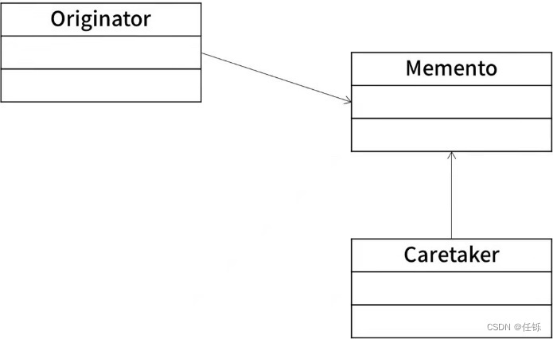

# 2022上半年软件设计师考试真题-下午卷
## 索引
|||||||
|:|:|:|:|:|:|
| [试题一](#试题一) | [试题二](#试题二) | [试题三](#试题三) | [试题四](#试题四) | [试题五](#试题五) | [试题六](#试题六) |
***
考试时间：150分钟

考试总分：75分（最后两题选做一题，45分及格）

**遵守考场纪律，维护知识尊严，杜绝违纪行为，确保考试结果公正。**

问答题(共 16 题,共 90 分)

### 试题一
（15分）

某公司欲开发一款外卖订餐系统，集多家外卖平台和商户为一体，为用户提供在线浏览餐品、订餐和配送等服务。该系统的主要功能是：

1.入驻管理。用户注册，商户申请入驻，设置按时间段接单数量阈值等。系统存储商户/用户信息。

2.餐品管理。商户对餐品的基本信息和优惠信息进行发布、修改、删除，系统存储相关信息。

3.订餐。用户浏览商户餐单，选择餐品及数量后提交订餐请求。系统存储订餐订单。

4.订单处理。收到订餐请求后，向外卖平台请求配送。外卖平台接到请求后发布配送单，由平台骑手接单，外卖平台根据是否有骑手接单返回接单状态。若外卖平台接单成功，系统给支付系统发送支付请求，接收支付状态。支付成功，更新订单状态为已接单，向商户发送订餐请求并由商户打印订单，给用户发送订单状态；若支付失败，更新订单状态为下单失败，向外卖平台请求取消配送，向用户发送下单失败。若系统接到外卖平台返回接单失败或超时未返回接单状态，则更新订单状态为下单失败，向用户发送下单失败。

5.配送。商户备餐后，由骑手取餐配送给用户。送达后由用户扫描骑手出示的订单上的配送码后确认送达，订单状态更改为已送达，并发送给商户。

6.订单评价。用户可以对订单餐品、骑手配送服务进行评价，推送给对应的商户、所在外卖平台，商户和外卖平台对用户的评价进行回复。系统存储评价。现采用结构化方法对外卖订餐系统进行分析与设计，

获得如图1-1所示的上下文数据和图1-2所示的0层数据流图。

<center>
    
    <br>
    <div style="color:orange; border-bottom: 1px solid #d9d9d9;
    display: inline-block;
    color: #999;
    padding: 2px;"></div>
</center>

<center>
    
    <br>
    <div style="color:orange; border-bottom: 1px solid #d9d9d9;
    display: inline-block;
    color: #999;
    padding: 2px;"></div>
</center>

问题1（4分）

使用说明中的词语，给出图1-1的实体E1~E4的名称。

问题2（4分）

使用说明中的词语，给出图1-2中的数据存储D1-D4 的名称。

问题3（4分）

根据说明和图中术语，补充图1-2中缺失的数据流及其起点和终点。

问题4（3分）

根据说明，采用结构化语言对“订单处理”的加工逻辑进行描述。

<div style="display: inline;">
<h4>参考答案</h4>
<p>
问题1（4分）<br>

E1：商户    E2：外卖平台    E3：用户    E4：支付系统<br><br>

问题2（4分）<br>

D1：用户/商户信息表    D2：订单信息表   D3：餐品信息表  D4：评价信息表<br><br>

问题3（4分）<br>
</p>

<table border="1px solid #ccc">
<h4>缺失的数据流及其起点和终点</h4>
<tr>
<td>数据流名称</td>
<td>起点</td>
<td>终点</td>
</tr>
<tr>
<td>餐单</td>
<td>D3(餐品信息表)</td>
<td>P3(订餐)</td>
</tr>
<tr>
<td>餐单</td>
<td>P3(订餐)</td>
<td>E3(用户)</td>
</tr>
<tr>
<td>订餐请求</td>
<td>P3(订餐)</td>
<td>P4(订单管理)</td>
</tr>
<tr>
<td>更新订单状态</td>
<td>P4(订单管理)</td>
<td>D2(订单信息表)</td>
</tr>
<tr>
<td>配送码</td>
<td>P5(配送)</td>
<td>E3(用户)</td>
</tr>
</table>

<p>问题4（3分）</p>

<code>收到订餐请求后，向外卖平台请求配送。  </code><br>

<code>外卖平台接到请求后发布配送单，由平台骑手接单。</code><br>

<code>IF(外卖平台接单成功)  THEN</code><br>

<code>系统给支付系统发送支付请求，接收支付状态；</code><br>

<code>IF(支付成功)  THEN</code><br>

<code>更新订单状态为已接单；</code><br>

<code>向商户发送订餐请求并由商户打印订单；</code><br>

<code>给用户发送订单状态；</code><br>

<code>ELSE   //支付未成功</code><br>

<code>更新订单状态为下单失败；</code><br>

<code>向外卖平台请求取消配送；</code><br>

<code>向用户发送下单失败；</code><br>

<code>ENDIF</code><br>

<code>ELSE IF(系统接到外卖平台返回接单失败或超时未返回接单状态) THEN</code><br>

<code>更新订单状态为下单失败</code><br>

<code>向用户发送下单失败；</code><br>

<code>ENDIF</code>
</div>

### 试题二
（15分）

为了提高接种工作的效率，并为抗击疫情提供疫苗接种数据支撑，需要开发一个信息系统，根据下述需求完成该系统的数据库设计。

(1)记录疫苗供应商的信息，包括供应商名称，地址和一个电话。

(2)记录接种医院的信息，包括医院名称、地址和一个电话。

(3)记录接种者个人信息，包括姓名、身份证号和一个电话。

(4)记录接种者疫苗接种信息，包括接种医院信息、被接种者信息、疫苗供应商名称和接种日期，为了提高免疫力，接种者可能需要进行多次疫苗接种，（每天最多接种一次，每次都可以在全市任意一家医院进行疫苗接种）。

概念模型设计

根据概念模型设计阶段完成的实体联系图，得出如下关系模式（不完整）：

<center>
    
    <br>
    <div style="color:orange; border-bottom: 1px solid #d9d9d9;
    display: inline-block;
    color: #999;
    padding: 2px;"></div>
</center>

逻辑结构设计

根据概念模型设计阶段完成的实体联系图，得出如下关系模式（不完整）：

供应商（供应商名称、地址、电话）
医院（医院名称、地址、电话）
供货（供应商名称，（ a ），供货内容）
被接种者（姓名、身份证号、电话）
接种（接种者身份证号，（ b ），医院名称、供应商名称）
问题1（4分）

根据问题描述，补充图2-1的实体联系图（不增加新的实体）。

问题2（4分）

补充逻辑结构设计结果中的（a）、（b）两处空缺，并标注主键和外键完整性约束。

问题3（7分）

若医院还兼有核酸检测的业务，检测时可能需要进行多次核酸检测（每天最多检测一次），但每次都可以在全市任意一家医院进行检测。

请在图2-1中增加“被检测者”实体及相应的属性。医院与被检测者之间的“检测”联系及必要的属性，并给出新增加的关系模式。

“被检测者”实体包括姓名、身份证号、地址和一个电话。“检测”联系需要包括检测日期和检测结果等。

<div style="display: inline;">
<h4>参考答案</h4>
<p>
问题1（4分）
</p>

<center>
    
    <br>
    <div style="color:orange; border-bottom: 1px solid #d9d9d9;
    display: inline-block;
    color: #999;
    padding: 2px;"></div>
</center>

<p>
问题2（4分）<br><br>

(a)医院名称    (b)接种日期<br><br>

供货关系中，主键：供应商名称，医院名称；外键：供应商名称，医院名称。<br><br>

接种关系中，主键：接种者身份证号，接种日期；  外键：接种者身份证号，医院名称、供应商名称。<br><br>

问题3（7分）<br><br>
</p>

<center>
    
    <br>
    <div style="color:orange; border-bottom: 1px solid #d9d9d9;
    display: inline-block;
    color: #999;
    padding: 2px;"></div>
</center>

<p>
新增关系模式：<br><br>

被检测者（身份证号，姓名，地址，电话）<br><br>

检测（被检测者身份证号，医院名称，检测日期，检测结果）
</p>
</div>

### 试题三
某公司的人事部门拥有一个地址簿管理系统(AddressBookSystem)，用于管理公司所有员工的地址记录(PersonAddress)。员工的地址记录包括：姓名、住址、城市、省份、邮政编码以及联系电话等信息。

管理员可以完成对地址簿中地址记录的管理操作，包括：

(1)管理地址记录。根据公司的人员变动情况，对地址记录进行添加、修改、删除等操作;

(2)排序。按照员工姓氏的字典顺序或邮政编码对地址中的所有记录进行排序。

(3)打印地址记录。以邮件标签的格式打印一个地址单独的地址簿。

系统会对地址记录进行管理，为便于管理，管理员在系统中为公司的不同部门建立员工对每个地址簿的修改操作，包括：

(1)创建地址簿。新建个地址簿并保存。

(2)打开地址簿。打开一个已有的地址簿。

(3)修改地址簿。对打开的地址簿进行修改并保存

系统将提供一个GUI（图形用户界面）实现对地址簿的各种操作。

现采用面向对象方法分析并设计该地址簿管理系统，得到如图3-1所示的用例图和图3-2所示的类图。

<center>
    
    <br>
    <div style="color:orange; border-bottom: 1px solid #d9d9d9;
    display: inline-block;
    color: #999;
    padding: 2px;"></div>
</center>

<center>
    
    <br>
    <div style="color:orange; border-bottom: 1px solid #d9d9d9;
    display: inline-block;
    color: #999;
    padding: 2px;">图3-2 类图</div>
</center>

问题1（6分）

根据说明中的描述，给出图3-1中U1～U6所对应的用例名。

问题2（5分）

根据说明中的描述，给出图3-2中类AddressBook的主要属性和方法以及类PersonAddress的主要属性（可以使用说明中的文字）。

问题3（4分）

根据说明中的描述以及图3-1所示的用例图，请简要说明extend和include关系的含义是什么？

<div style="display: inline;">
<h4>参考答案</h4>
<p>
问题1（6分）<br><br>

U1：按员工姓氏的字典顺序排序   U2：按邮政编码排序<br><br>

U3：创建地址簿  U4：修改地址簿 U5：打开地址簿    U6：保存地址簿<br><br>

问题2（5分）<br><br>

AddressBook的属性包括：姓名、部门、住址、城市、省份、邮政编码以及联系电话。<br><br>

AddressBook的方法包括：添加、修改、删除地址记录，排序，打印地址记录。<br><br>

PersonAddress的属性包括：姓名、住址、城市、省份、邮政编码以及联系电话。<br><br>

PersonAddress的方法包括：创建地址簿，打开地址簿，修改地址簿。<br><br>

问题3（4分）<br><br>

包含（include）两个以上用例有共同功能，可分解到单独用例，形成包含依赖；执行基本用例时，每次都必须调用被包含的用例。<br><br>

扩展（extend）如果一个用例明显地混合了两种或两种以上的不同场景，即根据情况可能发生多种事情，则可以断定将这个用例分为一个主用例和一个或多个辅用例进行描述可能更加清晰。
</p>
</div>

### 试题四
阅读下列说明和C代码，回答问题1至问题3，将解答写在答题纸的对应栏内。

工程计算中经常要完成多个矩阵相乘的计算任务，对矩阵相乘进行以下说明。

(1)两个矩阵相乘要求第一个矩阵的列数等于第二个矩阵的行数，计算量主要由进行乘法运算的次数决定，假设采用标准的矩阵相乘算法，计算Amxn*Bnxp需要m*n*p次乘法运算，即时间复杂度为O(m*n*p)。

(2)矩阵相乘满足结合律，多个矩阵相乘时不同的计算顺序会产生不同的计算量。以矩阵A15×100，A2100*8，A38x50三个矩阵相乘为例，若按(A1*A2)*A3计算，则需要进行5*100*8+5*8*50=6000次乘法运算，若按A1*(A2*A3)计算，则需要进行100*8*50+ 5*100*50=65000次乘法运算。

矩阵链乘问题可描述为：给定n个矩阵，矩阵Ai的维数为Pi-1×Pi其中i=1, 2,..., n。确定一种乘法顺序，使得这n个矩阵相乘时进行乘法的运算次数最少。由于可能的计算顺序数量非常庞大，对较大的n，用蛮力法确定计算顺序是不实际的。经过对问题进行分析，发现矩阵链乘问题具有最优子结构，即若A1*A2**An的一个最优计算顺序从第k个矩阵处断开，即分为A1*A2*…*Ak和Ak+1*Ak+2**An两个子问题，则该最优解应该包含A1*A2**Ak的一个最优计算顺序和Ak+1*Ak+2**An的一个最优计算顺序。据此构造递归式：

<center>
    
    <br>
    <div style="color:orange; border-bottom: 1px solid #d9d9d9;
    display: inline-block;
    color: #999;
    padding: 2px;"></div>
</center>

其中，cost[i][j]表示Ai+1*Ai+2*Aj+1的最优计算的计算代价。最终需要求解cost[0][n-1]。

C代码算法实现，采用自底向上的计算过程。首先计算两个矩阵相乘的计算量，然后依次计算3个矩阵、4个矩阵、…、n个矩阵相乘的最小计算量及最优计算顺序。下面是该算法的语言实现：

(1)主要变量说明
n：矩阵数

seq：矩阵维数序列

cost[][]：二维数组，长度为n*n，其中元素cost[i][j]表示Ai+1*Ai+2*...*Aj+1的最优的计算代价

trace[][]：二维数组，长度为n*n，其中元素trace[i][j]表示Ai+1*Ai+2*...*Aj+1的最优计算对应的划分位置，即k

(2)函数cmm
```
#define N 100

int cost[N][N]

int trace [N][N];

int cmm (int n, int seq[]) {

  int tempCost;

  int tempTrace;

  int i, j, k, p;

  int temp;

  for (i=0; i < n; i++) { cost [i] [i] =0; }

  for (p= 1; p < n; p++) {

    for (i= 0; i<n-p ; i++) {
    ( 1 );

         tempCost=-1;

         for (k= i; ( 2 ) ; k++) {

           temp = ( 3 ) ;

             if (tempCost == -1 || tempCost > temp) {

                 tempCost = temp;

                 tempTrack=k ;

             }

             cost [i][j] = tempCost;

             ( 4 );

         }

      }   

      return cost [0] [n - 1];

    }
```

问题1（8分）

根据以上说明和C代码，填写C代码中的空(1)～(4)。

问题2（4分）

根据以上说明和C代码，该问题采用了（ 5 ）算法设计策略，时间复杂度为（ 6 ）（用O符号表示）。

问题3（3分）

考虑实例n=4，各个矩阵的维数为A1为15*5，A2为5*10，A3为10*20，A4为20*25，即维度序列为15，5，10，20和25。则根据上述C代码得到的一个最优计算顺序为（ 7 ）（用加括号方式表示计算顺序），所需要的乘法运算次数为（ 8 ）。

<div style="display: inline;">
<h4>参考答案</h4>
<p>
问题1（8分）<br><br>

(1) j=i+p<br><br>

(2) k < j<br><br>

(3) cost[i][k]+cost[k+1][j]+seq[i]*seq[k+1]*seq[j+1]<br><br>

(4) trace[i][j]= tempTrace<br><br>

问题2（4分）<br><br>

(5)动态规划算法    (6) O (n3)<br><br>

问题3（3分）<br><br>

(7) A1*((A2*A3)*A4)     (8) 5375<br><br>
</p>
</div>

### 试题五
（共15分）

阅读下列说明和C++代码。将应填入（n）处的字句写在答题纸的对应栏内。

在软件系统中，通常会给用户提供取消、不确定或者错误操作的选择，允许将系统恢复到原先的状态。现使用备忘录（Memento）模式实现该要求，得到如图5-1所示的类图。Memento 包含了要被恢复的状态。Originator创建并在Memento中存储状态。Caretaker负责从Memento中恢复状态。

<center>
    
    <br>
    <div style="color:orange; border-bottom: 1px solid #d9d9d9;
    display: inline-block;
    color: #999;
    padding: 2px;">图5-1 类图</div>
</center>

C++代码
```
#include <iostream>

#include <string>

#include <vector>

using namespace std;

class Memento {

  private:

         string state;

  public:

    Memento(string state) { this->state=state; }

    string getState() { return state; }

}

class Originator {

  private

    String state; 

  public:

    void setState(string state) {this->state=state;}

    string getState() { return state;}
    Memento* saveStateToMemento(){

          return  ( 1 )

        }

        void getStateFromMemento(Memento *Memento){

          state=( 2 )

        }

    class CareTaker{

      private:

        vector<Memento>mementoList;

      pubilc:

        void ( 3 ) {mementoList.push_back (state);}

        ( 4 ) { return mementoList (index);}

    }
    int mian( ){

      Originator*originator=new Originator();

      CareTaker*careTaker=new CareTaker();

      originator->setState("State #1");

      originator->setState("State #2");

      careTaker->add( ( 5 ));

      originator->setState("State #3");

      careTaker->add(( 6 ));

      originator->setState("State #4");

      cout <<"Current State:"<<"+"  <<originator->getState( )<<endl;

      originator->getStateFromMemento(careTaker->get(0);

      cout<<"First saved State:"<<originator->getStatee( )<<endl;

      originator->getStateFromMemento(careTaker->get(1);

      cout<<"second save State"<<"+" <<originator>getState( )<<endl;return 0;}
```

<div style="display: inline;">
<h4>参考答案</h4>
<p>
(1) new Memento(state);<br><br>

(2) Memento->getState();<br><br>

(3) add(Memento * state)<br><br>

(4) Memento * get(int index)<br><br>

(5) originator->saveStateToMemento()<br><br>

(6) originator->saveStateToMemento()
</p>
</div>

### 试题六
（共15分）
阅读下列说明和Java代码，将应填入（n）处的字句写在答题纸的对应栏内。

在软件系统中，通常都会给用户提供取消、不确定或者错误操作的选择，允许将系统恢复到原先的状态。现使用备忘录（Memento）模式实现该要求，得到如图6-1所示的类图。Memento包含了要被恢复的状态。Originator创建并在Memento中存储状态。Caretaker负责从Memento中恢复状态。

<center>
    
    <br>
    <div style="color:orange; border-bottom: 1px solid #d9d9d9;
    display: inline-block;
    color: #999;
    padding: 2px;">图6-1 类图</div>
</center>

java代码

```
import java.util.*；

class Memento {

  private String state；

  public Memento (String state) {this.state=state;}

  public String getState() {return state; }

}

class Originator{

  private String state；

  public void setState (String state) {this.state=state; }

  public String getState() { retum state; }

  public Memento saveStateToMemento() { Return ( 1 ) }

  public void getStateFromMemento(Memento Memento){ state =( 2 )}

}
class CareTaker {

  public ( 3 ){

     mementoList.add(state);

  }

  public ( 4 ) {

     return mementoList get(index);

  }

}

class MementoPatternDemo{

  pubic static void main (String[] args) {

    Originator aniginator=new Originator();

    CareTaker careTaker =new careTaker();

    originator.setState("State #1");

    originator.setState("State #2");
    
    careTaker.add( 5 )

        originator.setState("State #3");

        careTaker.add ( 6 )

        originator.setState("State #4");
```

<div style="display: inline;">
<h4>参考答案</h4>
<p>
(1) new Memento(state)<br><br>

(2) Memento.getState()<br><br>

(3) void add(Memento state)<br><br>

(4) Memento get(int index)<br><br>

(5) originator.saveStateToMemento()<br><br>

(6) originator.saveStateToMemento()
</p>
</div>
